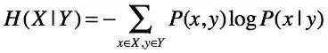
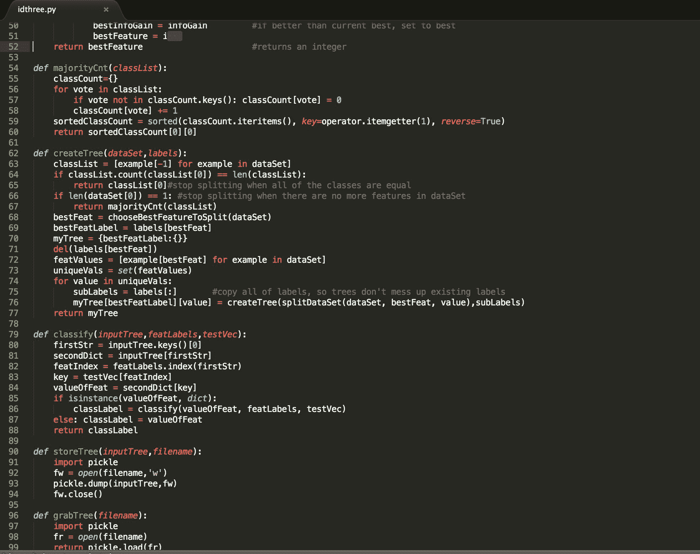

# 【Python 机器学习】信息熵和在决策树中的运用（附源码）

> 原文：[`mp.weixin.qq.com/s?__biz=MzAxNTc0Mjg0Mg==&mid=2653283451&idx=1&sn=2f10aaa1083856c0a2e07e718a3973cd&chksm=802e266eb759af7863a4e7af909c3cc897c867367e2fdd9f1abb6e97410ef7b773016149b89b&scene=27#wechat_redirect`](http://mp.weixin.qq.com/s?__biz=MzAxNTc0Mjg0Mg==&mid=2653283451&idx=1&sn=2f10aaa1083856c0a2e07e718a3973cd&chksm=802e266eb759af7863a4e7af909c3cc897c867367e2fdd9f1abb6e97410ef7b773016149b89b&scene=27#wechat_redirect)

> ********查看之前文章请点击右上角********，关注并且******查看历史消息******
> 
> ********所有文章全部分类和整理，让您更方便查找阅读。请在页面菜单里查找。********

之前在[【Python 机器学习】系列五决策树非线性回归与分类（深度详细附源码）](http://mp.weixin.qq.com/s?__biz=MzAxNTc0Mjg0Mg==&mid=2653283257&idx=1&sn=1b081581fd2b80c2bdfa03fdc73b1d3a&scene=21#wechat_redirect)一期中， 我们提到了用熵来度量信息的不确定性和信息增益。今天我们来详细解读一下什么是信息熵及其相关概念，以及如何进行信息增益的计算和它在 decision tree 中的运用。

**信息熵与热力学熵**

学过化学或热力学的同学可能了解热力学熵。 熵的概念由德国物理学家克劳修斯提出，其定义为：在一个可逆性程序里，被用在恒温的热的总数。宏观上，热力学熵主要用于研究热机，微观上，玻尔兹曼将其赋以统计学意义用以描述系统的混乱程度。而**信息熵**也称为香农熵， 香农于 1948 年将热力学中的熵的概念引入到信息论中，来度量信息中的信息量。与信息量相关的是信息的不确定性，如果一条信息中不确定性越大， 我们就希望获得更多的信息去消除不确定性并了解信息所想要表达的真正意思。因此对信息量的量化也可以理解为对一则信息不确定性的量化。 

在吴军老师的《数学之美》一书中有这样的例子： 假如你 totally 错过了 2010 年的世界杯， 如果有人问你此届世界杯的冠军是谁，在没有任何提示下，你需要从 32 支队伍中猜出谁夺得了大力神杯。每猜一次需要花费 1bit 信息量，而提问者会回答：是或否。 如果你对 32 个球队一无所知（比如以为皇马也来参加了世界杯。。）并假定 32 支队伍夺冠几率相同，你可能会采取二分法来逐渐缩小范围。这样你总共需要花费 5 bit 信息量，因为*log 32 = 5。* 而假如你对足球有一定的了解，会知道每个球队夺冠的概率是不一样的。那么根据香农熵的公式，准确信息量将应该是

**条件熵(conditional entropy)**

因为相关信息的存在也可以消除不确定性， 比如在自然语言模型中，相比于一元语言模型，二元语言模型除了参考词语本身的概率之外还要借助上下文的信息，因此结果更为准确。 假如说我们想要知道随机变量 X 的信息熵，同时我们已知在随机变量 Y 出现时 X 出现的概率（条件概率）和 X，Y 同时出现的概率（联合概率）这些信息， 那么我们计算在 Y 的条件下 X 的熵为：

 

这个熵不同于 H(X)， 被称为**条件熵**。 在 X 和 Y 不相互独立的时候，因为我们得到了 Y 的信息，我们确定 X 所需要的信息熵就下降了。 因此 H(X)>=H(X|Y)。

**互信息(mutual information)**

**互信息**是用来量化两个变量 X，Y 相关性的量。它的定义为：

互信息的意义为：由于事件 X 发生与事件 Y 发生相关联而提供的信息量。 I(X|Y）同时也是 H(X)与条件熵 H(X|Y)之间的差。

 

**相对熵（Kullback-Leibeler Divergence）**

**相对熵**又称 KL 散度，用来衡量两个取值为正数的函数的相关性。他的定义为：

 

相对熵具有如下性质：

1\. 相对熵始终大于等于 0，两个完全相同的函数相对熵为 0

2\. 相对熵不对称， 即 KL(A||B)不等于 KL(B||A)

2\. 相对熵越大，函数差异越大

3\. 相对熵可以度量两个随机分布之间的距离

相对熵常用来做文本相似度分析，以及在多指标系统中用来进行指标权重分配。

我们可以比较互信息和相对熵的概念，发现互信息是在求 KL(P(x,y)||P(x)P(y))。当 X 与 Y 相互独立时，P(x,y)=P(x)P(y)。所以当 X 与 Y 相互独立时互信息为 0。从上面的韦恩图中也可以看出。

**信息增益(Information Gain)**

**信息增益**表示在条件 a 下，信息不确定性减少的量。与互信息不同的是，互信息衡量的是两个变量之间的相关性，而信息增益衡量的是系统分类后增加的信息量，a 指的是分类方式。

**算法**

介绍完基本概念后，我们可以了解在决策树中常用的算法。算法主要有三种： ID3, C4.5 以及 CART。再此主要介绍 ID3 和 C4.5.

*ID3*

ID3 是基于以信息熵和信息增益为衡量标准来选取属性进行分类的方式。其基本思路如下：

 

在决策树中，结点可以分为：根结点，内部结点，叶结点。在选取根结点和内部结点时，我们选择信息增益最大的属性。比如我们拥有一个 training set 数据集 S 其类别集合为｛0，1｝，参与分类的属性集合为{A,B,C,D}，那我们分别计算 IG(S, A), IG(S,B), IG(S,C), IG(S,D)。按照上面的公式：IG(S,A)=H(S)-H(S|A) ，求得最大 IG 最大的属性，即可作为本次划分的结点。划分直至终结条件满足后，决策树构建完成。

终结条件主要分两种：

1 划分出的类为同类

2 所有属性已被考虑，不再有属性可供再分

在 Machine Learning in Action 一书中有 ID3 的详细代码（python） 

*C4.5*

C4.5 是在 ID3 基础上的扩展，不同的是，C4.5 用的是信息增益率来进行属性选择。信息增益率定义如下：

其中 Gain(S,A)=IG(S,A)，就是信息增益

SplitInfo(S,A)指的是按照属性 A 对 S 的信息分裂值，用以将信息增益规范化，因此避免了 ID3 中指标偏向分支多的属性的倾向。C4.5 算法框架如下：

> 参考文献：
> 
> 《数学之美》－吴军［著］
> 
> *Machine Learning in Action*  --Peter Harrington
> 
> http://blog.csdn.net/google19890102/article/details/28611225
> 
> http://shiyanjun.cn/archives/417.html
> 
> http://isilic.iteye.com/blog/1844097

**后台回复下列关键字，更多惊喜在等着****你** **【区分大小写】**  

**1.回复****每周论文** [**获取 Market Making 论文分享**](http://mp.weixin.qq.com/s?__biz=MzAxNTc0Mjg0Mg==&mid=2653283381&idx=1&sn=48ec361d5b5a0e86e7749ff100a1f335&scene=21#wechat_redirect)

**2\. 回复****matlab 量化投资** **[**获取大量源码**](http://mp.weixin.qq.com/s?__biz=MzAxNTc0Mjg0Mg==&mid=2653283293&idx=1&sn=7c26d2958d1a463686b2600c69bd9bff&scene=21#wechat_redirect)**

****3\. 回复****每周书籍**[**获取国外书籍电子版**](http://mp.weixin.qq.com/s?__biz=MzAxNTc0Mjg0Mg==&mid=2653283159&idx=1&sn=2b5ff2017cabafc48fd3497ae5efa58c&scene=21#wechat_redirect)**

******4\.** **回复******文本挖掘** **[**获取关于文本挖掘的资料**](http://mp.weixin.qq.com/s?__biz=MzAxNTc0Mjg0Mg==&mid=2653283053&idx=1&sn=1d17fbc17545e561be0664af78304a67&scene=21#wechat_redirect)********

************5\. 回复******金融数学** **[**获取金融数学藏书**](http://mp.weixin.qq.com/s?__biz=MzAxNTc0Mjg0Mg==&mid=403111936&idx=4&sn=97822bfa300f3d856d6c9acd8dc24914&scene=21#wechat_redirect)**************

**********6\. 回复******贝叶斯 Matlab****[**获取 NBM 详解与具体应用**](http://mp.weixin.qq.com/s?__biz=MzAxNTc0Mjg0Mg==&mid=401834925&idx=1&sn=d56246158c1002b2330a7c26fd401db6&scene=21#wechat_redirect)************

************7.回复****AdaBoost******[获取 AdaBoost 算法文献、代码、研报](http://mp.weixin.qq.com/s?__biz=MzAxNTc0Mjg0Mg==&mid=2653283387&idx=1&sn=d40b3a1ea73e3d85c124b5b1e4f3057b&scene=21#wechat_redirect)**************

**********8.回复****数据包络分析** **获取****[选股分析](http://mp.weixin.qq.com/s?__biz=MzAxNTc0Mjg0Mg==&mid=2653283401&idx=1&sn=fae6d0c0638174bb713952e6af983c54&scene=21#wechat_redirect)源码**********

********9.回复****SVD** **获取数据预处理之图像处理的方法********

**************** 

********【过往文章】********

********0.[【重！磅！干！货！】互联网金融之量化投资深度文本挖掘——附源码文档](http://mp.weixin.qq.com/s?__biz=MzAxNTc0Mjg0Mg==&mid=2653282879&idx=1&sn=12a91c4b8317662fbae470541ebe4683&scene=21#wechat_redirect)********

********1.[【机器学习课程】深度学习与神经网络系列之绪论介绍](http://mp.weixin.qq.com/s?__biz=MzAxNTc0Mjg0Mg==&mid=404690945&idx=1&sn=39ae29caade4b2fac87304d5091ecfc0&scene=21#wechat_redirect)******** 

********2.[【Python 机器学习】系列之线性回归篇【深度详细】](http://mp.weixin.qq.com/s?__biz=MzAxNTc0Mjg0Mg==&mid=405488375&idx=1&sn=e06859f0d3cf5102946bd1551d80184a&scene=21#wechat_redirect)******** 

********3.[【Python 机器学习】系列五决策树非线性回归与分类（深度详细附源码）](http://mp.weixin.qq.com/s?__biz=MzAxNTc0Mjg0Mg==&mid=2653283257&idx=1&sn=1b081581fd2b80c2bdfa03fdc73b1d3a&scene=21#wechat_redirect)******** 

********4.[【每周研报干货】各大券商研报免费分享（附下载链接）](http://mp.weixin.qq.com/s?__biz=MzAxNTc0Mjg0Mg==&mid=2653283257&idx=2&sn=49c78925e7f3535b9cad95bf91574519&scene=21#wechat_redirect)******** 

********5.[【每周书籍干货】国外近期深度学习与机器学习书籍电子版——你知道一本买来好多刀啊！](http://mp.weixin.qq.com/s?__biz=MzAxNTc0Mjg0Mg==&mid=2653283143&idx=1&sn=2316c1a067239aa007196cc8cb2e6c5b&scene=21#wechat_redirect)******** 

********6.[几种编程语言的优缺点](http://mp.weixin.qq.com/s?__biz=MzAxNTc0Mjg0Mg==&mid=2653283125&idx=1&sn=fc1a2a490600516cbdbbebfa4cd9d8fb&scene=21#wechat_redirect)******** 

********7.[【Python 机器学习】系列之从线性回归到逻辑回归篇（深度详细附源码）](http://mp.weixin.qq.com/s?__biz=MzAxNTc0Mjg0Mg==&mid=2653283118&idx=1&sn=fb38ed89200ba96f9ed2791dce76d55e&scene=21#wechat_redirect)******** 

********8.[【Python 机器学习】系列之特征提取与处理篇（深度详细附源码）](http://mp.weixin.qq.com/s?__biz=MzAxNTc0Mjg0Mg==&mid=2653283084&idx=1&sn=c7dd24ea9f5633f1f5370176fadef05f&scene=21#wechat_redirect)******** 

********9.[【最强干货】关于文本挖掘的资料（文献，报告，策略，代码）](http://mp.weixin.qq.com/s?__biz=MzAxNTc0Mjg0Mg==&mid=2653283053&idx=1&sn=1d17fbc17545e561be0664af78304a67&scene=21#wechat_redirect)********

********10.[机器学习的前期入门汇总](http://mp.weixin.qq.com/s?__biz=MzAxNTc0Mjg0Mg==&mid=404455727&idx=3&sn=d05688effdbb0583031ef9ae98c64387&scene=21#wechat_redirect)********

********11.[【深度原创研究】分级基金下折全攻略（一）](http://mp.weixin.qq.com/s?__biz=MzAxNTc0Mjg0Mg==&mid=403551881&idx=1&sn=e1ed56f607a0fe187dd7a0cf5178b638&scene=21#wechat_redirect)********

********12.[【深度原创研究】分级基金下折全攻略（二）](http://mp.weixin.qq.com/s?__biz=MzAxNTc0Mjg0Mg==&mid=403626226&idx=1&sn=4d1f56a6599c92fd6688e5eb5d7d15dc&scene=21#wechat_redirect)********

********13.[【知识食粮】最新华尔街牛人必读书籍排行](http://mp.weixin.qq.com/s?__biz=MzAxNTc0Mjg0Mg==&mid=401910135&idx=1&sn=43d5eb7549281bb9231a3be831302139&scene=21#wechat_redirect)********

********14.[通过 MATLAB 处理大数据](http://mp.weixin.qq.com/s?__biz=MzAxNTc0Mjg0Mg==&mid=401910135&idx=2&sn=5289317b5fa1afe4a5a4115520aaa8ac&scene=21#wechat_redirect)********

********15.[【扎实资料干货分享】Python、研究报告、计量经济学、投资书籍、R 语言等！(Book+Video)](http://mp.weixin.qq.com/s?__biz=MzAxNTc0Mjg0Mg==&mid=2653282744&idx=2&sn=c9e9fbf1fd0cd4efa8bf08b9c5f16d8a&scene=21#wechat_redirect)********

********16.[机器学习在统计套利中的应用](http://mp.weixin.qq.com/s?__biz=MzAxNTc0Mjg0Mg==&mid=2653282744&idx=3&sn=85d30593998974cfaf714ac0cf81f8cd&scene=21#wechat_redirect)********

********17.[量化投资修行之路](http://mp.weixin.qq.com/s?__biz=MzAxNTc0Mjg0Mg==&mid=2653282744&idx=4&sn=0ff993c537b4b1689967f1560dfd45be&scene=21#wechat_redirect)********

********18.[统计套利在股指期货跨期套利中的应用：基于协整方法的估计](http://mp.weixin.qq.com/s?__biz=MzAxNTc0Mjg0Mg==&mid=405625337&idx=3&sn=60d19beefab3a1636554b216a9b05742&scene=21#wechat_redirect)********

********19.[股指期货跨品种套利交易](http://mp.weixin.qq.com/s?__biz=MzAxNTc0Mjg0Mg==&mid=405625337&idx=2&sn=e136d7bb6542789fa12f1f90dd206641&scene=21#wechat_redirect)********

********20.[沪港通股票统计套利：基于 BP 神经网络](http://mp.weixin.qq.com/s?__biz=MzAxNTc0Mjg0Mg==&mid=405625337&idx=1&sn=c7d62703af3e5cdb90f0b1b853f8a483&scene=21#wechat_redirect)********

********21.[机器学习到底在量化金融里哪些方面有应用？](http://mp.weixin.qq.com/s?__biz=MzAxNTc0Mjg0Mg==&mid=2653282744&idx=1&sn=73db745def6298a1e352c03f51d26d95&scene=21#wechat_redirect)********

********22.[【Matlab 机器学习】之图像识别](http://mp.weixin.qq.com/s?__biz=MzAxNTc0Mjg0Mg==&mid=2653282814&idx=1&sn=f1224ea30942468ee39aa96d6ea0dd8f&scene=21#wechat_redirect)********

********23.[【干货分享】Python 数据结构与算法设计总结篇](http://mp.weixin.qq.com/s?__biz=MzAxNTc0Mjg0Mg==&mid=2653282752&idx=1&sn=5db4c3e27508abc083a7a5f388ddb6ed&scene=21#wechat_redirect)********

********24.[基于 Python 的股票数据接口调用代码实例](http://mp.weixin.qq.com/s?__biz=MzAxNTc0Mjg0Mg==&mid=2653282828&idx=1&sn=126ad1c21ce5795f8744690cb1effc13&scene=21#wechat_redirect)********

********25.[基于 Python 爬取腾讯网的最热评论代码实例](http://mp.weixin.qq.com/s?__biz=MzAxNTc0Mjg0Mg==&mid=2653282828&idx=2&sn=d73b96b78ce43b151c69ab3e70e4d24c&scene=21#wechat_redirect)********

********26.[卷积神经网络反向传播推导](http://mp.weixin.qq.com/s?__biz=MzAxNTc0Mjg0Mg==&mid=2653282851&idx=1&sn=6cc6f32f8d35089a3c80cdc4c95b48a9&scene=21#wechat_redirect)********

********27.[深度学习项目](http://mp.weixin.qq.com/s?__biz=MzAxNTc0Mjg0Mg==&mid=2653282851&idx=2&sn=d683b6a6570309b7dc07d79829c56b72&scene=21#wechat_redirect)********

********28.[混沌分形理论](http://mp.weixin.qq.com/s?__biz=MzAxNTc0Mjg0Mg==&mid=2653282968&idx=1&sn=04dcad950d1f1093ec35d7d70459020a&scene=21#wechat_redirect)********

********29.[【Python】基于情感词典进行情感分析（附代码）](http://mp.weixin.qq.com/s?__biz=MzAxNTc0Mjg0Mg==&mid=2653282977&idx=1&sn=715655ed0965227450696decde1b9864&scene=21#wechat_redirect)********

********29.[基于技术交易规则的动态模型股票价格（附论文和 Matlab 源程序）](http://mp.weixin.qq.com/s?__biz=MzAxNTc0Mjg0Mg==&mid=2653282981&idx=1&sn=7fcfb07c09bc6c40bb8e19972e4349c1&scene=21#wechat_redirect)********