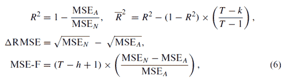

# 【论文分享】因子模型是否具有良好的预测性？

> 原文：[`mp.weixin.qq.com/s?__biz=MzAxNTc0Mjg0Mg==&mid=2653283422&idx=1&sn=ab95987e8eebba4572a7004f6ced9cc2&chksm=802e264bb759af5d4fa03feac2fb6c5a6f810dd312552b6bb7af11803fa848803a31b4525497&scene=27#wechat_redirect`](http://mp.weixin.qq.com/s?__biz=MzAxNTc0Mjg0Mg==&mid=2653283422&idx=1&sn=ab95987e8eebba4572a7004f6ced9cc2&chksm=802e264bb759af5d4fa03feac2fb6c5a6f810dd312552b6bb7af11803fa848803a31b4525497&scene=27#wechat_redirect)

> ********查看之前文章请点击右上角********，关注并且******查看历史消息******
> 
> ********所有文章全部分类和整理，让您更方便查找阅读。请在页面菜单里查找。********

学术界和实务界对股票收益的预测都比较感兴趣。因素模型一般用一些经济指标作为解释变量来预测股票收益。例如 D/P, E/P, B/M 等估值比率。这些模型大多数关注的是样本内检验，虽然回归结果显示这些比率对股票超额具有较好的样本内解释能力，但把视野拓展到样本外，这些模型能否稳健预测未来收益，仍存在较大争议。今天我们介绍这一领域的两篇经典研究。

1

**1\. A Comprehensive Look at The Empirical Performance of Equity Premium Prediction**

Welch and Goyal (2008)研究美国股权风险溢价时发现，与历史平均收益相比（在做预测评价时会有一个标准，一般以过去某段时间的平均收益作为预测期内的收益基准），现有文献中基于一系列经济指标的样本外预测并没有表现出持续、稳健的良好效果。

本文综合性的审视讨论了现有的各种因子模型，吸纳了大量的变量、不同的考量角度、以及不同的时间区间。结果发现，**多数因子模型预测能力是不稳定的**。

**数据：**

被解释变量：股票超额收益（equity premium）

解释变量：

【股票特征相关变量】

（1）股息（dividends）

        d/p (dividend price ratio)

        d/y (dividend yield)

（2）收入（earnings）： 

        e/p (earnings price ratio)

        d/e (dividend payout ratio)

（3）股票方差（svar）

（4）截面溢价（cross-sectional premium，csp）：测度了高 beta 股票和低 beta 股票的相对估值。

（5）账面价值（book-to-market ratio），b/m

（6）公司发行活动（corporate issuing activity）

【利率相关变量】

（1）tbl (treasury bills)

（2）长期收益率

（3）公司债券收益率：

（4）通胀率（infl，inflation）

【宏观变量】

    投资对资本的比率（investment to capital ratio）

    i/k = 总投资/整个经济体的总资本

**方法上，采用单因素回归和多因素回归**

单因素回归：

多因素回归：

第一种，all (kitchen sink regression)：包括上述所以的变量。

第二种，ms (model selection)：如果有 k 个变量，就会有 个随机的模型组合方式。在每个时期 t，选出一个最好的模型——标准是 OOS 的预测误差最小（minimum OOS prediction errors）。

**预测：**

首先，将 T 个样本分为 m 个样本内数据和 p 个样本外数据；

其次，为了预测第 m+1 期的值，我们要用前 m 期共 m-1 个有效数据回归，得到系数α和β；

最后，代入第 m 期的解释变量求第 m+1 期的 r;

然后，预测第 m+2 期的 r,此时第 m+  1 期的是所有真实数据都已知了，用前 m+1 期共 m 个有效数据回归，再得到系数α和β（与第一次的可能不同）；代入第 m+1 期的解释变量求第 m+2 期的 r;

重复以上过程，直到把 q 个样本外预测做完。

**验证模型预测能力的****OOS****统计量：**

eN 表示 OOS 与历史均值（无条件预测）之间的误差；eA 表示 OOS 与 OLS 回归模型（条件预测）之间的误差。

**结论**

（1）大多数模型是不稳定的、甚至是虚假的。即使单个变量模型在某段时间内具有良好的样本外预测能力，这种预测能力也很难持续，比如经济结构不稳定或结构变化。

（2）到 2005 年末为止，大多数模型无论是在 IS 还是在 OOS 中都丧失了统计显著性。在 OOS 中，大多数模型不仅不能在统计意义上或经济意义上打败无条件基准水平（历史均值），而且表现的还不如它。如果我们把目光集中在 1975 年以后的时间里，我们会发现，没有哪一个模型在 OOS 中有突出的表现，而且也几乎没有可接受的 IS 显著水平。

（3）当我们把视角从研究者转向为投资者时，我们相信有证据表明这些模型并不能给今天的投资提供支持或建议。

2

**2. Out of sample equity premium prediction: Combination Forecasts and Links to the Real Economy**

Rapach et al（2009）改进了模型的组合方式，发现当对不同的模型预测结果进行一定的组合时，其组合收益可以稳定地超越历史平均水平，也就是说，组合后的模型显示了较好的预测能力。

将 15 个单变量回归模型预测值的某种平均值作为最终的预测值，即 combination.

**有两大类确定权重的方法：**

The first class uses simple averaging schemes: mean, median, and trimmed mean

以第 t+1 期的预测值为例，最终的预测值为①15 个模型预测值的简单平均；②15 个预测值的中位数作为最终预测值；③15 个预测值排序，掐头去尾，剩下 13 个取简单平均值（简单了理解为剔除个别不好的回归模型所产生的“异常值”）

The second class of combining methods uses the combining weights formed at time t as functions of the historical forecasting performance of the individual models over the holdout out-of-sample period。一言以蔽之：“重用”预测能力好的模型。

如果某个回归模型的预测误差的平方较小（倒数或精度越高），则表明模型预测性较好，应该在下一期的预测值上赋予更大的权重。

下图表示历史平均预测模型的 MSPE 减组合预测模型的 MSPE 的差值。可以看到组合预测的表现始终好于历史平均预测，而且下图的实线显著的规避了频繁、大量的波动，说明组合预测比单个预测更有效。虚线表示给组合预测模型附加理论约束后的修正，发现变动不明显，说明组合预测模型本身就已满足这些理论约束条件。

下图实线描述了单个预测回归模型在 1965.1-2005.1 的样本外预测值，虚线描述了历史平均预测模型的预测值，右下角的图描述的是组合预测模型的样本外预测值（采用的是 mean combining method）。单个预测模型的样本外预测值波动比较大，包含大量噪音，给出错误信号，影响预测质量。而 mean 组合预测的样本外预测值比较稳定，但也呈现出比较合理的波动。

组合预测法在捕捉一系列经济变量的信息与避免过度的波动之间达到了一个平衡状态，即既不像单个指标预测时那样过度波动，也不像历史平均值法那样过渡平滑（无法与经济周期联系）。因此组合预测法在一定程度上可以获得超过历史平均的超额收益。

**后台回复下列关键字，更多惊喜在等着****你** **【区分大小写】**  

**1.回复****每周论文** [**获取 Market Making 论文分享**](http://mp.weixin.qq.com/s?__biz=MzAxNTc0Mjg0Mg==&mid=2653283381&idx=1&sn=48ec361d5b5a0e86e7749ff100a1f335&scene=21#wechat_redirect)

**2\. 回复****matlab 量化投资** **[**获取大量源码**](http://mp.weixin.qq.com/s?__biz=MzAxNTc0Mjg0Mg==&mid=2653283293&idx=1&sn=7c26d2958d1a463686b2600c69bd9bff&scene=21#wechat_redirect)**

****3\. 回复****每周书籍**[**获取国外书籍电子版**](http://mp.weixin.qq.com/s?__biz=MzAxNTc0Mjg0Mg==&mid=2653283159&idx=1&sn=2b5ff2017cabafc48fd3497ae5efa58c&scene=21#wechat_redirect)**

******4\.** **回复******文本挖掘** **[**获取关于文本挖掘的资料**](http://mp.weixin.qq.com/s?__biz=MzAxNTc0Mjg0Mg==&mid=2653283053&idx=1&sn=1d17fbc17545e561be0664af78304a67&scene=21#wechat_redirect)********

************5\. 回复******金融数学** **[**获取金融数学藏书**](http://mp.weixin.qq.com/s?__biz=MzAxNTc0Mjg0Mg==&mid=403111936&idx=4&sn=97822bfa300f3d856d6c9acd8dc24914&scene=21#wechat_redirect)**************

**********6\. 回复******贝叶斯 Matlab****[**获取 NBM 详解与具体应用**](http://mp.weixin.qq.com/s?__biz=MzAxNTc0Mjg0Mg==&mid=401834925&idx=1&sn=d56246158c1002b2330a7c26fd401db6&scene=21#wechat_redirect)************

************7.回复****AdaBoost******[获取 AdaBoost 算法文献、代码、研报](http://mp.weixin.qq.com/s?__biz=MzAxNTc0Mjg0Mg==&mid=2653283387&idx=1&sn=d40b3a1ea73e3d85c124b5b1e4f3057b&scene=21#wechat_redirect)**************

**********8.回复****数据包络分析** **获取****[选股分析](http://mp.weixin.qq.com/s?__biz=MzAxNTc0Mjg0Mg==&mid=2653283401&idx=1&sn=fae6d0c0638174bb713952e6af983c54&scene=21#wechat_redirect)源码**********

********9.回复****SVD** **获取数据预处理之图像处理的方法********

****************

********【过往文章】********

********0.[【重！磅！干！货！】互联网金融之量化投资深度文本挖掘——附源码文档](http://mp.weixin.qq.com/s?__biz=MzAxNTc0Mjg0Mg==&mid=2653282879&idx=1&sn=12a91c4b8317662fbae470541ebe4683&scene=21#wechat_redirect)********

********1.[【机器学习课程】深度学习与神经网络系列之绪论介绍](http://mp.weixin.qq.com/s?__biz=MzAxNTc0Mjg0Mg==&mid=404690945&idx=1&sn=39ae29caade4b2fac87304d5091ecfc0&scene=21#wechat_redirect)******** 

********2.[【Python 机器学习】系列之线性回归篇【深度详细】](http://mp.weixin.qq.com/s?__biz=MzAxNTc0Mjg0Mg==&mid=405488375&idx=1&sn=e06859f0d3cf5102946bd1551d80184a&scene=21#wechat_redirect)******** 

********3.[【Python 机器学习】系列五决策树非线性回归与分类（深度详细附源码）](http://mp.weixin.qq.com/s?__biz=MzAxNTc0Mjg0Mg==&mid=2653283257&idx=1&sn=1b081581fd2b80c2bdfa03fdc73b1d3a&scene=21#wechat_redirect)******** 

********4.[【每周研报干货】各大券商研报免费分享（附下载链接）](http://mp.weixin.qq.com/s?__biz=MzAxNTc0Mjg0Mg==&mid=2653283257&idx=2&sn=49c78925e7f3535b9cad95bf91574519&scene=21#wechat_redirect)******** 

********5.[【每周书籍干货】国外近期深度学习与机器学习书籍电子版——你知道一本买来好多刀啊！](http://mp.weixin.qq.com/s?__biz=MzAxNTc0Mjg0Mg==&mid=2653283143&idx=1&sn=2316c1a067239aa007196cc8cb2e6c5b&scene=21#wechat_redirect)******** 

********6.[几种编程语言的优缺点](http://mp.weixin.qq.com/s?__biz=MzAxNTc0Mjg0Mg==&mid=2653283125&idx=1&sn=fc1a2a490600516cbdbbebfa4cd9d8fb&scene=21#wechat_redirect)******** 

********7.[【Python 机器学习】系列之从线性回归到逻辑回归篇（深度详细附源码）](http://mp.weixin.qq.com/s?__biz=MzAxNTc0Mjg0Mg==&mid=2653283118&idx=1&sn=fb38ed89200ba96f9ed2791dce76d55e&scene=21#wechat_redirect)******** 

********8.[【Python 机器学习】系列之特征提取与处理篇（深度详细附源码）](http://mp.weixin.qq.com/s?__biz=MzAxNTc0Mjg0Mg==&mid=2653283084&idx=1&sn=c7dd24ea9f5633f1f5370176fadef05f&scene=21#wechat_redirect)******** 

********9.[【最强干货】关于文本挖掘的资料（文献，报告，策略，代码）](http://mp.weixin.qq.com/s?__biz=MzAxNTc0Mjg0Mg==&mid=2653283053&idx=1&sn=1d17fbc17545e561be0664af78304a67&scene=21#wechat_redirect)********

********10.[机器学习的前期入门汇总](http://mp.weixin.qq.com/s?__biz=MzAxNTc0Mjg0Mg==&mid=404455727&idx=3&sn=d05688effdbb0583031ef9ae98c64387&scene=21#wechat_redirect)********

********11.[【深度原创研究】分级基金下折全攻略（一）](http://mp.weixin.qq.com/s?__biz=MzAxNTc0Mjg0Mg==&mid=403551881&idx=1&sn=e1ed56f607a0fe187dd7a0cf5178b638&scene=21#wechat_redirect)********

********12.[【深度原创研究】分级基金下折全攻略（二）](http://mp.weixin.qq.com/s?__biz=MzAxNTc0Mjg0Mg==&mid=403626226&idx=1&sn=4d1f56a6599c92fd6688e5eb5d7d15dc&scene=21#wechat_redirect)********

********13.[【知识食粮】最新华尔街牛人必读书籍排行](http://mp.weixin.qq.com/s?__biz=MzAxNTc0Mjg0Mg==&mid=401910135&idx=1&sn=43d5eb7549281bb9231a3be831302139&scene=21#wechat_redirect)********

********14.[通过 MATLAB 处理大数据](http://mp.weixin.qq.com/s?__biz=MzAxNTc0Mjg0Mg==&mid=401910135&idx=2&sn=5289317b5fa1afe4a5a4115520aaa8ac&scene=21#wechat_redirect)********

********15.[【扎实资料干货分享】Python、研究报告、计量经济学、投资书籍、R 语言等！(Book+Video)](http://mp.weixin.qq.com/s?__biz=MzAxNTc0Mjg0Mg==&mid=2653282744&idx=2&sn=c9e9fbf1fd0cd4efa8bf08b9c5f16d8a&scene=21#wechat_redirect)********

********16.[机器学习在统计套利中的应用](http://mp.weixin.qq.com/s?__biz=MzAxNTc0Mjg0Mg==&mid=2653282744&idx=3&sn=85d30593998974cfaf714ac0cf81f8cd&scene=21#wechat_redirect)********

********17.[量化投资修行之路](http://mp.weixin.qq.com/s?__biz=MzAxNTc0Mjg0Mg==&mid=2653282744&idx=4&sn=0ff993c537b4b1689967f1560dfd45be&scene=21#wechat_redirect)********

********18.[统计套利在股指期货跨期套利中的应用：基于协整方法的估计](http://mp.weixin.qq.com/s?__biz=MzAxNTc0Mjg0Mg==&mid=405625337&idx=3&sn=60d19beefab3a1636554b216a9b05742&scene=21#wechat_redirect)********

********19.[股指期货跨品种套利交易](http://mp.weixin.qq.com/s?__biz=MzAxNTc0Mjg0Mg==&mid=405625337&idx=2&sn=e136d7bb6542789fa12f1f90dd206641&scene=21#wechat_redirect)********

********20.[沪港通股票统计套利：基于 BP 神经网络](http://mp.weixin.qq.com/s?__biz=MzAxNTc0Mjg0Mg==&mid=405625337&idx=1&sn=c7d62703af3e5cdb90f0b1b853f8a483&scene=21#wechat_redirect)********

********21.[机器学习到底在量化金融里哪些方面有应用？](http://mp.weixin.qq.com/s?__biz=MzAxNTc0Mjg0Mg==&mid=2653282744&idx=1&sn=73db745def6298a1e352c03f51d26d95&scene=21#wechat_redirect)********

********22.[【Matlab 机器学习】之图像识别](http://mp.weixin.qq.com/s?__biz=MzAxNTc0Mjg0Mg==&mid=2653282814&idx=1&sn=f1224ea30942468ee39aa96d6ea0dd8f&scene=21#wechat_redirect)********

********23.[【干货分享】Python 数据结构与算法设计总结篇](http://mp.weixin.qq.com/s?__biz=MzAxNTc0Mjg0Mg==&mid=2653282752&idx=1&sn=5db4c3e27508abc083a7a5f388ddb6ed&scene=21#wechat_redirect)********

********24.[基于 Python 的股票数据接口调用代码实例](http://mp.weixin.qq.com/s?__biz=MzAxNTc0Mjg0Mg==&mid=2653282828&idx=1&sn=126ad1c21ce5795f8744690cb1effc13&scene=21#wechat_redirect)********

********25.[基于 Python 爬取腾讯网的最热评论代码实例](http://mp.weixin.qq.com/s?__biz=MzAxNTc0Mjg0Mg==&mid=2653282828&idx=2&sn=d73b96b78ce43b151c69ab3e70e4d24c&scene=21#wechat_redirect)********

********26.[卷积神经网络反向传播推导](http://mp.weixin.qq.com/s?__biz=MzAxNTc0Mjg0Mg==&mid=2653282851&idx=1&sn=6cc6f32f8d35089a3c80cdc4c95b48a9&scene=21#wechat_redirect)********

********27.[深度学习项目](http://mp.weixin.qq.com/s?__biz=MzAxNTc0Mjg0Mg==&mid=2653282851&idx=2&sn=d683b6a6570309b7dc07d79829c56b72&scene=21#wechat_redirect)********

********28.[混沌分形理论](http://mp.weixin.qq.com/s?__biz=MzAxNTc0Mjg0Mg==&mid=2653282968&idx=1&sn=04dcad950d1f1093ec35d7d70459020a&scene=21#wechat_redirect)********

********29.[【Python】基于情感词典进行情感分析（附代码）](http://mp.weixin.qq.com/s?__biz=MzAxNTc0Mjg0Mg==&mid=2653282977&idx=1&sn=715655ed0965227450696decde1b9864&scene=21#wechat_redirect)********

********29.[基于技术交易规则的动态模型股票价格（附论文和 Matlab 源程序）](http://mp.weixin.qq.com/s?__biz=MzAxNTc0Mjg0Mg==&mid=2653282981&idx=1&sn=7fcfb07c09bc6c40bb8e19972e4349c1&scene=21#wechat_redirect)********

********点击下方“阅读原文”查看更多论文书籍。********