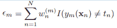
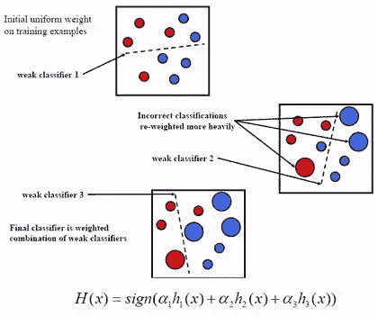
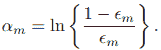
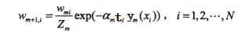
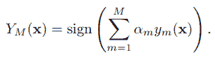
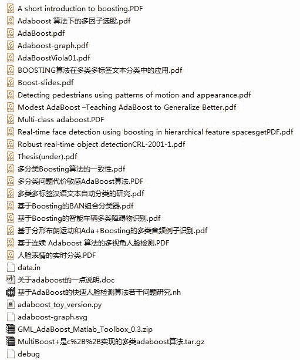

# 【机器学习课程】经典算法之——AdaBoost 在量化投资中的应用（附代码和很多论文资料）

> 原文：[`mp.weixin.qq.com/s?__biz=MzAxNTc0Mjg0Mg==&mid=2653283387&idx=1&sn=d40b3a1ea73e3d85c124b5b1e4f3057b&chksm=802e262eb759af38c11960a61674e20f447ef8af23874d46bed8da9adafa62c4164952f1edd4&scene=27#wechat_redirect`](http://mp.weixin.qq.com/s?__biz=MzAxNTc0Mjg0Mg==&mid=2653283387&idx=1&sn=d40b3a1ea73e3d85c124b5b1e4f3057b&chksm=802e262eb759af38c11960a61674e20f447ef8af23874d46bed8da9adafa62c4164952f1edd4&scene=27#wechat_redirect)

> ********查看之前文章请点击右上角********，关注并且******查看历史消息******
> 
> ********所有文章全部分类和整理，让您更方便查找阅读。请在页面菜单里查找。********

1 算法简介

AdaBoost 是由 Yoav Freund 和 Robert Schapire 提出自适应增强的一种机器学习方法。AdaBoost 算法的自适应在于：**前一个分类器分错的样本会被用来训练下一个分类器。**

AdaBoost 是一种迭代算法，在每一轮中加入一个新的弱分类器（新的因子），直到达到某个预定的足够小的错误率。在训练样本时，每一个样本都被赋予一个权重，表明它被某个分类器选入训练集的概率。第一次分类后，如果某个样本已经被正确地分类，那么它的权重就会降低，因为它被下一个分类器选中的概率被降低；反之，如果样本被分类错误，它的权重就会增加。通过这样的方式，AdaBoost 算法能"针对"那些难以分离的样本上。因此，****在量化分析预测股票的走势上，AadaBoost 常能比其它算法更加胜任**。**

2 数据处理

在将此算法搬运到预测股票涨跌之前，我们需要做一些调整避免 AdaBoost 算法的"水土不服"。

**1）**由于 AdaBoost 算法对于噪声数据和异常数据极其敏感，简答地将训练样本分类涨与跌为(+1,-1)可能会对结果造成极大影响。所以，处理时可以去除样本中不明显的涨跌（如<1%)保留噪声较少部分。

**2）**在弱分类器的选择上，大家可以加上任何有相关性的因子。但是，值得注意的是，需要将因子的值划在同一区间内，这样可以极大减少极端值的影响。

3 算法应用

为了方便解释，这里选择了三层（L 层）弱分类器，分为两组（G 组）。

**1）**首先，我们有训练样本 D={**xi** = (Xi1,Xi2,Xi3),Yi}, 这里 i 表示第 i 个样本，**xi**表示每个样本对应的三个因子**, Y**代表每个样本对应的需要学习的值——涨（+）或跌（-）。

**2）**起初，如图一，我们赋予每个样本同样的权重 wi = 1/n，图中显示每一个圆圈大小一致。然后，我们尽可能使得错误分类得将样本一分为二，分成两组。

并记录该训练误差。

**3）**计算判决分数 ：

**4）**更新权重，如图二、三，将分类正确地权重降低（圈圈变小），分类正确地权重降低（圈圈变大）。

**5）**得到最后的分类器：

**6）**现在可以通过得到的分类器的值来预测涨跌幅，分数越高则走涨的可能性却高，分数越低则走跌的可能性越大。

4 参考文献

**参考文献：**

http://blog.csdn.net/dark_scope/article/details/14103983

**代码推荐：**

https://github.com/justdark/dml/tree/master/dml/ADAB

5 论文资料获取

**后台回复**

**【AdaBoost】**

**即可获取**

**后台回复下列关键字，更多惊喜在等着你**

**1.回复****每周论文** [**获取 Market Making 论文分享**](http://mp.weixin.qq.com/s?__biz=MzAxNTc0Mjg0Mg==&mid=2653283381&idx=1&sn=48ec361d5b5a0e86e7749ff100a1f335&scene=21#wechat_redirect)

**2\. 回复****matlab 量化投资** [**获取大量源码**](http://mp.weixin.qq.com/s?__biz=MzAxNTc0Mjg0Mg==&mid=2653283293&idx=1&sn=7c26d2958d1a463686b2600c69bd9bff&scene=21#wechat_redirect)

****3\. 回复****每周书籍** [**获取国外书籍电子版**](http://mp.weixin.qq.com/s?__biz=MzAxNTc0Mjg0Mg==&mid=2653283159&idx=1&sn=2b5ff2017cabafc48fd3497ae5efa58c&scene=21#wechat_redirect)**

******4\. 回复******文本挖掘**** **[**获取关于文本挖掘的资料**](http://mp.weixin.qq.com/s?__biz=MzAxNTc0Mjg0Mg==&mid=2653283053&idx=1&sn=1d17fbc17545e561be0664af78304a67&scene=21#wechat_redirect)******

**********5\. 回复******金融数学**** **[**获取金融数学藏书**](http://mp.weixin.qq.com/s?__biz=MzAxNTc0Mjg0Mg==&mid=403111936&idx=4&sn=97822bfa300f3d856d6c9acd8dc24914&scene=21#wechat_redirect)**********

************6\. 回复******贝叶斯 Matlab**** ****[获取 NBM 详解与具体应用](http://mp.weixin.qq.com/s?__biz=MzAxNTc0Mjg0Mg==&mid=401834925&idx=1&sn=d56246158c1002b2330a7c26fd401db6&scene=21#wechat_redirect)**************

****************