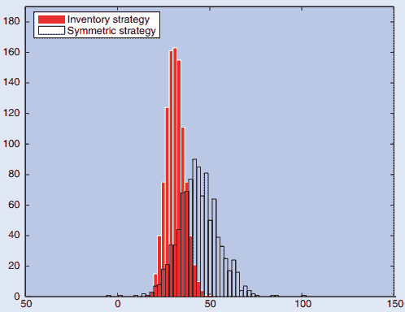
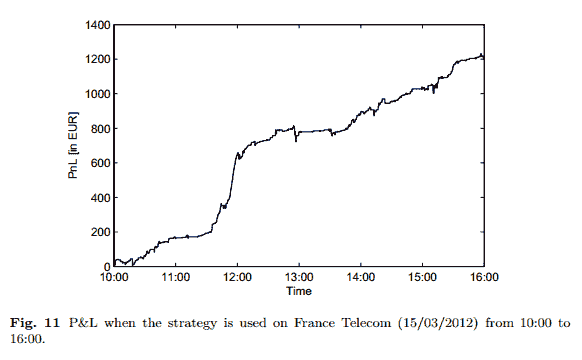

# 【论文分享】Market Making 论文分享

> 原文：[`mp.weixin.qq.com/s?__biz=MzAxNTc0Mjg0Mg==&mid=2653283381&idx=1&sn=48ec361d5b5a0e86e7749ff100a1f335&chksm=802e2620b759af36237a0f72ab628c7dcf6ecffb4e87d1d19f2119077ec7239cd88f394e5a63&scene=27#wechat_redirect`](http://mp.weixin.qq.com/s?__biz=MzAxNTc0Mjg0Mg==&mid=2653283381&idx=1&sn=48ec361d5b5a0e86e7749ff100a1f335&chksm=802e2620b759af36237a0f72ab628c7dcf6ecffb4e87d1d19f2119077ec7239cd88f394e5a63&scene=27#wechat_redirect)

> ********查看之前文章请点击右上角********，关注并且******查看历史消息******
> 
> ********所有文章全部分类和整理，让您更方便查找阅读。请在页面菜单里查找。********

Market Making 是高频交易中的一类策略，它通过赚取买卖价差来获取利润，由于与传统的做市商市场类似，所以被命名为 Mar-ket Making。国外有几篇学术论文已经对该策略做了些研究，这些论文可以让我们在设计算法和实际应用中得到一些启示。

**1\. Market-making and proprietary trading: industry trends, drivers and policy implications**这是一篇 Denis Beau 的小组的研究报告，讲述了做市商与自营交易的一些机制，以及它们可能带来的影响。可以通过这篇报告了解 Market-making 和 proprietary trading.
**2\. High-frequency trading in a limit-order book**这篇论文提出了一些做市商策略的公式。同时考虑了信息不对称和存货问题可能带来的风险，但是并没有更深入地考虑存货风险。**3\. Dealing with inventory risk**提出了一个做市商策略中最优的定价的模型，用到了光谱分析的技术，该模型还能解决 Avellaneda and Stoikov 未能解决的问题(见论文 2)。
**4\. High-frequency market-making with inventory constraints and directional bets**这篇论文在以上两篇论文所建立的做市商的随机控制模型基础上对其进行拓展。**5\. Adaptive Market Making via Online Learning**提出了一类“spread-based”做市商策略来对抗巨幅价格波动所带来的风险

Pure Quant 叱咤风云的时代已经终结。单纯的数理金融方面的理论研究是不够的，New Quant 要做的是从以往单纯的理论建模工作转向在深入理解业务的基础上展开工作，特别是要从现实和宏观的角度理解系统性风险。

**关注后回复【****每周论文****】获取下载地址**

****后台回复下列关键字，更多惊喜在等着你**** 

****1\. 回复****matlab 量化投资** [**获取大量源码**](http://mp.weixin.qq.com/s?__biz=MzAxNTc0Mjg0Mg==&mid=2653283293&idx=1&sn=7c26d2958d1a463686b2600c69bd9bff&scene=21#wechat_redirect)**

******2\. 回复****每周书籍** [**获取国外书籍电子版**](http://mp.weixin.qq.com/s?__biz=MzAxNTc0Mjg0Mg==&mid=2653283159&idx=1&sn=2b5ff2017cabafc48fd3497ae5efa58c&scene=21#wechat_redirect)****

********3\. 回复******文本挖掘**** **[**获取关于文本挖掘的资料**](http://mp.weixin.qq.com/s?__biz=MzAxNTc0Mjg0Mg==&mid=2653283053&idx=1&sn=1d17fbc17545e561be0664af78304a67&scene=21#wechat_redirect)********

**********4\. 回复******金融数学**** **[**获取金融数学藏书**](http://mp.weixin.qq.com/s?__biz=MzAxNTc0Mjg0Mg==&mid=403111936&idx=4&sn=97822bfa300f3d856d6c9acd8dc24914&scene=21#wechat_redirect)**********

************5\. 回复******贝叶斯 Matlab**** **[**获取 NBM 详解与具体应用**](http://mp.weixin.qq.com/s?__biz=MzAxNTc0Mjg0Mg==&mid=401834925&idx=1&sn=d56246158c1002b2330a7c26fd401db6&scene=21#wechat_redirect)************

 ********************