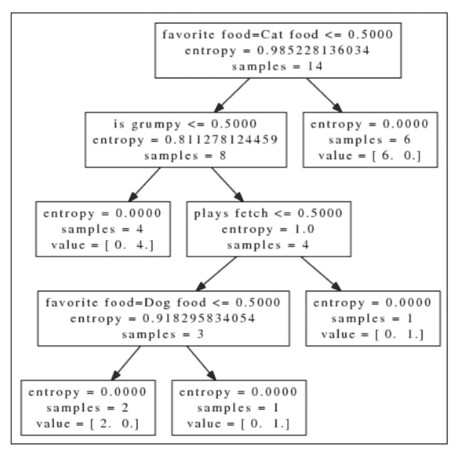
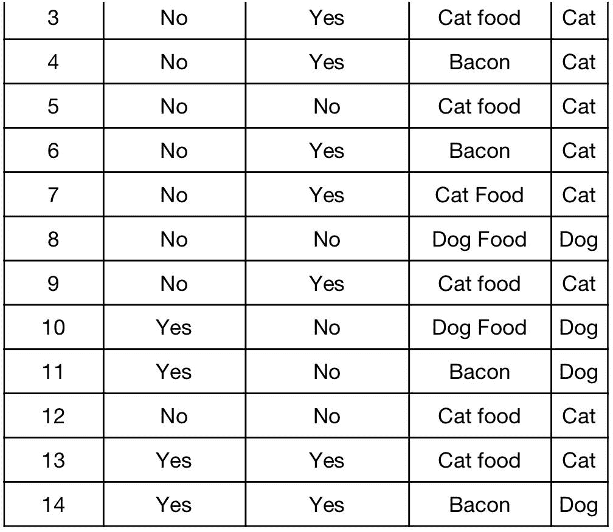
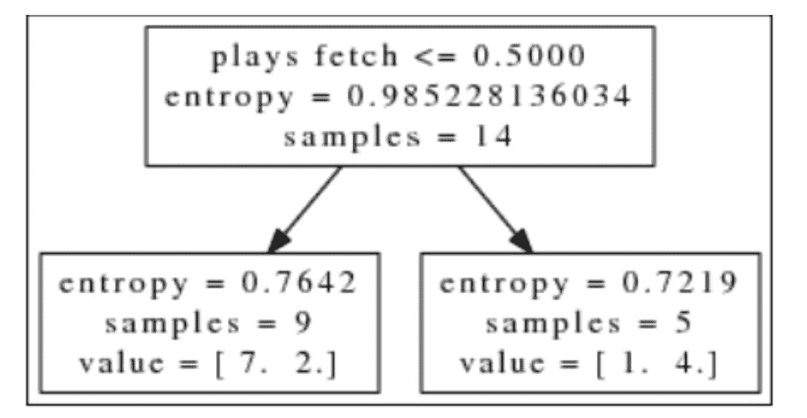
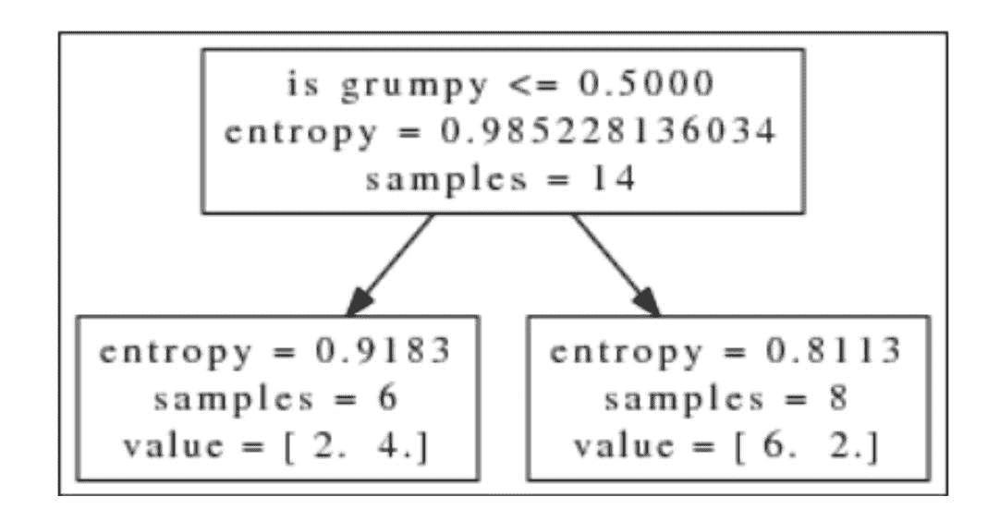
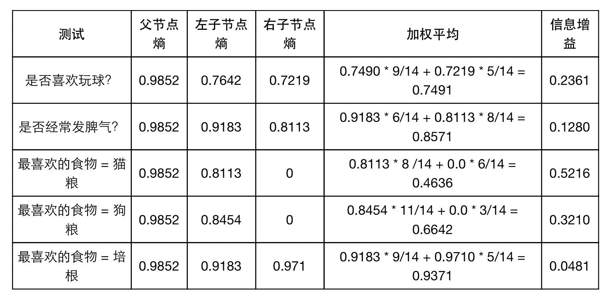
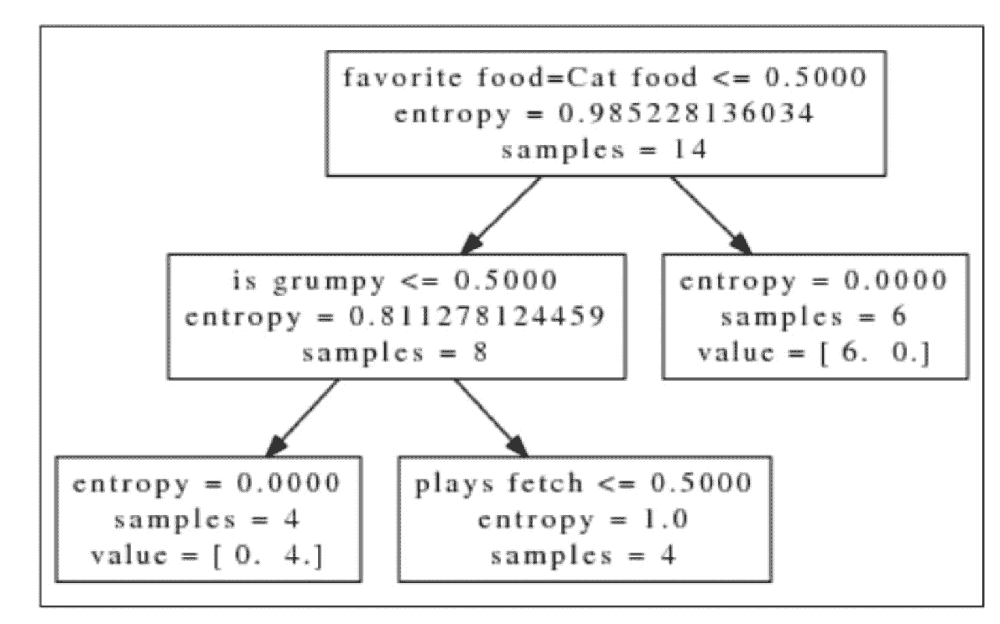
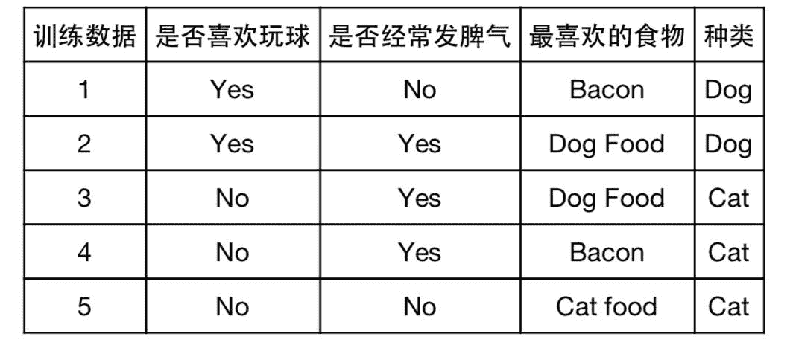
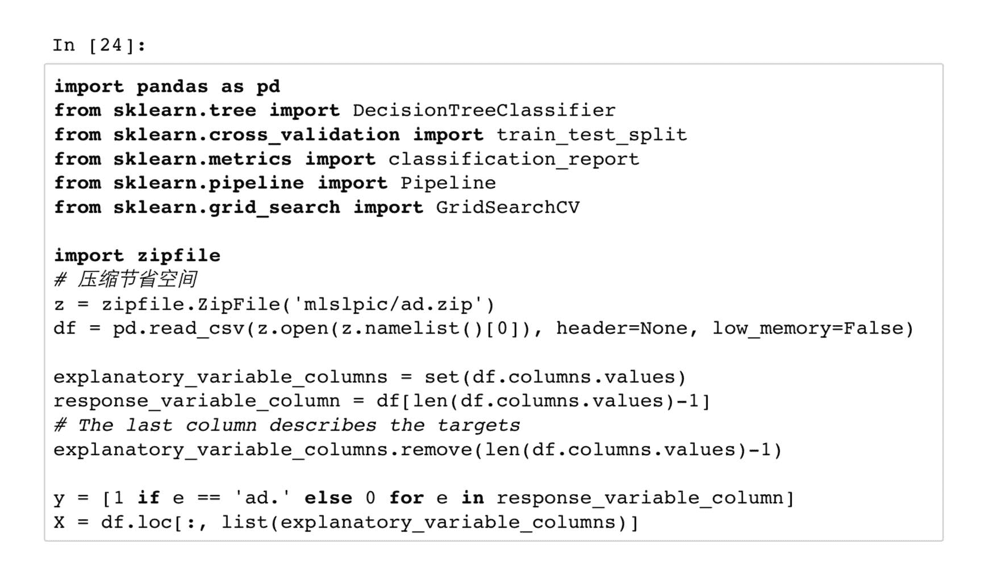
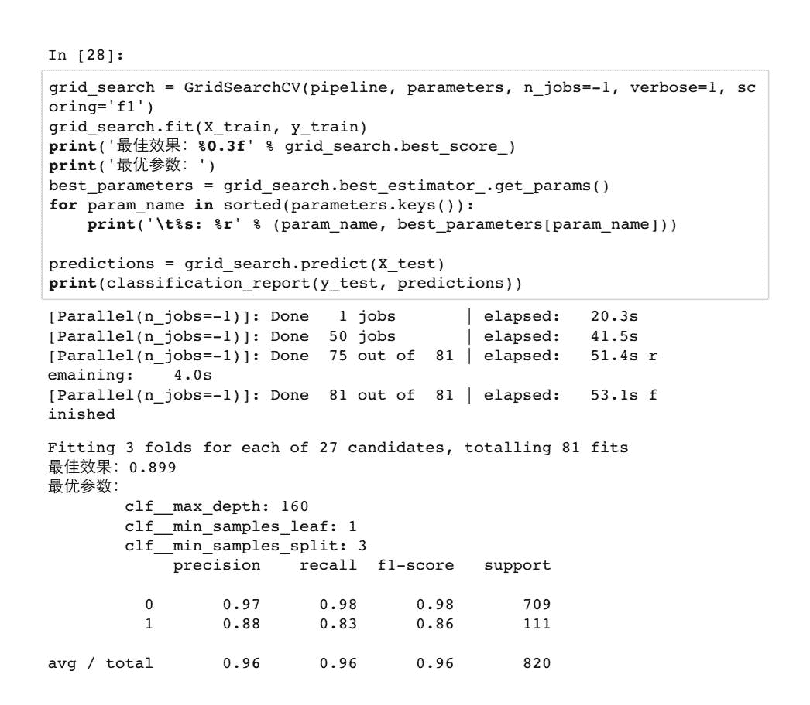

# 【Python 机器学习】系列五决策树非线性回归与分类（深度详细附源码）

> 原文：[`mp.weixin.qq.com/s?__biz=MzAxNTc0Mjg0Mg==&mid=2653283257&idx=1&sn=1b081581fd2b80c2bdfa03fdc73b1d3a&chksm=802e21acb759a8ba144cc808b49546faee523f7516b2c33f8e9bb35655e32a93cae15bc15fa0&scene=27#wechat_redirect`](http://mp.weixin.qq.com/s?__biz=MzAxNTc0Mjg0Mg==&mid=2653283257&idx=1&sn=1b081581fd2b80c2bdfa03fdc73b1d3a&chksm=802e21acb759a8ba144cc808b49546faee523f7516b2c33f8e9bb35655e32a93cae15bc15fa0&scene=27#wechat_redirect)

> ********查看之前文章请点击右上角********，关注并且******查看历史消息******
> 
> ********所有文章全部分类和整理，让您更方便查找阅读。请在页面菜单里查找。********

**相关内容：（点击标题可查看原文）**

[**第一章 机器学习基础**](http://mp.weixin.qq.com/s?__biz=MzAxNTc0Mjg0Mg==&mid=405186782&idx=2&sn=34cb8d04935fdfd6d24c29d565380b50&scene=21#wechat_redirect)

将机器学习定义成一种通过学习经验改善工作效果的程序研究与设计过程。其他章节都以这个定义为基础，后面每一章里介绍的机器学习模型都是按照这个思路解决任务，评估效果。

[**第二章 线性回归**](http://mp.weixin.qq.com/s?__biz=MzAxNTc0Mjg0Mg==&mid=405488375&idx=1&sn=e06859f0d3cf5102946bd1551d80184a&scene=21#wechat_redirect)

介绍线性回归模型，一种解释变量和模型参数与连续的响应变量相关的模型。本章介绍成本函数的定义，通过最小二乘法求解模型参数获得最优模型。

[**第三章 特征提取与处理**](http://mp.weixin.qq.com/s?__biz=MzAxNTc0Mjg0Mg==&mid=2653283084&idx=1&sn=c7dd24ea9f5633f1f5370176fadef05f&scene=21#wechat_redirect)

很多机器学习问题需要研究的对象可能是分类变量、文字甚至图像。本章介绍提取这些变量特征的方法。这些技术是数据处理的前提——序列化，更是机器学习的基础。

[**第四章从线性回归到逻辑回归**](http://mp.weixin.qq.com/s?__biz=MzAxNTc0Mjg0Mg==&mid=2653283118&idx=1&sn=fb38ed89200ba96f9ed2791dce76d55e&scene=21#wechat_redirect)

在第二章，线性回归里面，我们介绍了一元线性回归，多元线性回归和多项式回归。这些模型都是广义线性回归模型的具体形式，广义线性回归是一种灵活的框架，比普通线性回归要求更少的假设。这一章，我们讨论广义线性回归模型的具体形式的另一种形式，逻辑回归（logistic regression）。

前面几章, 我们介绍的模型都是广义线性模型,基本方法都是通过联接方程构建解释变量与若干响应变量的关联关系。我们用多元线性回归解决回归问题, 逻辑回归解决分类问题。本章我们要讨论一种简单的非线性模型, 用来解决回归与分类问题, 称为决策树(decision tree)。首先, 我们将用决策树做一个广告屏蔽器, 可以将网页中的广告内容屏蔽掉。之后, 我们介绍集成学习(lensemble learning)方法, 通过将一系列学习方法集成使用, 以取得更好的训练效果。

**●决策树简介**

决策树就是做出一个树状决策,就像猜猜看(Twenty Questions)的游戏。一个玩家(先知)选择一种常见物品, 但是事先不能透露给其他玩家(提问者)。提问者最多问 20 个问题,而先知只能回答: 是, 否, 可能三种答案。提问者的提问会根据先知的回答越来越具体, 多个问题问完后, 提问者的决策就形成了一颗决策树。决策树的分支由可以猜出响应变量值的最短的解释变量序列构成。因此, 在猜猜看游戏中,提问者和先知对训练集的解释变量和响应变量都很了解, 但是只有先知知道测试集的响应变量值。

决策树通常是重复的将训练集解释变量分割成子集的过程, 如下图所示。决策树的节点用方块表示, 用来测试解释变量。每个节点向下的边表示不同决策产生结果。训练集的样本由决策结果分成不同的子集。例如, 一个节点测试解释变量的值是否超过的限定值。如果没有超过, 则进入该节点的右侧子节点; 如果超过, 则进入左侧子节点。子节点的运行原理和前面的一样, 直到终止条件(stopping criterion)满足才停止。在分类任务中, 包含在叶子节点中的样本响应变量的值的平均值作为响应变量的估计值。决策树建立之后, 做决策的过程就是把测试样本放进决策树沿着边不断前进, 直到一个叶子被触及才停止前进。

  

**●训练决策树**

我们用 Ross Quinlan 发明的 ID3(Iterative Dichotomiser 3,迭代二叉树 3 代)算法创建决策树,  ID3 是最早用于决策树的算法之一。假设你有一些猫和狗的分类数据。但是不允许直接观察, 你只能通过动物特征的描述去做决策。对每个动物, 你都会获得关于“是否喜欢玩球(play fetch)”和“是否经常发脾气”, 以及它最喜欢的食物三个问题的答案。

要正确分出新动物的种类, 决策树需要对每条边的解释变量进行检查。每条边的下一个节点由测试结果决定。例如, 第一关节点可能问“是否喜欢玩球”, 如果回答“YES”, 则进入左节点, 否则,  如果回答“NO”, 则进入右节点。以此类推, 最后一条边会指向一个叶子节点, 那就是答案。下表是 14 个节点的训练数据:

从数据中我们发现, 猫比狗更容易发脾气。大多数狗玩球, 而猫不爱玩。狗更喜欢狗粮和培根, 而猫喜欢猫粮和培根。解释变量是否喜欢玩球和是否经常发脾气可以转换成二元特征值。解释变量最喜欢的食物可以转换成一个具有三个可能值的分类变量, 可以用热独编码[1,0,0], [0,1,0], [0,0,1]表示, 具体方法在第三章已经介绍过。通过上面的分析, 我们可以构建模型的规则。例如,一个动物如果经常发脾气且喜欢吃猫粮那就是猫, 如果喜欢玩球且爱吃培根就是狗。在这么小的训练集里, 想手工逐条构建规则也是非常麻烦的事情。因此, 下面我们来构建决策树。

**问题选择**

和猜猜看一样,决策树也是通过对解释变量序列的逐条测试获取响应变量结果的。那么,哪个解释变量应该先测试?直觉观察会发现,解释变量集合包含所有猫或者所有狗的测试,比既包含猫又包含狗的解释变量集合的测试要好。如果子集成员种类不同,我们还是不能确定种类。我们还需要避免创建那种测试,把单独的一只猫或一条狗分离出去,这种做法类似于猜猜看问题中前几轮就问非常具体的问题。更一般的情形是,这些测试极少可以分出一个样本的种类,也不能降低分类不确定性。能够降低分类不确定性的测试通常都是最好的测试。我们通常用熵(entropy)来度量信息的不确定性。以比特(bits)为计量单位,熵量化了一个变量的不确定性。熵计算公式如下所示:

 

其中, n 是样本的数量, P(xi)是第 i 个样本的概率。 b 一般取 2, e 或 10 。因为对数函数中真数小于 1 则对数值为 0, 因此, 公式前面加符号使熵为正数。

例如,  一个硬币投掷一次事件发生后一般有两种可能: 正面或反面。正面朝上的概率是 0.5, 反面朝上的概率也是 0.5。那么一个硬币投掷一次的结果这个变量的熵:

也就是说, 两个等概率的可能值, 正面和反面, 只需要一个比特。如果是两个硬币投掷一次事件发生后一般有四种可能: 正面正面, 正面反面, 反面反面, 反面正面, 每种可能的概率是 0.25。其熵为:

如果硬币的两面相同, 那么表示其可能值的变量熵为 0 比特, 也就是说, 结果是确定的, 变量再也不会产生新信息量了。熵还可以用小数值表示。比如, 一个不正常的硬币, 其正反面的材质不同, 一边重一边轻。导致其投掷后正面朝上的概率 0.8, 反面朝上概率 0.2。那么其熵为:

一个不正常的硬币投掷后其结果的熵是一个小数。虽然两种结果都有可能, 但是因为其中一种可能性更大, 所有不确定性减小了。

下面让我们计算动物分类的熵。如果训练集数据中猫和狗数量是相等的,而且我们不知道动物的任何其他信息, 那么决策的熵是 1。这就像普通硬币的结果一样, 非猫即狗, 两种可能概率一样。但是, 我们的训练数据里面, 6 条狗 8 只猫。如果我们不考虑其他信息,那么决策的熵就是:  
由于猫更多, 所以不确定性要小一些。现在让我们找出对分类最有用的解释变量, 也就是找出对熵降幅最大的解释变量。我们可以测试是否喜欢玩球这个解释变量, 把测试分成两支, 喜欢玩和不喜欢玩, 其结果如下图所示:

决策树通常都是用流程图显示决策过程的。最上面的方框是根节点, 包括所有要测试的解释变量。在根节点里我们还没有开始测试, 所以变量的熵设为 0.985228136。前面我们介绍过, 将解释变量是否喜欢玩球转换成二元变量, 左子节点用 0 表示,右子节点用 1 表示。左子节点包括 7 只猫和 2 条狗都是不喜欢玩球的数据。计算这时解释变量的熵:右子节点包括 1 只猫和 4 条狗都是喜欢玩球的数据。计算这时解释变量的熵:  同理, 我们也可以测试解释变量是否经常发脾气。经常发脾气为左子节点, 用 0 表示, 经常发脾气为右子节点,用 1 表示。

也可以对解释变量最喜欢的食物。对每一种食物都可以按照前面的思路进行测试:

**信息增益**

对解释变量最喜欢的食物的值是猫粮进行测试的结果是, 右节点喜欢猫粮的动物中 6 只猫没有狗, 其熵为 0, 而做节点 2 只猫 6 条狗, 其熵为 0.8113 比特。我们如何评估哪一个变量最大程度的降低了分类的不确定性? 子集熵的均值看起来像是一个合理的度量指标。本例中,猫粮测试这个子集熵的均值最小。直观上看, 这条测试也更有效, 因为我们可以用它识别出几乎是一半样本。但是, 实际上这么做可能做导致决策局部最优值。例如, 假设有一个子集的结果是两条狗没有猫, 另一个子集的结果是 4 条狗 8 只猫。第一个子集的熵是 0, 而第二个子集的熵 0.918。那么平均熵是 0.459, 但是第二个子集包

含了绝大多数样本, 而其熵接近 1 比特。

这就好像在猜猜看游戏中过早的问了太具体的问题, 而我们的问题并没有消除许多可能性。因此, 我们要用一种方法来合理度量熵的降幅, 这个方法称为信息增益(information gain)。信息增益是父节点熵, 用 H(T) 表示与其子节点熵的加权均值的差, 计算公式如下:

下表就是本例信息增益的计算结果。可
以看出,猫粮测试是最佳选择,因为其信息增益最大。

现在让我们增加其他的节点到决策树中。一个子节点只包含猫, 另一个子节点还有 2 只猫和 6 条狗, 我们测试这个节点。同理, 按照信息增益方法计算可以得到下表数据:

所有的测试都会出现熵为 0 的情况, 但是从表中可以看出, 解释变量是否喜欢玩球和是否经常发脾气的信息增益相等且都是最大的。ID3 算法会随机选择一个节点继续测试。我们选择是否经常发脾气这个解释变量。它的右节点的 8 个动物分成左节点是 4 条狗, 右节点是两只猫两只狗。如下图所示:  
现在我们对剩下的解释变量进行信息增益计算,包括是否喜欢玩球?, 最喜欢的食物 =狗粮, 最喜欢的食物 =培根,这些解释变量测试的结果都是一个节点是一只猫或一条狗, 另一个节点是剩下的动物。其信息增益计算结果如下表所示:

我们随机选择是否喜欢玩球? 这个解释变量来生成后面的节点,左节点包含一条狗, 右节点包含两只猫和一条狗。其他两个解释变量,最喜欢的食物 =狗粮和最喜欢的食物 =培根产生同样的结果, 左节点包含一条狗,右节点包含两只猫。然后, 我们随机选择最喜欢的食物 =狗粮进行测试,最终胜出决策树如下图所示:

让我们用下表的测试集数据对决策树进行测试：  让我们来找第一个动物的类型, 它喜欢玩球, 不经常发脾气, 喜欢培根。沿着决策树往下走, 根节点测试不喜欢猫粮, 因此进入左节点。又不经常发脾气, 依然进入左节点, 现在的叶子节点只有狗, 因此这个动物种类是狗。其他动物也按照同样的方法去查找, 第三个动物是一只猫, 根节点测试不喜欢猫粮, 进入左节点, 然后经常发脾气, 进入右节点, 不喜欢玩球, 进入左节点, 喜欢狗粮, 进入右节点, 因此该动物是猫。

这样我们就用 ID3 算法实现了一个决策树。还有很多算法也可以实现决策树, C4.5 算法是 ID3 的改进版, 可以用来处理连续的解释变量并考虑特征值丢失。C4.5 算法可以修剪(prune)决策树, 修剪是通过更少的叶节点来替换分支, 以缩小决策树的规模。scikit-learn 的决策树实现算法是 CART(Classification and Regression Trees, 分类与回归树)算法, CART 也是一种支持修剪的学习算法。

**基尼不纯度**

前面我们用最大信息增益建立决策树。还有一个启发式方法是基尼不纯度(Gini impurity), 度量一个集合中每种类型的比例。基尼不纯度格式如下:

其中, *j*是类型的数量, *t*是节点样本的子集, *P(i|t)*是从节点子集中选择一个类型*i* 的概率。

可以看出, 如果集合中只有一类, 那么基尼不纯度值为 0。和熵一样, 当每个类型概率相同时, 基尼不纯度最大。此时, 基尼不纯度的最大值有类型的数量决定:  我们的例子有两种类型, 所有基尼不纯度的最大值是 0.5。scikit-learn 研究决策树的算法, 既支持信息增益, 也支持基尼不纯度。到底用哪种方法并没有规定, 实际上, 它们产生的结果类似。一般的决策树都是两个都用, 比较一下结果, 哪个好用哪个。

**scikit-learn 决策树**

下面让我们用 scikit-learn 的决策树来做一个广告屏蔽程序。这个程序可以预测出网页上的图片是广告还是正常内容。被确认是广告的图片通过调整 CSS 隐藏。我们用互联网广告数据集(Internet Advertisements Data Set) (http://archive.ics.uci.edu/ml/datasets/Internet+Advertisements)来实现分类器, 里面包含了 3279 张图片。不过类型的比例并不协调, 459 幅广告图片,2820 幅正常内容。决策树学习算法可以从比例并不协调的数据集中生成一个不平衡的决策树(biased tree)。在决定是否值得通过过抽样(over-sampling)和欠抽样(under-sampling)的方法平衡训练集之前, 我们将用不相关的数据集对模型进行评估。本例的解释变量就是图片的尺寸, 网址链接里的单词, 以及图片标

签周围的单词。响应变量就是图片的类型。解释变量已经被转换成特征向量了。前三个特征值表示宽度, 高度, 图像纵横比(aspect ratio)。剩下的特征是文本变量的二元频率值。下面, 我们用网格搜索来确定决策树模型最大最优评价效果(F1 score)的超参数, 然后把决策树用在测试集进行效果评估。

首先,我们读取数据文件,然后解释变量和响应变量分开。  

我们把广告图片设为阳性类型, 正文图片设为阴性类型。超过 1/4 的图片其宽带或高度的值不完整, 用空白加问号(“ ?”)表示, 我们用正则表达式替换为-1, 方便计算。然后我们用交叉检验对训练集和测试集进行分割。

我们创建了 pipeline 和 DecisionTreeClassifier 类的实例, 将 criterion 参数设置成 entropy, 这样表示使用信息增益启发式算法建立决策树。  

然后, 我们确定网格搜索的参数范围。最后将 GridSearchCV 的搜索目标 scoring 设置为 f1。

这个分类器发现了测试集中 90%的广告, 真广告中有 88%被模型发现了, 你运行的数据结果可能会有不同。分类器的效果还可以,下面我们进一步改善模型的效果。

**决策树集成**

集成学习方法将一堆模型组合起来使用, 比单个模型可以获取更好的效果。随机森林(randomforest)是一种随机选取训练集解释变量的子集进行训练, 获得一系列决策树的集合的方法。随机森林通常用其决策树集合里每个决策树的预测结果的均值或众数作为最终预测值。scikit-learn 里的随机森林使用均值作为预测值。随机森林相比单一决策树,不太会受到拟合过度的影响,因为随机森林的每个决策树都看不到训练集的全貌,只是训练一部分解释变量数据,不会记忆训练集的全部噪声。

下面我们用随机森林升级我们的广告屏蔽程序􏰂把前面用的 DecisionTreeClassifier 替换成 RandomForestClassifier 就可以了􏰂和前面一样􏰀我们仍然用网格搜索来探索最优超参数􏰂。

这个分类器发现了测试集中 91%的广告,各类指标相比单一决策树都有明显改善。精确率和召回率都提升到 98%。

**决策树的优劣势**

和前面几章介绍过的模型相比,决策树的用法更简单。首先,决策树对数据没有零均值,均方差的要求。而且可以容忍解释变量值的缺失,虽然现在的 scikit-learn 还没实现这一特点。决策树在训练的时候可以忽略与任务无关的解释变量。

小型决策树很容易理解,而且可以通过 scikit-learn 的 tree 模块里的 export_graphviz 函数生成图形,可视化效果好。决策树的分支都有着逻辑上的联接关系,很容易通过流程图画出来。另外,决策树支持多输出任务,单一决策树可以用于多类分类,不需要使用 one-versus-all 策略。

和前面介绍过的模型一样,决策树是一种积极学习方法(eager learner),必须在它们可以用于预测测试集任务时,先从训练集建立一个与后面的需求无关的模型,但是模型一旦建好它们可以很快的预测出结果。相反,有些算法是消极学习方法(lazy learners),像 K 最近邻(K-Nearest Neighbor,KNN)分类算法,它们必须等到有了训练集数据的预测需求,才会开始学习整个数据的特征。消极学习方法不需要花时间训练预测能力,但是比积极学习方法预测速度慢。

决策树比我们之前介绍的算法更容易拟合过度, 因为它们可以通过精确的描述每个训练样本的特征,构建出复杂的决策树, 从而忽略了一般性的真实关联关系。有一些技术可以修正决策树的拟合过度。修剪就是一个常用的策略, 将决策树里一些最高的子节点和叶子节点剪掉, 但是目前 scikit-learn 还没有相应的实现。但是, 类似的效果可以通过设置决策树最大深度,或者限定只有当决策树包含的训练样本数量超过限定值时才创建子节点。DecisionTreeClassifier 和 DecisionTreeRegressor 类都有这样的参数可以设置。另外, 随机森林决策树也可以消除拟合过度。

像 ID3 这样的决策树学习算法是贪婪的(greedy)。它们充分的学习有时会深陷于局部最优的美梦, 但是不能保证生成最优决策树。ID3 通过选择解释变量序列进行测试。一个解释变量被选中是因为它比其他解释变量更大幅度的降低了不确定性。但是, 有可能全局最优的决策并非局部最优。

在我们的例子中, 决策树的规模并不重要, 因为我们可以获取所有节点。但是, 在现实应用中, 决策树的规模被修剪以及其他技术限制。而决策树经过修剪后的不同形状会产生不同的效果。实际上, 由信息增益和基尼不纯度启发式方法计算出的局部最优决策通常都会生成一个可行的决策树。

**总结**

本章我们介绍了一个非线性模型——决策树, 用来解决分类和回归问题。就像猜猜看游戏一样, 决策树也是由一些了问题构成一个测试实例。决策树的一个分支在遇到显示响应变量值的叶子节点时停止。我们介绍了 ID3 算法，用来训练决策树通过递归分割训练集，形成子集以减低响应变量的不确定性。我们还介绍了集成学习方法，通过将一系列模型组合起来达到更好的学习效果。最后我们用随机森林方法对图片是广告还是网页正文进行了预测。下一章，我们将介绍第一种非监督学习方法——聚类。􏰂

**量化投资与机器学习**

**知识、能力、深度、专业**

**勤奋、天赋、耐得住寂寞**

****