# 【量化研报最新】跟踪聪明钱：从分钟行情数据到选股因子

> 原文：[`mp.weixin.qq.com/s?__biz=MzAxNTc0Mjg0Mg==&mid=2653283181&idx=1&sn=d49547d3ae954126cce54fa3e0ab07ec&chksm=802e2178b759a86e4c0a1fd1973ea163e19d0d6efb6d452e111bbe63ae1ef9f2d24dcade55f2&scene=27#wechat_redirect`](http://mp.weixin.qq.com/s?__biz=MzAxNTc0Mjg0Mg==&mid=2653283181&idx=1&sn=d49547d3ae954126cce54fa3e0ab07ec&chksm=802e2178b759a86e4c0a1fd1973ea163e19d0d6efb6d452e111bbe63ae1ef9f2d24dcade55f2&scene=27#wechat_redirect)

量化零距离

> ********文章请点击右上角********，关注并且******查看历************史消息******
> 
> ********所有文章全部分类和整理，让您更方便查找阅读。请在页面菜单里查找。********

****来源：方正金工专题报告《跟踪聪明钱：从分钟行情数据到选股因子》****

****获取研报：文章最后有链接****

****报告摘要****

*   **市场是一座黑暗森林，每个交易者都小心翼翼。备受大家关注的“聪明钱”（Smart Money），更是难觅踪影。在本篇报告中，我们尝试解答如下问题：能否从分钟行情数据中，发现“聪明钱”行动的蛛丝马迹？**

*   **我们首先利用聪明度指标 S，从分钟数据中筛选出属于“聪明钱”的交易。在此基础上，我们构造了**聪明钱情绪因子 Q**，该因子实际上反映了聪明钱参与交易的相对价位。因子 Q 的值越大，表明聪明钱的交易越倾向于出现在价格较高处，这是逢高出货的表现，反映其悲观态度；因子 Q 的值越小，则表明聪明钱的交易多出现在价格较低处，这是逢低吸筹的表现，反映其乐观情绪。**

*   **根据情绪因子 Q 对所有 A 股进行排序并等分五组，多空对冲的年化收益为 26.0%，信息比率 2.70，最大回撤 7.97%，月度胜率 75.7%，收益回撤比 3.26。**

*   **我们将 Q 值小视为聪明钱逢低买入的表现，因此可选取五分组中 Q 值最小的第一组，作为**跟踪聪明钱动向的 SMART 组合**。SMART 组合对冲中证 500 指数后，**年化收益为 31.6%，信息比率 3.66，最大回撤 5.9%，月度胜率 79.0%，收益回撤比高达 5.4。****

**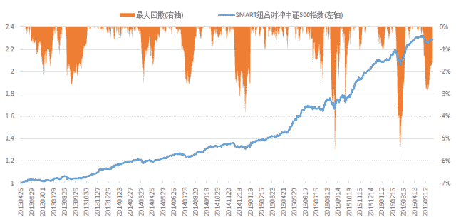** 

****1. ****前言：聆听高频世界的声音****

**天下武功，唯快不破。更高频的数据，更高频的交易，一直是量化投资领域的独门绝技。对于国内机构投资者而言，高频的交易目前常受限于外部法规或内部风控等诸多因素。退而求其次，如果能够从高频数据中获取有用的信息，为构造低频交易信号提供依据，也是十分诱人的想法。** 

**在量化选股的领域，随着业内对各类选股因子的不断挖掘，传统的基本面因子、技术类因子以及事件型因子，都已经被研究得相当透彻。而另一方面，源自高频数据的选股因子，至今仍未受到广泛关注。如何从分钟行情数据的海洋中，萃取出新的有效因子呢？带着这个问题，方正金工团队近期推出了“聆听高频世界的声音”系列研究。本报告为继**《异动罗盘：寻一只特立独行的票》**、**《夜空中最亮的星：十字星形态的选股研究》**之后，“高频”系列报告的第三篇。正如读者所看到的，本系列报告在研究方法上有较多创新的尝试，方正金工团队期待能以此为广大量化投资人带来思路上的启发，起到抛砖引玉的效果，一起聆听来自高频世界的声音。** 

****2\. 从分钟行情数据看聪明钱****

**市场是一座黑暗森林，每个交易者都是带枪的猎人，他必须小心不暴露自己——林中到处都有与他一样潜行的猎人。也正因为如此，备受大家关注的“聪明钱”（Smart Money），怀揣着更加准确、更有价值的市场信息，像幽灵般潜行于林间，更是难觅踪影。在本篇报告中，方正金工团队提出这样一个课题：我们能不能从分钟行情数据中，找到“聪明钱”行动的蛛丝马迹呢？** 

**股票的分钟行情数据，通常包含开盘价、最高价、最低价、收盘价和成交量等信息。我们面临的第一个难题是，在这么多的分钟行情数据中，如何区别哪些分钟属于聪明钱的交易？考虑到聪明钱在交易过程中往往呈现“单笔订单数量更大、订单报价更为激进”的特征[1]，在本报告中，我们采用指标 S 来衡量每一个分钟交易的“聪明”程度：**

**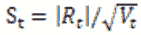** 

**其中，Rt 为第 t 分钟的涨跌幅，Vt 为第 t 分钟的成交量。指标 St 的值越大，则表示该分钟的交易越“聪明”。** 

**借助指标 S，我们可以通过以下方法筛选聪明钱的交易：对于特定股票、特定时段的所有分钟行情数据[2]，将其按照指标 S 从大到小进行排序，将成交量累积占比前 20% 视为聪明钱的交易。为了更加形象地展示这一划分过程，图表 1 给出了一个简单的示例。图表 1 的上半部分，是一段长度为半小时的分钟行情数据，按照时间顺序排列，时间标签依次为 1 至 30，蓝柱代表每分钟的成交量，红点代表每分钟的 S 值。图表 1 的下半部分，我们按照 S 值从大到小对行情数据进行重新排序，柱子仍代表每分钟的成交量，绿线代表成交量从左到右的累计占比（相对于总成交量）。最后，我们以成交量累计占比 20% 作为划分的界线，将最左侧的 6 个分钟数据（红柱）划归为聪明钱的交易。剩余的分钟数据（蓝柱）则被划为普通资金的交易。**

**图表 1：聪明钱的划分过程（示例）**

**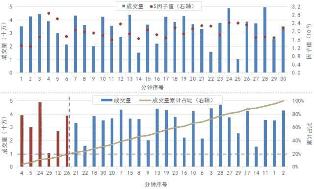** 

**对于特定股票、特定时段的分钟行情数据，按照上述方法划分出聪明钱的交易之后，我们可以构造**聪明钱的情绪因子 Q**：**

**Q=VWAPsmart/VWAPall** 

**其中，VWAPsmart 是聪明钱的成交量加权平均价，VWAPall 是所有交易的成交量加权平均价。不难看出，因子 Q 实际上反映了在该时间段中聪明钱参与交易的相对价位。之所以将其称为聪明钱的情绪因子，是因为：**因子 Q 的值越大，表明聪明钱的交易越倾向于出现在价格较高处，这是逢高出货的表现，反映了聪明钱的悲观态度；因子 Q 的值越小，则表明聪明钱的交易多出现在价格较低处，这是逢低吸筹的表现，是乐观的情绪。**** 

****3\. 情绪因子的选股能力****

**在本小节中，我们将重点考察聪明钱情绪因子 Q 的选股能力。因子历史回测的基本框架如下：** 

**1)  回测时段为 2013 年 4 月 30 日至 2016 年 5 月 31 日；**

**2)  样本空间为全体 A 股，剔除 ST 股和上市未满 60 日的新股；**

**3)  组合每月月初调仓，交易费率设为双边千分之三；**

**4)  调仓时，涨停、停牌不买入，跌停、停牌不卖出。**

**在每个月的最后一个交易日，我们取所有股票最近 10 个交易日的分钟行情数据，计算每只股票的情绪因子 Q。图表 2 给出了每个月因子值与次月收益的秩相关系数（RankIC），显著为正的有 5 个（红柱），显著为负的有 26 个（红柱），相关性不显著的有 6 个（淡色）。情绪因子的 RankIC 基本为负的结论，结合前文关于聪明钱情绪的讨论，说明跟随聪明钱的投资方向是有利可图的。**

**为了考察因子的收益表现，在每个月底，我们将所有股票按照因子 Q 从小到大排序，等分成五组。图表 3 给出了各组的净值曲线，其中，第一组为 Q 值最小的组，第五组则为 Q 值最大的组，虚线为第一组与第五组对冲的净值。多空对冲的年化收益为 26.0%，信息比率为 2.70，最大回撤为 7.97%，月度胜率为 75.7%，收益回撤比高达 3.26。图表 4 为各组每月相对于市场平均收益的超额收益，其中多头超额收益为 0.94%，空头超额收益为-1.06%。此数据显示，在多空对冲的收益中，多头、空头分别各贡献了约 50%。**

**图表 2：因子 RankIC 的月度序列**

**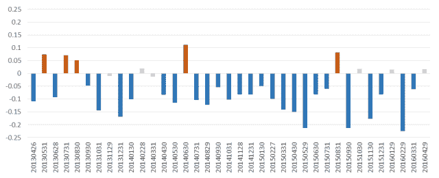** 

**图表 3：分组表现与多空对冲净值**

**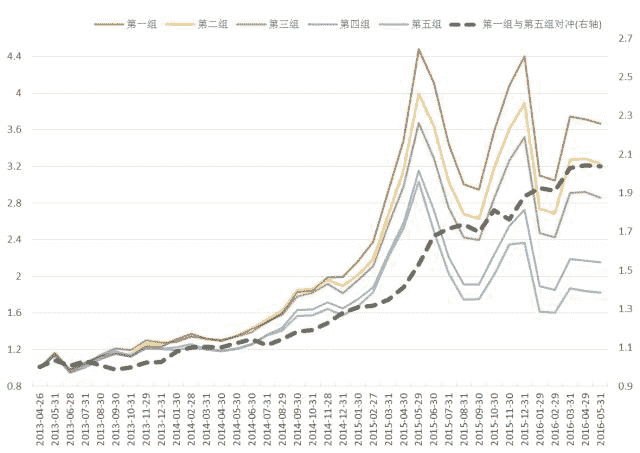
   **

**图表 4：分组相对于市场平均收益的超额收益（月度均值）**

**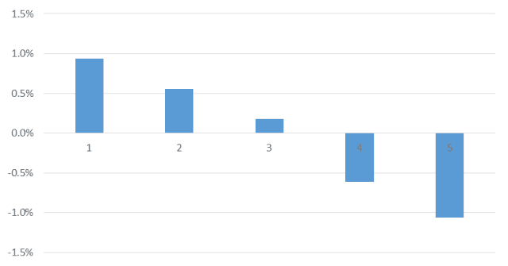** 

**图表 5：多空对冲的分年度表现**

**在本小节的最后，让我们来关注情绪因子 Q 的一个构造细节。我们对于聪明钱的划分，是以成交量累计占比 20% 作为界线的。取 20%作为截止值，是出于这样的考虑：在 A 股市场中，机构投资者贡献了相对较小的成交量（此结论有实证数据支撑）。参数测试的结果也支持我们这一做法：图表 6 给出了不同截止值下多空对冲的净值曲线，随着截止值的提高，收益呈现单调递减。**

**图表 6：不同截止值下的多空对冲收益**

**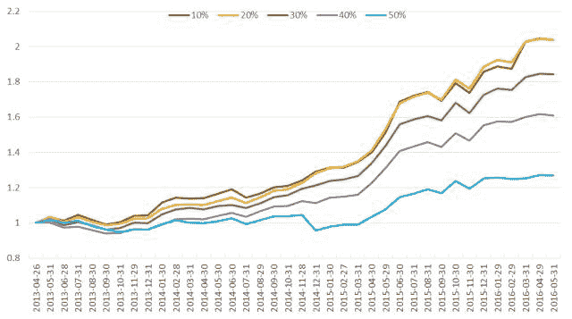
    **

****4\. 情绪因子的风险特征****

**本小节我们重点关注情绪因子 Q 与市值、动量等因子的关联性。图表 7、图表 8 分别是按照情绪因子排序分组的市值、动量特征。各组的流通市值特征，呈现“中间高、两头低”的特点，多头组合（第一组）与空头组合（第五组）均有轻微的小市值暴露。各组的动量特征，则呈现“中间低、两头高”的特点，在动量因子上也是轻微的暴露。** 

**为了考察情绪因子本身的收益特征，我们考虑通过横截面回归取残差的方式，对市值、动量、行业等因子进行剔除。横截面回归模型如下：**

**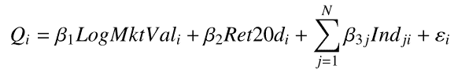
其中，Q 为聪明钱情绪因子，LogMktVal 为股票的对数流通市值，Ret20d 为前 20 个交易日的涨跌幅，Ind 为申万一级行业哑变量，ε为残差因子。图表 9 给出了按照残差因子排序分组的多空对冲净值，年化收益为 13.1%，期间最大回撤为 5.22%，信息比率为 2.07，月度胜率为 78.4%，收益回撤比为 2.51。**

**图表 7：情绪因子分组的市值特征**

**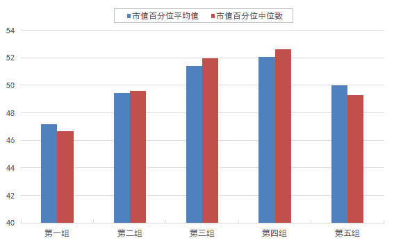
   **

**图表 8：情绪因子分组的动量特征**

**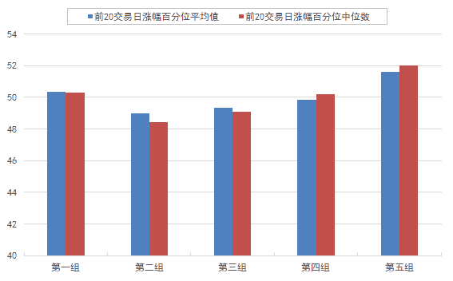** 

**图表 9：剔除市值、动量、行业因子后的多空对冲收益**

****5\. 跟踪聪明钱的 SMART 组合****

**如前文所述，我们将 Q 值小视为聪明钱逢低买入的表现。因此，选取五分组中 Q 值最小的第一组，可作为**跟踪聪明钱动向的 SMART 组合**。在图表 10 中，蓝线为 SMART 组合的净值表现，全区间累计收益为 255%。橘线为剔除了前期涨幅过高的五分之一样本后，再取 Q 值最小一组得到的 SMART 组合，全区间累计收益为 288%。作为对比，同期中证 50 指数的累计收益仅为 76.6%。** 

**图表 11 为 SMART 组合（图表 10 橘线）对冲中证 500 指数后的净值表现。年化收益为 31.6%，信息比率为 3.66，最大回撤为 5.9%，月度胜率为 79.0%，收益回撤比高达 5.4。此结果显示，在回测的历史时段内，SMART 组合非常稳定地跑赢中证 500 指数。**

**图表 10：SMART 组合的净值表现**

**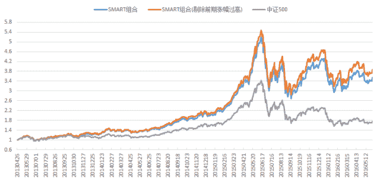** 

**图表 11：SMART 组合对冲中证 500 指数的效果**

**    **

****6\. 风险提示****

**选股模型的主要风险有两个方面：（1）量化模型的收益测试基于历史数据，市场未来可能发生较大的变化；（2）单个因子的收益可能存在较大波动，实际应用需结合资金管理、风险控制等方法。** 

**附注：**

**[1] 相关实证研究，参见《订单簿信息透明性对投资者行为和市场质量的影响》（上海证券交易所研究中心，2006）、《个人与机构投资者订单主动性比较》（管理评论，2004）等。**

**[2] 实际上，为避免某些成交量太小的分钟被划为“聪明钱的交易”，在进行排序划分之前，我们先剔除了分钟数据中成交量最小的五分之一样本。此操作对因子收益影响不大，仅出于逻辑严密的考虑。**

**[3] 实习生陈楠、陈实参与了本项研究，对本课题有重要贡献。**

****量化投资与机器学习****

****知识、能力、深度、专业****

****勤奋、天赋、耐得住寂寞****

********

******链接: http://pan.baidu.com/s/1i47YDUX ******

******密码: ahwg******