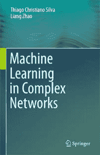
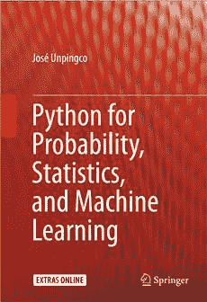
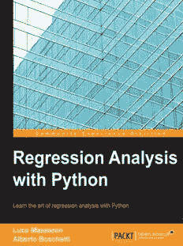

# 【每周国外书籍】2016 年最新机器学习书籍电子版——你知道一本买来得好多刀啊！

> 原文：[`mp.weixin.qq.com/s?__biz=MzAxNTc0Mjg0Mg==&mid=2653283159&idx=1&sn=2b5ff2017cabafc48fd3497ae5efa58c&chksm=802e2142b759a8543fe53ff46ff5d18028eb89f2d8a99af8da36541602993b36505083ab1753&scene=27#wechat_redirect`](http://mp.weixin.qq.com/s?__biz=MzAxNTc0Mjg0Mg==&mid=2653283159&idx=1&sn=2b5ff2017cabafc48fd3497ae5efa58c&chksm=802e2142b759a8543fe53ff46ff5d18028eb89f2d8a99af8da36541602993b36505083ab1753&scene=27#wechat_redirect)

> ********查看之前文章请点击右上角********，关注并且******查看历史消息******
> 
> ********所有文章全部分类和整理，让您更方便查找阅读。请在页面菜单里查找。********

这周分享的书籍是 2016 年最新的哦！

**点击右下角【写留言】。**

**说说你对这个活动的看法和对平台的建议，****即可免费获取三本书的链接。**

工作人员会在每晚 6:00 回复发送链接。

**第一本**

This book presents the features and advantages offered by complex networks in the machine learning domain. In the first part, an overview on complex networks and network-based machine learning is presented, offering necessary background material. In the second part, we describe in details some specific techniques based on complex networks for supervised, non-supervised, and semi-supervised learning. Particularly, a stochastic particle competition technique for both non-supervised and semi-supervised learning using a stochastic nonlinear dynamical system is described in details. Moreover, an analytical analysis is supplied, which enables one to predict the behavior of the proposed technique. In addition, data reliability issues are explored in semi-supervised learning. Such matter has practical importance and is not often found in the literature. With the goal of validating these techniques for solving real problems, simulations on broadly accepted databases are conducted. Still in this book, we present a hybrid supervised classification technique that combines both low and high orders of learning. The low level term can be implemented by any classification technique, while the high level term is realized by the extraction of features of the underlying network constructed from the input data. Thus, the former classifies the test instances by their physical features, while the latter measures the compliance of the test instances with the pattern formation of the data. We show that the high level technique can realize classification according to the semantic meaning of the data. This book intends to combine two widely studied research areas, machine learning and complex networks, which in turn will generate broad interests to scientific community, mainly to computer science and engineering areas.

**第二本**

      This book covers the key ideas that link probability, statistics, and machine learning illustrated using Python modules in these areas. The entire text, including all the figures and numerical results, is reproducible using the Python codes and their associated Jupyter/IPython notebooks, which are provided as supplementary downloads. The author develops key intuitions in machine learning by working meaningful examples using multiple analytical methods and Python codes, thereby connecting theoretical concepts to concrete implementations. Modern Python modules like Pandas, Sympy, and Scikit-learn are applied to simulate and visualize important machine learning concepts like the bias/variance trade-off, cross-validation, and regularization. Many abstract mathematical ideas, such as convergence in probability theory, are developed and illustrated with numerical examples. This book is suitable for anyone with an undergraduate-level exposure to probability, statistics, or machine learning and with rudimentary knowledge of Python programming.

**第三本**

       Learn the art of regression analysis with Python About This Book * Become competent at implementing regression analysis in Python * Solve some of the complex data science problems related to predicting outcomes * Get to grips with various types of regression for effective data analysis Who This Book Is For The book targets Python developers, with a basic understanding of data science, statistics, and math, who want to learn how to do regression analysis on a dataset. It is beneficial if you have some knowledge of statistics and data science. What You Will Learn * Format a dataset for regression and evaluate its performance * Apply multiple linear regression to real-world problems * Learn to classify training points * Create an observation matrix, using different techniques of data analysis and cleaning * Apply several techniques to decrease (and eventually fix) any overfitting problem * Learn to scale linear models to a big dataset and deal with incremental data In Detail Regression is the process of learning relationships between inputs and continuous outputs from example data, which enables predictions for novel inputs. There are many kinds of regression algorithms, and the aim of this book is to explain which is the right one to use for each set of problems and how to prepare real-world data for it. With this book you will learn to define a simple regression problem and evaluate its performance. The book will help you understand how to properly parse a dataset, clean it, and create an output matrix optimally built for regression. You will begin with a simple regression algorithm to solve some data science problems and then progress to more complex algorithms. The book will enable you to use regression models to predict outcomes and take critical business decisions. Through the book, you will gain knowledge to use Python for building fast better linear models and to apply the results in Python or in any computer language you prefer. Style and approach This is a practical tutorial-based book. You will be given an example problem and then supplied with the relevant code and how to walk through it. The details are provided in a step by step manner, followed by a thorough explanation of the math underlying the solution. This approach will help you leverage your own data using the same techniques.