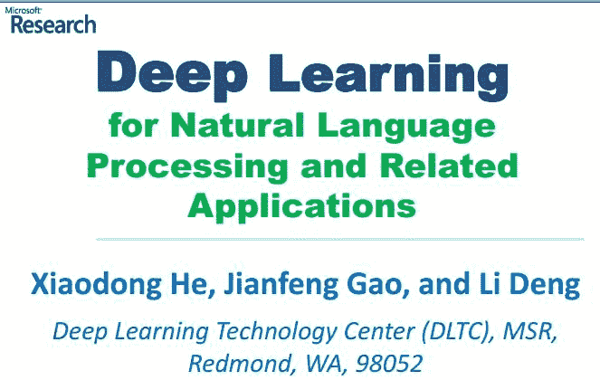
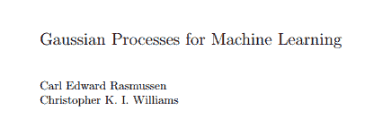

# 【每周书籍干货】国外近期深度学习与机器学习书籍电子版——你知道一本买来好多刀啊！

> 原文：[`mp.weixin.qq.com/s?__biz=MzAxNTc0Mjg0Mg==&mid=2653283143&idx=1&sn=2316c1a067239aa007196cc8cb2e6c5b&chksm=802e2152b759a844669f14ce388df5526c64eb8ceb383efa9b4935caed2fba9f33284bbfb772&scene=27#wechat_redirect`](http://mp.weixin.qq.com/s?__biz=MzAxNTc0Mjg0Mg==&mid=2653283143&idx=1&sn=2316c1a067239aa007196cc8cb2e6c5b&chksm=802e2152b759a844669f14ce388df5526c64eb8ceb383efa9b4935caed2fba9f33284bbfb772&scene=27#wechat_redirect)

> ********查看之前文章请点击右上角********，关注并且******查看历史消息******
> 
> ********所有文章全部分类和整理，让您更方便查找阅读。请在页面菜单里查找。********

每周分享十几本国外书籍。

**可以打赏！！！可以点赞！！可以留言！**

希望分享给更多的人，知识共享！

**1、****The LION Way: Machine Learning plus Intelligent Optimization**

> 这是一本机器学习的小册子, 短短 300 多页道尽机器学习的方方面面. 图文并茂, 生动易懂, 没有一坨坨公式的烦恼. 适合新手入门打基础, 也适合老手温故而知新. 比起 MLAPP/PRML 等大部头, 也许这本你更需要！

**2、****Mathematics for Computer Science**

**** 

> 这本书是由谷歌公司和 MIT 共同出品的计算机科学中的数学：分为 5 大部分：1）证明，归纳。2）结构，数论，图。3）计数，求和，生成函数。4）概率，随机行走。5）递归。等等

**3、Practical Data Science with R**

**** 

> 这是一本由雪城大学新编的第二版《数据科学入门》教材：偏实用型，浅显易懂，适合想学习 R 语言的同学选读。

**4、Foundations of Data Science** 

**** 

> 信息时代的计算机科学理论

**5、****An Introduction to Statistical Learning with Applications in R**

 

> 这是一本斯坦福统计学著名教授 Trevor Hastie 和 Robert Tibshirani 的新书，并且在 2014 年一月已经开课。

**6、A Handbook of Models, Programs, and Exercises**

> 这是一本关于分布式并行处理的数据《Explorations in Parallel Distributed Processing: A Handbook of Models, Programs, and Exercises》,作者是斯坦福的 James L. McClelland。着重介绍了各种神级网络算法的分布式实现,做 Distributed Deep Learning 的童鞋可以参考下。

**7、****Deep Learning for Natural Language Processing and Related Applications**

**** 

> 这份文档来自微软研究院,精髓很多。如果需要完全理解，需要一定的机器学习基础。不过有些地方会让人眼前一亮,毛塞顿开。

**8、Sibyl: A system for large scale supervised machine learning**

**** 

> Sibyl 是一个监督式机器学习系统，用来解决预测方面的问题，比如 YouTube 的视频推荐。

**9、Deep Learning**

> Yoshua Bengio, Ian Goodfellow, Aaron Courville 著

**10、****Deep Learning: Methods and Applications**

 

> 这是一本来自微的研究员 li Peng 和 Dong Yu 所著的关于深度学习的方法和应用的电子书。

**10、****Gaussian Processes for Machine Learning**

> 由 Carl Edward Rasmussen，Christopher K. I. Williams 编写

**11、Neural Networks and Deep Learning**

**** 

**12、Statistical Pattern Recognition**

**13、Machine Learning For Financial Engineering**

**** 

**所有书籍连接在【阅读原文】**

**回复【每周书籍】获取密码。**

**量化投资与机器学习**

**知识、能力、深度、专业**

**勤奋、天赋、耐得住寂寞**

**** 

****