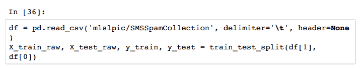
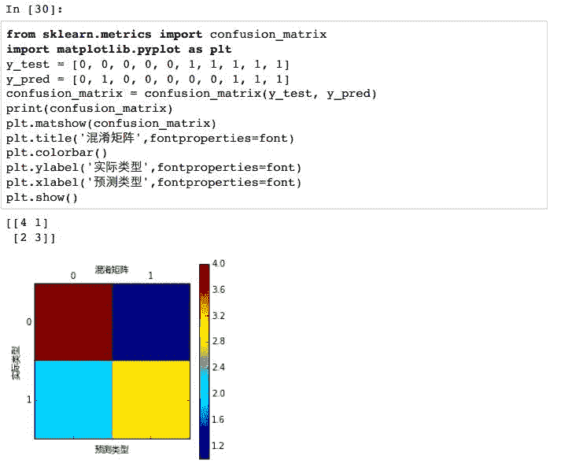

# 【Python 机器学习】系列之从线性回归到逻辑回归篇（深度详细附源码）

> 原文：[`mp.weixin.qq.com/s?__biz=MzAxNTc0Mjg0Mg==&mid=2653283118&idx=1&sn=fb38ed89200ba96f9ed2791dce76d55e&chksm=802e213bb759a82dac983e5f48c69dfab047a98da8cf173f8e31bc101e9b5029d6bf2a1a6c74&scene=27#wechat_redirect`](http://mp.weixin.qq.com/s?__biz=MzAxNTc0Mjg0Mg==&mid=2653283118&idx=1&sn=fb38ed89200ba96f9ed2791dce76d55e&chksm=802e213bb759a82dac983e5f48c69dfab047a98da8cf173f8e31bc101e9b5029d6bf2a1a6c74&scene=27#wechat_redirect)

********查看之前文章请点击右上角********，关注并且******查看历史消息******

********所有文章全部分类和整理，让您更方便查找阅读。请在页面菜单里查找。********

**相关内容：（点击标题可查看原文）**

[**第一章 机器学习基础**](http://mp.weixin.qq.com/s?__biz=MzAxNTc0Mjg0Mg==&mid=405186782&idx=2&sn=34cb8d04935fdfd6d24c29d565380b50&scene=21#wechat_redirect)

将机器学习定义成一种通过学习经验改善工作效果的程序研究与设计过程。其他章节都以这个定义为基础，后面每一章里介绍的机器学习模型都是按照这个思路解决任务，评估效果。

[**第二章 线性回归**](http://mp.weixin.qq.com/s?__biz=MzAxNTc0Mjg0Mg==&mid=405488375&idx=1&sn=e06859f0d3cf5102946bd1551d80184a&scene=21#wechat_redirect)

介绍线性回归模型，一种解释变量和模型参数与连续的响应变量相关的模型。本章介绍成本函数的定义，通过最小二乘法求解模型参数获得最优模型。

[**第三章 特征提取与处理**](http://mp.weixin.qq.com/s?__biz=MzAxNTc0Mjg0Mg==&mid=2653283084&idx=1&sn=c7dd24ea9f5633f1f5370176fadef05f&scene=21#wechat_redirect)

很多机器学习问题需要研究的对象可能是分类变量、文字甚至图像。本章介绍提取这些变量特征的方法。这些技术是数据处理的前提——序列化，更是机器学习的基础。

> 在第二章，线性回归里面，我们介绍了一元线性回归，多元线性回归和多项式回归。这些模型都是广义线性回归模型的具体形式，广义线性回归是一种灵活的框架，比普通线性回归要求更少的假设。这一章，我们讨论广义线性回归模型的具体形式的另一种形式，逻辑回归（logistic regression）。
> 
> 和前面讨论的模型不同，逻辑回归是用来做分类任务的。分类任务的目标是找一个函数，把观测值匹配到相关的类和标签上。学习算法必须用成对的特征向量和对应的标签来估计匹配函数的参数，从而实现更好的分类效果。在二元分类（binary classification）中，分类算法必须把一个实例配置两个类别。二元分类案例包括，预测患者是否患有某种疾病，音频中是否含有人声等。多元分类中，分类算法需要为每个实例都分类一组标签。本章，我们会用逻辑回归来介绍一些分类算法问题，研究分类任务的效果评价，也会用到上一章学的特征抽取方法。

**●****逻辑回归处理二元分类**

普通的线性回归假设响应变量呈正态分布，也称为高斯分布（Gaussian distribution ）或钟形曲线（bell curve）。正态分布数据是对称的，且均值，中位数和众数（mode）是一样的。很多自然现象都服从正态分布。比如，人类的身高就服从正态分布，姚明那样的高度极少，在 99%之外了。

在某些问题里，响应变量不是正态分布的。比如，掷一个硬币获取正反两面的概率分布是伯努力分布（Bernoulli distribution），又称两点分布或者 0-1 分布。表示一个事件发生的概率是 ，不发生的概率是 ，概率在{0,1}之间。线性回归假设解释变量值的变化会引起响应变量值的变化，如果响应变量的值是概率的，这条假设就不满足了。广义线性回归去掉了这条假设，用一个联连函数(link

function)来描述解释变量与响应变量的关系。实际上，在第二章，线性回归里面，我们已经用了联连函数。普通线性回归作为广义线性回归的特例使用的是恒等联连函数(identity link function)，将解释变量的通过线性组合的方式来联接服从正态分布的响应变量。如果响应变量不服从正态分布，就要用另外一种联连函数了。

在逻辑回归里，响应变量描述了类似于掷一个硬币结果为正面的概率。如果响应变量等于或超过了指定的临界值，预测结果就是正面，否则预测结果就是反面。响应变量是一个像线性回归中的解释变量构成的函数表示，称为逻辑函数（logistic function）。一个值在{0,1}之间的逻辑函数如下所示：

下面是 在{-6,6}的图形：

在逻辑回归中， 是解释变量的线性组合，公式如下：

对数函数（logit function）是逻辑函数的逆运算：

 

定义了逻辑回归的模型之后，我们用它来完成一个分类任务。

**●垃圾邮件分类**

经典的二元分类问题就是垃圾邮件分类（spam classification）。这里，我们分类垃圾短信。我们用第三章介绍的 TF-IDF 算法来抽取短信的特征向量，然后用逻辑回归分类。

我们可以用 UCI Machine Learning Repository

(http://archive.ics.uci.edu/ml/datasets/SMS+Spam+Collection)的短信垃圾分类数据集（SMS SpamClassification Data Set）。首先，我们还是用 Pandas 做一些描述性统计：

每条信息的前面已经被打上了标签。共 5574 条短信里面，4827 条是 ham，747 条是 spam。ham 短信用 0 标记，spam 短信用 1 标记。观察数据会看到更多建模时需要的信息。下面的几条信息体现两种类型的特征：

● Spam: Free entry in 2 a wkly comp to win FA Cup final tkts 21st May
● Text FA to 87121 to receive entry question(std txt rate)T&C's apply                 08452810075over18's
● Spam: WINNER!! As a valued network customer you have been selected to    receivea £900prize reward! To claim call 09061701461\. Claim code KL341\.      Valid 12 hours only.
● Ham: Sorry my roommates took forever, it ok if I come by now?
● Ham: Finished class where are you.

用 LogisticRegression 类来预测：

**** 

首先，用 pandas 加载数据.csv 文件，然后用 train_test_split 分成训练集（75%）和测试集（25%）：

然后，我们建一个 TfidfVectorizer 实例来计算 TF-IDF 权重：

最后，我们建一个 LogisticRegression 实例来训练模型。和 LinearRegression 类
似，LogisticRegression 同样实现了 fit()和 predict()方法。最后把结果打印出来看看：

**** 

**
** 

分类模型的运行效果如何？有线性回归的度量方法在这里不太适用了。我们感兴趣的是分类是否正确，并不在乎它的决策范围。下面，我们来介绍二元分类的效果评估方法。

**●二元分类效果评估方法**

二元分类的效果评估方法有很多，常见的包括第一章里介绍的肿瘤预测使用的准确率（accuracy），精确率（precision）和召回率（recall）三项指标，以及综合评价指标（F1 measure）， ROC AUC 值（Receiver Operating Characteristic ROC，Area Under Curve，AUC）。这些指标评价的样本分

类是真阳性（true positives），真阴性（true negatives），假阳性（false positives），假阴性（false negatives）。阳性和阴性指分类，真和假指预测的正确与否。

在我们的垃圾短信分类里，真阳性是指分类器将一个垃圾短信分辨为 spam 类。真阴性是指分类器将一个正常短信分辨为 ham 类。假阳性是指分类器将一个正常短信分辨为 spam 类。假阴性是指分类器将一个垃圾短信分辨为 ham 类。混淆矩阵（Confusion matrix），也称列联表分析（Contingency table）可以用来描述真假与阴阳的关系。矩阵的行表示实际类型，列表示预测类型。

**准确率**
准确率是分类器预测正确性的评估指标。scikit-learn 提供了 accuracy_score 来计算：

LogisticRegression.score()用来计算模型预测的准确率：

**** 

你的结果可能和这些数字不完全相同，毕竟交叉检验的训练集和测试集都是随机抽取的。准确率是分类器预测正确性的比例，但是并不能分辨出假阳性错误和假阴性错误。另外，有时准确率并非一个有效的衡量指标，如果分类的比例在样本中严重失调。比如，分类器预测信用卡交易是否为虚假交易时，假阴性比假阳性更敏感。为了提高客户满意度，信用卡部门更倾向于对合法的交易进行风险检查，往往会忽略虚假交易。因为绝大部分交易都是合法的，这里准确率不是一个有效的衡量指标。经常预测出虚假交易的分类器可能有很高的准确率，但是实际情况可能并非如此。因此，分类器的预测效果还需要另外两个指标：精确率和召回率。

**精确率和召回率**

**** 

我们的分类器精确率 99.2%，分类器预测出的垃圾短信中 99.2%都是真的垃圾短信。召回率比较低 67.2%，就是说真实的垃圾短信中，32.8%被当作正常短信了，没有被识别出来。这些数据会不断变化，因为训练集和测试集是随机抽取的。

**●计算综合评价指标**

综合评价指标（F1 measure）是精确率和召回率的调和均值（harmonic mean），或加权平均值，也称为 F-measure 或 fF-score。

综合评价指标平衡了精确率和召回率。一个二元分类模型，精确率和召回率为 1，那么综合评价指标为 1。如果精确率或召回率为 0，那么综合评价指标为 0。scikit-learn 也提供了计算综合评价指标的函数。

本例的综合评价指标是 80%。由于精确率和召回率的差异比较小，所以综合评价指标的罚值也比较小。有时也会用 F0.5 和 F2，表示精确率权重大于召回率，或召回率权重大于精确率。

**●ROC AUC**
ROC 曲线（Receiver Operating Characteristic，ROC curve）可以用来可视化分类器的效果。和准确率不同，ROC 曲线对分类比例不平衡的数据集不敏感，ROC 曲线显示的是对超过限定阈值的所有预测结果的分类器效果。ROC 曲线画的是分类器的召回率与误警率（fall-out）的曲线。误警率也称假阳性率，是所有阴性样本中分类器识别为阳性的样本所占比例：

AUC 是 ROC 曲线下方的面积，它把 ROC 曲线变成一个值，表示分类器随机预测的效果。scikit-learn 提供了计算 ROC 和 AUC 指标的函数

**●网格搜索**

在第二章我们曾经提到过超参数，是需要手动调节的参数，模型无法学习。比如，在我们的垃圾短信分类模型中，超参数出现在 TF-IDF 中，用来移除太频繁和太稀缺单词的频率阈值，目前函数正则化的权重值。在 scikit-learn 里面，超参数是在模型建立时设置的。在前面的例子中，我们没有为 LogisticRegression()设置参数，是因为用的都是默认值。但是有时候默认值不一定是最优的。网格搜索（Grid search）就是用来确定最优超参数的方法。其原理就是选取可能的参数不断运行模型获取最佳效果。网格搜索用的是穷举法，其缺点在于即使每个超参数的取值范围都很小，计算量也是巨大的。不过这是一个并行问题，参数与参数彼此独立，计算过程不需要同步，所有很多方法都可以解决这个问题。scikit-learn 有 GridSearchCV()函数解决这个问题：

GridSearchCV()函数的参数有待评估模型 pipeline，超参数词典 parameters 和效果评价指标 scoring。n_jobs 是指并发进程最大数量，设置为-1 表示使用所有 CPU 核心进程。在 Python3.4 中，可以写一个 Python 的脚本，让 fit()函数可以在 main()函数里调用，也可以在 Python 自带命令行,IPython 命令行和 IPython Notebook 运行。经过网格计算后的超参数在训练集中取得了很好的效果。

**●多类分类**

现实中有很多问题不只是分成两类，许多问题都需要分成多个类，成为多类分类问题（Multi-classclassification）。比如听到一首歌的样曲之后，可以将其归入某一种音乐风格。这类风格就有许多种。scikit-learn 用 one-vs.-all 或 one-vs.-the-rest 方法实现多类分类，就是把多类中的每个类都作为二元分类处理。分类器预测样本不同类型，将具有最大置信水平的类型作为样本类型。LogisticRegression()通过 one-vs.-all 策略支持多类分类。下面，我们用它来分析一个多类分类问题。

假设你想看电影，而你又非常讨厌看太次的电影。所以有品位的你可以在看每部电影之前都会看一堆影评，不过你更讨厌看影评。那么下面我们就用好影评来给电影分类。本例中，我们利用烂番茄（Rotten Tomatoes）网站影评短语数据对电影进行评价。每个影评可以归入下面 5 个类项：不给力（negative），不太给力（somewhat negative），中等（neutral），有点给力（somewhat positive）, 给力（positive）。解释变量不会总是直白的语言，因为影评内容千差万别，有讽刺的，否定的，以及其他语义的表述，语义并不直白，这些都会让分类充满挑战。数据集可以从 kaggle (https://www.kaggle.com/c/sentiment-analysis-on-movie-reviews)上下载。首先，我们还是用 Pandas 简单探索一下：

Sentiment 是响应变量，0 是不给力（negative），4 是给力（positive），其他以此类推。Phrase 列是影评的内容。影评中每句话都被分割成一行。我们不需要考虑 PhraseId 列和 SentenceId 列。

可以看出，近 51%都是评价为 2 中等（neutral）的电影。可见，在这个问题里，准确率不是一个有信息量的评价指标，因为即使很烂的分类器预测出中等水平的结果，其准确率也是 51%。3 有点给力（somewhat positive）的电影占 21%, 4 给力（positive）的电影占 6%，共占 27%。剩下的 21%就是不给力（negative），不太给力（somewhat negative）的电影。用 scikit-learn 来训练分类器：

**多类分类效果评估**

二元分类里，混淆矩阵可以用来可视化不同分类错误的数据。每种类型的精确率，召回率和综合评价指标（F1 score）可以计算，所有预测的准确率也可以计算。

我们通过网格搜索获得了最佳参数组合，最终的分类器是通过对开始的分类器不断优化得到的。

**●多标签分类和问题转换**

前面我们讨论了二元分类，多类分类，还有一种分类问题是多标签分类（multi-label classification）。每个样本可以拥有全部类型的一部分类型。这样的例子太普遍了，比如统计班上同学一周 7 天里哪天有空。每个同学都会在周一到周日这 7 天里，根据自己的情况分别打勾。再比如常见的博客文章分类标签，一篇文章一般都有好几个标签等等。多标签分类问题一般有两种解决方法。

问题转化方法(Problem transformation)可以将多标签问题转化成单标签问题。 第一种转换方法是训练集里面每个样本通过幂运算转换成单标签。比如下面数据里面每篇文章都带有若干标签。

转换方法就是用幂运算将多个类合并成一个类，比如样本 1 有 Local 和 US 类，新建一个标签为 Local^US 类，这样多标签就变成单标签了。

这样原来 5 个标签现在变成了 7 个标签。这种幂运算虽然直观，但是并不实用，因为这样做多出来的标签只有一小部分样本会用到。而且，这些标签只能在训练集里面学习这些类似，在测试集中依然无法使用。

另外一种问题转换方法就是每个标签都用二元分类处理。每个标签的分类器都预测样本是否属于该标签。我们的例子中需要 5 个二元分类器，第一个分类器预测样本是否应该被归入 Local 类，第二个分类器预测样本是否应该被归入 US 类，以此类推。预测最后一步就是把这些分类结果求并集，如下图所示。这个问题确保了单标签问题和多标签问题有同样的训练集，只是忽略了标签之间的关联关系。

 

**多标签分类效果评估**

多标签分类效果评估与多标签分类效果评估方式不同。最常用的手段是汉明损失函数（Hamming loss）和杰卡德相似度（Jaccard similarity）。汉明损失函数表示错误标签的平均比例，是一个函数，当预测全部正确，即没有错误标签时，值为 0。杰卡德相似度或杰卡德相指数（Jaccard index），是预测标签和真实标签的交集数量除以预测标签和真实标签的并集数量。其值在{0,1}之间，公式如下：

**总结**
本章我们介绍了广义线性模型，是对普通线性回归中解释变量非正态分布情况的扩展。广义线性回归模型通过联接方程将解释变量和响应变量联接起来，和普通线性回归不同，这个方程可能是非线性的。我们重点介绍了逻辑联接方程，其图象是一种 S 曲线，对任意实数的返回值都在在{0,1}之间，如群体生长曲线。

之后，我们介绍了逻辑回归，一种通过逻辑联接方程联接解释变量与呈伯努力分布的响应变量的关系。逻辑回归可用于解决二元分类问题，我们用它研究了典型的垃圾短信分类问题。紧接着我们介绍了多类分类问题，其类型空间超过两个，每个样本都有且仅有一种类型，我们用 one-vs.-all 策略研究了通过影评对电影分类的问题。最后，我们介绍了多标签分类，其类型空间超过两个，每个样本都有至少一种标签。介绍完广义线性模型的回归和分类问题，下一章我们就来介绍非线性模型的回归和分类问题——决策树

**量化投资与机器学习**

**知识、能力、深度、专业**

**勤奋、天赋、耐得住寂寞**

**** 

****