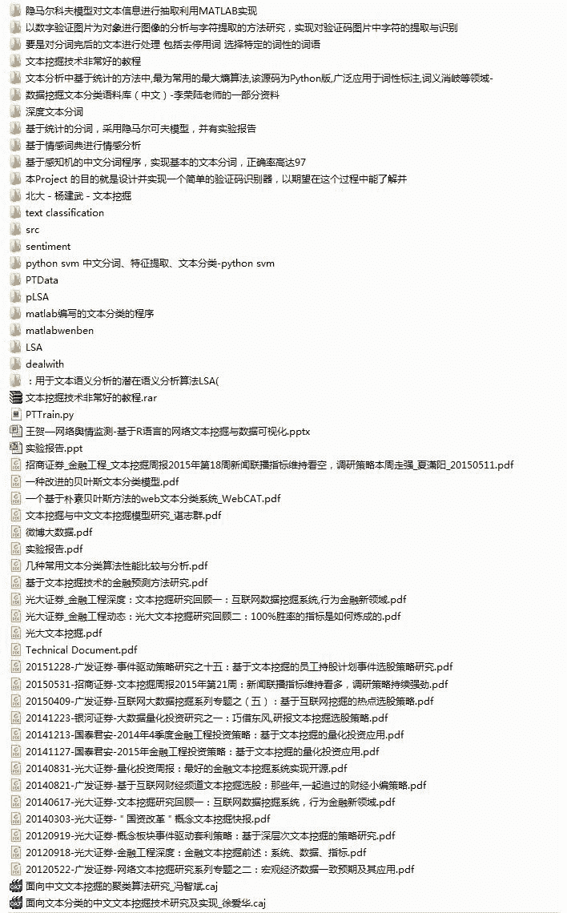

# 【最强干货】关于文本挖掘的资料（文献，报告，策略，代码）

> 原文：[`mp.weixin.qq.com/s?__biz=MzAxNTc0Mjg0Mg==&mid=2653283053&idx=1&sn=1d17fbc17545e561be0664af78304a67&chksm=802e20f8b759a9ee0329c001f68d27a44fef2968573ab4ba51df714355b83a8e9114540a9625&scene=27#wechat_redirect`](http://mp.weixin.qq.com/s?__biz=MzAxNTc0Mjg0Mg==&mid=2653283053&idx=1&sn=1d17fbc17545e561be0664af78304a67&chksm=802e20f8b759a9ee0329c001f68d27a44fef2968573ab4ba51df714355b83a8e9114540a9625&scene=27#wechat_redirect)

> ********查看之前文章请点击右上角********，关注并且******查看历史消息******
> 
> ********所有文章全部分类和整理****************，让您更方便查找阅读。请在页面菜单里查找。********

今天没有策略研究推送。

有几篇文章还需再研究一下

好久没有给大家干货啦 

今天给大家一些干货福利

文本挖掘方面的资料

文献，报告，策略，代码

如果想获取这些资料，请转发到你的朋友圈。然后截图，通过后台发给工作人员，工作人员会发送给您密码。链接在阅读原文。 

这是公众号第一次做这种事情。

这种分享朋友圈的行为，其实并不是很好。

但是公众号需要让更多的读者来分享学习资源，所以希望大家理解理解。

我们很尽力啦。

