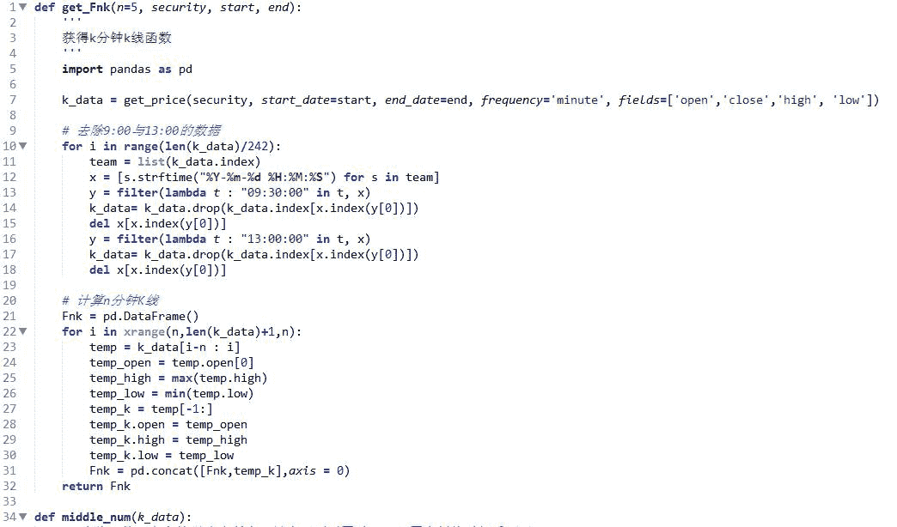

# 【量化投资】缠论面面观（附 Python 源码）

> 原文：[`mp.weixin.qq.com/s?__biz=MzAxNTc0Mjg0Mg==&mid=2653283047&idx=1&sn=fe805c2c7d38b65774f01543d538d8e4&chksm=802e20f2b759a9e4966f089916b4a9c2ba13da6333ab07b2c4c6d55a422ed1b70154b2ca138c&scene=27#wechat_redirect`](http://mp.weixin.qq.com/s?__biz=MzAxNTc0Mjg0Mg==&mid=2653283047&idx=1&sn=fe805c2c7d38b65774f01543d538d8e4&chksm=802e20f2b759a9e4966f089916b4a9c2ba13da6333ab07b2c4c6d55a422ed1b70154b2ca138c&scene=27#wechat_redirect)

> ********查看之前文章请点击右上角********，关注并且******查看历史消息******
> 
> ********所有文章全部分类和整理，让您更方便查找阅读。请在页面菜单里查找。********


来自聚宽：莫邪的救赎的精彩之作

博客连接：https://www.joinquant.com/post/425

   因为缠论文章都是博客形式，并无很规范的写作格式与篇章结构，自己理解起来着实不易，每次读都感悟不同，程序也是改了又改。
       下文对于缠论的理解以及程序的处理都是个人粗浅的理解，还望对缠论有很深造诣的前辈指出不足之处。

## **一、序言**

       研究模块中实现了“缠论”的分型，笔，线段。
       开始本想实现维克多交易法则中的维克多交易法则，维克多 123 法则和 2B 法则是判断趋势变动的最基本法则。思考如何实现对于趋势"图"的识别，想到了缠论中关于分型，笔以及线段的描述。
       其中对简单的 1-2-3 准则的进行简单总结：

1.  趋势线被突破。价格穿越绘制的趋势线

2.  上升趋势不再创新高，或下降趋势不再创新低。

3.  在下降趋势中，价格向上穿越先前的短期反弹高点；或在上升趋势中，价格向下穿越先前的短期回档低点。
           示意图如下所示：

    


 维克多交易规则具体的学习还是要到《专业投机原理》**（在第二篇推文里提供下载地址）**一书中深刻领会，在这里仅仅是一个概括。
       我们可以将维克多的趋势看为缠论的一个线段，维克多的趋势破坏即可认为是缠论中的线段被破坏，如下图中 9 所示，触发交易信号。下面介绍一下缠论之分型、笔、线段。

## **二、缠论之分型、笔、线段**

       下面的定义与图，都适合任何周期的 K 线图。先看图中的第 1、2，图中的小线段代表的是 K 线，这里不分阳线阴线，只看 K 线高低点。


       像图 1 这种，第二 K 线高点是相邻三 K 线高点中最高的，而低点也是相邻三 K 线低点中最高的，定义其顶分型；图 2 这种第二 K 线低点是相邻三 K 线低点中最低的，而高点也是相邻三 K 线高点中最低的，定义为底分型。看不明白定义的，看图就明白了。

       顶分型的最高点叫该分型的顶，底分型的最低点叫该分型的底，由于顶分型的底和底分型的顶是没有意义的，所以顶分型的顶和底分型的底就可以简称为顶和低。也就是说，当我们以后说顶和底时，就分别是说顶分型的顶和底分型的底。

       两个相邻的顶和底之间构成一笔，所谓笔，就是顶和底之间的其他波动，都可以忽略不算，但注意，一定是相邻的顶和底，隔了几个就不是了。而所谓的线段，就是至少由三笔组成。但这里有一个细微的地方要分清楚，因为结合律是必须遵守的，像图 3 这种，顶和底之间必须共用一个 K 线，这就违反结合律了，所以这不算一笔，而图 4，就光是顶和底了，中间没有其他 K 线，一般来说，也最好不算一笔，而图 5，是一笔的最基本的图形，顶和底之间还有一根 K 线。在实际分析中，都必须要求顶和底之间都至少有一 K 线当成一笔的最基本要求。

       当然，实际图形里，有些复杂的关系会出现，就是相邻两 K 线可以出现如图 6 这种包含关系，也就是一 K 线的高低点全在另一 K 线的范围里，这种情况下，可以这样处理，在向上时，把两 K 线的最高点当高点，而两 K 线低点中的较高者当成低点，这样就把两 K 线合并成一新的 K 线；反之，当向下时，把两 K 线的最低点当低点，而两 K 线高点中的较低者当成高点，这样就把两 K 线合并成一新的 K 线。经过这样的处理，所有 K 线图都可以处理成没有包含关系的图形。在我的处理中，将下方这些形式都进行了包含关系的处理。


       而图 7，就给出了经过以上处理，没有包含关系的图形中，三相邻 K 线之间可能组合的一个完全分类，其中的二、四，就是分别是顶分型和底分型，一可以叫上升 K 线，三可以叫下降 K 线。所以，上升的一笔，由结合律，就一定是底分型+上升 K 线+顶分型；下降的一笔，就是顶分型+下降 K 线+底分型。注意，这里的上升、下降 K 线，不一定都是 3 根，可以无数根，只要一直保持这定义就可以。当然，简单的，也可以是 1、2 根，这只要不违反结合律和定义就可以。

       至于图 8，就是线段的最基本形态，而图 9，就是线段破坏，也就是两线段组合的其中一种形态。
       有人可能要说，这怎么有点像波浪理论，缠论作者认为这不奇怪，作者认为缠论的理论可以严格地推论出波浪理论的所有结论，而且还可以指出他理论的所有不足，波浪理论和缠论的理论一点可比性都没有。不仅是波浪理论，所有关于股市的理论，只要是关系到“图形”的，缠论的理论都可以严格推论，因为缠论的理论是关于走势图形最基础的理论，谁都逃不掉。

       缠论中根据可操作性定义了不同显微级别的，对于中枢和走势类型，也就有了关于不同级别的图形的研究。进而，就有了不同级别显微镜的比喻。而实际上，一般能得到的图，最多也就是 1 分钟级别的，因此，可以从这个图入手。当然，也可以从 5 分钟，甚至更高入手，但这就等于把显微镜倍数弄小了，看到的东西自然没有 1 分钟的多且清楚。再次强调，什么级别的图和什么级别的中枢没有任何必然关系，走势类型以及中枢就如同显微镜下的观察物，是客观存在的，其存在性由上面所说最原始的递归定义保证，而级别的图，就如同显微镜，不同倍数的看这客观的图就看到不同的精细程度，如此而已。所以，不能把显微镜和显微镜观察的东西混在一起了。

       如果我们首先确立了显微镜的倍数，也就是说，例如我们把 1 分钟图作为最基本的图，那么就可以开始定义上一课程说的分型、笔、线段等等。有了线段，就可以定义 1 分钟的中枢，然后就是 1 分钟的走势类型，然后按照递归的方法，可以逐步定义 5 分钟、30 分钟、日、周、月、季度、年的中枢和走势类型。而有的人总是不明白，例如总是在问，5 分钟图怎么看，30 分钟怎么看，其实，如果你选择 5 分钟或 30 分钟为最基本的图，那么和 1 分钟的看法一样，只不过你的显微镜倍数比较小，看起来比较粗糙而已。而如果你已经选择 1 分钟作为最基本的图，也就是选定了 1 分钟这个倍数的显微镜，那么看 1 分钟图就可以。

       所以程序中也定义了换算不同分钟级别的函数 get_Fnk，根据需求可获得不同级别的分钟数据。

       另外，鄙人对于分型的寻找，如果一个底分型之后遇到一个顶分型，其中底分型的底高于顶分型的顶，如下图中一所示，则上一个底分型不被确立，跳过该顶分型，接着寻找一个下一个更低的底分型或者顶高于该底分型的顶分型。（话着实有些绕，抱歉抱歉！看图您就明白了。）


       缠论具体细则可参考《教你炒股票-缠中说禅》**（在第二篇推文里提供下载地址）**，其中关于“分型，笔，线段”的内容可参考第 62-65 课的内容。

用缠论分型处理之后的图形如下，符合维克多上升趋势：


## **三、不足之处**

1.  因为思绪混乱，程序更改多次，看着也许会有些混乱；

2.  判断包含关系、找寻顶底的程序没有写成函数；

3.  因为要实现维克多交易规则，程序还要判断准则还需更改，所以暂时并未没有实现，下一步计划实现维克多 1-2-3 与维克多 2B 交易规则。




Out：

```py
[None, None, None, None, None, None, None, None, None, None]
```


```py
[-1, 1, -1, 1, -1, 1, -1, 1, -1, 1, -1, 1]
['2015-12-02 09:55:00', '2015-12-02 10:35:00', '2015-12-02 11:20:00', '2015-12-02 13:35:00', '2015-12-02 14:05:00', '2015-12-02 14:30:00', '2015-12-03 09:50:00', '2015-12-03 11:05:00', '2015-12-03 13:30:00', '2015-12-03 14:30:00', '2015-12-04 11:20:00', '2015-12-04 13:25:00']
[12.35, 11.949999999999999, 12.119999999999999, 12.109999999999999, 12.59, 12.25, 12.75, 12.43, 12.699999999999999, 12.26, 12.300000000000001, 12.09]
```


下面画出识别分型之后的走势图！

 

Out：

```py
[None, None, None, None, None, None, None, None]

```


识别完分型的 candle 图如下：

 

其中黑框为底分型，黄框为顶分型，椭圆为记录的位置，用以跟之后的 k 线进行比对。

用缠论处理之后，上图符合维克多交易法则上升趋势：


**量化投资与机器学习**

**知识、能力、深度、专业**

**勤奋、天赋、耐得住寂寞**

**** 

****