# 【量化投资系列】基于多重分形理论的短趋势择时策略研究

> 原文：[`mp.weixin.qq.com/s?__biz=MzAxNTc0Mjg0Mg==&mid=2653283004&idx=1&sn=95a79928c89a69ac12d07514f5085c9a&chksm=802e20a9b759a9bfa28367854d1a3204057becd5e6ef4b829fbd90d5c79e7edd6bb4a4f66880&scene=27#wechat_redirect`](http://mp.weixin.qq.com/s?__biz=MzAxNTc0Mjg0Mg==&mid=2653283004&idx=1&sn=95a79928c89a69ac12d07514f5085c9a&chksm=802e20a9b759a9bfa28367854d1a3204057becd5e6ef4b829fbd90d5c79e7edd6bb4a4f66880&scene=27#wechat_redirect)

> ********查看之前文章请点击右上角********，关注并且******查看历史消息******，还可以在文章最后评论留言。谢谢您的支持！********

**1、分形理论简介**

       一直以来，有效市场假说 ( EMH)作为一种线性、简单的均衡范式主宰着金融经济学的理论研究；然而 ， 实证研究表明 ， 资本市场的波动具有很多复杂和有趣的特征 ， 这些现象是经典金融理论所解释不了的 ， 因此 ， 越来越多的学者对有效市场假说提出了质疑。近来 ， 分形理论作为复杂性研究的前沿课题开创了金融市场研究的新局面 ； 然而 ， 早期的工作 (R/ S 分析和 DFA 分析 )仅局限于用单一的参数来描述价格波动的宏观概貌和长期统计行为 ， 而对资产价格在某一时刻上局部特性的描述远远不够细致和全面。多重分形能够分析分形维的混合状态 ， 它将复杂体系分成许多奇异度不同的区域 ， 通过具有时变性的参数 (如尺度函数、广义 Hurst 指数、广义分形维和多重分形谱等 )来刻画金融时间序列的局部特征 ， 更加真实地描述系统的复杂统计特性 ， 是刻画金融市场复杂波动的有力工具。

**1.1 分形的维数**

    一般将维数理解为确定一个点的位臵需要的坐标数，点是 0 维，直线是 1 维，方形、圆等平面图形是 2 维，立方体、球等立体图形是 3 维。另外一种对维数的理解则从测度的角度来衡量，当用来测量一个几何体的“尺子”缩小时，需要的尺子数量的增大速度与该几何体的维数直接相关，我们可以对常见的几个单位几何体进行如下的测度：

1、单位长度直线长度的测量 

如果用长为 r 的线段去覆盖一段单位长度的直线，则有如下公式成

1=N*r 其中    N 为覆盖直线所需要的线段数

2、单位面积正方形面积的测量
如果用边长为 r 的小正方形去覆盖一个单位面积的正方形，则有如下公式成立
1=N*r² 其中    N 为覆盖正方形所需要的小正方形数

3、单位体积正方体体积的测量

如果用边长为 r 的小正方体去覆盖一个单位体积的正方体，则有如下公式成立
1=N*r³ 其中   N 为覆盖正方体所需要的小正方体数 

       推而广之，对一个 D 维的几何体来说，当测度的尺子从 r 缩小至 r/2 时，要覆盖这

一几何体需要的尺子将增多至原来的 2^D 个，上述规则几何图形的测度中 r 的幂即 

为其整数维数，将这一定义推广至分数维数即为分形维数 D：

**1=N*r^D —— D=ln N /ln (1/r) r-**>**0**  

**1.2 经典的规则分形集——CANTOR 集**

      为了更好的理解多重分形理论，我们有必要先介绍一个经典的规则分形集——CANTOR 集，其生成规则非常简单：三等分一直线，挖去中段，再把剩下的两段各三等分挖去中段，如此无限的进行下去得到无穷多离散的点组成的 CANTOR 集。

**经典规则分形集——CANTOR 集生成示意图**

**** 

      用尺寸（1/3)^n 的尺子测量 CANTOR 集，只要线段内有 CANTOR 集的点就予以计数，得到有 2^n 个单元，由前面分形维数的公式得到：  **D=ln2/ln3=0.631**

      可见， CANTOR 集的维数大于点（0 维）小于直线（1 维），其局部与整体严格相似（而不是统计相似），因此称为规则分形。

**1.4 多重分形理论简介**  

        在采用盒维数法进行简单分形维数的测定中，只要盒内有该图形的象素则被计数，而不考虑该盒子内象素的多少或者其他物理量的差异（默认这些物理量为均匀分布），而多重分形则将盒子内的象素或者其他物理量进行归一化得到一个概率分布，将概率相同的盒子归为一个子集，并计算其分形维数，最终得到一个多重分形谱函数对分形进行描述，得到的结果包含了许多被简单分形忽略的信息。

      规则分形集——CANTOR 集各个线段质量是完全相同的，也就是说质量是均匀分布的，如果 CANTOR 集中每一段的质量是不一样的，即质量是一个概率分布而不再是一个均匀分布，则质量相同的线段组成一个分形子集，而不同质量的子集将合成一个多重分形集。

        众多国内学者对上证综指或者深证综指的实证研究表明，中国股市具备多重分形这种重要的非线性特征，而多重分形特征参数的变化在一定程度上反映了市场运行规律的变化，本文将应用多重分形理论预测市场短期走势，通过计算沪深 300 指数的多重分形谱函数，研究谱函数重要特征参数与指数短期走势的关系，从而构建有效的短趋势择时策略。

**2、多重分形谱函数的计算**

       多重分形谱是描述多重分形集特征的重要函数，对于规则分形集来说，可以解析方法求解，而股价服从不规则多重分形，只能通过数值求解，其计算主要分为三步：

**2.1 价格归一化**

数据准备： 5 分钟采集一次高频股价交易数据，包括时间、收盘价、成交金额等信息，每个交易日 48 个数据，将连续 5 个交易日的高频数据分成一组，每组总共 240 个数据。 

      采用不规则多重分形常用的盒维数法计算多重分形谱函数，把取样区间内每组价格时间序列作为一维平面的点集，用尺度为 r(r<=1)的“盒子”对其进行覆盖，鉴于每组为 240 个数据， r 取 1/240 1/120 1/80 … 1。

      令 pi(r)为时间标度为 r 时第 i 个区间股价之和的归一化价格。

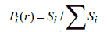 

可知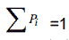， Si 是时间标度为 r 的第 i 个区间所采集股价之 和，Pi 越大，第 i 个区间的股价越高，反之亦然。

      令 x 为第 i 区间所对应的标志 大小的奇异指数，则有如下幂律关系：

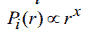

x 反映 Pi 随 r 变化的各子集的性质， x 与 Pi 成反比  

**2.2 计算配分函数**  

        令 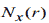为时间标度为 r 时具有相同奇异指数 x 的个数，定义奇异指数相同的子集的分形维数为 f(x),则两者具有如下幂律关系：

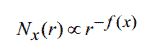 

      f(x) 即为多重分形谱函数，可见，谱函数 f(x)表示具有相同 x 的子集数目随 r 减小而增大的速度，它描述出股价波动分布的均匀程度。当 x 取最小值时， f(x)刻画最高股价出现的次数；反之，当 x 取最大值时， f(x)刻画最低股价出现的次数。

      为了计算多重分形谱函数，定义配分函数：

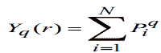 

Yq(r) 是反映 不均匀性的统计量，它用概率的 q 次方作为权重将概率不同大小的子集区分开来，从而达到分层次了解分形内部精细结构的目的。 

      若股价具有多重分形特征，则配分函数与标度 r 满足如下幂律关系：

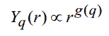 

       其中 g(q)为质量指数，可通过对 ln 与 lnr 双对数曲线中无标度区（即线性区间）的点进行线性拟合来估算 g(q)。

**2.3 legendre 变换**

      通过统计物理中的 legendre 变换可得到奇异指数 x、多重分形谱函数 f(x)、质量指数 g(q)之间的关系如下：

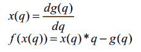 

先求得质量指数 g(q)，然后对其求偏导获得奇异指数 x,再通过第二个公式求得其对应的 f(x),从而得到多重分形谱函数。 

**2.4 多重分形谱特征参数**

       计算出多重分形谱函数后，我们可以通过谱函数的一些特征参数的大小及变化趋势观察股价的形态，从而为预测股价的变化提供参考。

**      多重分形谱的宽度 dx:**

dx=x_max – x_min
      dx 越大说明归一化价格分布越不均匀，股价波动幅度越大。 

**      多重分形谱高度差 df:**

df=f(x_min) –f( x_max)
       df>0 表示股价处于高位的次数更多。 

       df<0 表示股价处于低位的次数更多

**多重分形谱函数示意图**

**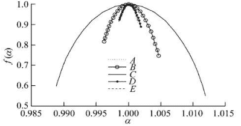** 

**3、多重分形短趋势择时策略的构建及检验**

        在构建多重分形短趋势择时策略前， 我们有必要对沪深 300 指数的多重分形谱函数进行特征分析，以便根据其谱函数与指数走势的关系构建合适的择时策略。

**10 年 10 月大涨前后的多重分形谱**

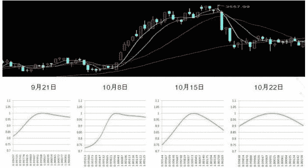 

**10 年 10 月大跌前后的多重分形谱**

**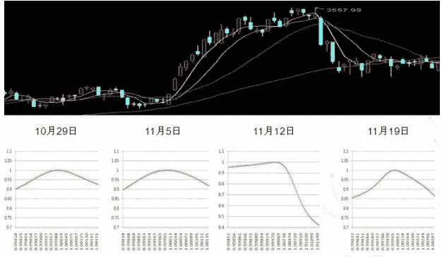** 

1、上涨前及上涨初期：左端点较右端点低，即 df<0，且宽度 dx 有增大的趋势
2、上涨中期：左右端点趋向于持平，即 df 增大，且宽度 dx 继续增大
3、上涨末期及上涨后：左右端点持平或者右端点较左端点低，即 df>=0,且宽度 dx 缩小 

      从下图可以看出， df 与短期涨幅成反比，而 dx 与短期涨幅成正比。 df 与 dx 对短期涨幅（T+5）具有很好的区分度，特别是两个极端的涨幅差异显著，而且从红线标识的样本数占比来看，位于两个极端区间的样本数超过半数，说明这一统计规律是稳定可靠的。这一结论与上涨前后观察到的多重分形谱特征完全一致。

**df 与 T+5 日涨幅的相关性； dx 与 T+5 日涨幅的相关性（蓝柱为 T+5 涨幅，红线为样本数占比）**

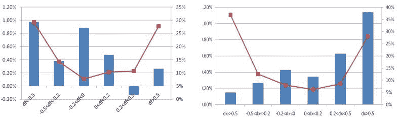 

**3.2 沪深 300 指数短趋势择时策略（MF 策略）的构建** 1、用前 N 个交易日的时间序列数据对当日多重分形谱特征参数 df 及 dx 进行滚动标准化，得到标准化后的价格 DF（PDF）、价格 DX（PDX）。
        2、定义多重分形择时指标（Multifractal FX）为
                                **MFFX=PDF-PDX**
       3、当 MFFX<-R 且 PDF<0 时触发短期买入信号，如果当日已经为持仓状态则继续持有 5 个交易日；如果当日为空仓，则按收盘价买入并持有 5 个交易日。
       其中 N、 R 为 MF 短趋势择时策略的参数

**3.3 MF 策略样本内参数优化** 时间： 05 年 7 月 1 日至 10 年 6 月 30 日
交易成本：单边 0.1%
N 取值区间： 5-30 个交易日，步长为 1
R 取值区间： 0-1.5，步长为 0.02

通过下面的热度图观察 MF 策略收益及胜率的参数敏感性，高收益及高胜率的区域为 N（15-25） R（0.1-0.72） 。

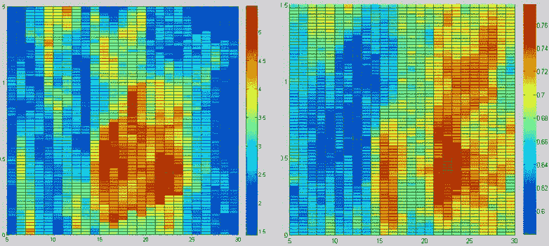 

**3.4 MF 短趋势择时样本内检验**

1、自 2005 年 7 月 1 日至 2010 年 6 月 30 日， MF 策略收益为 520%，共进行了 150 次交易，平均每年交易 30 次，平均每次持仓为 10.5 个交易日，交易获取正收益的概率为 74.7%，同期沪深 300 涨幅为 192%。 

      2、从年度收益对比来看，除 06 年 07 年跑输基准外，其余年份均有显著的超额收

益（05、 10 年均为半年时间，收益未年化）。

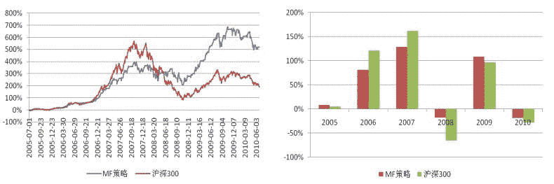 

**3.5 MF 短趋势择时样本外检验**  

        1、 自 2010 年 7 月 1 日至 2011 年 7 月 29 日， MF 策略收益为 45.5%，共进行了 31 次交易，平均每次持仓为 11.2 个交易日，交易获取正收益的概率为 66.7%，期间最大回撤为 12%，同期沪深 300 涨幅为 16%。

        2、样本内+样本外累计收益为 801%，胜率为 72.9%，基准涨幅为 238%， MF 策略波动率为 26%，显著低于基准 32%的波动率。

       3、从样本内外夏普比率的对比来看， MF 策略相对于基准均有显著的优势，特别是在样本外的震荡市中，优势更为明显。

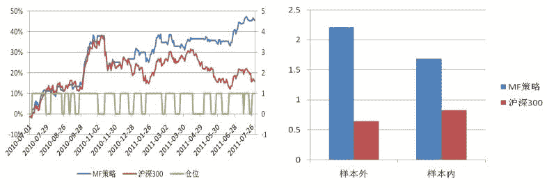 

      为了更客观的对样本内外的策略效果进行评价，按年份统计 MF 策略每年的交易次数和胜率，并统计每年按日滚动的 T+5 个交易日涨幅为正的概率（随机胜率）作为对比：

1、样本内+样本外 6 年时间， MF 策略最大回撤为 37.8%，每年触发的交易次数基本稳定在 25-30 次，其中 05、 07、 09 年胜率超过了 80%， 08 年胜率最低，降至 54%，而 10、 11 年则均为 66.7%。 

      2、 为了更客观的评价 MF 策略的效果，统计了每年按日滚动的 T+5 个交易日涨幅为正的概率（随机胜率），并统计了策略空仓期沪深 300 上涨的概率（踏空概率），从下图三条线的对比来看，除了 06 年胜率持平踏空概率较高外，其余年份策略胜率均显著战胜了随机胜率，并且踏空概率都比较低，说明 MF 短趋势择时是稳定可靠的。

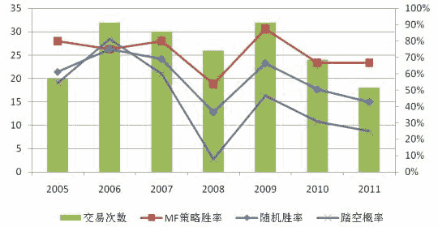 

**3.6 MF 策略应用——股指期货短线交易** 在样本外区间用 MF 策略指导股指期货短线交易，所有交易全部在收盘进行，
而且只交易当月合约，当月合约如果到期但还未到卖出日则展期至下一个合约。 

      在约一年的时间内，该策略获得了 44.3%的正收益，同期沪深 300 涨幅为 16%，

这一收益与直接用指数交易基本相当，说明 MF 策略完全可以通过股指期货进行实
际操作获利。如果将交易成本提高至单边 0.2%，则收益约有 4.4%的下降，这完全

在可接受的范围内。

**股指期货短线交易（20100701-20110729）**

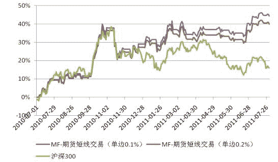 

**3.7 MF 短趋势择时策略最新结论**  

       8 月 10 日测算出来的 MFFX 为-2.36，提示大盘波动幅度急剧增大，同时 PDF（价格 DF）指标为 1.87>0，提示大盘短线依然处于下跌趋势中，未触发新的买入信号，最近一次买入信号为 7 月 29 日收盘触发，至上周五已持仓 5 个交易日，因此上周五收盘卖出持仓，进入空仓阶段，短线看空大盘走势。

**指标及仓位变化 （20110701-20110810）**

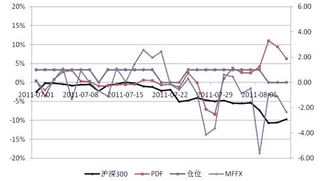 

**【过往文章】**

**0.[【重！磅！干！货！】互联网金融之量化投资深度文本挖掘——附源码文档](http://mp.weixin.qq.com/s?__biz=MzAxNTc0Mjg0Mg==&mid=2653282879&idx=1&sn=12a91c4b8317662fbae470541ebe4683&scene=21#wechat_redirect)**

**1.[【机器学习课程】深度学习与神经网络系列之绪论介绍](http://mp.weixin.qq.com/s?__biz=MzAxNTc0Mjg0Mg==&mid=404690945&idx=1&sn=39ae29caade4b2fac87304d5091ecfc0&scene=21#wechat_redirect)** 

**2.[【Python 机器学习】系列之线性回归篇【深度详细】](http://mp.weixin.qq.com/s?__biz=MzAxNTc0Mjg0Mg==&mid=405488375&idx=1&sn=e06859f0d3cf5102946bd1551d80184a&scene=21#wechat_redirect)** 

**3.[多因子策略系列（一）——因子回溯测试的总体框架](http://mp.weixin.qq.com/s?__biz=MzAxNTc0Mjg0Mg==&mid=404506736&idx=1&sn=20737eb5d6d9ab45a9de576014991db7&scene=21#wechat_redirect)** 

**4.[Python 机器学习：数据拟合与广义线性回归](http://mp.weixin.qq.com/s?__biz=MzAxNTc0Mjg0Mg==&mid=404455727&idx=4&sn=eec006e2fab671f0ac11bdbc8e9299a7&scene=21#wechat_redirect)** 

**5.[【分级基金】之分级 A 的隐含收益率研究分析](http://mp.weixin.qq.com/s?__biz=MzAxNTc0Mjg0Mg==&mid=401876825&idx=1&sn=d2eed5059426af15d1eb60821ccc9bcf&scene=21#wechat_redirect)** 

**6.[【精华干货】Quant 需要哪些 Python 知识](http://mp.weixin.qq.com/s?__biz=MzAxNTc0Mjg0Mg==&mid=405488375&idx=2&sn=bb7bd9d7eadea8ad68f1f404bbb0753a&scene=21#wechat_redirect)**

**7.[【干货】量化投资国内外很棒的论坛网站](http://mp.weixin.qq.com/s?__biz=MzAxNTc0Mjg0Mg==&mid=404455727&idx=2&sn=11acb86a872c0b4871ac094136903f3d&scene=21#wechat_redirect)**

**8.[朴素贝叶斯模型(NBM)详解与在 Matlab 和 Python 里的具体应用](http://mp.weixin.qq.com/s?__biz=MzAxNTc0Mjg0Mg==&mid=401834925&idx=1&sn=d56246158c1002b2330a7c26fd401db6&scene=21#wechat_redirect)**

**9.[机器学习的前期入门汇总](http://mp.weixin.qq.com/s?__biz=MzAxNTc0Mjg0Mg==&mid=404455727&idx=3&sn=d05688effdbb0583031ef9ae98c64387&scene=21#wechat_redirect)**

**10.[【深度原创研究】分级基金下折全攻略（一）](http://mp.weixin.qq.com/s?__biz=MzAxNTc0Mjg0Mg==&mid=403551881&idx=1&sn=e1ed56f607a0fe187dd7a0cf5178b638&scene=21#wechat_redirect)**

**11.[【深度原创研究】分级基金下折全攻略（二）](http://mp.weixin.qq.com/s?__biz=MzAxNTc0Mjg0Mg==&mid=403626226&idx=1&sn=4d1f56a6599c92fd6688e5eb5d7d15dc&scene=21#wechat_redirect)**

**12.[【知识食粮】最新华尔街牛人必读书籍排行](http://mp.weixin.qq.com/s?__biz=MzAxNTc0Mjg0Mg==&mid=401910135&idx=1&sn=43d5eb7549281bb9231a3be831302139&scene=21#wechat_redirect)**

**13.[通过 MATLAB 处理大数据](http://mp.weixin.qq.com/s?__biz=MzAxNTc0Mjg0Mg==&mid=401910135&idx=2&sn=5289317b5fa1afe4a5a4115520aaa8ac&scene=21#wechat_redirect)**

**14.[【扎实资料干货分享】Python、研究报告、计量经济学、投资书籍、R 语言等！(Book+Video)](http://mp.weixin.qq.com/s?__biz=MzAxNTc0Mjg0Mg==&mid=2653282744&idx=2&sn=c9e9fbf1fd0cd4efa8bf08b9c5f16d8a&scene=21#wechat_redirect)**

**15.[机器学习在统计套利中的应用](http://mp.weixin.qq.com/s?__biz=MzAxNTc0Mjg0Mg==&mid=2653282744&idx=3&sn=85d30593998974cfaf714ac0cf81f8cd&scene=21#wechat_redirect)**

**16.[量化投资修行之路](http://mp.weixin.qq.com/s?__biz=MzAxNTc0Mjg0Mg==&mid=2653282744&idx=4&sn=0ff993c537b4b1689967f1560dfd45be&scene=21#wechat_redirect)**

**17.[统计套利在股指期货跨期套利中的应用：基于协整方法的估计](http://mp.weixin.qq.com/s?__biz=MzAxNTc0Mjg0Mg==&mid=405625337&idx=3&sn=60d19beefab3a1636554b216a9b05742&scene=21#wechat_redirect)**

**18.[股指期货跨品种套利交易](http://mp.weixin.qq.com/s?__biz=MzAxNTc0Mjg0Mg==&mid=405625337&idx=2&sn=e136d7bb6542789fa12f1f90dd206641&scene=21#wechat_redirect)**

**19.[沪港通股票统计套利：基于 BP 神经网络](http://mp.weixin.qq.com/s?__biz=MzAxNTc0Mjg0Mg==&mid=405625337&idx=1&sn=c7d62703af3e5cdb90f0b1b853f8a483&scene=21#wechat_redirect)**

**20.[机器学习到底在量化金融里哪些方面有应用？](http://mp.weixin.qq.com/s?__biz=MzAxNTc0Mjg0Mg==&mid=2653282744&idx=1&sn=73db745def6298a1e352c03f51d26d95&scene=21#wechat_redirect)**

**21.[【Matlab 机器学习】之图像识别](http://mp.weixin.qq.com/s?__biz=MzAxNTc0Mjg0Mg==&mid=2653282814&idx=1&sn=f1224ea30942468ee39aa96d6ea0dd8f&scene=21#wechat_redirect)**

**22.[【干货分享】Python 数据结构与算法设计总结篇](http://mp.weixin.qq.com/s?__biz=MzAxNTc0Mjg0Mg==&mid=2653282752&idx=1&sn=5db4c3e27508abc083a7a5f388ddb6ed&scene=21#wechat_redirect)**

**23.[基于 Python 的股票数据接口调用代码实例](http://mp.weixin.qq.com/s?__biz=MzAxNTc0Mjg0Mg==&mid=2653282828&idx=1&sn=126ad1c21ce5795f8744690cb1effc13&scene=21#wechat_redirect)**

**24.[基于 Python 爬取腾讯网的最热评论代码实例](http://mp.weixin.qq.com/s?__biz=MzAxNTc0Mjg0Mg==&mid=2653282828&idx=2&sn=d73b96b78ce43b151c69ab3e70e4d24c&scene=21#wechat_redirect)**

**25.[卷积神经网络反向传播推导](http://mp.weixin.qq.com/s?__biz=MzAxNTc0Mjg0Mg==&mid=2653282851&idx=1&sn=6cc6f32f8d35089a3c80cdc4c95b48a9&scene=21#wechat_redirect)**

**26.[深度学习项目](http://mp.weixin.qq.com/s?__biz=MzAxNTc0Mjg0Mg==&mid=2653282851&idx=2&sn=d683b6a6570309b7dc07d79829c56b72&scene=21#wechat_redirect)**

**27.[混沌分形理论](http://mp.weixin.qq.com/s?__biz=MzAxNTc0Mjg0Mg==&mid=2653282968&idx=1&sn=04dcad950d1f1093ec35d7d70459020a&scene=21#wechat_redirect)**

**28.[【Python】基于情感词典进行情感分析（附代码）](http://mp.weixin.qq.com/s?__biz=MzAxNTc0Mjg0Mg==&mid=2653282977&idx=1&sn=715655ed0965227450696decde1b9864&scene=21#wechat_redirect)**

**29.[基于技术交易规则的动态模型股票价格（附论文和 Matlab 源程序）](http://mp.weixin.qq.com/s?__biz=MzAxNTc0Mjg0Mg==&mid=2653282981&idx=1&sn=7fcfb07c09bc6c40bb8e19972e4349c1&scene=21#wechat_redirect)**

**‍

**量化投资与机器学习**

**知识、能力、深度、专业**

**勤奋、天赋、耐得住寂寞**

**** 

******