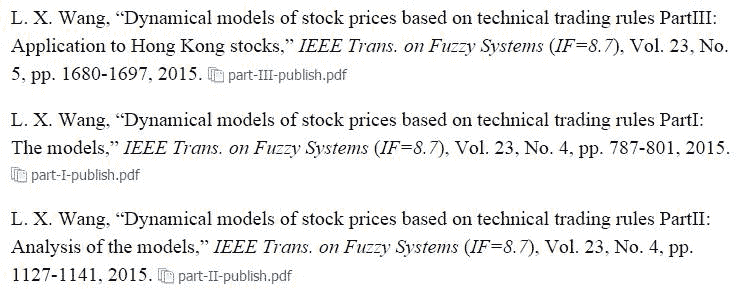

# 基于技术交易规则的动态模型股票价格（附论文和 Matlab 源程序）

> 原文：[`mp.weixin.qq.com/s?__biz=MzAxNTc0Mjg0Mg==&mid=2653282981&idx=1&sn=7fcfb07c09bc6c40bb8e19972e4349c1&chksm=802e20b0b759a9a6322777ad59d0a1c76958add8a02e4c50deaf0dc0096ab79bd3b1afd38c06&scene=27#wechat_redirect`](http://mp.weixin.qq.com/s?__biz=MzAxNTc0Mjg0Mg==&mid=2653282981&idx=1&sn=7fcfb07c09bc6c40bb8e19972e4349c1&chksm=802e20b0b759a9a6322777ad59d0a1c76958add8a02e4c50deaf0dc0096ab79bd3b1afd38c06&scene=27#wechat_redirect)

> ********查看之前文章请点击右上角********，关注并且******查看历史消息******，还可以在文章最后评论留言。谢谢您的支持！********

来自西安交大，电信学院，王立新教授

博客地址：http://blog.sciencenet.cn/blog-2999994-950653.html

当一个大户决定买入一只股票，比如索罗斯的量子基金决定买入一只港股，通常买入量是很大的。问题的关键是，在一个时间点上可供买卖的股票数量非常有限，通常不到想要买入量的千分之一，所以大户们通常只有时间换空间，将一个大单分割成许多小单，一点一点地完成交易。

   我们仔细分析一下这些小单是怎样完成的。如果价格处于上升趋势，而小单还是持续买入，那么上升趋势会被加强，这样一则入货成本大大提高，二则很可能买不到股票，因为交易对手发现股价快速上升很可能会停下来重新估值，不再卖出。所以，这些小单的大部分应该是在价格处于下降趋势时完成的，而且下降趋势越大，小单完成的频率越高。如果我们能用具体的数学函数刻画上述的大户买卖行为，那么我们就可以根据具体的股票价格数据辨识出大户的存在，进而跟庄操作，获取利润。下面我们来看具体怎么做。

首先定义一个趋势变量 x(t)，通常是现时股价 p(t) 相对于某个移动平均 MA(t)的相对变化比，即

       x(t) = ln[p(t)/MA(t)]

其中

       MA(t) =[p(t)+p(t-1)+p(t-2)+p(t-3)+p(t-4)]/5

为 5 天移动平均线，也可以是 3 天或 10 天移动平均线，而 ln[p(t)/MA(t)]~= [p(t)-MA(t)]/MA(t) 为相对变化比。x(t)>0 表示现时股价 p(t) 在移动平均线 MA(t) 之上，价格处于上升趋势；而 x(t)<0 表示现时股价 p(t) 在移动平均线 MA(t) 之下，价格处于下降趋势。

 再来定义大户的特征函数，分别为大买家特征函数 buy[x(t)]，和大卖家特征函数 sell[x(t)]，具体定义为：

        buy[x(t)] = -x(t) if x(t)<0; = 0 if x(t)>0

        sell[x(t)] = -x(t) if x(t)>0; =0 if x(t)<0

即当价格处于下降趋势时（x(t)<0），大买家 buy[x(t)]=-x(t)>0 呈正特征，且强度与趋势成正比，而此时大卖家 sell[x(t)]=0，没有操作；反过来，当价格处于上升趋势时（x(t)>0），大卖家 sell[x(t)]=-x(t)<0 呈正特征（对卖家来说负为正），且强度与趋势成正比，而此时大买家 buy[x(t)]=0，没有操作。

接下来就可以建立由大买家和大卖家为主要动力的价格动态方程，如下：

    ln[p(t+1)] = ln[p(t)] + aup(t)*buy[x(t)] + adown(t)*sell[x(t)] + e(t)

其中 ln[p(t+1)]–ln[p(t)]~= [p(t+1)-p(t)]/p(t) 为股价的相对变化，时变参数 aup(t)和 adown(t) 分别代表大买家和大卖家的操作强度，而 e(t)代表除大买家和大卖家之外的其他投资者对股价相对变化的贡献 。

设 t+1 为现时，即我们知道股价数据 p(t+1),p(t), p(t-1), p(t-2), …，因此价格动态方程中 ln[p(t+1)], ln[p(t)], buy[x(t)], sell[x(t)] 为已知量，根据经典的“加权递推最小二乘算法”，我们可以辨识出大买家和大卖家的实时操作强度 aup(t) 和 adown(t)，进而提出以下两种跟庄交易策略：

**策略 1：**跟踪大买家：如果 aup(t)>0（大买家出现）且 adown(t)<0（没有大卖家），则全仓买入，持有；一旦 aup(t)<0（大买家离场），则立即清仓退出，持有现金，等待下一个回合。

**策略 2：**随风骑行：如果 aup(t) > adown(t)（大买家占上风），则全仓买入，持有；一旦 aup(t) < adown(t)（风向逆转），则立即清仓退出，持有现金，等待下一个回合。

**【阅读原文】**的论文详细描述了这些交易策略从 2007 年 7 月 3 日至 2014 年 7 月 2 日七年间对香港 20 只主要银行及地产股票的具体操作记录。只要你懂一点卡尔曼滤波器，相信你就能读懂这些论文，并且能自己编程，实现这些交易算法，构建属于自己的“印钞机”，吹响向财务自由进军的冲锋号。祝你成功！

 

**【过往文章】**

**0.[【重！磅！干！货！】互联网金融之量化投资深度文本挖掘——附源码文档](http://mp.weixin.qq.com/s?__biz=MzAxNTc0Mjg0Mg==&mid=2653282879&idx=1&sn=12a91c4b8317662fbae470541ebe4683&scene=21#wechat_redirect)**

**1.[【机器学习课程】深度学习与神经网络系列之绪论介绍](http://mp.weixin.qq.com/s?__biz=MzAxNTc0Mjg0Mg==&mid=404690945&idx=1&sn=39ae29caade4b2fac87304d5091ecfc0&scene=21#wechat_redirect)** 

**2.[【Python 机器学习】系列之线性回归篇【深度详细】](http://mp.weixin.qq.com/s?__biz=MzAxNTc0Mjg0Mg==&mid=405488375&idx=1&sn=e06859f0d3cf5102946bd1551d80184a&scene=21#wechat_redirect)** 

**3.[多因子策略系列（一）——因子回溯测试的总体框架](http://mp.weixin.qq.com/s?__biz=MzAxNTc0Mjg0Mg==&mid=404506736&idx=1&sn=20737eb5d6d9ab45a9de576014991db7&scene=21#wechat_redirect)** 

**4.[Python 机器学习：数据拟合与广义线性回归](http://mp.weixin.qq.com/s?__biz=MzAxNTc0Mjg0Mg==&mid=404455727&idx=4&sn=eec006e2fab671f0ac11bdbc8e9299a7&scene=21#wechat_redirect)** 

**5.[【分级基金】之分级 A 的隐含收益率研究分析](http://mp.weixin.qq.com/s?__biz=MzAxNTc0Mjg0Mg==&mid=401876825&idx=1&sn=d2eed5059426af15d1eb60821ccc9bcf&scene=21#wechat_redirect)** 

**6.[【精华干货】Quant 需要哪些 Python 知识](http://mp.weixin.qq.com/s?__biz=MzAxNTc0Mjg0Mg==&mid=405488375&idx=2&sn=bb7bd9d7eadea8ad68f1f404bbb0753a&scene=21#wechat_redirect)**

**7.[【干货】量化投资国内外很棒的论坛网站](http://mp.weixin.qq.com/s?__biz=MzAxNTc0Mjg0Mg==&mid=404455727&idx=2&sn=11acb86a872c0b4871ac094136903f3d&scene=21#wechat_redirect)**

**8.[朴素贝叶斯模型(NBM)详解与在 Matlab 和 Python 里的具体应用](http://mp.weixin.qq.com/s?__biz=MzAxNTc0Mjg0Mg==&mid=401834925&idx=1&sn=d56246158c1002b2330a7c26fd401db6&scene=21#wechat_redirect)**

**9.[机器学习的前期入门汇总](http://mp.weixin.qq.com/s?__biz=MzAxNTc0Mjg0Mg==&mid=404455727&idx=3&sn=d05688effdbb0583031ef9ae98c64387&scene=21#wechat_redirect)**

**10.[【深度原创研究】分级基金下折全攻略（一）](http://mp.weixin.qq.com/s?__biz=MzAxNTc0Mjg0Mg==&mid=403551881&idx=1&sn=e1ed56f607a0fe187dd7a0cf5178b638&scene=21#wechat_redirect)**

**11.[【深度原创研究】分级基金下折全攻略（二）](http://mp.weixin.qq.com/s?__biz=MzAxNTc0Mjg0Mg==&mid=403626226&idx=1&sn=4d1f56a6599c92fd6688e5eb5d7d15dc&scene=21#wechat_redirect)**

**12.[【知识食粮】最新华尔街牛人必读书籍排行](http://mp.weixin.qq.com/s?__biz=MzAxNTc0Mjg0Mg==&mid=401910135&idx=1&sn=43d5eb7549281bb9231a3be831302139&scene=21#wechat_redirect)**

**13.[通过 MATLAB 处理大数据](http://mp.weixin.qq.com/s?__biz=MzAxNTc0Mjg0Mg==&mid=401910135&idx=2&sn=5289317b5fa1afe4a5a4115520aaa8ac&scene=21#wechat_redirect)**

**14.[【扎实资料干货分享】Python、研究报告、计量经济学、投资书籍、R 语言等！(Book+Video)](http://mp.weixin.qq.com/s?__biz=MzAxNTc0Mjg0Mg==&mid=2653282744&idx=2&sn=c9e9fbf1fd0cd4efa8bf08b9c5f16d8a&scene=21#wechat_redirect)**

**15.[机器学习在统计套利中的应用](http://mp.weixin.qq.com/s?__biz=MzAxNTc0Mjg0Mg==&mid=2653282744&idx=3&sn=85d30593998974cfaf714ac0cf81f8cd&scene=21#wechat_redirect)**

**16.[量化投资修行之路](http://mp.weixin.qq.com/s?__biz=MzAxNTc0Mjg0Mg==&mid=2653282744&idx=4&sn=0ff993c537b4b1689967f1560dfd45be&scene=21#wechat_redirect)**

**17.[统计套利在股指期货跨期套利中的应用：基于协整方法的估计](http://mp.weixin.qq.com/s?__biz=MzAxNTc0Mjg0Mg==&mid=405625337&idx=3&sn=60d19beefab3a1636554b216a9b05742&scene=21#wechat_redirect)**

**18.[股指期货跨品种套利交易](http://mp.weixin.qq.com/s?__biz=MzAxNTc0Mjg0Mg==&mid=405625337&idx=2&sn=e136d7bb6542789fa12f1f90dd206641&scene=21#wechat_redirect)**

**19.[沪港通股票统计套利：基于 BP 神经网络](http://mp.weixin.qq.com/s?__biz=MzAxNTc0Mjg0Mg==&mid=405625337&idx=1&sn=c7d62703af3e5cdb90f0b1b853f8a483&scene=21#wechat_redirect)**

**20.[机器学习到底在量化金融里哪些方面有应用？](http://mp.weixin.qq.com/s?__biz=MzAxNTc0Mjg0Mg==&mid=2653282744&idx=1&sn=73db745def6298a1e352c03f51d26d95&scene=21#wechat_redirect)**

**21.[【Matlab 机器学习】之图像识别](http://mp.weixin.qq.com/s?__biz=MzAxNTc0Mjg0Mg==&mid=2653282814&idx=1&sn=f1224ea30942468ee39aa96d6ea0dd8f&scene=21#wechat_redirect)**

**22.[【干货分享】Python 数据结构与算法设计总结篇](http://mp.weixin.qq.com/s?__biz=MzAxNTc0Mjg0Mg==&mid=2653282752&idx=1&sn=5db4c3e27508abc083a7a5f388ddb6ed&scene=21#wechat_redirect)**

**23.[基于 Python 的股票数据接口调用代码实例](http://mp.weixin.qq.com/s?__biz=MzAxNTc0Mjg0Mg==&mid=2653282828&idx=1&sn=126ad1c21ce5795f8744690cb1effc13&scene=21#wechat_redirect)**

**24.[基于 Python 爬取腾讯网的最热评论代码实例](http://mp.weixin.qq.com/s?__biz=MzAxNTc0Mjg0Mg==&mid=2653282828&idx=2&sn=d73b96b78ce43b151c69ab3e70e4d24c&scene=21#wechat_redirect)**

**25.[卷积神经网络反向传播推导](http://mp.weixin.qq.com/s?__biz=MzAxNTc0Mjg0Mg==&mid=2653282851&idx=1&sn=6cc6f32f8d35089a3c80cdc4c95b48a9&scene=21#wechat_redirect)**

**26.[深度学习项目](http://mp.weixin.qq.com/s?__biz=MzAxNTc0Mjg0Mg==&mid=2653282851&idx=2&sn=d683b6a6570309b7dc07d79829c56b72&scene=21#wechat_redirect)**

**27.[【Python】基于情感词典进行情感分析（附代码）](http://mp.weixin.qq.com/s?__biz=MzAxNTc0Mjg0Mg==&mid=2653282977&idx=1&sn=715655ed0965227450696decde1b9864&scene=21#wechat_redirect)**

**28.[混沌分形理论](http://mp.weixin.qq.com/s?__biz=MzAxNTc0Mjg0Mg==&mid=2653282968&idx=1&sn=04dcad950d1f1093ec35d7d70459020a&scene=21#wechat_redirect)**

****量化投资与机器学习****

****知识、能力、深度、专业****

****勤奋、天赋、耐得住寂寞****

******** 

********

******论文获取密码：z2rc******