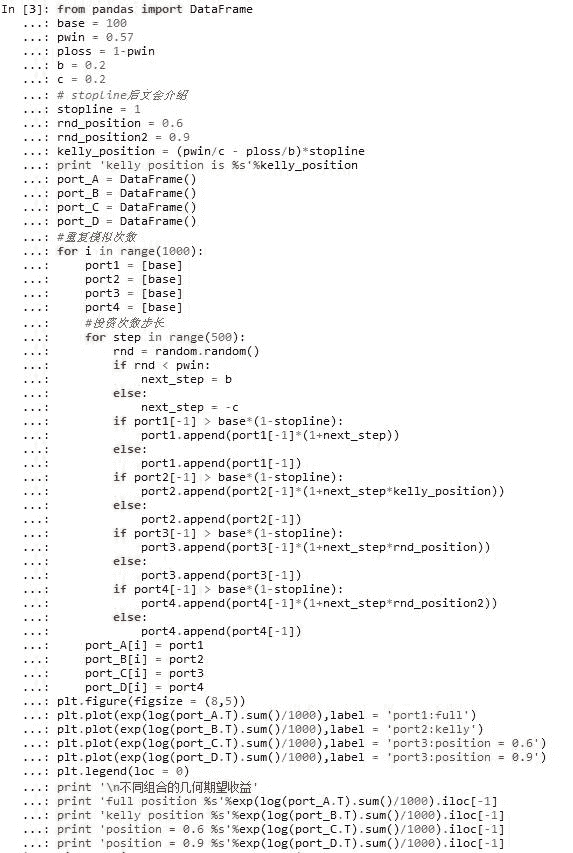
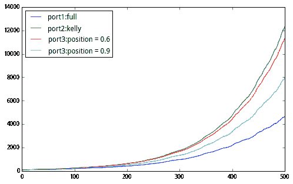

# 【仓位管理大杀器】凯利公式你用对了吗？

> 原文：[`mp.weixin.qq.com/s?__biz=MzAxNTc0Mjg0Mg==&mid=2653282963&idx=1&sn=35e5b1c85a50a8e2b0bf43f9bf5d71e9&chksm=802e2086b759a9900967dcbc0b0f72521b45b0ba58e429409b78b2189fe12b2bfd22d6a25a27&scene=27#wechat_redirect`](http://mp.weixin.qq.com/s?__biz=MzAxNTc0Mjg0Mg==&mid=2653282963&idx=1&sn=35e5b1c85a50a8e2b0bf43f9bf5d71e9&chksm=802e2086b759a9900967dcbc0b0f72521b45b0ba58e429409b78b2189fe12b2bfd22d6a25a27&scene=27#wechat_redirect)

> ********查看之前文章请点击右上角********，关注并且******查看历史消息******，还可以在文章最后评论留言。谢谢您的支持！********

### 本文源自聚宽 JoinQuant-JQ 的大作，博主认为写的不错，拿来分享，希望大家有所收获。

### **一、故事背景**

市场不好的时候，我们总是会犹豫，满仓？半仓？还是空仓？有没有一个科学的办法给出一个标准答案呢？下面来看看仓位管理神器——凯利公式。

投资就是一场赌博。像索普、香农等很多投资大师早期都对研究赌博业的秘密情有独钟，科学家们总是希望从理论上找到赌博游戏的必胜策略，使得一场游戏中赢的概率远远高过输的概率。

凯利就是这样一个大师。他是香农（信息论创始人）在贝尔实验室的同事，这个来自德克萨斯州、爱摆弄手枪、喜欢一根接一根抽烟的狂野硬汉，干过很多恶作剧，特别喜欢将填满塑料的子弹射进他客厅的墙壁里来戏弄家里暂住的客人。他的研究领域从量子物理学到电视信号解码，发明了能够准确模拟人类声音的电脑设备。最广为人知的研究贡献，便是将香农的信息论运用到了赛马赌博中。

就是这个精巧简洁的公式，将信息论与赌博之间的本质联系揭露出来，告诉我们在有限了解的信息下，如何下注能使得资本增值的速度最大化。

### **二、赌博怎么用凯利公式？**

最早的凯利公式是运用在赌博游戏中的，我们先看看赌博情形下凯利公式的特殊形式：

f =(P_win×b-P_loss)/b

举个简单的例子

假想一个游戏。赢的概率是 60%，输的概率 40%。入场费随意交。如果赢了获得 2 倍的入场费金额（1 赔 1），输则输掉入场费。小编有 100 元做本金，请问小编每次给多少入场费，理论上 4 次游戏后几何期望收益能最大？

凯利公式告诉你，最佳的策略是每次投剩余本金的 20%。 f = （1×0.6-0.4）/1 = 0.2。

基于上述的例子，做个简单的蒙特卡洛模拟实验（进行 200 次游戏）：


kelly position is 0.2

不同组合的几何期望收益 full position 0.0 kelly position 5995.5282211 position = 0.25 4682.58669977 position = 0.15 4558.10831927


观察四种操作方式：满仓下注、按凯利公式下注 20%、按 25%下注、按 15%下注 图为进行 200 次游戏之后几何期望资金曲线的情况 凯利无疑是增长最快的。

#### **从另一个角度，我们来理解一下**

不同赔率下，赢的概率多大我们会选择入场参与游戏？

还是上面的游戏，如果赢的概率 40%，输的概率 60%，那么，期望净收益就是（1×0.4-0.6）< 0；从概率的角度说，一个期望净收益为负的游戏是不值得参与的，求得的 f 小于 0，也就是不下注。

下面看一下不同赔率下一个游戏赌赢的概率为多少才值得参加？

同样，用实验来观察：


上图说明两个问题：

1.  如果一次赌博赔率越大，在赢的概率较小的情况下，凯利公式就开始提示要下注啦。（如图赔率为 20 时，只需要 10%的赢率就可以入场玩啦）

2.  同一赔率下，凯利公式只有在稳赢（赢概率=100%）时才会支持押下全部本金，否则都是本金的一定比例。也即永远不会输完所有的钱。

### **三、炒股怎么用凯利公式？**

凯利的论文给出的押注策略，神奇之处就在于，当你总是遵循这一准则进行操作，你就能预测接下来发生的事情，你也能清楚的知道你的财富增长速度是在控制住风险情况下最优的结果。

来看看凯利运用他的财富公式，专门成立的 hedge fund 的 performance~20 年 15 倍，就是辣么厉害。

那么问题来了，我们量化炒股如何引入这么神奇的仓位管理神器？

因为股市的涨跌我们不会一次性赔光本金，所以引入损失率对凯利公式做微调，即更一般性的凯利公式：

f =P_win⁄c-P_loss⁄b

f：仓位比例 Pwin：赌赢的概率—股市上涨概率 Ploss：赌输的概率—股市下跌概率 b：赢钱率（资产从 1 增加到 1+b） c：损失率（资产从 1 减少到 1-c）

#### 仔细想一个问题

赌博和买股票，赢概率 Pwin 和输概率 Ploss 究竟是什么？

赌博的时候，Pwin 和 Ploss 是根据游戏规则算出的概率而定。比如投硬币（Pwin=Ploss=0.5），或者转轮盘，扑克等更为复杂的游戏。

而买股票的过程，是 n 次离散赌博的过程。当你找到一个有效信号之后进行一次操作（比如有效信号是价格突破 5 日均线，财务数据好，成交量放大，或者各种金叉死叉等等。。）

假设我们找到了一个有效信号，信号发生时，股价为 S。我们提前给定价格 S*（1+b）和 S*（1-c）作为信号发生后止盈和止损的边界，这个时候的 Pwin 和 Ploss 应该是基于历史这个信号的收益情况做数据统计分析胜率（赢概率）和败率（输概率）来给出，也即价格触碰到 S*（1+b）止盈的概率是 Pwin，触碰到 S*（1-c）止损的概率是 Ploss。

再举一个简单例子

有效信号：当前价突破 5 日均线 统计样本：100 只相似股票，过去三年有效信号发生了 1000 次。 统计包含：假定上涨 20%止盈，下跌 20%止损。止盈赢钱的次数 57 次，止损输钱的次数 43 次

对应公式来看：Pwin=0.57，Ploss=0.43，b=0.20，c=0.20

此时 f=Pwin/c – Ploss/b = 0.57/0.20 – 0.43/0.20= 70%

按照我们对某一个有效信号做历史统计定出来的 Pwin，Ploss，b 和 c 来进行模拟的投资组合看看看效果：





同样四种仓位操作后的资金曲线来进行比较：

1.  凯利公式下资金曲线增长是最快的。

2.  高于或低于凯利公式的比例资金曲线增长都不是最快的。

#### 再思考一个问题：关于杠杆

再多举一个例子：f>1

研究不能止步于此啊。很多知道凯利公式的朋友都有的疑问，是凯利计算出来的仓位容易过大。比如一不小心就提示几倍，几十倍了。这是什么情况呢？

比如我们找到一个信号：Pwin=0.7，Ploss=0.3，b=0.20，c=0.20

来看看实验结果：


kelly position is 4.0

不同组合的几何期望收益 full position 3303.78161947 kelly position 354171.443201 position = 3 204753.84751 position = 6 20439.1375486


f>1，甚至等于 4 了，什么意思！！凯利公式在告诉你这个信号太好了，值得你做 4 倍的杠杆来操作~！什么，你说我多加一点好不好，看上图，加到 6 倍显然就挫了。。。

（想知道凯利公式为何能做到几何期望收益最大化，证明过程戳 wiki 百科自行科普）

#### **再思考一个止损的问题，stopline 不为 1**

上面杠杆的问题引出其实说明了 A 股版凯利公式暗含的一个假设：

资金可以随意无摩擦地加杠杆操作，无借贷成本。

什么意思。一个好的信号，凯利会告诉你在已知风险（Pwin，Ploss，b 和 c）的情况下，最优的杠杆是多少。你可以毫不犹豫的就按这个杠杆去操作，最大化自己的资金曲线。

那么真实情况下呢，我们可能不加杠杆，而且也不能承受全部本金损失掉的风险。也就是，我们 stopline 会小于 1，甚至只到 30%或者 20%。那这时候凯利公式怎么用？

这里不做实验，仅抛个引子。感兴趣的朋友可以继续深入研究，也欢迎与我探讨。

1.  静态止损：即亏损本金的固定数额后撤出投资 kelly_position = (pwin/c - ploss/b)×stopline stopline 应为此时剩余可承受的损失/本金 base。

举例：base=100 元，输 20 元止损。initial_stopline = 0.2。假设损失率 c = 0.04 第一次，赔了 4 块，base=96，stopline = （20-4）/100 = 0.16 第 n 次，输输赢赢后 base = 250，stopline = （150-4

1.  动态止损：即亏损剩余资金的一定比例后撤出投资

比如动态 20%止损。base =100 元，赚到 200 元后，如亏损到 160 元即止损。

这个具体实验就留给各位自己研究啦~~

### Bonus：小结一下

好啦，少年。真正赚钱的是找有效的因子 or 信号，使得 Pwin 尽可能大，b 尽可能大。无论是以往大家关注的一些技术指标（各种金叉、死叉）还是量价指标（放量、突破等等）又或者是财务指标，都可以作为一个信号。

统计历史信号出现时的一个表现，得到这个信号产生的收益的分布。只要这个信号的收益分布正偏一些些，就是纯纯的 Alpha 啊。当然这个因子 or 信号的挖掘，就是作为矿工孜孜不倦追求的终极目标了。当你找到这样一个神奇的信号，配上凯利公式会让你的财富增加更快~

好啦，说完啦。去挖信号了。

最后：目前网络上传播较广的一篇介绍凯利前世今生的文章，个人认为深度不够当然，而且思路是有问题的。大家不要看多了受到误导。最近也花了一些力气做梳理，把这篇分享出来，尽量做到讲对，讲透，也是提醒各位，低头挖矿，不要搞错了挖矿的初衷。

#### 1、补充：凯利公式的证明

#### 2、随机游走绘图


```py
random_plot(0,0.07,'on')
```


```py
random_plot(0.01,0.07)
```


**【过往文章】**

**0.[【重！磅！干！货！】互联网金融之量化投资深度文本挖掘——附源码文档](http://mp.weixin.qq.com/s?__biz=MzAxNTc0Mjg0Mg==&mid=2653282879&idx=1&sn=12a91c4b8317662fbae470541ebe4683&scene=21#wechat_redirect)**

**1.[【机器学习课程】深度学习与神经网络系列之绪论介绍](http://mp.weixin.qq.com/s?__biz=MzAxNTc0Mjg0Mg==&mid=404690945&idx=1&sn=39ae29caade4b2fac87304d5091ecfc0&scene=21#wechat_redirect)** 

**2.[【Python 机器学习】系列之线性回归篇【深度详细】](http://mp.weixin.qq.com/s?__biz=MzAxNTc0Mjg0Mg==&mid=405488375&idx=1&sn=e06859f0d3cf5102946bd1551d80184a&scene=21#wechat_redirect)** 

**3.[多因子策略系列（一）——因子回溯测试的总体框架](http://mp.weixin.qq.com/s?__biz=MzAxNTc0Mjg0Mg==&mid=404506736&idx=1&sn=20737eb5d6d9ab45a9de576014991db7&scene=21#wechat_redirect)** 

**4.[Python 机器学习：数据拟合与广义线性回归](http://mp.weixin.qq.com/s?__biz=MzAxNTc0Mjg0Mg==&mid=404455727&idx=4&sn=eec006e2fab671f0ac11bdbc8e9299a7&scene=21#wechat_redirect)** 

**5.[【分级基金】之分级 A 的隐含收益率研究分析](http://mp.weixin.qq.com/s?__biz=MzAxNTc0Mjg0Mg==&mid=401876825&idx=1&sn=d2eed5059426af15d1eb60821ccc9bcf&scene=21#wechat_redirect)** 

**6.[【精华干货】Quant 需要哪些 Python 知识](http://mp.weixin.qq.com/s?__biz=MzAxNTc0Mjg0Mg==&mid=405488375&idx=2&sn=bb7bd9d7eadea8ad68f1f404bbb0753a&scene=21#wechat_redirect)**

**7.[【干货】量化投资国内外很棒的论坛网站](http://mp.weixin.qq.com/s?__biz=MzAxNTc0Mjg0Mg==&mid=404455727&idx=2&sn=11acb86a872c0b4871ac094136903f3d&scene=21#wechat_redirect)**

**8.[朴素贝叶斯模型(NBM)详解与在 Matlab 和 Python 里的具体应用](http://mp.weixin.qq.com/s?__biz=MzAxNTc0Mjg0Mg==&mid=401834925&idx=1&sn=d56246158c1002b2330a7c26fd401db6&scene=21#wechat_redirect)**

**9.[机器学习的前期入门汇总](http://mp.weixin.qq.com/s?__biz=MzAxNTc0Mjg0Mg==&mid=404455727&idx=3&sn=d05688effdbb0583031ef9ae98c64387&scene=21#wechat_redirect)**

**10.[【深度原创研究】分级基金下折全攻略（一）](http://mp.weixin.qq.com/s?__biz=MzAxNTc0Mjg0Mg==&mid=403551881&idx=1&sn=e1ed56f607a0fe187dd7a0cf5178b638&scene=21#wechat_redirect)**

**11.[【深度原创研究】分级基金下折全攻略（二）](http://mp.weixin.qq.com/s?__biz=MzAxNTc0Mjg0Mg==&mid=403626226&idx=1&sn=4d1f56a6599c92fd6688e5eb5d7d15dc&scene=21#wechat_redirect)**

**12.[【知识食粮】最新华尔街牛人必读书籍排行](http://mp.weixin.qq.com/s?__biz=MzAxNTc0Mjg0Mg==&mid=401910135&idx=1&sn=43d5eb7549281bb9231a3be831302139&scene=21#wechat_redirect)**

**13.[通过 MATLAB 处理大数据](http://mp.weixin.qq.com/s?__biz=MzAxNTc0Mjg0Mg==&mid=401910135&idx=2&sn=5289317b5fa1afe4a5a4115520aaa8ac&scene=21#wechat_redirect)**

**14.[【扎实资料干货分享】Python、研究报告、计量经济学、投资书籍、R 语言等！(Book+Video)](http://mp.weixin.qq.com/s?__biz=MzAxNTc0Mjg0Mg==&mid=2653282744&idx=2&sn=c9e9fbf1fd0cd4efa8bf08b9c5f16d8a&scene=21#wechat_redirect)**

**15.[机器学习在统计套利中的应用](http://mp.weixin.qq.com/s?__biz=MzAxNTc0Mjg0Mg==&mid=2653282744&idx=3&sn=85d30593998974cfaf714ac0cf81f8cd&scene=21#wechat_redirect)**

**16.[量化投资修行之路](http://mp.weixin.qq.com/s?__biz=MzAxNTc0Mjg0Mg==&mid=2653282744&idx=4&sn=0ff993c537b4b1689967f1560dfd45be&scene=21#wechat_redirect)**

**17.[统计套利在股指期货跨期套利中的应用：基于协整方法的估计](http://mp.weixin.qq.com/s?__biz=MzAxNTc0Mjg0Mg==&mid=405625337&idx=3&sn=60d19beefab3a1636554b216a9b05742&scene=21#wechat_redirect)**

**18.[股指期货跨品种套利交易](http://mp.weixin.qq.com/s?__biz=MzAxNTc0Mjg0Mg==&mid=405625337&idx=2&sn=e136d7bb6542789fa12f1f90dd206641&scene=21#wechat_redirect)**

**19.[沪港通股票统计套利：基于 BP 神经网络](http://mp.weixin.qq.com/s?__biz=MzAxNTc0Mjg0Mg==&mid=405625337&idx=1&sn=c7d62703af3e5cdb90f0b1b853f8a483&scene=21#wechat_redirect)**

**20.[机器学习到底在量化金融里哪些方面有应用？](http://mp.weixin.qq.com/s?__biz=MzAxNTc0Mjg0Mg==&mid=2653282744&idx=1&sn=73db745def6298a1e352c03f51d26d95&scene=21#wechat_redirect)**

**21.[【Matlab 机器学习】之图像识别](http://mp.weixin.qq.com/s?__biz=MzAxNTc0Mjg0Mg==&mid=2653282814&idx=1&sn=f1224ea30942468ee39aa96d6ea0dd8f&scene=21#wechat_redirect)**

**22.[【干货分享】Python 数据结构与算法设计总结篇](http://mp.weixin.qq.com/s?__biz=MzAxNTc0Mjg0Mg==&mid=2653282752&idx=1&sn=5db4c3e27508abc083a7a5f388ddb6ed&scene=21#wechat_redirect)**

**23.[基于 Python 的股票数据接口调用代码实例](http://mp.weixin.qq.com/s?__biz=MzAxNTc0Mjg0Mg==&mid=2653282828&idx=1&sn=126ad1c21ce5795f8744690cb1effc13&scene=21#wechat_redirect)**

**24.[基于 Python 爬取腾讯网的最热评论代码实例](http://mp.weixin.qq.com/s?__biz=MzAxNTc0Mjg0Mg==&mid=2653282828&idx=2&sn=d73b96b78ce43b151c69ab3e70e4d24c&scene=21#wechat_redirect)**

**25.[卷积神经网络反向传播推导](http://mp.weixin.qq.com/s?__biz=MzAxNTc0Mjg0Mg==&mid=2653282851&idx=1&sn=6cc6f32f8d35089a3c80cdc4c95b48a9&scene=21#wechat_redirect)**

**26.[深度学习项目](http://mp.weixin.qq.com/s?__biz=MzAxNTc0Mjg0Mg==&mid=2653282851&idx=2&sn=d683b6a6570309b7dc07d79829c56b72&scene=21#wechat_redirect)**

****量化投资与机器学习****

****知识、能力、深度、专业****

****勤奋、天赋、耐得住寂寞****

******** 

********