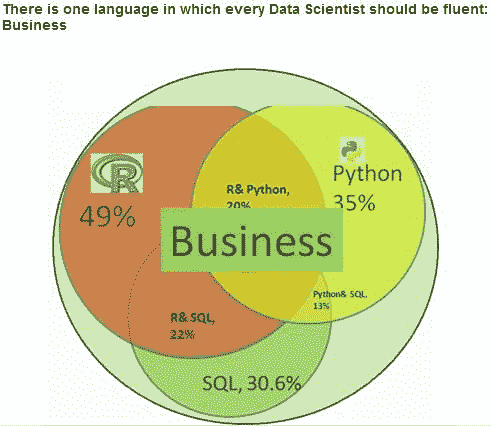

# 【机器学习资料整理】（学习工具、学习视频、博客和文章推荐、ML 相关算法参考、部分机器学习译文）

> 原文：[`mp.weixin.qq.com/s?__biz=MzAxNTc0Mjg0Mg==&mid=2653282920&idx=1&sn=6faa96116c590c75d92569351f987e52&chksm=802e207db759a96b14bb164ff5ca4391093fb5749f6dde06c7f01336454dd121ee65058cbb6c&scene=27#wechat_redirect`](http://mp.weixin.qq.com/s?__biz=MzAxNTc0Mjg0Mg==&mid=2653282920&idx=1&sn=6faa96116c590c75d92569351f987e52&chksm=802e207db759a96b14bb164ff5ca4391093fb5749f6dde06c7f01336454dd121ee65058cbb6c&scene=27#wechat_redirect)

> ********查看之前文章请点击右上角********，关注并且******查看历史消息******，还可以在文章最后评论留言。谢谢您的支持！********

## 如果连接点不开，请点击阅读原文。

## **书籍推荐**

机器学习的书籍很多，下面推荐几本还不错的书籍。优于机器学习是一门跨领域的学科，所以在书籍上并非全是机器学习的书籍:

*   1.《机器学习实战》**Machine Learning in Action [美] Peter Harington 著**。该书贯穿了 10 个最受欢迎的机器学习算法，提供了案例研究问题并用 Python 代码实例来解决。我本人比较喜欢这本书，因为里面的代码给了我很大的帮助，自己在学习机器学习算法的时候，理论上很多东西不太理解透，通过该书实践之后，在算法层面又有了进一步的提高。

*   2.《统计学习方法》 李航著。该书比较详细地介绍了算法的原理，只从理论层面来研究算法。通过这本书和《机器学习实战》两本书相结合，一本讲理论，一本着手实践，加在一起会有事半功倍的效果。

*   3.《数据挖掘概念与技术》 韩家炜著。该书介绍了数据挖掘的常用技术，比较详实，但本人觉得不太适合初学者，当时自己初学的时候看的就是这本书，结果最后很多地方理解的不是很好，后来通过《统计学习方法》和算法实践之后，再回头看《数据挖掘概念与技术》，感觉就轻松多了。

*   4.《数学之美》 吴军著。本书可以当做业余书籍来看，可以在无聊的时候看看，不过里面讲的东西还是挺有用的。

*   5.《Python 科学计算》该书可以当做 Python 编程参考书籍，但前提是你喜欢使用 Python，并爱上了它，不然这本书还是蛮贵的，我自己也是通过“研究生自由探索项目”才买的这本书，因为可以报销嘛。

## **学习工具**

机器学习的 tools 很多，这里只列出几个参考工具。

*   Scikit-learn.基于 Python 语言的 scikit-learn 库，里面涵盖了分类、聚类、回归的大部分算法，并且有常用的评估指标以及预处理数据的方法，是一个不错的学习库，强力推荐。附一篇博文：SOME USEFUL MACHINE LEARNING LIBRARIES.

*   R 语言，语言就是一门工具，R 语言现在在商业界是用的最多的，在统计方面功能强大，而且也有封装好的算法库可以直接使用。附：R 语言参考卡片.

*   Weka，是一个基于 java 开发的数据挖掘工具，可以尝试一下。它为用户提供了一系列据挖掘 API、命令行和图形化用户接口。你可以准备数据、可视化、建立分类、进行回归分析、建立聚类模型，同时可以通过第三方插件执行其他算法。除了 WEKA 之外， Mahout 是 Hadoop 中为机器学习提供的一个很好的 JAVA 框架，你可以自行学习。如果你是机器学习和大数据学习的新手，那么坚持学习 WEKA，并且全心全意地学习一个库。

*   Matlab，里面有很多的工具包，不过本人不怎么用过。参考：Matlab Codes and Datasets for Feature Learning 和 Statistics and Machine Learning Toolbox。此外 matlab 中的 Octave 可以很方便地解决线性和非线性问题，比如机器学习算法底层涉及的问题。如果你有工程背景，那么你可以由此入手。

*   BigML:可能你并不想进行编程工作。你完全可以不通过代码，来使用 WEKA 那样的工具。你通过使用 BigMLS 的服务来进行更加深入的工作。BigML 通过 Web 页面，提供了机器学习的接口，因此你可以通过浏览器来建立模型。

*   如果你使用 Python，这里推荐一个 IDE，WinPython,IDE 版本就是 Python 的版本，自行选择！

下面给出一个比较图，具体想要学什么，还需自己抉择。

## **学习视频**

首先推荐的便是 Andrew Ng 的斯坦福大学的机器学习课程。这套视频在网上有两个网址，国外和国内的都有，全程英语教学，内容很好，有时间建议你去听听：

*   一个是国外的 Coursera 公开课，该课程在机器学习领域很火，是很多入门学者的首选。地址：https://www.coursera.org/；讲义地址：[Stanford CS229 course 下载讲义和笔记](http://cs229.stanford.edu/)；

*   一个是国内的网易公开课，链接地址：http://open.163.com/movie/2008/1/U/O/M6SGF6VB4_M6SGJURUO.html

下面是一个机器学习视频库，由加州理工学院（Caltech）出品。

*   机器学习视频库，地址：http://work.caltech.edu/library/

其它的视频库

*   Machine Learning Category on VideoLectures，这个网站的视频比较多。你可以找出比较感兴趣的资源，然后深入学习。

机器学习最近在国内比较火，许多培训机构都相应的开了该门课程，如果想要听中文教程的，可以去网上搜索下，这里就不给培训机构打广告了。

## **博客和文章推荐**

大牛们的博客，会让你感到兴奋，让你觉得你不是一个人在奋斗，让你时刻记住你的前方已经有很多的学者正在等着你，你要加油。他们的经验会让我们少走些冤枉路，能让我们在他们的基础上进一步理解。下面推荐几个我所知道的或者说我了解到的几位牛人博客和几篇文章：

*   **pluskid**，真名张弛原，一位技术大牛，毕业于浙江大学，后来出国深造。他的博文质量非常高，深入浅出，其 SVM 三层境界的讲解让人茅塞顿开，应该给了很多人启发吧，很值得学习。现在的博客网址：Chiyuan Zhang，原博客网址：Chiyuan Zhang

*   **Rachel Zhang**，真名张睿卿，很有气质的一位软妹纸，目前是百度深度学习实验室研发工程师，在 CSDN 中的博客人气绝对屈指可数，算是 IT 界的一位女中豪杰。博客网址：CSDN 博客-Rachel Zhang

*   **July**，对算法研究独具一格，目前是七月在线科技创始人兼 CEO。博客网址：July

*   **Jason**，一位国外机器学习爱好者，其博客内容详实，多篇文章被国内机器学习者翻译。博客网址：http://machinelearningmastery.com/blog/

*   一个国外很好的机器学习博客，里面介绍了详细的算法知识，很全面，从感知机、神经网络、决策树、SVM、Adaboost 到随机森林、Deep Learning.网址：A Blog From a Human-engineer-being

*   一篇涵盖许多机器学习资料的文章：机器学习(Machine Learning)&深度学习(Deep Learning)资料

*   **Edwin Chen** ，机器学习爱好者，博客内容涵盖数学、机器学习和数据科学。分享其中一篇博文：Choosing a Machine Learning Classifier

*   一篇以前的博文：A List of Data Science and Machine Learning Resources，有时间好好阅读阅读，对你绝对有帮助。

*   A Few Useful Things to Know about Machine Learning,一篇很有帮助的机器学习文章，里面包括了特征选择与模型的简化。

*   The Discipline of Machine Learning 机器学习规则。该文章比较老，2006 年发布的，作者是 Tom Mitchell，但很有参考价值，其中定义了机器学习的规则。Mitchell 在说服 CMU 总裁为一个百年内都存在的问题建立一个独立的机器学习部门时，也用到了这本书中的观点。希望能对你也有所帮助。

*   分享一个网站：简书。

## **国外网站**

如果你想搜索比较新颖的机器学习资料或是文章，可以到以下网站中搜索，里面不仅包括了机器学习的内容，还有许多其它相关领域内容，如数据科学和云计算等。

*   InfoWord：http://www.infoworld.com/reviews/

*   Kdnuggets：http://www.kdnuggets.com

*   Datasciencecentral：http://www.datasciencecentral.com/

*   Datascienceplus：http://datascienceplus.com

## **数据科学竞赛**

关于数据分析的竞赛，国内国外都有，下面推荐几个比较火的竞赛网站 ：

*   Kaggle 比赛，网址：https://www.kaggle.com/

*   DataCastle 比赛，网站：http://www.pkbigdata.com/

*   2015 年有个【2015 天池大数据竞赛】

## **ML 相关算法参考**

*   决策树-参考：decision Tree（Python 实现）

*   SVM 支持向量机-参考：pluskid 支持向量机三重境界

*   Adaboost-参考：组合算法-Adaboost

*   Random Forest-参考：随机森林算法

*   朴素贝叶斯算法-参考：Naive Bayes 算法实现

*   人工神经网络-参考：http://www.cnblogs.com/luxiaoxun/archive/2012/12/10/2811309.html

*   Apriori 算法-参考地址：Apriori 关联分析

*   K 最近邻算法-参考：KNN 从原理到实现

*   梯度树提升 GTB 算法-参考：Gradient Tree Boosting（或 GBRT）

*   K-means 聚类-参考：K-means cluster

*   组合算法总结-参考：Ensemble 算法总结

*   EM 期望最大算法-参考：EM 算法

*   Logistic 回归-参考：逻辑回归

*   HMM 隐马尔可夫模型，参考:HMM

*   条件随机场，参考：CRF

*   随机森林和 GBDT，参考：决策树模型组合之随机森林与 GBDT

*   特征选择和特征提取，参考：特征提取与特征选择

*   梯度下降法，参考:gradient descent

*   牛顿法，参考：牛顿法

*   线性判别分析，参考：线性判别

*   深度学习-深度学习概述：从感知机到深度网络

## **译文**

*   2015-09-14 LSTM 实现详解

*   2015-09-10 从零实现来理解机器学习算法：书籍推荐及障碍的克服

*   2015-08-31 机器学习开发者的现代化路径：不需要从统计学微积分开始

*   2015-08-27 基于 Python 的卷积神经网络和特征提取

*   2015-08-20 你应该掌握的七种回归技术

*   2015-08-11 机器学习 API Top 10：AT&T Speech、IBM Watson 和 Google Prediction

*   2015-08-03 从 Theano 到 Lasagne：基于 Python 的深度学习的框架和库

*   2015-07-15 Airbnb 欺诈预测机器学习模型设计：准确率和召回率的故事

*   2015-07-13 开发者成功使用机器学习的十大诀窍

下面是相关译者的译文，仅供参考：

*   2015-09-16 各种编程语言的深度学习库整理

*   2015-09-11 机器学习温和指南

*   2015-09-10 关于数据科学，书上不曾提及的三点经验

**【过往文章】**

**0.[【重！磅！干！货！】互联网金融之量化投资深度文本挖掘——附源码文档](http://mp.weixin.qq.com/s?__biz=MzAxNTc0Mjg0Mg==&mid=2653282879&idx=1&sn=12a91c4b8317662fbae470541ebe4683&scene=21#wechat_redirect)**

**1.[【机器学习课程】深度学习与神经网络系列之绪论介绍](http://mp.weixin.qq.com/s?__biz=MzAxNTc0Mjg0Mg==&mid=404690945&idx=1&sn=39ae29caade4b2fac87304d5091ecfc0&scene=21#wechat_redirect)** 

**2.[【Python 机器学习】系列之线性回归篇【深度详细】](http://mp.weixin.qq.com/s?__biz=MzAxNTc0Mjg0Mg==&mid=405488375&idx=1&sn=e06859f0d3cf5102946bd1551d80184a&scene=21#wechat_redirect)** 

**3.[多因子策略系列（一）——因子回溯测试的总体框架](http://mp.weixin.qq.com/s?__biz=MzAxNTc0Mjg0Mg==&mid=404506736&idx=1&sn=20737eb5d6d9ab45a9de576014991db7&scene=21#wechat_redirect)** 

**4.[Python 机器学习：数据拟合与广义线性回归](http://mp.weixin.qq.com/s?__biz=MzAxNTc0Mjg0Mg==&mid=404455727&idx=4&sn=eec006e2fab671f0ac11bdbc8e9299a7&scene=21#wechat_redirect)** 

**5.[【分级基金】之分级 A 的隐含收益率研究分析](http://mp.weixin.qq.com/s?__biz=MzAxNTc0Mjg0Mg==&mid=401876825&idx=1&sn=d2eed5059426af15d1eb60821ccc9bcf&scene=21#wechat_redirect)** 

**6.[【精华干货】Quant 需要哪些 Python 知识](http://mp.weixin.qq.com/s?__biz=MzAxNTc0Mjg0Mg==&mid=405488375&idx=2&sn=bb7bd9d7eadea8ad68f1f404bbb0753a&scene=21#wechat_redirect)**

**7.[【干货】量化投资国内外很棒的论坛网站](http://mp.weixin.qq.com/s?__biz=MzAxNTc0Mjg0Mg==&mid=404455727&idx=2&sn=11acb86a872c0b4871ac094136903f3d&scene=21#wechat_redirect)**

**8.[朴素贝叶斯模型(NBM)详解与在 Matlab 和 Python 里的具体应用](http://mp.weixin.qq.com/s?__biz=MzAxNTc0Mjg0Mg==&mid=401834925&idx=1&sn=d56246158c1002b2330a7c26fd401db6&scene=21#wechat_redirect)**

**9.[机器学习的前期入门汇总](http://mp.weixin.qq.com/s?__biz=MzAxNTc0Mjg0Mg==&mid=404455727&idx=3&sn=d05688effdbb0583031ef9ae98c64387&scene=21#wechat_redirect)**

**10.[【深度原创研究】分级基金下折全攻略（一）](http://mp.weixin.qq.com/s?__biz=MzAxNTc0Mjg0Mg==&mid=403551881&idx=1&sn=e1ed56f607a0fe187dd7a0cf5178b638&scene=21#wechat_redirect)**

**11.[【深度原创研究】分级基金下折全攻略（二）](http://mp.weixin.qq.com/s?__biz=MzAxNTc0Mjg0Mg==&mid=403626226&idx=1&sn=4d1f56a6599c92fd6688e5eb5d7d15dc&scene=21#wechat_redirect)**

**12.[【知识食粮】最新华尔街牛人必读书籍排行](http://mp.weixin.qq.com/s?__biz=MzAxNTc0Mjg0Mg==&mid=401910135&idx=1&sn=43d5eb7549281bb9231a3be831302139&scene=21#wechat_redirect)**

**13.[通过 MATLAB 处理大数据](http://mp.weixin.qq.com/s?__biz=MzAxNTc0Mjg0Mg==&mid=401910135&idx=2&sn=5289317b5fa1afe4a5a4115520aaa8ac&scene=21#wechat_redirect)**

**14.[【扎实资料干货分享】Python、研究报告、计量经济学、投资书籍、R 语言等！(Book+Video)](http://mp.weixin.qq.com/s?__biz=MzAxNTc0Mjg0Mg==&mid=2653282744&idx=2&sn=c9e9fbf1fd0cd4efa8bf08b9c5f16d8a&scene=21#wechat_redirect)**

**15.[机器学习在统计套利中的应用](http://mp.weixin.qq.com/s?__biz=MzAxNTc0Mjg0Mg==&mid=2653282744&idx=3&sn=85d30593998974cfaf714ac0cf81f8cd&scene=21#wechat_redirect)**

**16.[量化投资修行之路](http://mp.weixin.qq.com/s?__biz=MzAxNTc0Mjg0Mg==&mid=2653282744&idx=4&sn=0ff993c537b4b1689967f1560dfd45be&scene=21#wechat_redirect)**

**17.[统计套利在股指期货跨期套利中的应用：基于协整方法的估计](http://mp.weixin.qq.com/s?__biz=MzAxNTc0Mjg0Mg==&mid=405625337&idx=3&sn=60d19beefab3a1636554b216a9b05742&scene=21#wechat_redirect)**

**18.[股指期货跨品种套利交易](http://mp.weixin.qq.com/s?__biz=MzAxNTc0Mjg0Mg==&mid=405625337&idx=2&sn=e136d7bb6542789fa12f1f90dd206641&scene=21#wechat_redirect)**

**19.[沪港通股票统计套利：基于 BP 神经网络](http://mp.weixin.qq.com/s?__biz=MzAxNTc0Mjg0Mg==&mid=405625337&idx=1&sn=c7d62703af3e5cdb90f0b1b853f8a483&scene=21#wechat_redirect)**

**20.[机器学习到底在量化金融里哪些方面有应用？](http://mp.weixin.qq.com/s?__biz=MzAxNTc0Mjg0Mg==&mid=2653282744&idx=1&sn=73db745def6298a1e352c03f51d26d95&scene=21#wechat_redirect)**

**21.[【Matlab 机器学习】之图像识别](http://mp.weixin.qq.com/s?__biz=MzAxNTc0Mjg0Mg==&mid=2653282814&idx=1&sn=f1224ea30942468ee39aa96d6ea0dd8f&scene=21#wechat_redirect)**

**22.[【干货分享】Python 数据结构与算法设计总结篇](http://mp.weixin.qq.com/s?__biz=MzAxNTc0Mjg0Mg==&mid=2653282752&idx=1&sn=5db4c3e27508abc083a7a5f388ddb6ed&scene=21#wechat_redirect)**

**23.[基于 Python 的股票数据接口调用代码实例](http://mp.weixin.qq.com/s?__biz=MzAxNTc0Mjg0Mg==&mid=2653282828&idx=1&sn=126ad1c21ce5795f8744690cb1effc13&scene=21#wechat_redirect)**

**24.[基于 Python 爬取腾讯网的最热评论代码实例](http://mp.weixin.qq.com/s?__biz=MzAxNTc0Mjg0Mg==&mid=2653282828&idx=2&sn=d73b96b78ce43b151c69ab3e70e4d24c&scene=21#wechat_redirect)**

**25.[卷积神经网络反向传播推导](http://mp.weixin.qq.com/s?__biz=MzAxNTc0Mjg0Mg==&mid=2653282851&idx=1&sn=6cc6f32f8d35089a3c80cdc4c95b48a9&scene=21#wechat_redirect)**

**26.[深度学习项目](http://mp.weixin.qq.com/s?__biz=MzAxNTc0Mjg0Mg==&mid=2653282851&idx=2&sn=d683b6a6570309b7dc07d79829c56b72&scene=21#wechat_redirect)**

****量化投资与机器学习****

****知识、能力、深度、专业****

****勤奋、天赋、耐得住寂寞****

******** 

********