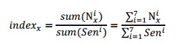
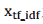

# 【重！磅！干！货！】互联网金融之量化投资深度文本挖掘——附源码文档

> 原文：[`mp.weixin.qq.com/s?__biz=MzAxNTc0Mjg0Mg==&mid=2653282879&idx=1&sn=12a91c4b8317662fbae470541ebe4683&chksm=802e202ab759a93ca5cb0dbda861a19d0c9dbdfc3bdd3b383aecf38494c5079ef66208f2e909&scene=27#wechat_redirect`](http://mp.weixin.qq.com/s?__biz=MzAxNTc0Mjg0Mg==&mid=2653282879&idx=1&sn=12a91c4b8317662fbae470541ebe4683&chksm=802e202ab759a93ca5cb0dbda861a19d0c9dbdfc3bdd3b383aecf38494c5079ef66208f2e909&scene=27#wechat_redirect)

> ********查看之前文章请点击右上角********，关注并且******查看历史消息******，还可以在文章最后评论留言。谢谢您的支持！********

*   回复【**文本挖掘**】或者【**点击阅读原文**】获取链接与代码附录

**一、 功能概述**

       关键词词频&网络图是以股票论坛、 个股新闻、研究报告三个网站作为数据源，以文本数据挖掘作为核心技术，以 Lucene 检索作为系统框架， 以证券分析为目的， 实现的智能文本分析系统，该系统主要实现了以下功能：

*   关键词词频统计

*   关键词网络图

      其中，关键词词频统计功能是： 对于给定的关键词(Word)以及给定的股票代码(Ticker)在一定的时间范围[StartDate,EndDate]内，计算每周的平均词频占比， 同时给出该词频占比时间序列与股价之间的相关系数。

 

       关键词网络图的功能是： 对于给定的关键词(Word)在一定的时间范围[StartDate,EndDate]内，根据 TF-IDF 关联度指标为依据，给出与关键词最相关的 20 个一级词，以及与一级词最相关的 5 个二级词，组成关键词网络图。

 

**二、功能模块**
如本文之前所述， 本文分析系统的两个功能是建立在三个文本的数据源，Lucene 检索的架构之上的。 所以，实现关键词词频、关键词网络图的功能需要先做一些准备工作和模块支持， 本文所实现的智能文本分析系统只要分为以下几个模块： 

*   爬虫模块

*   检索模块

*   统计模块

*   关键词词频模块

*   关键词网络模块

**1) 爬虫模块** 爬虫模块的主要作用在于将股票论坛、 个股新闻、研究报告三个网站的网页数据通过网页解析的方式将文本内容爬下来， 用于之后模块的文本挖掘。 爬虫模块将爬到的文本数据以【 日期 + 股票代码】 为单位存至相应的 TXT 文本文件当中，同时将文本文件所在的位置以及其他相关信息写入数据库。对于每个数据源，都有一个独立的程序进行网页爬虫，他们分别是：
▲***GetGuba_pylucene.py***股票论坛网页爬虫
▲***GetMbReport_pylucene.py***研究报告网页爬虫
▲***GetSinaNews_pylucene.py ***个股新闻网页爬虫 

**2） 检索模块**

检索模块的主要作用在于以 Lucene 为架构， 将爬虫模块爬到的文本数据加入到全文索引当中， 在建立索引的过程中，系统以“句子”作为基本的检索单位即检索关键词能够定位到该关键词所在的句子。 另外， 索引采用增量的方式来建立，即每次只将最新爬的文本加入到搜索索引当中， 而对于三个数据源，系统分别建立了三个独立的索引。同时，在建立的索引的基础上， 检索模块还实现了基本的文本检索功能， 检索程序能够在一定的时间范围内对于检索给定关键词，并返回该关键词所在的存储文件的文件名，以及该关键词所在的“句子”，并将所有的检索结果输出到一个给定的文件中。 

       简而言之，检索模块提供了建立索引和文本搜索两个主要的功能，他们分别是：

▲***IndexFiles_pylucene.py***增量建立索引
▲***SearchFiles_pylucene.py***   关键词全文检索 

**3） 统计模块** 设计统计模块是为了随后的关键词词频和网络模块进行数据的准备，和爬虫模块和检索模块一样，统计模块也是基础模块。 统计模块的主要功能有三个：
▲ 以【用户字典】为列表，计算用户字典中每个关键词在三个数据源中出现的总词频数
▲ 以【用户字典】为列表，计算用户字典中每个关键词在三个数据源中出现过的总文档数
▲ 以句子为单位，计算三个数据源中每天文档的总句子数 

       其中，用户字典关键词的词频数和文档数，是为了关键词网络模块中计算 TF-IDF 相关度指标所准备的数据，而每天的句子数则树为了关键词词频模块中计算词频占比所准备的数据。对于统计模块的这三个功能，分别有三个独立的程序进行，他们分别是：

▲***IDFCalWord.py***   计算关键词总词频数
▲***IDFCal.py***   计算关键词所在文档数 

▲***SentenceCal.py***计算每天文档的句子数

**4） 关键词词频模块** 通过建立三个基础模块， 能够完成一系列的应用，关键词词频模块是其中的一个应用模块， 关键词词频模块的主要功能在于：对于给定的关键词以及给定的股票代码，在一定的时间范围内，计算每周的平均词频占比， 给出词频占比序列的曲线和股票价格曲线的对比图， 同时给出该词频占比与股价之间的相关系数。 

      模块中没有直接使用关键词每天的词频，而是根据每天的词频，以及当天文档的句子总数计算关键词的词频占比。 对于关键词 ，词频占比 的计算公式如下：

 

其中， 公式的各个指标的意义如下：
      分子： 概念关键词 在第 i 天出现的次数 

      分母： 第 i 天中文档的句子总数

       从词频占比的计算公式可以看出， 词频占比是将每个星期的关键词的词频总和除以每个星期文档的句子总数得到的。 使用词频占比而非直接采用词频，能够更公平地反应出关键词 每天的关注程度，从而更合理地对词频信号进行使用。另外，在计算关键词与给定股票的相关系数时， 模块会以一周为频率计算关键词的词频占比时间序列，同时计算该周内给定股票股价的均值，计算两个时间序列的相关系数作为两者相关性的依据。

       对于关键词词频模块， 只有一种调用的方式，调用时需给出关键词、股票代码以及时间范围：

▲ ***sigWordSeq.py***关键词词频时间序列

**5） 关键词网络模块** 和关键词词频模块一样，关键词网络模块也属于应用模块， 关键词网络模块的主要功能在于： 对于给定的关键词、在一定的时间范围内，根据 TF-IDF 关联度指标为依据，给出与关键词最相关的 20 个一级词，以及与一级词最相关的 5 个二级词，组成关键词网络图。 

       其中关联度指标采用的是 TF-IDF 算法， TF-IDF 是一种常用的文本检索与本文探勘的加权技术,主要用于评估某个词对于一份特定文档的重要程度。 在本文的关键词网络模块中，将给定关键词的搜索结果集合作为特定文档， TF-IDF 用于评估搜索结果中每个词对于该结果的关联程度，即对于关键词的关联程度。 TF-IDF 的具体计算公式如下：

 

其中 x 为搜索结果中的某个词，为词 x 的与关键词的 TF-IDF 关联度指标，其他符号意义如下：

 

对于关键词网络模块，提供了两种形式的调用，一是对于给定的关键词，生成完整的关键词网络图，二是对于只给出与关键词关联度最高的 20 只股票组合，他们分别是：
▲ ***WordNet.py***  完整关键词网络图
▲ ***WordNet_stock.py***  关键词关联股票组合

**三、 模块运行**

**1） 爬虫模块举例 2 个，其余不再呈现** 路径： ***D:\TotalCode\LuceneCode\GetData\GetGuba_pylucene.py***
功能： 股票论坛网页爬虫
输入参数：无
**运行举例**： *python   GetGuba_pylucene.py* 

运行过程实例：

 

运行结果：

**** 

路径：*****D:\TotalCode\LuceneCode\GetData\****GetSinaNews_pyl*** 功能： 个股新闻网页爬虫
输入参数：无
运行举例： *python   GetGuba_pylucene.py*

运行过程实例：

 

运行结果：

 

**2） 检索模块** 路径： ***D:\TotalCode\LuceneCode\Index_Search\IndexFiles_pylucene.py***
功能： 增量建立索引
输入参数：<数据目录> <索引目录> <开始日期> <结束日期>
**运行举例**：*python IndexFiles_pylucene.py D:\DATA\text D:\DATA\Index\text
20120715 20120820* 

运行过程实例：

 运行结果：

 

路径： ***D:\TotalCode\LuceneCode\Index_Search\******SearchFiles_pylucene.py***
功能： 关键词全文检索
输入参数：<索引目录> <关键词> <输出文件>
**运行举例**：*python SearchFiles_pylucene.py D:\DATA\Index\text "页岩气 "*

*D:\TotalCode\LuceneCode\Index_Search\Output_pylucene.txt*

运行过程实例：

 

**3）统计模块**举例 1 个，其余不再呈现**** 路径： ***D:\TotalCode\LuceneCode\ICTCLAS_Cal/IDFCal.py***
功能： 计算关键词所在文档数
输入参数：<数据源> <开始日期> <结束日期>
**运行举例**：*python IDFCal.py 股票论坛 20120715 20120820*

运行过程实例：

 

运行结果：

**4）关键词词频模块**举例 1 个，其余不再呈现**** 路径：*** D:\TotalCode\LuceneCode\ICTCLAS_ IDF/ sigWordSeq.py***
功能： 关键词词频时间序列
输入参数：<数据源> <关键词> <股票代码> <开始日期> <结束日期> <是否搜索标识>
**运行举例**：*python sigWordSeq.py 股票论坛 "物联网" 000001 20100601 **20120820 1*

运行过程实例：

 

运行结果：

 

路径：***D:\TotalCode\LuceneCode\ICTCLAS_ IDF/ WordNet.py***
功能： 完整关键词网络图
输入参数：<数据源> <关键词> <开始日期> <结束日期>
**运行举例**：*python WordNet.py 研究报告 "页岩气" 20120601 20120817* 运行过程实例：

** 

运行结果：

 

**四、模块效率性能总汇**

**** 

根据上表所示的各模块平均时间效率估计的结果，可以得到如下结论：
▲ 在三个数据源中，所有模块个股新闻的平均运行时间是最长的，研究报告次之，而股票      论坛是耗时最少的
▲ 所有模块的时间消耗主要都关键词的搜索上，模块的平均耗时和模块进行的关键词搜索      次数成正比
▲ 关键词词频模块 sigWordSeq 进行了一次词频检索，因此和检索模块 SearchFiles 的平        均耗时相当
▲ 关键词网络模块 WordNet_stock 同样只进行了一次关键词检索，但是在计算关联股票        TF-IDF 指标是需要耗费一定的时间，因此平均耗时略长于单次的检索 

▲ 关键词网络模块 WordNet 由于需要进行对 20 个一级词的搜索，因此耗费的时间是最长      的。另外， 由于三个数据源中【 个股新闻】的数据量最大，运行 WordNet 一旦遇到高      频词会消耗大量的时间，需要格外注意。

*   本文基于光大文本挖掘系统框架概述全文。

**【过往文章】**

**1.[【机器学习课程】深度学习与神经网络系列之绪论介绍](http://mp.weixin.qq.com/s?__biz=MzAxNTc0Mjg0Mg==&mid=404690945&idx=1&sn=39ae29caade4b2fac87304d5091ecfc0&scene=21#wechat_redirect)** 

**2.[【Python 机器学习】系列之线性回归篇【深度详细】](http://mp.weixin.qq.com/s?__biz=MzAxNTc0Mjg0Mg==&mid=405488375&idx=1&sn=e06859f0d3cf5102946bd1551d80184a&scene=21#wechat_redirect)** 

**3.[多因子策略系列（一）——因子回溯测试的总体框架](http://mp.weixin.qq.com/s?__biz=MzAxNTc0Mjg0Mg==&mid=404506736&idx=1&sn=20737eb5d6d9ab45a9de576014991db7&scene=21#wechat_redirect)** 

**4.[Python 机器学习：数据拟合与广义线性回归](http://mp.weixin.qq.com/s?__biz=MzAxNTc0Mjg0Mg==&mid=404455727&idx=4&sn=eec006e2fab671f0ac11bdbc8e9299a7&scene=21#wechat_redirect)** 

**5.[【分级基金】之分级 A 的隐含收益率研究分析](http://mp.weixin.qq.com/s?__biz=MzAxNTc0Mjg0Mg==&mid=401876825&idx=1&sn=d2eed5059426af15d1eb60821ccc9bcf&scene=21#wechat_redirect)** 

**6.[【精华干货】Quant 需要哪些 Python 知识](http://mp.weixin.qq.com/s?__biz=MzAxNTc0Mjg0Mg==&mid=405488375&idx=2&sn=bb7bd9d7eadea8ad68f1f404bbb0753a&scene=21#wechat_redirect)**

**7.[【干货】量化投资国内外很棒的论坛网站](http://mp.weixin.qq.com/s?__biz=MzAxNTc0Mjg0Mg==&mid=404455727&idx=2&sn=11acb86a872c0b4871ac094136903f3d&scene=21#wechat_redirect)**

**8.[朴素贝叶斯模型(NBM)详解与在 Matlab 和 Python 里的具体应用](http://mp.weixin.qq.com/s?__biz=MzAxNTc0Mjg0Mg==&mid=401834925&idx=1&sn=d56246158c1002b2330a7c26fd401db6&scene=21#wechat_redirect)**

**9.[机器学习的前期入门汇总](http://mp.weixin.qq.com/s?__biz=MzAxNTc0Mjg0Mg==&mid=404455727&idx=3&sn=d05688effdbb0583031ef9ae98c64387&scene=21#wechat_redirect)**

**10.[【深度原创研究】分级基金下折全攻略（一）](http://mp.weixin.qq.com/s?__biz=MzAxNTc0Mjg0Mg==&mid=403551881&idx=1&sn=e1ed56f607a0fe187dd7a0cf5178b638&scene=21#wechat_redirect)**

**11.[【深度原创研究】分级基金下折全攻略（二）](http://mp.weixin.qq.com/s?__biz=MzAxNTc0Mjg0Mg==&mid=403626226&idx=1&sn=4d1f56a6599c92fd6688e5eb5d7d15dc&scene=21#wechat_redirect)**

**12.[【知识食粮】最新华尔街牛人必读书籍排行](http://mp.weixin.qq.com/s?__biz=MzAxNTc0Mjg0Mg==&mid=401910135&idx=1&sn=43d5eb7549281bb9231a3be831302139&scene=21#wechat_redirect)**

**13.[通过 MATLAB 处理大数据](http://mp.weixin.qq.com/s?__biz=MzAxNTc0Mjg0Mg==&mid=401910135&idx=2&sn=5289317b5fa1afe4a5a4115520aaa8ac&scene=21#wechat_redirect)**

**14.[【扎实资料干货分享】Python、研究报告、计量经济学、投资书籍、R 语言等！(Book+Video)](http://mp.weixin.qq.com/s?__biz=MzAxNTc0Mjg0Mg==&mid=2653282744&idx=2&sn=c9e9fbf1fd0cd4efa8bf08b9c5f16d8a&scene=21#wechat_redirect)**

**15.[机器学习在统计套利中的应用](http://mp.weixin.qq.com/s?__biz=MzAxNTc0Mjg0Mg==&mid=2653282744&idx=3&sn=85d30593998974cfaf714ac0cf81f8cd&scene=21#wechat_redirect)**

**16.[量化投资修行之路](http://mp.weixin.qq.com/s?__biz=MzAxNTc0Mjg0Mg==&mid=2653282744&idx=4&sn=0ff993c537b4b1689967f1560dfd45be&scene=21#wechat_redirect)**

**17.[统计套利在股指期货跨期套利中的应用：基于协整方法的估计](http://mp.weixin.qq.com/s?__biz=MzAxNTc0Mjg0Mg==&mid=405625337&idx=3&sn=60d19beefab3a1636554b216a9b05742&scene=21#wechat_redirect)**

**18.[股指期货跨品种套利交易](http://mp.weixin.qq.com/s?__biz=MzAxNTc0Mjg0Mg==&mid=405625337&idx=2&sn=e136d7bb6542789fa12f1f90dd206641&scene=21#wechat_redirect)**

**19.[沪港通股票统计套利：基于 BP 神经网络](http://mp.weixin.qq.com/s?__biz=MzAxNTc0Mjg0Mg==&mid=405625337&idx=1&sn=c7d62703af3e5cdb90f0b1b853f8a483&scene=21#wechat_redirect)**

**20.[机器学习到底在量化金融里哪些方面有应用？](http://mp.weixin.qq.com/s?__biz=MzAxNTc0Mjg0Mg==&mid=2653282744&idx=1&sn=73db745def6298a1e352c03f51d26d95&scene=21#wechat_redirect)**

**21.[【Matlab 机器学习】之图像识别](http://mp.weixin.qq.com/s?__biz=MzAxNTc0Mjg0Mg==&mid=2653282814&idx=1&sn=f1224ea30942468ee39aa96d6ea0dd8f&scene=21#wechat_redirect)**

**22.[【干货分享】Python 数据结构与算法设计总结篇](http://mp.weixin.qq.com/s?__biz=MzAxNTc0Mjg0Mg==&mid=2653282752&idx=1&sn=5db4c3e27508abc083a7a5f388ddb6ed&scene=21#wechat_redirect)**

**23.[基于 Python 的股票数据接口调用代码实例](http://mp.weixin.qq.com/s?__biz=MzAxNTc0Mjg0Mg==&mid=2653282828&idx=1&sn=126ad1c21ce5795f8744690cb1effc13&scene=21#wechat_redirect)**

**24.[基于 Python 爬取腾讯网的最热评论代码实例](http://mp.weixin.qq.com/s?__biz=MzAxNTc0Mjg0Mg==&mid=2653282828&idx=2&sn=d73b96b78ce43b151c69ab3e70e4d24c&scene=21#wechat_redirect)**

**25.[卷积神经网络反向传播推导](http://mp.weixin.qq.com/s?__biz=MzAxNTc0Mjg0Mg==&mid=2653282851&idx=1&sn=6cc6f32f8d35089a3c80cdc4c95b48a9&scene=21#wechat_redirect)**

**26.[深度学习项目](http://mp.weixin.qq.com/s?__biz=MzAxNTc0Mjg0Mg==&mid=2653282851&idx=2&sn=d683b6a6570309b7dc07d79829c56b72&scene=21#wechat_redirect)**

****量化投资与机器学习****

****知识、能力、深度、专业****

****勤奋、天赋、耐得住寂寞****

******** 

********