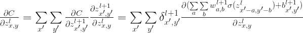

# 卷积神经网络反向传播推导

> 原文：[`mp.weixin.qq.com/s?__biz=MzAxNTc0Mjg0Mg==&mid=2653282851&idx=1&sn=6cc6f32f8d35089a3c80cdc4c95b48a9&chksm=802e2036b759a9201ce8f9b7c9cb36e673fc4c1e06b96e3062ff36f1f066b394939c11060adb&scene=27#wechat_redirect`](http://mp.weixin.qq.com/s?__biz=MzAxNTc0Mjg0Mg==&mid=2653282851&idx=1&sn=6cc6f32f8d35089a3c80cdc4c95b48a9&chksm=802e2036b759a9201ce8f9b7c9cb36e673fc4c1e06b96e3062ff36f1f066b394939c11060adb&scene=27#wechat_redirect)

> *********查看之前文章请点击右上角********，关注并且******查看历史消息******，还可以在文章最后评论留言。谢谢您的支持！*********

*Disclaimer: It is assumed that the reader is familiar with terms such as Multilayer Perceptron, delta errors or backpropagation. If not,  it is recommended to read for example a chapter 2 of free online book ‘Neural Networks and Deep Learning’ by Michael Nielsen.* 

*Convolutional Neural Networks (CNN) are now a standard way of image classification – there are publicly accessible deep learning frameworks, trained models and services. It’s more time consuming to install stuff like caffe than to perform state-of-the-art object classification or detection. We also have many methods of getting knowledge -there is a large number of deep learning courses/MOOCs, free e-books or even direct ways of accessing to the strongest Deep/Machine Learning minds such as Yoshua Bengio, Andrew NG or Yann Lecun by Quora, Facebook or G+.*

*Nevertheless, when I wanted to get deeper insight in CNN, I could not find a “CNN backpropagation for dummies”. Notoriously I met with statements like:  “If you understand backpropagation in standard neural networks, there should not be a problem with understanding it in CNN” or “All things are nearly the same, except matrix multiplications are replaced by convolutions”. And of course I saw tons of ready equations.*

*It was a little consoling, when I found out that I am not alone, for example: Hello, when computing the gradients CNN,  the weights need to be rotated, Why ? *

**

*The answer on above question, that concerns the need of rotation on weights in gradient computing, will be a result of this long post.* 

*We start from multilayer perceptron and counting delta errors on fingers:*

**

*We see on above picture that  is proportional to deltas from next layer that are scaled by weights.*

*But how do we connect concept of MLP with Convolutional Neural Network? Let’s play with MLP:*

**

*If you are not sure that after connections cutting and weights sharing we get one layer Convolutional Neural Network, I hope that below picture will convince you:*

*The idea behind this figure is to show, that such neural network configuration  is identical with a 2D convolution operation and weights are just filters (also called kernels, convolution matrices, or masks).*

*Now we can come back to gradient computing by counting on fingers, but from now we will be only focused on CNN. Let’s begin:*

*No magic here, we have just summed in “blue layer” scaled by weights gradients from “orange” layer. Same process as in MLP’s backpropagation. However, in the standard approach we talk about dot products and here we have … yup, again convolution:*

*
Yeah, it is a bit different convolution than in previous (forward) case. There we did so called valid convolution, while here we do a full convolution (more about nomenclature here). What is more, we rotate our kernel by 180 degrees. But still, we are talking about convolution!*

*Now, I have some good news and some bad news:*

1.  *you see (BTW, sorry for pictures aesthetics :) ), that matrix dot products are replaced by convolution operations both in feed forward and backpropagation.*

2.  *you know that seeing something and understanding something … yup, we are going now to get our hands dirty and prove above statement <fn> before getting next, I recommend to read, mentioned already in the disclaimer, chapter 2 of M. Nielsen book. I tried to make all quantities to be consistent with work of Michael. *

*In the standard MLP, we can define an error of neuron j as:*

**

*where  is just:*

**

*and for clarity, ") , where  is an activation function such as sigmoid, hyperbolic tangent or relu.*

*But here, we do not have MLP but CNN and matrix multiplications are replaced by convolutions as we discussed before. So instead of   we do have a :*

* + b_{x,y}^{l+1} = \sum \limits_{a} \sum \limits_{b} w_{a,b}^{l+1}\sigma(z_{x-a,y-b}^l)+ b_{x,y}^{l+1}")*

*Above equation is just a convolution operation during feedforward phase illustrated in the above picture titled ‘Feedforward in CNN is identical with convolution operation’*

*Now we can get to the point and answer the question Hello, when computing the gradients CNN,  the weights need to be rotated, Why ? *

*We start from statement:*

**

*We know that  is in relation to  which is indirectly showed in  the above picture titled ‘Backpropagation also results with convolution’. So sums are the result of chain rule. Let’s move on:*

**

*First term is replaced by definition of error, while second has become large because we put it here expression on . However, we do not have to fear of this big monster – all components of sums equal 0, except these ones that are indexed:  and . So:* 

* + b_{x',y'}^{l+1})}{\partial z_{x,y}^l} = \sum \limits_{x'} \sum \limits_{y'} \delta_{x',y'}^{l+1} w_{a,b}^{l+1} \sigma'(z_{x,y}^l)")*

*If  and  then it is obvious that  and  so we can reformulate above equation to:*

*  =\sum \limits_{x'}\sum \limits_{y'} \delta_{x',y'}^{l+1} w_{x'-x,y'-y}^{l+1} \sigma'(z_{x,y}^l) ")*

*OK, our last equation is just …*

* = \delta_{x,y}^{l+1} * w_{-x,-y}^{l+1} \sigma'(z_{x,y}^l) ")*

*Where is the rotation of weights? Actually  = w_{-x, -y}^{l+1}").*

*So the answer on question Hello, when computing the gradients CNN,  the weights need to be rotated, Why ?  is simple: the rotation of the weights just results from derivation of delta error in Convolution Neural Network.*

*OK, we are really close to the end. One more ingredient of backpropagation algorithm is update of weights :*

* + b_{x,y}^l)}{\partial w_{a,b}^l} =\sum \limits_{x}\sum \limits_{y} \delta_{x,y}^l \sigma(z_{x-a,y-b}^{l-1}) = \delta_{a,b}^l * \sigma(z_{-a,-b}^{l-1}) =\delta_{a,b}^l * \sigma(ROT180(z_{a,b}^{l-1})) ")*

*So paraphrasing the backpropagation algorithm  for CNN:*

1.  *Input x: set the corresponding activation  for the input layer.*

2.  *Feedforward: for each l = 2,3, …,L compute  and ")*

3.  *Output error : Compute the vector ")*

4.  *Backpropagate the error: For each l=L-1,L-2,…,2 compute  \sigma'(z_{x,y}^l)")*

5.  *Output: The gradient of the cost function is given by *

***【过往文章】*** 

*1.[【机器学习课程】深度学习与神经网络系列之绪论介绍](http://mp.weixin.qq.com/s?__biz=MzAxNTc0Mjg0Mg==&mid=404690945&idx=1&sn=39ae29caade4b2fac87304d5091ecfc0&scene=21#wechat_redirect)* 

*2.[【Python 机器学习】系列之线性回归篇【深度详细】](http://mp.weixin.qq.com/s?__biz=MzAxNTc0Mjg0Mg==&mid=405488375&idx=1&sn=e06859f0d3cf5102946bd1551d80184a&scene=21#wechat_redirect)* 

*3.[多因子策略系列（一）——因子回溯测试的总体框架](http://mp.weixin.qq.com/s?__biz=MzAxNTc0Mjg0Mg==&mid=404506736&idx=1&sn=20737eb5d6d9ab45a9de576014991db7&scene=21#wechat_redirect)* 

*4.[Python 机器学习：数据拟合与广义线性回归](http://mp.weixin.qq.com/s?__biz=MzAxNTc0Mjg0Mg==&mid=404455727&idx=4&sn=eec006e2fab671f0ac11bdbc8e9299a7&scene=21#wechat_redirect)* 

*5.[【分级基金】之分级 A 的隐含收益率研究分析](http://mp.weixin.qq.com/s?__biz=MzAxNTc0Mjg0Mg==&mid=401876825&idx=1&sn=d2eed5059426af15d1eb60821ccc9bcf&scene=21#wechat_redirect)* 

*6.[【精华干货】Quant 需要哪些 Python 知识](http://mp.weixin.qq.com/s?__biz=MzAxNTc0Mjg0Mg==&mid=405488375&idx=2&sn=bb7bd9d7eadea8ad68f1f404bbb0753a&scene=21#wechat_redirect)*

*7.[【干货】量化投资国内外很棒的论坛网站](http://mp.weixin.qq.com/s?__biz=MzAxNTc0Mjg0Mg==&mid=404455727&idx=2&sn=11acb86a872c0b4871ac094136903f3d&scene=21#wechat_redirect)*

*8.[朴素贝叶斯模型(NBM)详解与在 Matlab 和 Python 里的具体应用](http://mp.weixin.qq.com/s?__biz=MzAxNTc0Mjg0Mg==&mid=401834925&idx=1&sn=d56246158c1002b2330a7c26fd401db6&scene=21#wechat_redirect)*

*9.[机器学习的前期入门汇总](http://mp.weixin.qq.com/s?__biz=MzAxNTc0Mjg0Mg==&mid=404455727&idx=3&sn=d05688effdbb0583031ef9ae98c64387&scene=21#wechat_redirect)*

*10.[【深度原创研究】分级基金下折全攻略（一）](http://mp.weixin.qq.com/s?__biz=MzAxNTc0Mjg0Mg==&mid=403551881&idx=1&sn=e1ed56f607a0fe187dd7a0cf5178b638&scene=21#wechat_redirect)*

*11.[【深度原创研究】分级基金下折全攻略（二）](http://mp.weixin.qq.com/s?__biz=MzAxNTc0Mjg0Mg==&mid=403626226&idx=1&sn=4d1f56a6599c92fd6688e5eb5d7d15dc&scene=21#wechat_redirect)*

*12.[【知识食粮】最新华尔街牛人必读书籍排行](http://mp.weixin.qq.com/s?__biz=MzAxNTc0Mjg0Mg==&mid=401910135&idx=1&sn=43d5eb7549281bb9231a3be831302139&scene=21#wechat_redirect)*

*13.[通过 MATLAB 处理大数据](http://mp.weixin.qq.com/s?__biz=MzAxNTc0Mjg0Mg==&mid=401910135&idx=2&sn=5289317b5fa1afe4a5a4115520aaa8ac&scene=21#wechat_redirect)*

*14.[【扎实资料干货分享】Python、研究报告、计量经济学、投资书籍、R 语言等！(Book+Video)](http://mp.weixin.qq.com/s?__biz=MzAxNTc0Mjg0Mg==&mid=2653282744&idx=2&sn=c9e9fbf1fd0cd4efa8bf08b9c5f16d8a&scene=21#wechat_redirect)*

*15.[机器学习在统计套利中的应用](http://mp.weixin.qq.com/s?__biz=MzAxNTc0Mjg0Mg==&mid=2653282744&idx=3&sn=85d30593998974cfaf714ac0cf81f8cd&scene=21#wechat_redirect)*

*16.[量化投资修行之路](http://mp.weixin.qq.com/s?__biz=MzAxNTc0Mjg0Mg==&mid=2653282744&idx=4&sn=0ff993c537b4b1689967f1560dfd45be&scene=21#wechat_redirect)*

*17.[统计套利在股指期货跨期套利中的应用：基于协整方法的估计](http://mp.weixin.qq.com/s?__biz=MzAxNTc0Mjg0Mg==&mid=405625337&idx=3&sn=60d19beefab3a1636554b216a9b05742&scene=21#wechat_redirect)*

*18.[股指期货跨品种套利交易](http://mp.weixin.qq.com/s?__biz=MzAxNTc0Mjg0Mg==&mid=405625337&idx=2&sn=e136d7bb6542789fa12f1f90dd206641&scene=21#wechat_redirect)*

*19.[沪港通股票统计套利：基于 BP 神经网络](http://mp.weixin.qq.com/s?__biz=MzAxNTc0Mjg0Mg==&mid=405625337&idx=1&sn=c7d62703af3e5cdb90f0b1b853f8a483&scene=21#wechat_redirect)*

*20.[机器学习到底在量化金融里哪些方面有应用？](http://mp.weixin.qq.com/s?__biz=MzAxNTc0Mjg0Mg==&mid=2653282744&idx=1&sn=73db745def6298a1e352c03f51d26d95&scene=21#wechat_redirect)*

*21.[【Matlab 机器学习】之图像识别](http://mp.weixin.qq.com/s?__biz=MzAxNTc0Mjg0Mg==&mid=2653282814&idx=1&sn=f1224ea30942468ee39aa96d6ea0dd8f&scene=21#wechat_redirect)*

*22.[【干货分享】Python 数据结构与算法设计总结篇](http://mp.weixin.qq.com/s?__biz=MzAxNTc0Mjg0Mg==&mid=2653282752&idx=1&sn=5db4c3e27508abc083a7a5f388ddb6ed&scene=21#wechat_redirect)*

*23.[基于 Python 的股票数据接口调用代码实例](http://mp.weixin.qq.com/s?__biz=MzAxNTc0Mjg0Mg==&mid=2653282828&idx=1&sn=126ad1c21ce5795f8744690cb1effc13&scene=21#wechat_redirect)*

*24.[基于 Python 爬取腾讯网的最热评论代码实例](http://mp.weixin.qq.com/s?__biz=MzAxNTc0Mjg0Mg==&mid=2653282828&idx=2&sn=d73b96b78ce43b151c69ab3e70e4d24c&scene=21#wechat_redirect)*

***量化投资与机器学习***

***知识、能力、深度、专业***

***勤奋、天赋、耐得住寂寞***

****** 

******