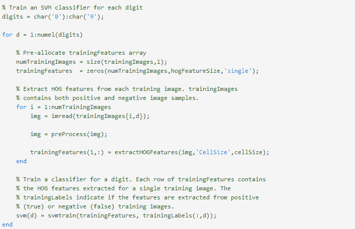

# 【Matlab 机器学习】之图像识别

> 原文：[`mp.weixin.qq.com/s?__biz=MzAxNTc0Mjg0Mg==&mid=2653282814&idx=1&sn=f1224ea30942468ee39aa96d6ea0dd8f&chksm=802e23ebb759aafd42bb6ad321e3bc5e8252b4de64070bb2c0bf7900bf8b2acc1fa3aef0d5b6&scene=27#wechat_redirect`](http://mp.weixin.qq.com/s?__biz=MzAxNTc0Mjg0Mg==&mid=2653282814&idx=1&sn=f1224ea30942468ee39aa96d6ea0dd8f&chksm=802e23ebb759aafd42bb6ad321e3bc5e8252b4de64070bb2c0bf7900bf8b2acc1fa3aef0d5b6&scene=27#wechat_redirect)

> ********查看之前文章请点击右上角********，关注并且******查看历史消息******，谢谢您的支持！********

**1.Classification in the Presence of Missing Data**

**2.Handwriting Recognition Using Bagged Classification Trees**

**【代码及其数据点击阅读原文下载】**

目标分类是一个重要的任务，在许多计算机视觉应用，包括监控、汽车安全、和图像检索。例如，在汽车安全应用程序，您可能需要将附近的物体，如行人或车辆。无论对象的分类类型，创建对象分类的基本程序是：

*   <trans data-src="Acquire a labeled data set with images of the desired object." data-dst="获得一个标记的数据集所需的对象的图像。" style="box-sizing: border-box; background: transparent;">获得一个标记的数据集所需的对象的图像。</trans>

*   <trans data-src="Partition the data set into a training set and a test set." data-dst="分区数据集分成训练集和测试集。" style="box-sizing: border-box; background: transparent;">分区数据集分成训练集和测试集。</trans>

*   <trans data-src="Train the classifier using features extracted from the training set." data-dst="训练分类器使用从训练集的特征提取。" style="box-sizing: border-box;">训练分类器使用从训练集的特征提取。</trans>

*   <trans data-src="Test the classifier using features extracted from the test set." data-dst="测试使用的测试集的分类特征提取。" style="box-sizing: border-box;">测试使用的测试集的分类特征提取。</trans>

**Digit Data Set**

For training, synthetic images are created using the insertText function from the Computer Vision System Toolbox™. The training images each contain a digit surrounded by other digits, which mimics how digits are normally seen together. Using synthetic images is convenient and it enables the creation of a variety of training samples without having to manually collect them. For testing, scans of handwritten digits are used to validate how well the classifier performs on data that is different than the synthetic training data. Although this is not the most representative data set, there is enough data to train and test a classifier, and show the feasibility of the approach.

trainingImages is a 200-by-10 cell array of training image file names; each column contains both the positive and negative training images for a digit. trainingLabels is a 200-by-10 matrix containing a label for each image in the trainingImage cell array. The labels are logical values indicating whether or not the image is a positive instance or a negative instance for a digit. testImages is a 12-by-10 cell array containing the image file names of the handwritten digit images. There are 12 examples per digit.

Note that prior to training and testing a classifier the following pre-processing step is applied to images from this dataset:

This pre-processing step removes noise artifacts introduced while collecting the image samples and helps provide better feature vectors for training the classifier. For example, the output of this pre-processing step on a couple of training and test images is shown next:

**Using HOG Features**

The data used to train the SVM classifier are HOG feature vectors extracted from the training images. Therefore, it is important to make sure the HOG feature vector encodes the right amount of information about the object. The extractHOGFeatures function returns a visualization output that can help form some intuition about just what the "right amount of information" means. By varying the HOG cell size parameter and visualizing the result, you can see the effect the cell size parameter has on the amount of shape information encoded in the feature vector:

The visualization shows that a cell size of [8 8] does not encode much shape information, while a cell size of [2 2] encodes a lot of shape information but increases the dimensionality of the HOG feature vector significantly. A good compromise is a 4-by-4 cell size. This size setting encodes enough spatial information to visually identify a digit shape while limiting the number of dimensions in the HOG feature vector, which helps speed up training. In practice, the HOG parameters should be varied with repeated classifier training and testing to identify the optimal parameter settings.

**Train the Classifier**

Digit classification is a multi-class classification problem, where you have to classify an object into one out of the ten possible digit classes. The SVM algorithm in the Statistics and Machine Learning Toolbox™, however, produces a binary classifier, which means that it is able to classify an object into one of two classes. In order to use a binary SVM for digit classification, 10 such classifiers are required; each one trained for a specific digit. This is a common technique used to solve multi-class classification problems with binary classifiers and is known as "one-versus-all" or "one-versus-rest" classification.

**Test the Classifier**

Now the SVM classifiers can be tested using the handwritten digit images shown earlier.

**Results**

**** 

The columns of the table contain the classification results for each SVM classifier. Ideally, the table would be a diagonal matrix, where each diagonal element equals the number of images per digit (12 in this example). Based on this data set, digit 1, 2, 3, and 4 are easier to recognize compared to digit 6, where there are many false positives. Using more representative data sets like MNIST [2] or SVHN [3], which contain thousands of handwritten characters, is likely to produce a better classifier compared with the one created using this example data set.

**Summary**

This example illustrated the basic procedure for creating an object classifier using the extractHOGfeatures function from the Computer Vision System Toolbox and the svmclassify and svmtrain functions from the Statistics and Machine Learning Toolbox™. Although HOG features and SVM classifiers were used here, other features and machine learning algorithms can be used in the same way. For instance, you can explore using different feature types for training the classifier; or you can see the effect of using other machine learning algorithms available in the Statistics and Machine Learning Toolbox™ such as k-nearest neighbors.

**Appendix - Helper functions**

**** 

* * *

This example shows how to recognize handwritten digits using an ensemble of bagged classification trees. Images of handwritten digits are first used to train a single classification tree and then an ensemble of 200 decision trees. The classification performance of each is compared to one another using a confusion matrix.

**Load Training and Test Data**

**** 

**Visualize Six Random Handwritten Samples**

**** 

## **Randomly Partition the Data into Training and Validation Sets**

**** 

## **Train and Predict Using a Single Classification Tree**

**** 

## **Train and Predict Using Bagged Decision Trees**

**** 

## **Compare Confusion Matrices**

**** 

**【过往文章】**

1.[【机器学习课程】深度学习与神经网络系列之绪论介绍](http://mp.weixin.qq.com/s?__biz=MzAxNTc0Mjg0Mg==&mid=404690945&idx=1&sn=39ae29caade4b2fac87304d5091ecfc0&scene=21#wechat_redirect)

2.[【Python 机器学习】系列之线性回归篇【深度详细】](http://mp.weixin.qq.com/s?__biz=MzAxNTc0Mjg0Mg==&mid=405488375&idx=1&sn=e06859f0d3cf5102946bd1551d80184a&scene=21#wechat_redirect)

3.[多因子策略系列（一）——因子回溯测试的总体框架](http://mp.weixin.qq.com/s?__biz=MzAxNTc0Mjg0Mg==&mid=404506736&idx=1&sn=20737eb5d6d9ab45a9de576014991db7&scene=21#wechat_redirect)

4.[Python 机器学习：数据拟合与广义线性回归](http://mp.weixin.qq.com/s?__biz=MzAxNTc0Mjg0Mg==&mid=404455727&idx=4&sn=eec006e2fab671f0ac11bdbc8e9299a7&scene=21#wechat_redirect)

5.[【分级基金】之分级 A 的隐含收益率研究分析](http://mp.weixin.qq.com/s?__biz=MzAxNTc0Mjg0Mg==&mid=401876825&idx=1&sn=d2eed5059426af15d1eb60821ccc9bcf&scene=21#wechat_redirect)

6.[【精华干货】Quant 需要哪些 Python 知识](http://mp.weixin.qq.com/s?__biz=MzAxNTc0Mjg0Mg==&mid=405488375&idx=2&sn=bb7bd9d7eadea8ad68f1f404bbb0753a&scene=21#wechat_redirect)

7.[【干货】量化投资国内外很棒的论坛网站](http://mp.weixin.qq.com/s?__biz=MzAxNTc0Mjg0Mg==&mid=404455727&idx=2&sn=11acb86a872c0b4871ac094136903f3d&scene=21#wechat_redirect)

8.[朴素贝叶斯模型(NBM)详解与在 Matlab 和 Python 里的具体应用](http://mp.weixin.qq.com/s?__biz=MzAxNTc0Mjg0Mg==&mid=401834925&idx=1&sn=d56246158c1002b2330a7c26fd401db6&scene=21#wechat_redirect)

9.[机器学习的前期入门汇总](http://mp.weixin.qq.com/s?__biz=MzAxNTc0Mjg0Mg==&mid=404455727&idx=3&sn=d05688effdbb0583031ef9ae98c64387&scene=21#wechat_redirect)

10.[【深度原创研究】分级基金下折全攻略（一）](http://mp.weixin.qq.com/s?__biz=MzAxNTc0Mjg0Mg==&mid=403551881&idx=1&sn=e1ed56f607a0fe187dd7a0cf5178b638&scene=21#wechat_redirect)

11.[【深度原创研究】分级基金下折全攻略（二）](http://mp.weixin.qq.com/s?__biz=MzAxNTc0Mjg0Mg==&mid=403626226&idx=1&sn=4d1f56a6599c92fd6688e5eb5d7d15dc&scene=21#wechat_redirect)

12.[【知识食粮】最新华尔街牛人必读书籍排行](http://mp.weixin.qq.com/s?__biz=MzAxNTc0Mjg0Mg==&mid=401910135&idx=1&sn=43d5eb7549281bb9231a3be831302139&scene=21#wechat_redirect)

13.[通过 MATLAB 处理大数据](http://mp.weixin.qq.com/s?__biz=MzAxNTc0Mjg0Mg==&mid=401910135&idx=2&sn=5289317b5fa1afe4a5a4115520aaa8ac&scene=21#wechat_redirect)

14.[【扎实资料干货分享】Python、研究报告、计量经济学、投资书籍、R 语言等！(Book+Video)](http://mp.weixin.qq.com/s?__biz=MzAxNTc0Mjg0Mg==&mid=2653282744&idx=2&sn=c9e9fbf1fd0cd4efa8bf08b9c5f16d8a&scene=21#wechat_redirect)

15.[机器学习在统计套利中的应用](http://mp.weixin.qq.com/s?__biz=MzAxNTc0Mjg0Mg==&mid=2653282744&idx=3&sn=85d30593998974cfaf714ac0cf81f8cd&scene=21#wechat_redirect)

16.[量化投资修行之路](http://mp.weixin.qq.com/s?__biz=MzAxNTc0Mjg0Mg==&mid=2653282744&idx=4&sn=0ff993c537b4b1689967f1560dfd45be&scene=21#wechat_redirect)

17.[统计套利在股指期货跨期套利中的应用：基于协整方法的估计](http://mp.weixin.qq.com/s?__biz=MzAxNTc0Mjg0Mg==&mid=405625337&idx=3&sn=60d19beefab3a1636554b216a9b05742&scene=21#wechat_redirect)

18.[股指期货跨品种套利交易](http://mp.weixin.qq.com/s?__biz=MzAxNTc0Mjg0Mg==&mid=405625337&idx=2&sn=e136d7bb6542789fa12f1f90dd206641&scene=21#wechat_redirect)

19.[沪港通股票统计套利：基于 BP 神经网络](http://mp.weixin.qq.com/s?__biz=MzAxNTc0Mjg0Mg==&mid=405625337&idx=1&sn=c7d62703af3e5cdb90f0b1b853f8a483&scene=21#wechat_redirect)

20.[机器学习到底在量化金融里哪些方面有应用？](http://mp.weixin.qq.com/s?__biz=MzAxNTc0Mjg0Mg==&mid=2653282744&idx=1&sn=73db745def6298a1e352c03f51d26d95&scene=21#wechat_redirect)

**量化投资与机器学习**

**知识、能力、深度、专业**

**勤奋、天赋、耐得住寂寞**

**** 

****