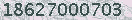
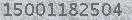
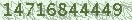
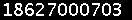
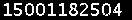
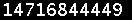

# MATLAB 简易验证码识别程序介绍

> 原文：[`mp.weixin.qq.com/s?__biz=MzAxNTc0Mjg0Mg==&mid=405714354&idx=1&sn=6e4827a2030d446ed0aa0373d1908312&chksm=062577a73152feb12ac5882773852c1cd8e8c70982a5cfc0fc76b3d206802382ef8f46a01cc1&scene=27#wechat_redirect`](http://mp.weixin.qq.com/s?__biz=MzAxNTc0Mjg0Mg==&mid=405714354&idx=1&sn=6e4827a2030d446ed0aa0373d1908312&chksm=062577a73152feb12ac5882773852c1cd8e8c70982a5cfc0fc76b3d206802382ef8f46a01cc1&scene=27#wechat_redirect)

> 谢谢大家的支持！现在该公众号开通了评论留言功能，你们对每篇推文的留言与问题，可以通过【写评论】给圈主留言，圈主会及时回复您的留言。

> ********查看之前文章请点击右上角********，关注并且******查看历史消息******，谢谢您的支持！********

本推文主要识别的验证码是这种:

  

## 第一步: 二值化

所谓二值化就是把不需要的信息通通去除，比如背景，干扰线，干扰像素等等，只剩下需要识别的文字，让图片变成 2 进制点阵。

  

## 第二步: 文字分割

为了能识别出字符，需要对要识别的文字图图片进行分割，把每个字符作为单独的一个图片看待。

          

## 第三步: 标准化

对于部分特殊的验证码，需要对分割后的图片进行标准化处理，也就是说尽量把每个相同的字符都变成一样的格式，减少随机的程度。最简单的比如旋转还原，复杂点的比如扭曲还原等等。比如本文中分割后的数字 1 和 8 宽度不一致，把他们的宽度填充一致，就是标准化的一种。

可以看到上面切割后的字符 1 最右边一列像素都为 0。

## 第四步: 学习 & 识别

这一步可以用很多种方法，最简单的就是模板对比，对每个出现过的字符进行处理后把点阵变成字符串，标明是什么字符后，通过字符串对比来判断相似度。

在文章的后半部分会详细解释我采用的算法。

## 训练集学习 tran.m

```py
width = 132; height = 20;

%共 10 张验证码 x 11 个数字 共分割出 110 张字符图片
%每个字符图片 高度 20 x 宽度 9 共 180 个像素
data = zeros(110, 180);

chars = zeros(180, 10);     %用于存储 10 个数字字符的特征值 每个字符大小为 20x9

for name = 0:9
    im = imread(sprintf('%d.jpg', name));    %读取图片
    im = im2bw(im) == 0;                     %第一步：二值化 黑色 1 白色 0

    %第二步： 分割
    black = sum(im) ~= 0;    %20x132 矩阵 从上向下求和为 1x132  不等于 0 则横坐标对应的一列有字符像素
    white = sum(im) == 0;    %20x132 矩阵 从上向下求和为 1x132  等于 0 则横坐标对应的一列没有字符像素

    lower = find(min([black 0],[1 white]));     %获取 11 个字符的开始下标
    upper = find(min([0 black],[white 1])) - 1; %获取 11 个字符的结束下标

    for i=1:11
        ch = im(:,lower(i):upper(i));   %截取单个字符
        ch(20, 9) = 0;                  %第三步： 字符二值化矩阵大小标准化为 20x9
        data(name*11 + i ,:) = ch(:);   %字符图片数据存入 data
    end
end

%第四步： 学习 & 识别
class = clusterdata(data, 10);   %将 110 个字符图片分为 10 类

%各个分类号对应的实际数字（人工识别后写进去的- -）
num  = [5 3 6 8 9 0 7 2 1 4];

for i = 1:10
    %各类中的字符图片取均值
    im = mean(data(class == i, :)) > 0.5;  
    chars(:, num(i) + 1) = im; %存储
end
```

## 验证码识别 ocr.m

```py
function ret = ocr(filename)
    load;
    ret = zeros(1, 11);
    im = imread(filename);
    im = im2bw(im) == 0;        %第一步： 二值化

    %第二步： 分割
    black = sum(im) ~= 0;
    white = sum(im) == 0;

    lower = find(min([black 0],[1 white]));
    upper = find(min([0 black],[white 1])) - 1;

    for i=1:11
        ch = im(:,lower(i):upper(i));
        ch = ch(:);
        ch(180) = 0;    %第三步标准化

        %第四步： 识别
        [~, num] = max(sum(min(repmat(ch, 1, 10), chars)));
        ret(i) = num-1;
    end
end
```

过往文章

1.[【机器学习课程】深度学习与神经网络系列之绪论介绍](http://mp.weixin.qq.com/s?__biz=MzAxNTc0Mjg0Mg==&mid=404690945&idx=1&sn=39ae29caade4b2fac87304d5091ecfc0&scene=21#wechat_redirect)

2.[【Python 机器学习】系列之线性回归篇【深度详细】](http://mp.weixin.qq.com/s?__biz=MzAxNTc0Mjg0Mg==&mid=405488375&idx=1&sn=e06859f0d3cf5102946bd1551d80184a&scene=21#wechat_redirect)

3.[多因子策略系列（一）——因子回溯测试的总体框架](http://mp.weixin.qq.com/s?__biz=MzAxNTc0Mjg0Mg==&mid=404506736&idx=1&sn=20737eb5d6d9ab45a9de576014991db7&scene=21#wechat_redirect)

4.[Python 机器学习：数据拟合与广义线性回归](http://mp.weixin.qq.com/s?__biz=MzAxNTc0Mjg0Mg==&mid=404455727&idx=4&sn=eec006e2fab671f0ac11bdbc8e9299a7&scene=21#wechat_redirect)

5.[【分级基金】之分级 A 的隐含收益率研究分析](http://mp.weixin.qq.com/s?__biz=MzAxNTc0Mjg0Mg==&mid=401876825&idx=1&sn=d2eed5059426af15d1eb60821ccc9bcf&scene=21#wechat_redirect)

6.[【精华干货】Quant 需要哪些 Python 知识](http://mp.weixin.qq.com/s?__biz=MzAxNTc0Mjg0Mg==&mid=405488375&idx=2&sn=bb7bd9d7eadea8ad68f1f404bbb0753a&scene=21#wechat_redirect)

7.[【干货】量化投资国内外很棒的论坛网站](http://mp.weixin.qq.com/s?__biz=MzAxNTc0Mjg0Mg==&mid=404455727&idx=2&sn=11acb86a872c0b4871ac094136903f3d&scene=21#wechat_redirect)

8.[朴素贝叶斯模型(NBM)详解与在 Matlab 和 Python 里的具体应用](http://mp.weixin.qq.com/s?__biz=MzAxNTc0Mjg0Mg==&mid=401834925&idx=1&sn=d56246158c1002b2330a7c26fd401db6&scene=21#wechat_redirect)

9.[机器学习的前期入门汇总](http://mp.weixin.qq.com/s?__biz=MzAxNTc0Mjg0Mg==&mid=404455727&idx=3&sn=d05688effdbb0583031ef9ae98c64387&scene=21#wechat_redirect)

10.[【深度原创研究】分级基金下折全攻略（一）](http://mp.weixin.qq.com/s?__biz=MzAxNTc0Mjg0Mg==&mid=403551881&idx=1&sn=e1ed56f607a0fe187dd7a0cf5178b638&scene=21#wechat_redirect)

11.[【深度原创研究】分级基金下折全攻略（二）](http://mp.weixin.qq.com/s?__biz=MzAxNTc0Mjg0Mg==&mid=403626226&idx=1&sn=4d1f56a6599c92fd6688e5eb5d7d15dc&scene=21#wechat_redirect)

12.[【知识食粮】最新华尔街牛人必读书籍排行](http://mp.weixin.qq.com/s?__biz=MzAxNTc0Mjg0Mg==&mid=401910135&idx=1&sn=43d5eb7549281bb9231a3be831302139&scene=21#wechat_redirect)

13.[通过 MATLAB 处理大数据](http://mp.weixin.qq.com/s?__biz=MzAxNTc0Mjg0Mg==&mid=401910135&idx=2&sn=5289317b5fa1afe4a5a4115520aaa8ac&scene=21#wechat_redirect)

**量化投资与机器学习**

**知识、能力、深度、专业**

**勤奋、天赋、耐得住寂寞**

**** 

****