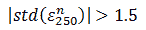
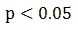
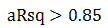

# 沪港通股票统计套利：基于 BP 神经网络

> 原文：[`mp.weixin.qq.com/s?__biz=MzAxNTc0Mjg0Mg==&mid=405625337&idx=1&sn=c7d62703af3e5cdb90f0b1b853f8a483&chksm=06269bec315112fa39bc90c4c7ffef2527e089aaa60b8fd76f3a4412fd8d4d58f9a9fb6fa13b&scene=27#wechat_redirect`](http://mp.weixin.qq.com/s?__biz=MzAxNTc0Mjg0Mg==&mid=405625337&idx=1&sn=c7d62703af3e5cdb90f0b1b853f8a483&chksm=06269bec315112fa39bc90c4c7ffef2527e089aaa60b8fd76f3a4412fd8d4d58f9a9fb6fa13b&scene=27#wechat_redirect)

> 谢谢大家的支持！现在该公众号开通了评论留言功能，你们对每篇推文的留言与问题，可以通过【写评论】给圈主留言，圈主会及时回复您的留言。

> ********查看之前文章请点击右上角********，关注并且******查看历史消息******，谢谢您的支持！********

一、理论介绍

**1.基础策略－统计套利**

统计套利是根据对历史数据的统计来指导投资，是一种基于模型的中短期投资策略，使用量化分析方法挖掘投资机会。使用配对交易（统计套利方法之一）是利用标的对相对价差获取收益，在市场相对稳定情况，标价差理论上也是稳定的，可以对冲大部分市场趋势变动的风险。

统计套利一般步骤：首先通过相关系数和平稳检验，选出股池可能具有稳定价格关系的投资对；其次，通过 EG 协整回归确定有稳定价格关系的投资对；最后，在存在稳定股票对中，筛选有价差偏离现象的投资对。

配对交易的收益情况：设有 Yt，Xt 价格序列，两者已通过相关和平稳筛选，对应协整方程为：

 

移项：

** 当处于投资时点 i 时，若标准化后正向偏离(，是设置的开仓阈值)，认为残差（即价差）将会回复，进行卖空 1 单位的 Yt，价格为 Yi；买入单位的 Xt，价格为 Xi，构造股票对。当到平仓时点 j，获得收益（或亏损）为：

 

若负向偏离，反向操作。

在使用上述统计套利方式进行投资时，价差偏离回复需要的时间和空间是未知的，如果在投资时能对价差序列实现预测，就可以提前确定套利的利润；此外，协整的残差序列（即价差）具有自相关性。基于以上，本文将价差序列的自相关性作为预测的理论基础，采用神经网络算法对价差实现预测，进而优化基础策略。

**2\. 优化策略－BP 神经网络算法**

神经网络（ANNs）算法使用领域十分广泛，它是智能科学和计算智能的重要部分，以脑科学和认知神经科学的研究成果为基础，拓展智能信息处理的方法，为解决复杂问题和智能控制提供有效的途径。简单来说，神经网络是一个数学模型，模型中有多个信息处理器（网络层和神经元），随着输入的信，动态调整模型的权重和阈值，最终形成输出。

神经网络模型的内含数学公式： 

 

二、 港股通介绍和数据预处理

沪港通全称沪港股票市场交易互联互通机制，指两地投资者委托上交所会员或者联交所参与者，通过上交所或者联交所在对方所在地设立的证券交易服务公司，买卖规定范围内的对方交易所上市股票。沪港通包括沪股通和港股通两部分，从 2014 年 11 月开通至今，市场活跃度逐渐提高。本策略模型选取港股通标的作为研究范围，有以下两方面考虑：1.股票市场投资标的多，出现有投资可能性的投资对更多 2.统计套利依赖于完善的做空机制，港股通的做空条件相对于内地上市股票更加成熟。

截止 2016 年 3 月，港股通有港股 294 支，选取 2013.4-2016.3 的收盘价数据作为研究范围。对数据进行预处理，将有空缺数据和涨跌幅异常（单日涨跌>30%）的港股剔除，最终得到 558 个交易日收盘价＊250 支股的数据阵。

三、 实证思路以及分析

本文策略为得到仿真的投资结果，对数据阵施行滚动回测的方式：以 250 个交易日数据为一个周期，确定投资标的对，并规定每次确定的标的，最长持仓时间为 5 个交易日，则将 558 交易日分为 60 个投资阶段((558-250)/5，向下取整，最后 8 个交易日去除)，下面以第一个阶段（1～250），进行步骤说明：

1.对 250 交易日*250 支股价格序列进行相关系数的初步筛选，保留相关系数大于 0.9，p 值检验小于 0.01 的股对；

2.平稳性检验，对每对中的两只股票都进行平稳性检验和一阶差分平稳检验，保留两只股票属于同阶单整，且一阶单整平稳性检验 p 值小于 0.01 的股对，平稳检验使用 ADF 法，其中一对股对平稳检验结果如下：

| 股票代码 | ADF 检验值 | ADF 显著性 | 一阶差分 ADF 检验 | 一阶差分 ADF 显著性 |
| 0001.HK | 0.8948 | 0.9006 | -15.3658 | 0.001  |
| 0008.HK | 0.7905 | 0.8825 | -16.2956 | 0.001 |

由表知此对股票原序列非稳定，但都是一阶单整符合，筛选条件。

3.协整检验，对股票对进行协整回归，确定存在长期稳定的标的；保留调整后 R2>0.85，F 统计量的 p 值小于 0.05，回归系数介于［0.5，2］，截距绝对值小于 5，DW 值>3 或 DW 值<1 的股对；下表是其中一对股的协整检验结果)：

| 协整系数 | 截距 | F 统计量 | P-value  | Adj-R2  | D.W.  |
| 0.048 | -1.58 | 1398.82 | 0 | 0.85 | 0.099 |

对应协整方程：

       由表知，此对股票协整结果符合筛选条件。此外，此一步还计算投资决策日的价差序列（标准化后），以价差偏离值的绝对值大于 1.5 标准筛选，即 

4\. BP 神经网络价差预测；依次使用剩余股对的价差序列，训练神经网路，并实现 5 个交易日价差的预测值。下图是其中一序列预测值与实际值（未标准化）的比较，可以看出预测值和实际有共同趋势且接近，有较好预测效果。

       此步保留股票对的依据是预测的均值回复值（标准化后）与投资决策日的价差（标准化后）差值大于 1。即

       上图价差预测值在图中自投资节点开始有明显均值回复现象，符合筛选条件。

5.平仓设置和回测，设置最长持仓为 5 个交易日，与价差进一步扩大的平仓阈值 0.5 的平仓条件，即：

 
       为构建拟真的投资环境，依据协整系数值，使用第 250 天收盘价开仓；用第 250 个时点之后的 5 个收盘价（251～255）数据，计算收益（或损失）直到达到平仓条件。最终第一个投资阶段（1～255）的收益情况如下：（交易费用率设为千分三，做空保证金 50%）

| 资金 | 79.1264 | 收益 | 1.9005 | 手续费后 | 1.2580 | 收益率：1.59% |

以上，已经对第一个投资计算阶段进行了说明。对整个数据矩阵进行完整回测，需要进行 60 次以上步骤的循环，以对模型整体效果形成评价。对以上开平仓条件归纳，开仓筛选条件：

| 相关系数 | 单只股票检验结果 | 单只股票检验结果 | 预测回复水平包括回复次数 |
| r>0.9  | P<0.01  | P>0.01  | P<0.01  |   |
| 协整方程整体显著 | 协整方程拟合程度 | 协整方程值 | 协整系数 | 协整截距 | 价差偏离 |
|   |   |   |   |   |   |

平仓条件：

 

四、 结果分析与启示

下面对整个时间段的数据，进行回测，参数选择不变，增加每次投资持股数量不超过 15 对的限制，约 1.5591 年，得到结果和香港恒生指数同一时间段的收益率做对比，图表如下：

|   | 最后净收益 | 收益率 | 年化收益 | 最大回撤 | 最大回测率 | 风险收益比 |
| 未考虑交易费用 | 23.1546 | 27.78% | 17.82% | 5.7726 | 0.2791 | 2.5727 |
| 考虑交易费用 | 15.8167 | 18.98% | 12.17% | 6.0307 | 0.5305 | 1.6822 |

由结果图表，本次构建的量化模型即使在引入手续费后，也得到了优良的回测收益，同期的恒生指数，收益率 -17.04%；而本文所构建的模型，也能达到正的年化收益率后 17.82%；模型的风险与收益比 1.6822，一份风险对应 1.6822 的收益；策略较高的回撤率较高，为 0.5305。

策略的优点，一，使用的标的范围广，资金不会出现闲置，二，引入了 BP 网络算法对统计套利实现优化，提高模型的准确性。但模型也存在以下的不足：一，对于网络的优化，相应的参数和函数选择相对固定，应该针对每一价差序列的每一次拟合，均实现网络参数的优化；二，预处理删除了一些可能存在收益（损失）的标的股；三，构建的模型在市场大牛或大熊时，收益率走向均向下。

        综上，基于 BP 神经网络的统计套利是可以帮助投资者在震荡行情获得超额收益，但在市场单边上涨或下降时，要注意防范风险。

过往文章

1.[【机器学习课程】深度学习与神经网络系列之绪论介绍](http://mp.weixin.qq.com/s?__biz=MzAxNTc0Mjg0Mg==&mid=404690945&idx=1&sn=39ae29caade4b2fac87304d5091ecfc0&scene=21#wechat_redirect)

2.[【Python 机器学习】系列之线性回归篇【深度详细】](http://mp.weixin.qq.com/s?__biz=MzAxNTc0Mjg0Mg==&mid=405488375&idx=1&sn=e06859f0d3cf5102946bd1551d80184a&scene=21#wechat_redirect)

3.[多因子策略系列（一）——因子回溯测试的总体框架](http://mp.weixin.qq.com/s?__biz=MzAxNTc0Mjg0Mg==&mid=404506736&idx=1&sn=20737eb5d6d9ab45a9de576014991db7&scene=21#wechat_redirect)

4.[Python 机器学习：数据拟合与广义线性回归](http://mp.weixin.qq.com/s?__biz=MzAxNTc0Mjg0Mg==&mid=404455727&idx=4&sn=eec006e2fab671f0ac11bdbc8e9299a7&scene=21#wechat_redirect)

5.[【分级基金】之分级 A 的隐含收益率研究分析](http://mp.weixin.qq.com/s?__biz=MzAxNTc0Mjg0Mg==&mid=401876825&idx=1&sn=d2eed5059426af15d1eb60821ccc9bcf&scene=21#wechat_redirect)

6.[Python VS Matlab----给我一个理由先](http://mp.weixin.qq.com/s?__biz=MzAxNTc0Mjg0Mg==&mid=401782053&idx=1&sn=27a92490e9ef9ffec72906d27e2e268a&scene=21#wechat_redirect)

7.[【干货】量化投资国内外很棒的论坛网站](http://mp.weixin.qq.com/s?__biz=MzAxNTc0Mjg0Mg==&mid=404455727&idx=2&sn=11acb86a872c0b4871ac094136903f3d&scene=21#wechat_redirect)

8.[朴素贝叶斯模型(NBM)详解与在 Matlab 和 Python 里的具体应用](http://mp.weixin.qq.com/s?__biz=MzAxNTc0Mjg0Mg==&mid=401834925&idx=1&sn=d56246158c1002b2330a7c26fd401db6&scene=21#wechat_redirect)

9.[机器学习的前期入门汇总](http://mp.weixin.qq.com/s?__biz=MzAxNTc0Mjg0Mg==&mid=404455727&idx=3&sn=d05688effdbb0583031ef9ae98c64387&scene=21#wechat_redirect)

10.[【深度原创研究】分级基金下折全攻略（一）](http://mp.weixin.qq.com/s?__biz=MzAxNTc0Mjg0Mg==&mid=403551881&idx=1&sn=e1ed56f607a0fe187dd7a0cf5178b638&scene=21#wechat_redirect)

11.[【深度原创研究】分级基金下折全攻略（二）](http://mp.weixin.qq.com/s?__biz=MzAxNTc0Mjg0Mg==&mid=403626226&idx=1&sn=4d1f56a6599c92fd6688e5eb5d7d15dc&scene=21#wechat_redirect)

12.[【知识食粮】最新华尔街牛人必读书籍排行](http://mp.weixin.qq.com/s?__biz=MzAxNTc0Mjg0Mg==&mid=401910135&idx=1&sn=43d5eb7549281bb9231a3be831302139&scene=21#wechat_redirect)

13.[通过 MATLAB 处理大数据](http://mp.weixin.qq.com/s?__biz=MzAxNTc0Mjg0Mg==&mid=401910135&idx=2&sn=5289317b5fa1afe4a5a4115520aaa8ac&scene=21#wechat_redirect)

**量化投资与机器学习**

**知识、能力、深度、专业**

**勤奋、天赋、耐得住寂寞**

**** 

****