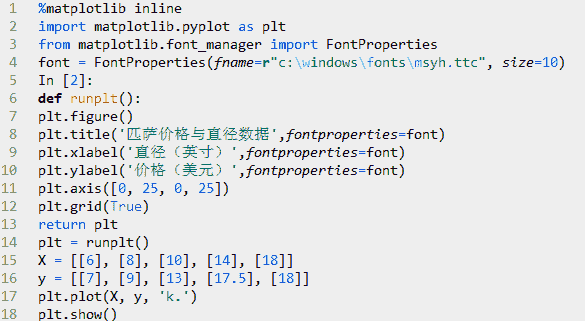
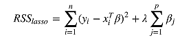

# 【Python 机器学习】系列之线性回归篇【深度详细】

> 原文：[`mp.weixin.qq.com/s?__biz=MzAxNTc0Mjg0Mg==&mid=405488375&idx=1&sn=e06859f0d3cf5102946bd1551d80184a&chksm=062080e2315709f497f4db4e3f848b0023cb9151d0036ae4dbd4ff5c8e3c265ae876601cc098&scene=27#wechat_redirect`](http://mp.weixin.qq.com/s?__biz=MzAxNTc0Mjg0Mg==&mid=405488375&idx=1&sn=e06859f0d3cf5102946bd1551d80184a&chksm=062080e2315709f497f4db4e3f848b0023cb9151d0036ae4dbd4ff5c8e3c265ae876601cc098&scene=27#wechat_redirect)

> 谢谢大家的支持！现在该公众号开通了评论留言功能，你们对每篇推文的留言与问题，可以通过【写评论】给圈主留言，圈主会及时回复您的留言。

> ********查看之前文章请点击右上角********，关注并且******查看历史消息******，谢谢您的支持！********

> 本次推文介绍用线性模型处理回归问题。从简单问题开始，先处理一个响应变量和一个解释变量的一元问题。然后，介绍多元线性回归问题（multiple linear regression），线性约束由多个解释变量构成。紧接着，介绍多项式回归分析（polynomial regression 问题），一种具有非线性关系的多元线性回归问题。最后，介绍如果训练模型获取目标函数最小化的参数值。在研究一个大数据集问题之前，先从一个小问题开始学习建立模型和学习算法

*   **一元线性回归**

    假设你想计算匹萨的价格。虽然看看菜单就知道了，不过也可以用机器学习方法建一个线性回归模型，通过分析匹萨的直径与价格的数据的线性关系，来预测任意直径匹萨的价格。先用 scikitlearn 写出回归模型，然后介绍模型的用法，以及将模型应用到具体问题中。假设我们查到了部分匹萨的直径与价格的数据，这就构成了训练数据，如下表所示：

可以用 matplotlib 画出图形：

上图中，'x'轴表示匹萨直径，'y'轴表示匹萨价格。能够看出，匹萨价格与其直径正相关，这与我们的日常经验也比较吻合，自然是越大越贵。下面就用 scikit-learn 来构建模。

预测一张 12 英寸匹萨价格：$13.68。

一元线性回归假设解释变量和响应变量之间存在线性关系；这个线性模型所构成的空间是一个超平面（hyperplane）。超平面是 n 维欧氏空间中余维度等于一的线性子空间，如平面中的直线、空间中的平面等，总比包含它的空间少一维。在一元线性回归中，一个维度是响应变量，另一个维度是解释变量，总共两维。因此，其超平面只有一维，就是一条线。

上述代码中 sklearn.linear_model.LinearRegression 类是一个估计器（estimator）。估计器依据观测值来预测结果。在 scikit-learn 里面，所有的估计器都带有 fit()和 predict()方法。fit()用来分析模型参数，predict()是通过 fit()算出的模型参数构成的模型，对解释变量进行预测获得的值。因为所有的估计器都有这两种方法，所有 scikit-learn 很容易实验不同的模型。LinearRegression 类的 fit()方法学习下面的一元线性回归模型：

 

y 表示响应变量的预测值，本例指匹萨价格预测值， 是解释变量，本例指匹萨直径。截距和相关系数 是线性回归模型最关心的事情.下图中的直线就是匹萨直径与价格的线性关系。用这个模型，可以计算不同直径的价格，8 英寸$7.33，20 英寸$18.75。

一元线性回归拟合模型的参数估计常用方法是普通最小二乘法（ordinary least squares ）或线性最小二乘法（linear least squares）。首先，我们定义出拟合成本函数，然后对参数进行数理统计。

*   **带成本函数的模型拟合评估**

下图是由若干参数生成的回归直线。如何判断哪一条直线才是最佳拟合呢？

成本函数（cost function）也叫损失函数（loss function），用来定义模型与观测值的误差。模型预测的价格与训练集数据的差异称为残差（residuals）或训练误差（training errors）。后面会用模型计算测试集，那时模型预测的价格与测试集数据的差异称为预测误差（prediction errors）或训练误差（test errors）。

模型的残差是训练样本点与线性回归模型的纵向距离，如下图所示：

我们可以通过残差之和最小化实现最佳拟合，也就是说模型预测的值与训练集的数据最接近就是最佳拟合。对模型的拟合度进行评估的函数称为残差平方和（residual sum of squares）成本函数。就是让所有训练数据与模型的残差的平方之和最小化，如下所示：

其中， 是观测值， 是预测值。残差平方和计算如下：

*   **解一元线性回归的最小二乘法**

通过成本函数最小化获得参数，先求相关系数贝塔。按照频率论的观点，首先需要计算 x 的方差和 x 与 y 的协方差。

方差是用来衡量样本分散程度的。如果样本全部相等，那么方差为 0。方差越小，表示样本越集中，反正则样本越分散。方差计算公式如下：

Numpy 里面有 var 方法可以直接计算方差，ddof 参数是贝塞尔(无偏估计)校正系数（Bessel'scorrection），设置为 1，可得样本方差无偏估计量。

协方差表示两个变量的总体的变化趋势。如果两个变量的变化趋势一致，也就是说如果其中一个大于自身的期望值，另外一个也大于自身的期望值，那么两个变量之间的协方差就是正值。 如果两个变量的变化趋势相反，即其中一个大于自身的期望值，另外一个却小于自身的期望值，那么两个变量之间的协方差就是负值。如果两个变量不相关，则协方差为 0，变量线性无关不表示一定没有其他相关

性。协方差公式如下：

现在有了方差和协方差，就可以计算相关系统贝塔了。

算出贝塔后，就可以计算阿尔法了：

将前面的数据带入公式就可以求出阿尔法了：

α = 12.9 − 0.9762931034482758 × 11.2 = 1.9655172413793114

这样就通过最小化成本函数求出模型参数了。把匹萨直径带入方程就可以求出对应的价格了，如 11 英寸直径价格$12.70，18 英寸直径价格$19.54。

*   **模型评估**

前面用学习算法对训练集进行估计，得出了模型的参数。如何评价模型在现实中的表现呢？现在假设有另一组数据，作为测试集进行评估。

有些度量方法可以用来评估预测效果，我们用 R 方（r-squared）评估匹萨价格预测的效果。R 方也叫确定系数（coefficient of determination），表示模型对现实数据拟合的程度。计算 R 方的方法有几种。一元线性回归中 R 方等于皮尔逊积矩相关系数（Pearson product moment correlation coefficient 或 Pearson's r）的平方。

这种方法计算的 R 方一定介于 0～1 之间的正数。其他计算方法，包括 scikit-learn 中的方法，不是用皮尔逊积矩相关系数的平方计算的，因此当模型拟合效果很差的时候 R 方会是负值。下面用 scikitlearn 方法来计算 R 方。

**** 

=56.8

然后，计算残差平方和，和前面的一样：

最后用下面的公式计算 R 方：

 

R 方是 0.6620 说明测试集里面过半数的价格都可以通过模型解释。现在，用 scikit-learn 来验证一下。LinearRegression 的 score 方法可以计算 R 方：

*   **多元线性回归**

可以看出匹萨价格预测的模型 R 方值并不显著。如何改进呢？

匹萨的价格其实还会受到其他因素的影响。比如，匹萨的价格还与上面的辅料有关。让我们再为模型增加一个解释变量。用一元线性回归已经无法解决了，我们可以用更具一般性的模型来表示，即多元线性回归。

写成矩阵形式如下：

一元线性回归可以写成如下形式：

 

其中，Y 是训练集的响应变量列向量，贝塔是模型参数列向量。X 称为设计矩阵，是 m*n 维训练集的解释变量矩阵。m 是训练集样本数量，n 是解释变量个数。增加辅料的匹萨价格预测模型训练集如下表所示：

同时要升级测试集数据：

学习算法评估三个参数的值：两个相关因子和一个截距。 的求解方法可以通过矩阵运算来实现。

 

矩阵没有除法运算，所以用矩阵的转置运算和逆运算来实现：

通过 Numpy 的矩阵操作就可以完成：

 

[[ 1.1875 ]
[ 1.01041667]
[ 0.39583333]]

有了参数，就来更新价格预测模型：

Predicted: [ 10.06250019], Target: [11]
Predicted: [ 10.28125019], Target: [8.5]
Predicted: [ 13.09375019], Target: [15]
Predicted: [ 18.14583353], Target: [18]
Predicted: [ 13.31250019], Target: [11]
R-squared: 0.77

增加解释变量让模型拟合效果更好了。为什么只用一个测试集评估一个模型的效果是不准确的，如何通过将测试集数据分块的方法来测试，让模型的测试效果更可靠。不过现在至少可以认为，匹萨价格预测问题，多元回归确实比一元回归效果更好。假如解释变量和响应变量的关系不是线性的呢？下面来研究一个特别的多元线性回归的情况，可以用来构建非线性关系模型。

*   **多项式回归**  

下面用多项式回归，一种特殊的多元线性回归方法，增加了指数项（ 的次数大于 1）。现实世界中的曲线关系都是通过增加多项式实现的，其实现方式和多元线性回归类似。本例还用一个解释变量，匹萨直径。用下面的数据对两种模型做个比较：

二次回归（Quadratic Regression），即回归方程有个二次项，公式如下：

只用一个解释变量，但是模型有三项，通过第三项（二次项）来实现曲线关系。PolynomialFeatures 转换器可以用来解决这个问题。代码如下：

[[6], [8], [10], [14], [18]]
[[ 1 6 36]
[ 1 8 64]
[ 1 10 100]
[ 1 14 196]
[ 1 18 324]]
[[6], [8], [11], [16]]
[[ 1 6 36]
[ 1 8 64]
[ 1 11 121]
[ 1 16 256]]
一元线性回归 r-squared 0.809726832467

二次回归 r-squared 0.867544458591

效果如上图所示，直线为一元线性回归（R 方 0.81），曲线为二次回归（R 方 0.87），其拟合效果更佳。还有三次回归，就是再增加一个立方项（β3x3 ）。同样方法拟合，效果如下图所示：

[[ 1 6 36 216]
[ 1 8 64 512]
[ 1 10 100 1000]
[ 1 14 196 2744]
[ 1 18 324 5832]]
[[ 1 6 36 216]
[ 1 8 64 512]
[ 1 11 121 1331]
[ 1 16 256 4096]]
二次回归 r-squared 0.867544458591
三次回归 r-squared 0.835692454062

七次回归，效果如下图所示：

二次回归 r-squared 0.867544458591

七次回归 r-squared 0.487942421984

可以看出，七次拟合的 R 方值更低，虽然其图形基本经过了所有的点。可以认为这是拟合过度（overfitting）的情况。这种模型并没有从输入和输出中推导出一般的规律，而是记忆训练集的结果，这样在测试集的测试效果就不好了。

*   **正则化**  

正则化（Regularization）是用来防止拟合过度的一堆方法。正则化向模型中增加信息，经常是一种对抗复杂性的手段。与奥卡姆剃刀原理（Occam's razor）所说的具有最少假设的论点是最好的观点类似。正则化就是用最简单的模型解释数据。

scikit-learn 提供了一些方法来使线性回归模型正则化。其中之一是岭回归(Ridge Regression，RR，也叫 Tikhonov regularization)，通过放弃最小二乘法的无偏性，以损失部分信息、降低精度为代价获得回归系数更为符合实际、更可靠的回归方法。岭回归增加 L2 范数项（相关系数向量平方和的平方根）来调整成本函数（残差平方和）：

scikit-learn 也提供了最小收缩和选择算子(Least absolute shrinkage and selection operator,LASSO)，增加 L1 范数项（相关系数向量平方和的平方根）来调整成本函数（残差平方和）：

LASSO 方法会产生稀疏参数，大多数相关系数会变成 0，模型只会保留一小部分特征。而岭回归还是会保留大多数尽可能小的相关系数。当两个变量相关时，LASSO 方法会让其中一个变量的相关系数会变成 0，而岭回归是将两个系数同时缩小。

scikit-learn 还提供了弹性网（elastic net）正则化方法，通过线性组合 L1 和 L2 兼具 LASSO 和岭回归的内容。可以认为这两种方法是弹性网正则化的特例。

*   **梯度下降法拟合模型**

前面的内容都是通过最小化成本函数来计算参数的：

这里 X 是解释变量矩阵，当变量很多（上万个）的时候， 右边第一项计算量会非常大。另外，如果右边第一项行列式为 0，即奇异矩阵，那么就无法求逆矩阵了。这里我们介绍另一种参数估计的方法，梯度下降法（gradient descent）。拟合的目标并没有变，我们还是用成本函数最小化来进行参数估计。

梯度下降法被比喻成一种方法，一个人蒙着眼睛去找从山坡到溪谷最深处的路。他看不到地形图，所以只能沿着最陡峭的方向一步一步往前走。每一步的大小与地势陡峭的程度成正比。如果地势很陡峭，他就走一大步，因为他相信他仍在高出，还没有错过溪谷的最低点。如果地势比较平坦，他就走一小步。这时如果再走大步，可能会与最低点失之交臂。如果真那样，他就需要改变方向，重新朝着溪谷的最低点前进。他就这样一步一步的走啊走，直到有一个点走不动了，因为路是平的了，于是他卸下眼罩，已经到了谷底深处，小龙女在等他。

通常，梯度下降算法是用来评估函数的局部最小值的。我们前面用的成本函数如下：

 

可以用梯度下降法来找出成本函数最小的模型参数值。梯度下降法会在每一步走完后，计算对应位置的导数，然后沿着梯度（变化最快的方向）相反的方向前进。总是垂直于等高线。

需要注意的是，梯度下降法来找出成本函数的局部最小值。一个三维凸（convex）函数所有点构成的图行像一个碗。碗底就是唯一局部最小值。非凸函数可能有若干个局部最小值，也就是说整个图形看着像是有多个波峰和波谷。梯度下降法只能保证找到的是局部最小值，并非全局最小值。残差平方和构成的成本函数是凸函数，所以梯度下降法可以找到全局最小值。

梯度下降法的一个重要超参数是步长（learning rate），用来控制蒙眼人步子的大小，就是下降幅度。如果步长足够小，那么成本函数每次迭代都会缩小，直到梯度下降法找到了最优参数为止。但是，步长缩小的过程中，计算的时间就会不断增加。如果步长太大，这个人可能会重复越过谷底，也就是梯度下降法可能在最优值附近摇摆不定。

如果按照每次迭代后用于更新模型参数的训练样本数量划分，有两种梯度下降法。批量梯度下降（Batch gradient descent）每次迭代都用所有训练样本。随机梯度下降（Stochastic gradientdescent，SGD）每次迭代都用一个训练样本，这个训练样本是随机选择的。当训练样本较多的时候，随机梯度下降法比批量梯度下降法更快找到最优参数。批量梯度下降法一个训练集只能产生一个结果。而 SGD 每次运行都会产生不同的结果。SGD 也可能找不到最小值，因为升级权重的时候只用一个训练样本。它的近似值通常足够接近最小值，尤其是处理残差平方和这类凸函数的时候。

下面用 scikit-learn 的 SGDRegressor 类来计算模型参数。它可以通过优化不同的成本函数来拟合线性模型，默认成本函数为残差平方和。本例中，我们用波士顿住房数据的 13 个解释变量来预测房屋价格：

 

交叉验证 R 方值: [ 0.64102297 0.65659839 0.80237287 0.67294193 0.57322387]
交叉验证 R 方均值: 0.669232006274
测试集 R 方值: 0.787333341357

*   **总结**

本次推文介绍了三类线性回归模型。首先，通过匹萨价格预测的例子介绍了一元线性回归，一个解释变量和一个响应变量的线性拟合。然后，讨论了多元线性回归，具有更一般形式的若干解释变量和一个响应变量的问题。最后，讨论了多项式回归，一种特殊的多元线性模型，体系了解释变量和响应变量的非线性特征。

目录

[**第 1****章  ****机器学习基础**](http://mp.weixin.qq.com/s?__biz=MzAxNTc0Mjg0Mg==&mid=405186782&idx=2&sn=34cb8d04935fdfd6d24c29d565380b50&scene=21#wechat_redirect)

将机器学习定义成一种通过学习经验改善工作效果的程序研究与设计过程。其他章节都以这个定义为基础，后面每一章里介绍的机器学习模型都是按照这个思路解决任务，评估效果。 

  **第二章  线性回归 **

介绍线性回归模型，一种解释变量和模型参数与连续的响应变量相关的模型。本章介绍成本函数的定义，通过最小二乘法求解模型参数获得最优模型。

  **第三章  ****特征提取与处理 **

介绍了常见的机器学习对象如文本，图像与分类变量的特征提取与处理方法。

  **第四章  ****从线性回归到逻辑回归 **

介绍广义线性回归模型如何解决分类任务。将逻辑回归模型与特征提取技术结合起  来实现一个垃圾短信分类器。

  第 5**章 ****决策树——非线性回归与分类**

介绍了一种回归和分类的非线性模型——决策树。用决策树集成方法实现了一个网页广告图片屏蔽器。

  **第六章  ****K-Means 聚类 **

介绍非监督学习的 K-Means 聚类算法，并与逻辑回归组合起来实现一个照片分类器。

  **第七章  用 PCA 降维 **

介绍另一种非监督学习任务——降维。用主成分分析实现高维数据的可视化，建立一个脸部识别器。

  **第八章  ****感知器**

介绍一种实时的，二元分类器——感知器。后面两章都是针对感知器的缺点发展起来的。

  **第九章  ****从感知器到支持向量机**

介绍支持向量机，是一种有效的非线性回归与分类模型。我们用支持向量机识别街景照片中的字母。

  **第十章  ****从感知器到人工神经网络 **

介绍了人工神经网络，是一种强大的有效的非线性回归与分类模型。我们用人工神经网络识别手写数字。

过往文章

1.[【机器学习课程】深度学习与神经网络系列之绪论介绍](http://mp.weixin.qq.com/s?__biz=MzAxNTc0Mjg0Mg==&mid=404690945&idx=1&sn=39ae29caade4b2fac87304d5091ecfc0&scene=21#wechat_redirect)

2.[大数据之微信公众号深度量化研究](http://mp.weixin.qq.com/s?__biz=MzAxNTc0Mjg0Mg==&mid=404626412&idx=1&sn=502f2a57b8f9b13887c30fb65e39a7f7&scene=21#wechat_redirect)

3.[多因子策略系列（一）——因子回溯测试的总体框架](http://mp.weixin.qq.com/s?__biz=MzAxNTc0Mjg0Mg==&mid=404506736&idx=1&sn=20737eb5d6d9ab45a9de576014991db7&scene=21#wechat_redirect)

4.[Python 机器学习：数据拟合与广义线性回归](http://mp.weixin.qq.com/s?__biz=MzAxNTc0Mjg0Mg==&mid=404455727&idx=4&sn=eec006e2fab671f0ac11bdbc8e9299a7&scene=21#wechat_redirect)

5.[【分级基金】之分级 A 的隐含收益率研究分析](http://mp.weixin.qq.com/s?__biz=MzAxNTc0Mjg0Mg==&mid=401876825&idx=1&sn=d2eed5059426af15d1eb60821ccc9bcf&scene=21#wechat_redirect)

6.[Python VS Matlab----给我一个理由先](http://mp.weixin.qq.com/s?__biz=MzAxNTc0Mjg0Mg==&mid=401782053&idx=1&sn=27a92490e9ef9ffec72906d27e2e268a&scene=21#wechat_redirect)

7.[【干货】量化投资国内外很棒的论坛网站](http://mp.weixin.qq.com/s?__biz=MzAxNTc0Mjg0Mg==&mid=404455727&idx=2&sn=11acb86a872c0b4871ac094136903f3d&scene=21#wechat_redirect)

8.[朴素贝叶斯模型(NBM)详解与在 Matlab 和 Python 里的具体应用](http://mp.weixin.qq.com/s?__biz=MzAxNTc0Mjg0Mg==&mid=401834925&idx=1&sn=d56246158c1002b2330a7c26fd401db6&scene=21#wechat_redirect)

9.[机器学习的前期入门汇总](http://mp.weixin.qq.com/s?__biz=MzAxNTc0Mjg0Mg==&mid=404455727&idx=3&sn=d05688effdbb0583031ef9ae98c64387&scene=21#wechat_redirect)

10.[【深度原创研究】分级基金下折全攻略（一）](http://mp.weixin.qq.com/s?__biz=MzAxNTc0Mjg0Mg==&mid=403551881&idx=1&sn=e1ed56f607a0fe187dd7a0cf5178b638&scene=21#wechat_redirect)

11.[【深度原创研究】分级基金下折全攻略（二）](http://mp.weixin.qq.com/s?__biz=MzAxNTc0Mjg0Mg==&mid=403626226&idx=1&sn=4d1f56a6599c92fd6688e5eb5d7d15dc&scene=21#wechat_redirect)

12.[【知识食粮】最新华尔街牛人必读书籍排行](http://mp.weixin.qq.com/s?__biz=MzAxNTc0Mjg0Mg==&mid=401910135&idx=1&sn=43d5eb7549281bb9231a3be831302139&scene=21#wechat_redirect)

13.[通过 MATLAB 处理大数据](http://mp.weixin.qq.com/s?__biz=MzAxNTc0Mjg0Mg==&mid=401910135&idx=2&sn=5289317b5fa1afe4a5a4115520aaa8ac&scene=21#wechat_redirect)

**量化投资与机器学习**

**知识、能力、深度、专业**

**勤奋、天赋、耐得住寂寞**

**** 

****