# 大数据之微信公众号深度量化研究

> 原文：[`mp.weixin.qq.com/s?__biz=MzAxNTc0Mjg0Mg==&mid=404626412&idx=1&sn=502f2a57b8f9b13887c30fb65e39a7f7&chksm=0615d9f9316250ef94b3b040217437b30636e11433966749b798a72b3538b5f1344cb1f63ede&scene=27#wechat_redirect`](http://mp.weixin.qq.com/s?__biz=MzAxNTc0Mjg0Mg==&mid=404626412&idx=1&sn=502f2a57b8f9b13887c30fb65e39a7f7&chksm=0615d9f9316250ef94b3b040217437b30636e11433966749b798a72b3538b5f1344cb1f63ede&scene=27#wechat_redirect)

> 谢谢大家支持，可以让有兴趣的人关注这个公众号。让知识传播的更加富有活力，谢谢各位读者。
> 
> 很多人问博主为什么每次的头像是奥黛丽赫本，因为她是博主女神，每天看看女神也是不错的嘛！

> ****查看之前文章请点击右上角，关注并且查看历史消息，谢谢您的阅读支持****

> **为何使用微信公众号**

微信公众号相对于其他信息源的主要优势在于其时效性和信息深度。
对于证券行业来说， 主要的大数据来源有财经网站（新浪财经，腾讯财经等），证券网站（东方财富，同花顺等）， 社交网站（微博， 微信等）， 研报   网站（迈博汇金，东财研报等）， 基础数据网站（上交所，深交所，中证登等）

时效性：基础数据网站>社交网站=财经网站=证券网站>研报网站
信息深度： 研报网站>社交网站>财经网站>证券网站>基础数据网站

> **如何提取公众号内容**

**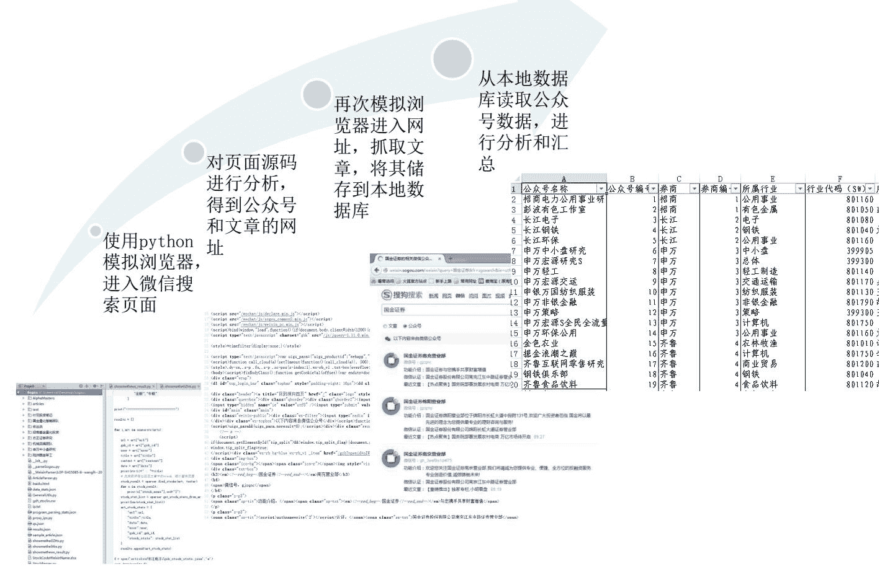** 

微信公众号信息抓取详细流程图

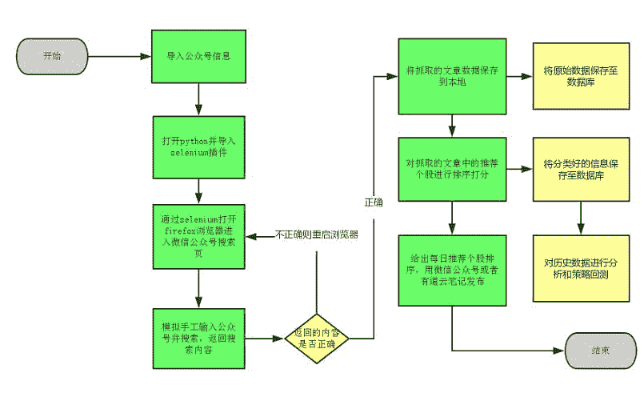 

对同一公众号内的股票排序

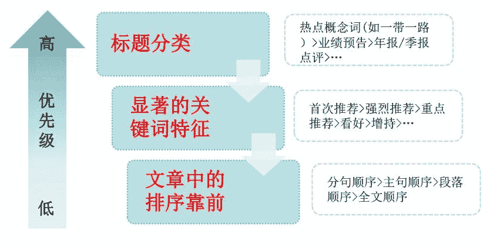 

从不同公众号之间的股票进行对比筛选

> 对于公众号之间的股票，首先控制个股的数量，然后以公众号优先级在股票之间比较，可以根据需要进行定制化的微信公众号股票对比筛选系统， 也可根据初步筛选结果结合技术分析系统进行综合筛选。

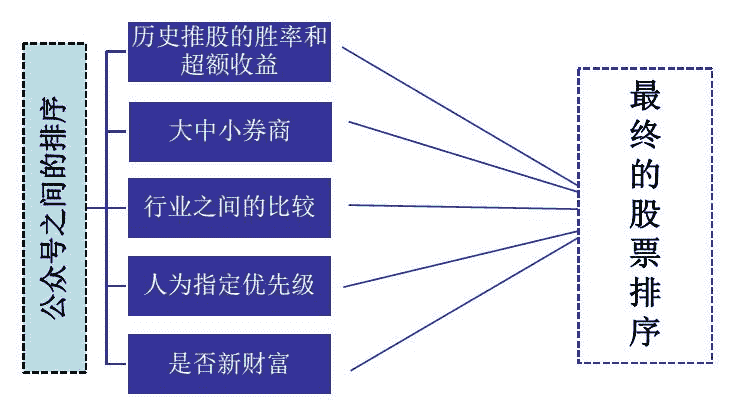

股票筛选流程举例

以下为排序举例：
公众号 A 共推荐 5 个股票 A1-A5，公众号 B 推荐 B1-B3，公众号 C 推荐 C1-C3

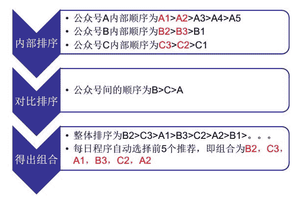

> **对微信数据的分析结果**

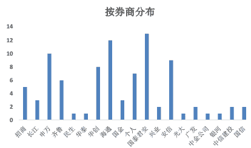

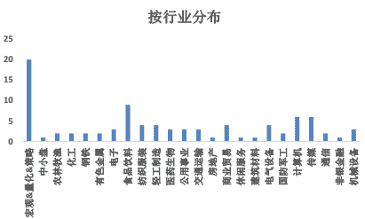

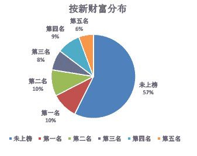

对于公众号推荐的股票，首先进行简单事件驱动分析，分析其 T-5 到 T+30 日的超额收益走势

可以看到， 相对沪深 300 而言，其推荐后的超额收益持续时间较为持久，而相对各行业指数而言，其超额收益在推荐后 5 日内就接近平缓，但是其整体具有超额收益的效果毋庸置疑。

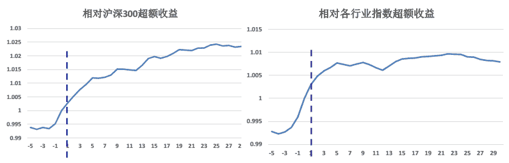 

对微信公众号选出股票的回测方法为：

> 将资金等分为 N 份，每次买入的持有时间为 N 日，每个公众号每日最多可以入选的股票数量设为 M 个，等权重买入所有出现信号的股票，若没有出现信号则使用沪深 300 指数 ETF 替代，交易成本设置为双边千 5，剔除当日无法买入的股票或不想买入的股票（当日一字涨停或者跌停），若抛出日无法抛出则以之后能抛出的日均价作为抛出价。

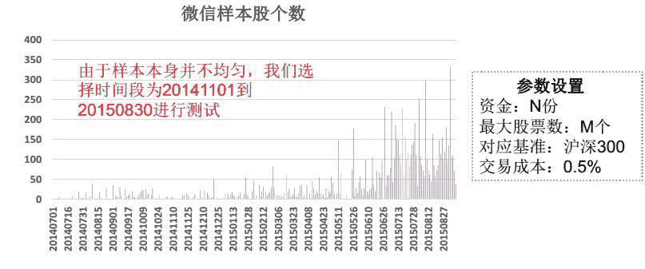

> 对每个公众号进行测试，由于公众号数量众多，展示其中收益较高的前 10 个公众号，可以看到这些公众号相对其跟踪的行业指数具有明显的超额收益。

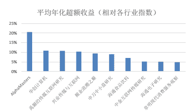

以公众号 AlphaMasters 为例设定参数为 N=30， M=20， 则年化超额收益为 21%，最大回撤 3%。

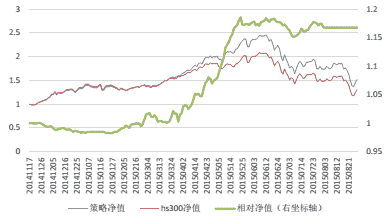 

> 对每个券商进行测试，下图为测试结果较好的券商，整体来说券商整体的超额收益效果比单个公众号更好，但是回撤也更大

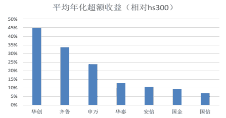

以某券商为例：设定参数为 N=30， M=20，年化收益 10%，最大回撤 7%  

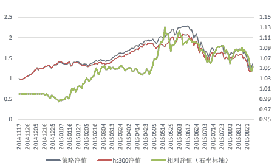 

> 对每个行业的公众号进行测试，其中 TMT 行业的公众号推荐的股票相对其
> 行业指数超额收益明显，而轻工、食品饮料和建筑材料的公众号就不太容 
> 
> 行业指数超额收益明显，而轻工、食品饮料和建筑材料的公众号就不太容 
> 
> 易推具有超额收益的股票

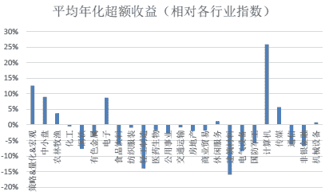 

设定参数为 N=30， M=20，行业选择计算机，年化收益 30%，最大回撤 3%

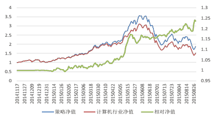 

**量化投资与机器学习**

**知识、能力、深度、专业**

**勤奋、天赋、耐得住寂寞**

**** 

****