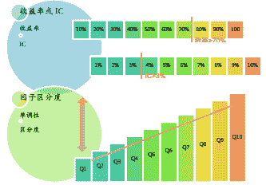
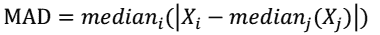
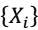
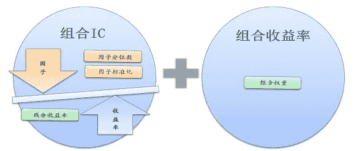

# 多因子策略系列（一）——因子回溯测试的总体框架

> 原文：[`mp.weixin.qq.com/s?__biz=MzAxNTc0Mjg0Mg==&mid=404506736&idx=1&sn=20737eb5d6d9ab45a9de576014991db7&chksm=06178a653160037328cef0865ded3517fa75af431464d948dffc366321947fb1a4dda21857b4&scene=27#wechat_redirect`](http://mp.weixin.qq.com/s?__biz=MzAxNTc0Mjg0Mg==&mid=404506736&idx=1&sn=20737eb5d6d9ab45a9de576014991db7&chksm=06178a653160037328cef0865ded3517fa75af431464d948dffc366321947fb1a4dda21857b4&scene=27#wechat_redirect)

> 谢谢大家支持，可以让有兴趣的人关注这个公众号。让知识传播的更加富有活力，谢谢各位读者。
> 
> 很多人问博主为什么每次的头像是奥黛丽赫本，因为她是博主女神，每天看看女神也是不错的嘛！

> ****查看之前文章请点击右上角，关注并且查看历史消息，谢谢您的阅读支持****

**1\. 目前的因子测试方法**
目前的因子分析方法一般包括两方面：
1、 对因子收益率和 IC 的筛选：
◆     收益率：要求胜率或者 Top-Bottom 收益率超过设定值；
◆     IC：要求 IC 或者 T 检验超过设定值；
2、 对因子的单调性或者区分度的限制：
◆     单调性：要求因子收益率随因子的增加具有一定的单调性；
◆     区分度： 要求因子的不同分位数组合的收益率具有一定的差距；

**现有的因子筛选方法**  

> **如果只从上述角度考虑，对因子的分析就仅仅局限于静态分析：**
> (1) 没有考虑因子有效性的时间变化：因子的有效性具有时变性，随着持
> 有期的变化因子的有效性是不断变化的，不同因子的有效性呈现出不
> 同的衰变规律；
> (2) 没有考虑环境或者风格板块对因子有效性的影响： 因子的有效性在不
> 同的股票池、不同的风格板块上可能具有不同的规律，不同的宏观环
> 境下因子可能具有不同的特征。

> **针对上述缺陷，我重新设计了测试的框架，着重增加了对因子有效性的动态
> 分析：**
> (1) 增加了对因子时间变化特征的分析：
> 包括 IC 的分布、 IC 的衰变、自相关性的衰变、买入信号的保持或逆转等内容；
> (2) 增加了对因子的情境特征分析：
> 
> 包括不同股票池（指数成分股/行业/风格）上的因子选股分析，宏观指标与因
> 
> 子组合的分析，不同市场阶段上的因子表现等，目的是发现因子适应于什么样的股票群体，什么样的市场阶段和宏观环境。

> **其他考虑因素**
> (1) 改进了数据清洗方法， 增加了平均绝对偏差方法；
> (2) 设定了标准化/分位数/组合权重/残余收益率四个层次，便于从不同角
> 度过滤特定风格对因子的影响，实现风格中性化，例如对于行业影响，
> 可以从因子的行业标准化、因子的行业分位、组合权重的行业中性和
> 从个股收益率中直接剔除行业收益率四个方面剔除因子中的行业影响；
> (3) 增加了初步的风险控制方面的内容：如因子回测的历史变动、组合的
> 跟踪误差以及组合业绩的归因等；
> (4) 考虑了幸存者偏差： 各种股票池的设定， 根据的都是历史成分股， 保
> 证了回溯测试的有效性；
> (5)详细校订了因子的信息公布时间：保证了因子的实时性；
> (6)对增长因子，采用趋势化的方法，避免采用算术增长率或者几
> 何增长率所造长的两点偏差；
> (7) 建立了初步的因子库， 分为估值因子/成长因子/规模因子/动量因子/
> 财务质量因子/技术因子/预测因子六个部分。

**1\. 数据输入**
数据输入部分， 主要工作包括数据的采集和整理、数据结构的设计， 生成最终
因子分析所需的数据集。 测试所需的数据主要包括股票/指数/风格/宏观四个
方面， 对各类数据和因子， 我们进行了细致的处理和校对， 包括消除幸存者偏
差、前视偏差等等；

**2\. 样本筛选**
样本筛选部分， 主要功能是实现对股票池的初步筛选， 在因子测试时， 设定了三条筛选规则：
1) 剔除选股日的 ST/PT 股票；
2) 剔除上市不满一年的股票；
3) 剔除选股日由于停牌等原因而无法买入的股票；
当然，不同逻辑下可能会有不同的筛选，在这个测试框架下，允许添加对股

票池的其他筛选，但是所有筛选都要在样本筛选部分实现。

**4\. 数据清洗**

数据清洗部分， 主要功能是完成对因子和收益率数据的清洗。 数据清洗的目的
是去掉可能的数据错误和极端数据， 保证最终得到的模型具有稳健性。
数据清洗的内容包括两部分，即异常值的处理和缺失值的处理。

(1) 异常值的处理：

对于异常值的定义， 用一种更为稳健的绝对中位偏差方法（ MAD）：

这里是数据集。
实际上， 对于异常值的处理，不同的因子可能采用不同的方式， 可供选择的处
理方式包括定义为 NA 或者用相近值替代， 具体的处理方式取决于对异常值的
逻辑解释。
需要说明的是异常值只是一个相对概念，有许多不同的异常值定义方法，如对
单因子异常值通常的定义方法是利用方差、中位数和四分位数，具体剔除多少，选择哪种方法，取决于数据本身的特征和对数据的主观理解， 以及对敏感性和稳健型的平衡。

(2) 缺省值的处理：
数据的缺失值有不同的来源，如有些是原始数据缺失，有些是异常值处理产生
的。对缺失值的处理方式要依据缺失值的来源和逻辑解释， 选取不同的操作，
包括剔除或者替代。

**5.分析计算**
分析计算部分， 主要功能是完成对因子特征的各种分析。 对不同的因子，依据
不同的逻辑，可以分不同层次设定因子分析的方式：
(1) 因子的标准化方法：
新版测试中可供选择的因子标准化方法包括四种，
(a)   普通标准化方法，即通常求 z 值的方法；
(b)   市值标准化方法， 相对于普通标准化方法，考虑了规模对均值的影响， 均
值为市值加权平均数；
(c)    随机数标准化，根据因子的样本分布随机生成一个样本，将随机生成的样
本值依次赋给对应股票作为标准化后的因子值，优点是可以将因子值转换
为服从特定分布的得分；
(d)    风格标准化，即将股票池划分为不同的风格， 将每个股票的因子值用所属
风格的风格平均值和风格标准差进行标准化，一个特例就是用不同行业的
行业均值和行业标准差进行因子的行业标准化。

(2) 因子的分位数方法
可供选择的分位数方法有两种：
(a)    普通分位数方法，即在整个股票池进行分位数计算；
(b)    风格分位数方法， 即在每个风格上进行分位数计算，然后构成整体股票池
的分位数结果。

风格分位方法，能够保证在每个分位组上，从数目上看各个风格是均匀分布的。风格分位的一个特例就是行业分位，即分别在每个行业上进行分位数计算，从而保证各个分位组中的行业分布在数目上是均匀的。

(3) 组合的权重方法
可供选择的组合权重方法有三种，
(a) 等权重方法，即组合中的每个股票具有同等的权重；
(b) 市值加权方法，即组合中的股票权重取决于股票的市值大小；
(c) 风格中性权重方法，即组合中的股票权重由股票的市值和股票所属风格在指数中所占的权重决定；

实际上，采用风格分位+市值加权，与采用普通分位+风格中性权重， 当指数权

重与市值权重一致时，两种方法都能达到同样的风格中性效果。

(4) 残余收益率方法
对风格影响的剔除，除了从上述标准化、分位数和权重三个角度考虑外，最后
一个方法就是直接从股票收益率中剔除所在风格板块的收益率。
下图说明了上述四种处理方式的关系，分位数、 标准化和残余收益率三种方法
是从影响 IC 角度影响因子的有效性，而权重是从收益率角度影响因子的有效
性。

以上只是策略思路，仅供参考。

**量化投资与机器学习**

**知识、能力、深度、专业**

**勤奋、天赋、耐得住寂寞**

**** 

****