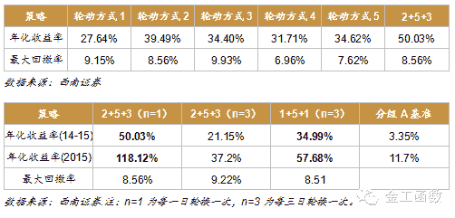
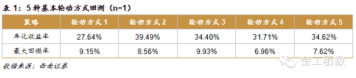
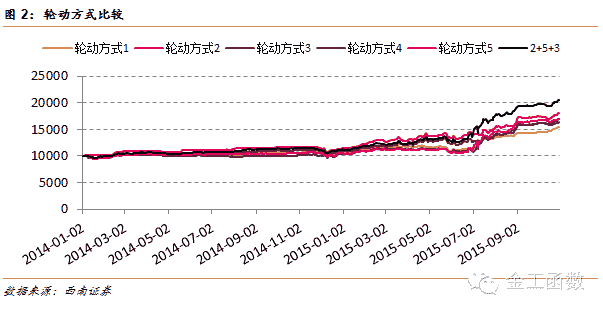
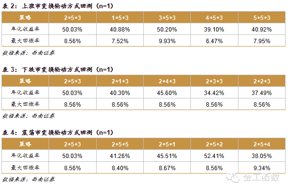
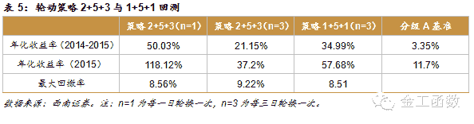
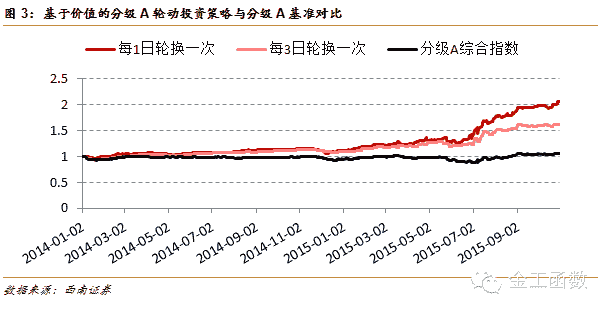

# 【西南金工】分级基金：基于价值的分级 A 轮动投资策略

> 原文：[`mp.weixin.qq.com/s?__biz=MzAxNTc0Mjg0Mg==&mid=404195415&idx=1&sn=e7d59de666d1534b5e85eba28ce09798&chksm=061c4a42316bc354e20e67ec04fcdbd87179f46f2a8c4eb2be12f6738bfcb805936fb9418b82&scene=27#wechat_redirect`](http://mp.weixin.qq.com/s?__biz=MzAxNTc0Mjg0Mg==&mid=404195415&idx=1&sn=e7d59de666d1534b5e85eba28ce09798&chksm=061c4a42316bc354e20e67ec04fcdbd87179f46f2a8c4eb2be12f6738bfcb805936fb9418b82&scene=27#wechat_redirect)

**摘要：**

本文将在对分级 A 价值分析的基础上，讨论收益最大化的轮动投资策略。

我们认为分级 A 主要有四类价值，分别为**债性价值、期权价值、配对转换价值、做空工具价值**。

不同种类的价值之间不一定具有可加性，甚至有的价值难以量化，如配对转换价值和做空价值。因此，我们只能退而求其次，有两种方法解决这一难题：第一，虽然总价值难以衡量，但我们只关注某一种价值，自始至终以这种价值进行轮动。事实上，市场上现存的轮动策略绝大多数都是如此。第二，分级 A 价格驱动因素显著地受到市场环境所影响，**在不同的市场环境下主导分级 A 价格的价值不一样**，因此只需要根据市场环境的变化以相应的价值进行轮动就能取得更高的收益，我们正是用的这种方法，称之为**基于价值的轮动策略**。

基于价值的分级 A 轮动策略：

*   当市场处于上涨市时，配对转换价值主导分级 A 走势，采取以**整体折价率**为标准的筛选方式；

*   当市场处于下跌市时，下折期权价值和做空价值决定着分级 A 价格的变化，采取以**下折收益/下折距离**为标准的筛选方式；

*   当市场震荡时，债性价值和配对转换价值时非常重要的，采取以**整体折价率、隐含收益率**为标准的筛选方式。

**策略结果：**

 

分级 A 作为分级基金的优先份额，因其具有较高的约定收益且在下跌市中表现非常突出，受到投资者的青睐。同时，市场上分级 A 的条款趋同，投资方式类似，价值相对明确，使投资者容易发现低估的分级 A，因而轮动投资方式较为盛行。然而，我们认为现存的轮动投资策略大多不是最优的。本文将在对分级 A 价值分析的基础上，讨论收益最大化的轮动投资策略。

 1  分级 A 的价值简析 

分级 A 价值就是通过各种途径获得收益的预期。一般情况下，分级 A 价值的提高将直接带来价格的上涨，例如在 6 月末急速下跌的市场环境下，分级 A 价值提升，价格表现强势。如果某只分级 A 价值与价格明显不匹配，那么投资者就会通过“用脚投票”使两者相吻合。我们认为分级 A 主要有四类价值，分别为债性价值、期权价值、配对转换价值、做空工具价值。

母基金每天从净值里面分出当天的约定收益给分级 A，累计到分级 A 的净值上，然后通过每年的定期折算将累计的净值转换成母基金折算给投资者。在分级 A 获得约定收益的过程中，违约的概率极低，分级基金历史上从未发生到期不能支付约定收益的事件，这一点类似高评级的债券，体现了分级 A 的债性价值。一般用隐含收益率来衡量债性价值，隐含收益率越高债性价值越大。

分级 A 期权价值主要是指下折期权价值。当发生下折时，分级 A 一大部分被转换成母基金，而分级 A 常常是折价交易，因此被折算成母基金的折价部分成为了分级 A 的下折收益，下折期权价值就是下折收益的预期值。期权价值的影响因素众多，其中下折距离和折价率对期权价值影响最大，下折距离与期权价值反相关，折价率与期权价值正相关。

分级基金一般存在着配对转换机制，即子基金和母基金按照一定的比例相互转化的机制，既包括母基金按照初始份额比例拆分成 A、B 份额，又包含分级 A、B 按照一定比例合并成母基金。配对转换价值就是分级 B 持有人在需要合并成母基金时，买入分级 A，从而使分级 A 价格得到推升的那部分价值。配对转换价值主要体现在跌停分级 B 的退出需求和折价套利的买入需求上。跌停分级 B 不常有，因而我们只考虑折价套利的买入需求，折价套利空间可以用整体折价率来表示，整体折价率越大，配对转换价值越大。

做空工具价值指的是在标的指数走弱的情况下，投资者对指数信心降低，分级 B 溢价下降，在配对转换机制的作用下，分级 A 折价也会下降，从而使分级 A 价格上升的这部分价值。假设所有的指数均有相等的概率走弱，那么做空工具价值的大小可以用折价率来衡量，折价率越大表示分级 B 溢价率也就越大，分级 B 溢价下降空间就相对较大。

 2  分级 A 价格驱动因素 

在进行分级 A 的轮动时，需要找到当前预期涨幅最大的分级 A，我们知道分级 A 价格是由价值所驱动的，也就说需要找到当前价值最大的分级 A。但分级 A 价值有四类，不同种类的价值之间不一定具有可加性，甚至有的价值难以量化，如配对转换价值和做空价值。因此，我们只能退而求其次，有两种方法解决这一难题：第一，虽然总价值难以衡量，但我们只关注某一种价值，自始至终以这种价值进行轮动。事实上，市场上现存的轮动策略绝大多数都是如此。第二，分级 A 价格驱动因素显著地受到市场环境所影响，在不同的市场环境下主导分级 A 价格的价值不一样，因此只需要根据市场环境的变化以相应的价值进行轮动就能取得更高的收益，我们正是用的这种方法，称之为基于价值的轮动策略。

实施这种轮动策略需要分析分级 A 主导价值的变化。在市场走强时，分级 A 则走弱，配对转换价值偶尔带来一些投资机会，这个时候分级 A 机会较少；在市场平稳时期，债性价值主导着分级 A 价格的走势，配对转换价值对价格也有一定的影响，主要体现在折溢价套利上。此时，期权价值保持稳定，做空价值也较小，对分级 A 价格影响极其有限；在市场走弱时，做空价值和期权价值常决定着分级 A 价格的变化，配对转换价值和债性价值影响最小；在市场极度走弱，急速下跌时，在避险需求的推动下，债性价值也可能成为分级 A 价格的主导。

 3  基于价值的轮动投资策略 

目前，市场上主流的轮动策略是以隐含收益率、整体折价率为轮动标准。本文增加轮动指标：分级 A 折价率、下折收益/下折距离。具体来说，分别的轮动方式为（所有轮动方式均排除含有特殊条款（如不含上下折等）且流动性较差（平均日成交额小于 200 万）的分级 A，将剩下的所有永续分级 A 纳入备选）：

轮动方式 1：以隐含收益率为标准，将所有备选分级 A 按照隐含收益率大小排列，选取隐含收益率最大的三只分级 A，等权重纳入投资组合，每隔 n 天换仓一次。

轮动方式 2：以整体折价率为标准，将所有备选分级 A 按照整体折价率大小排列，依次选取整体折价率最大且大于 1%的三只分级 A，不足三只则以最先选取的分级 A 填补（例如，只选出 2 只分级 A，则将最先选出的那一只作为第三只，若一只都未选出，则保持空仓），等权重纳入投资组合，每隔 n 天换仓一次。

轮动方式 3：首先以整体折价率为标准，选取整体折价率最大且大于 1%的三只分级 A，不足三只则用隐含收益率最大的分级 A 填补，等权重纳入投资组合，每隔 n 天换仓一次。

轮动方式 4：以折价率为标准，将所有备选分级 A 按照折价率大小排列，选取折价率率最大的三只分级 A，等权重纳入投资组合，每隔 n 天换仓一次。

轮动方式 5：以下折收益/下折距离为标准，按下折收益除以下折距离的商从大到小排列，排除下折距离大于 5%，下折收益小于 3%的分级 A，然后按照排序依次选取三只分级 A，不足三只则选取折价率最大的分级 A 替补，每隔 n 天换仓一次。

以 2014 年 1 月 1 日到 2015 年 11 月 1 日为回测区间，分别对以上 5 种轮动方式进行回测，得到如下结果：

从上文对分级 A 价值的解析可知，分级 A 的价格驱动因素在不同的市场环境中是不一样的，若不区分市场环境，自始至终以某一种方式轮动并不能取得最大收益，甚至发生亏损。因此，在对分级 A 进行轮动时首先需要判断市场环境。众所周知，对于未来市场走势的推断是非常难的，幸运的是我们并不需要去推测未来，只需结合过去一段时间的市场表现，对现在的市场环境进行大概判断。我们采取的判断方式如下：

*   计算出上证综指 10 日均值和 10 日收盘价标准差，若标准差除以 10 日均值值小于 1.5%，表示市场波动较小，判断市场处于低幅震荡的状态；

*   如果标准差除以 10 日均值的商大于 1.5%，表示市场波动较大，上涨市和下跌市均有可能。计算 10 日内涨幅和以及 10 日内跌幅和，判断涨幅和除以跌幅和的商的大小，若商大于 2，则为上涨市，若商小于 0.6，则为下跌市，若在两者之间则为震荡市。

在找到了市场环境的判断方法之后，我们建立基准轮动策略：

*   当市场处于上涨市时，配对转换价值主导分级 A 走势，采取轮动方式 2；

*   当市场处于下跌市时，下折期权价值和做空价值决定着分级 A 价格的变化，采取轮动方式 5；

*   当市场震荡时，债性价值和配对转换价值时非常重要的，采取轮动方式 3。

为了寻找最优的轮动策略，分别对基准策略（根据轮动方式的选取，下文称之为策略 253，分别代表在上涨市场、下跌市、震荡市时选取的轮动方式，下文将以同样的方式为其它轮动策略命名）在不同市场环境下所选择的轮动方式的有效性进行验证。设定回测区间为 2014 年 1 月 1 日到 2015 年 11 月 1 日，交易成本设定为万分之三，回测结果为：

当市场处于上涨市时，轮动策略 353 收益微高于基准策略 253，但回撤率也大于基准策略，总的来说，在上涨市中选择轮动方式 2 是最优的。从下跌市的回测结果来看，下跌市中选择轮动方式 5 是最优的。而在震荡市时，轮动方式 2 表现最好，但仅比轮动方式 3 稍好，考虑到轮动方式 3 兼顾了震荡市中分级 A 的债性价值，我们仍在震荡市中选择轮动方式 3。对比表一中始终以一种方式进行轮动的回测结果，可以发现判断市场环境的轮动策略效果更好。轮动频率 n 的取值并不一定要为 1，可以根据自身实际情况选取合适的轮动频率，下面给出 n=3 时的轮动策略 253 回测结果。

调成每 3 日轮换一次后，收益下降，主要是因为用整体折价率筛选变化较快。若需要降低轮换频率，建议用**隐含收益率**筛选替换**整体折价率**筛选。

* * *

