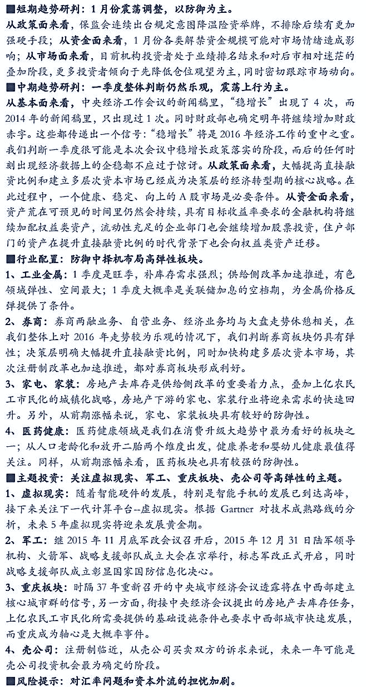

# 【券商精选研报】防御中择机布局高弹性的板块和主题——2016 年一季度策略

> 原文：[`mp.weixin.qq.com/s?__biz=MzAxNTc0Mjg0Mg==&mid=403960472&idx=1&sn=2ceb55f6699913f371a80c32bb90d88b&chksm=0618308d316fb99b43cb0dcae02f699103e9e4863f6ddc217c7e655bdf8c956248e66d28af7c&scene=27#wechat_redirect`](http://mp.weixin.qq.com/s?__biz=MzAxNTc0Mjg0Mg==&mid=403960472&idx=1&sn=2ceb55f6699913f371a80c32bb90d88b&chksm=0618308d316fb99b43cb0dcae02f699103e9e4863f6ddc217c7e655bdf8c956248e66d28af7c&scene=27#wechat_redirect)

> 谢谢大家支持，可以让有兴趣的人关注这个公众号。让知识传播的更加富有活力，谢谢各位读者。
> 
> 很多人问博主为什么每次的头像是奥黛丽赫本，因为她是博主女神，每天看看女神也是不错的嘛！

> ****查看之前文章请点击右上角，关注并且查看历史消息，谢谢您的阅读支持****

**全文 PDF 报告请回点击原文阅读 密码：mj8q**

**量化投资与机器学习**

**知识、能力、深度、专业**

**勤奋、天赋、耐得住寂寞**

**** 

****