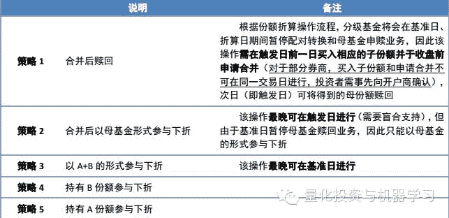
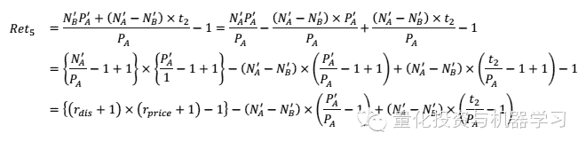

# 【深度原创研究】分级基金下折全攻略（二）

> 原文：[`mp.weixin.qq.com/s?__biz=MzAxNTc0Mjg0Mg==&mid=403626226&idx=1&sn=4d1f56a6599c92fd6688e5eb5d7d15dc&chksm=06051ae7317293f1429b99c7a4d28f78d5c45eaca4e8ed37829a3005f5666f41dfc37cc496e6&scene=27#wechat_redirect`](http://mp.weixin.qq.com/s?__biz=MzAxNTc0Mjg0Mg==&mid=403626226&idx=1&sn=4d1f56a6599c92fd6688e5eb5d7d15dc&chksm=06051ae7317293f1429b99c7a4d28f78d5c45eaca4e8ed37829a3005f5666f41dfc37cc496e6&scene=27#wechat_redirect)

> 谢谢大家支持，可以让有兴趣的人关注这个公众号。让知识传播的更加富有活力，谢谢各位读者。
> 
> 很多人问博主为什么每次的头像是奥黛丽赫本，因为她是博主女神，每天看看女神也是不错的嘛！

> ****查看之前文章请点击右上角，关注并且查看历史消息，谢谢您的阅读支持****

上次推文大概把分级基金下折的具体知识分析完成，这次推文将进一步就下折策略进行归纳总结。**祝大家新年快乐！感谢您一直对量化投资与机器学习公共号的支持。**

对于持有临近下折的 B 类份额的投资者而言， 若能够在折算日停牌前卖出手中份额固然是好。 但一般而言， 一方面，出于对下折的恐慌，稍懂规则的投资者往往不会在此时成为接盘侠；另一方面， 深交所为了加强下折基准日交易风险警示，在原来 9:30-10:30 停牌的基础上，又新增了 13:00-14:00 的一个小时的停牌时间， 在制度上增加了转让的难度。因此， 我们在这里给出几种操作策略，以供投资者相机决策。

 

> **策略 1：**

该策略在 B 份额确定要下折前便合并撤离市场， 属于最为保守的操作方式，但同时也对投资者预判的要求比较高。 整个操作过程的损益主要来自两个部分：**（ 1） 合并过程后折溢价的抹平；（ 2） 合并次日母基金净值的波动。 约有 60%**的分级基金在触发日前一日整体溢价率在 8%以上， 换言之， 这些基金在合并之后的亏损将会在 7.4%以上（ 反之，如果整体折价，那么合并操作可实现一定的收益）。 此外， 由于是下折品种，因此触发日清算后母基金净值定会比前一日来得低，这部分的损失平均为 6%。

**触发前一日整体折溢价率分布**  

 

> **策略 2：**

和策略 1 相同的是，投资者拿到手的都是场内母基金份额，需要承担合并操作中由于折溢价被抹平而带来的损益； 所不同的是， 在本操作下， 持有人还将要承受母基金净值从基准日到复牌日共计 3 个交易日的波动风险（注意， 折算本身对于母基金账面价值并无影响）。 因此，如果投资者对于短期市场存在较强的反弹预期时， 不妨持有母基金份额参与下折，可享受期间净值总额增长对下折损失的对冲。

**触母基金净值涨跌幅对于策略收益影响**

 

> **策略 3：**

我们可以从资产的最终账面价值（复牌日收盘后） 入手来分析其与策略 2 的不同之处（ 假设成本相同）。 根据推导， 策略 3 对于策略 2 的相对收益有着如下关系：

假设，我们在触发日的前一个交易日以收盘价 PA 、PB 买入 1 份 A 份额和 1 份 B 份额，当天收盘后母基金净值为 Nm，母基金仓位为 Pos，且在整个折算过程中保持不变。
此后 4 个交易日（触发日、基准日、折算日和复牌日）跟踪指数的涨跌幅分别为 z1， z2， z3， z4。在基准日收盘后，若此时 A 份额净值为 NA ′， 根据配对转换原则， B 份额的净值为：

那么，对策略 2 和策略 3 而言，下折前后投资者拥有的份额数变化如下表所示：

其中， t2 为母基金净值在折算日至复牌日之间的增长倍数（亦即母基金复牌日的净值）， PA ′、 PB ′ 分别为 A、 B 份额复牌日的收盘价，NB ′为基准日收盘后 B 份额的单位净值。

也就是说， 策略 3 相对于策略 2 的收益率高低， 主要取决于 2 个部分：（ 1）基准日收盘后 B 份额的单位净值；（ 2） 复牌日整体折溢价水平。 前者数值越高，意味着投资者在折算后获得的子基金份额数越多；后者为正，意味着 A+B 份额的账面价值将大于母基金份额的账面价值。考虑到单位净值恒为正，因此， **复牌日整体折溢价率的正负决定了两种策略相对收益的方向， 基准日收盘后 B 份额单位净值的大小起到放大收益或亏损的因子作用。**

****触复盘日收盘后整体折溢价率分布****

**** 

由以下公式推导， 复牌日整体折溢价率的方向主要由当日跟踪指数的涨跌幅决定， 当指数上涨时， 基金大概率会整体折价， 反之亦然。由于近两次大规模下折潮发生时市场均出现明显的反弹， 因此大约有 80%的基金在复牌日整体折价， 导致策略 3 并不如策略 2 来的好使。 不过考虑到公式右边的数值普遍较小， 策略收益率之差的均值仅为-0.6%。

一般而言， A、 B 份额在复牌日的涨跌幅有着反向关系（高约定收益率品种的 A 份额涨停、B 份额跌停， 低约定收益率品种行情相反）， 这也就意味着，跟踪指数的走势和母基金预估仓位，对复牌后整体折溢价的状态起着决定性的影响。

> **策略 4：**

 对溢价交易的 B 份额而言，此策略属于下下策的无奈之举。根据策略的操作方式， 最终收益率表达式为：

****策略 4 损益影响因素统计****

其中， **第一个影响因素贡献了损益的大部分。** 注意到， 当临近下折时，B 类份额的溢价率会快速提高（在母基金仓位较重的前提下）。 这是因为在临近下折时， B 类份额的净值杠杆较高（ 假设为 5 倍），若母基金净值下跌 5%，则 B 类份额净值将下跌 25%左右； 而由于二级市场存在涨跌停限制， B 类份额交易价最多下跌 10%， 导致 B 类份额二级市场价格并没有跌到位（ 更不用说无法下跌的成本价）， 溢价率被被动抬升。 即便是一些正常情况下以低溢价水平、甚至折价水平来交易的 B 类份额，亦会在下折前达到惊人的溢价水平。

****策同辉 100B 溢价率走势图****

 

当然，也并非所有的 B 类份额在下折前都有着动辄 100%的高溢价。当发生以下两种情形时， B 类份额的溢价率很可能可以被控制在正常范围内：

（1） **基金经理在下折前及时降低仓位， 使得价格的跌速能够赶上净值的下降， 则有可能将溢价率保持在较低水平**，如证保 B 级（ 150226）， 下折前基金仓位控制在 23%左右， 基准日的溢价率水平也仅为 6.6%。

**情形 1——证保 B 级溢价率走势图**

 

**情形 2——国企改 B 溢价率走势图**

**** 

（2） **基准日跟踪指数大涨，而二级市场 B 份额价格依旧跌停**， 如此， 那些仓位较重的 B 份额可实现溢价率被动抬升的逆过程， 如国企改 B （ 150210）在基准日净值增长 25.6%，而价格下跌 9.9%，溢价率水平从 96%降至 40%。特别的， 如果 B 份额在临近下折的边缘徘徊较久， 给予价格充分时间去逼近净值，则在基准日股市大涨的情景下， 投资者甚至可以通过持有 B 份额下折来获取收益（ 在复牌日涨停的假设下， 以成本价计， **在基准日溢价率只要控制在 22%以内，亏损率即小于跌停板卖出；控制在 10%以内，即可盈大于亏）。**

**基准日溢价率（以成本价计） 与策略收益率关系**

**** 

> **策略 5：**

此策略适合不受下折困扰的投资者通过持有 A 份额来博取事件套利收益。 易得其收益率表达式为：

**** 

其中， 对于第一部分的解释类同于策略 4， 是假设 A 份额在下折后仍全部保留为原形式下的收益率， 主要包括因折溢价抹平而产生收益率和复牌日收盘价相对于 1 涨跌幅两部分（ A 份额多以折价为主）； 但由于并不是全部 A 份额都需要承受复牌日价格波动，因此第二部分是针对转化为母基金的份额的修正；第三部分则是持有人获配的母基金份额在折算日和复牌日因净值波动而获得的收益。

 

与策略 4 不同的是， A 份额由于折价归零而产生的收益空间（第部分收益之和） 并不大， 策略 5 收益的大部分来源于折算后得到的母基金份额在折算日和复牌日净值的波动， 因为：

（1） 当临近下折时， A 份额的折溢价率有回归 0 的趋势。 对于折价交易的品种， 其自带的看跌期权属性被逐渐被市场所发掘， 并反映到二级市场价格上，导致折价率的下降； 而对于溢价交易的品种， 由于投资者担心折算后溢价的消失，因此会尽量避免参与下折，导致溢价回落，甚至成为折价状态（如同辉 100A、 煤炭 A 基、中小 A）；

（2）复牌日折价率有回归正常的内在述求， 因此手中 A 类份额将承受价格下降（折价品种） /上涨（溢价品种）带来的损失/收益，与折算过程的损益对冲；

（3） 折算之后，约有 80%的 A 份额转换成母基金份额， 因而母基金的账 

面价值占比更大。

**样本 A 份额收盘价涨跌幅**

**高约定收益率品种溢价率趋势**

**下折应对策略说明**  

**■ 策略结果对比**

从横向对比来看：（1） 策略 1 显得最为稳健，不同品种最终的收益率偏离较小， 投资者基本可锁定 13%-15%左右的亏损；（2） 得益于 2 次大规模下折触发潮后均出现市场反弹的情况， 策略 2 的收益率明显高于策略 1；（3）策略 3 与策略 2 的结果相差并不显著，对于投资者而言，若无法完成合并操作， 也不用太过担心；（4） A 份额下折套利的整体成功率很高， 只有 2 个样本实现负收益（ 证券 A 级、同辉 100A），均是由于折算后母基金净值跌幅较大造成。

**■ 对策略选择的一些补充**

（1） 对于是否买入 A 份额进行下折套利： **首先， 投资者应对于下折的确定性进行判断**（ 从短期行情和基金仓位两方面考虑），倘若母基金仓位较低，即便净值接近下折阈值，也有可能需要较长的时间才能实现， 那么投资者需要承受较多的价格波动风险。

其次， 若基金实现下折的速度较快， 或者已确定下折， 投资者可从两方面入手来衡量是否应该进行下折套利： 第一， **基准日之后，跟踪指数是否有上涨可能性**。 根据前文分析， A 类份额的下折收益主要由折算后得到的母基金净值增长贡献。 那么对持有人而言，下折套利的最优情景是“ 基准日指数大跌（ 较多比例转换为母基金） +折算日复牌日指数大涨（母基金净值上涨）”的组合； 而最糟情景则是“ 基准日、 折算日、 复牌日指数连跌三天” 的组合。

第二， **在跟踪指数不会出现大幅下跌的判断下， 观察下折品种的折溢价率大小。** 若是溢价品种，投资者可先等待溢价的回落以获得较低的成本；若是折价品种，投资者则应提早布局折价率较大的个券， 还可以享受下折前看跌期权价值的兑现。

**因此， 建议想要参与下折套利的投资者预先进行情景分析来判断获利空间。**

（2） **对于持有确定下折的 B 份额的投资者而言，可先根据最新的实时溢价率来判断下一步的行动。**

若溢价率已被控制在一个较低的水平（ 22%以内）， 而市场也呈现出企稳、甚至反弹的迹象，那么即便持有 B 份额参与下折， 也可能比下折前卖出来得划算（ 考虑到在经历了 7 月份抢反弹却惨遭下折损失的教训之后， 投资者对于下折有了很深敬畏之感， 即便市场反弹， B 份额价格也大多保持停），如最近的 NCF 环保 B（ 150191）。

若溢价率过高， 则投资者可优先考虑以跌停板卖出，当然， 这种方式的成功概率可能较低。 为了以防万一，此时投资者还需考虑 A 份额在下折后是否会亏损，若否， 建议买入等数量 A 进行对冲。 由于是否合并从结果上来看并没有太大差异， 因此当投资者对于危机发现较晚时， 大可不必慌张， 根据市场走势，选择最适合自己实际情形的策略。

**不同约定收益率规则下对复牌日价格涨跌幅的影响**

**量化投资与机器学习**

**知识、能力、深度、专业**

**勤奋、天赋、耐得住寂寞**

**** 

****