# 【深度原创研究】分级基金下折全攻略（一）

> 原文：[`mp.weixin.qq.com/s?__biz=MzAxNTc0Mjg0Mg==&mid=403551881&idx=1&sn=e1ed56f607a0fe187dd7a0cf5178b638&chksm=0606749c3171fd8a649c54f3686893515d39f5c1d2f16dc30e08494e85f433553043bf7f2d93&scene=27#wechat_redirect`](http://mp.weixin.qq.com/s?__biz=MzAxNTc0Mjg0Mg==&mid=403551881&idx=1&sn=e1ed56f607a0fe187dd7a0cf5178b638&chksm=0606749c3171fd8a649c54f3686893515d39f5c1d2f16dc30e08494e85f433553043bf7f2d93&scene=27#wechat_redirect)

> 谢谢大家支持，可以让有兴趣的人关注这个公众号。让知识传播的更加富有活力，谢谢各位读者。
> 
> 很多人问我为什么每次的头像是奥黛丽赫本，我只能说她是我女神，每天看看女神也是不错的嘛！

> **查看之前博文点击右上角关注且查看历史消息**

■ 下折条款是分级基金的重要条款之一，保证了极端情况下 B 类份额可以被强行平仓，并将其实际杠杆调整至初始状态；其本质在于保护 A 类份额的本金安全，避免出现 A 类份额约定收益率无法偿付的现象。

■ 折算流程： 指一般而言， 分级基金的下折周期需要 4 个交易日（触发日、基准日、折算日、复牌日）， 需要特别注意的是， **在基准日，不论 B 类份额收盘后净值是否反弹至 0.25 元以上，基金都将在次日进行折算。** 

■ B 类份额：

（ 1） **多数 B 类份额平时以溢价状态交易。**一方面，国内杠杆工具较少，投资者对 B 类份额的投资热情度高， 愿意以溢价的状态持有。 另一方面， 大部分 A 类份额约定收益率低于市场普遍要求的水平， 持有人需要一定的折价补偿。（ 2） **当临近下折时， B 类份额的溢价率会被动得快速提高。**这是因为在临近下折时， B 类份额的净值杠杆较高， 在涨跌停限制下， B 类份额净值跌幅远大于交易价跌幅， 导致 B 类份额二级市场价格并没有跌到位。（ 3） **下折后 B 类份额溢价全部消失！**由此产生巨额损失。 根据折算规则， 首个交易日 B 类份额前收盘价参考前一交易日的份额净值， 这相当于平价交易，此前的高溢价被抹平， 由此发生亏损。

■ 倘若投资者手中不幸持有临近下折的品种，且二级市场流动性较弱，无法易手，则可**买入等份额的 A 份额，当日申请合并为母基金，次日确认成功后申请赎回，** 如此操作可减少大部分亏损。

 ■ A 类份额：
（ 1） B 类份额在下折过程中把大部分溢价转交给了 A 类份额。
（ 2） 并不是所有 A 类份额在下折过程中都能受益的。对于溢价交易的 A，由于折算后溢价消除， 同样会遭受损失。
（ 3） A 类份额自带的看跌期权属性，将随着下折的临近逐渐在二级市场价格中显现。 

■ A 类份额：
（ 1） B 类份额在下折过程中把大部分溢价转交给了 A 类份额。
（ 2） **并不是所有 A 类份额在下折过程中都能受益的。**对于溢价交易的 A，由于折算后溢价消除， 同样会遭受损失。 

（ 3） A 类份额自带的看跌期权属性，将随着下折的临近逐渐在二级市场价格中显现。

> **一、 何谓下折？ 下折条款详解**

下折条款是分级基金的重要条款之一，其本质在于保护 **A** 类份额的本金安全，避免出现 **A** 类份额约定收益率无法偿付的现象。 当母基金的跟踪指数呈现单边下行时， B 类份额的净值杠杆会不断扩大，其净值会以加速度的状态下跌。  

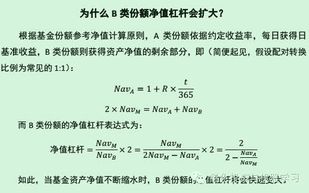
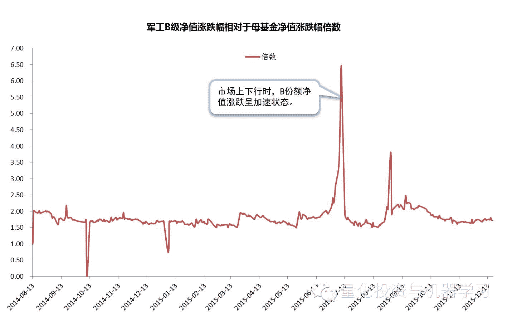 

若此时不加以限制， 任由 B 类份额杠杆上升，则极有可能出现不仅 B 类份额净值血本无归， 而且 A 类份额本金亦会受到侵蚀的情况。正因如此， 2012 年出台的《 分级基金产品审核指引》 中规定股票型分级基金实际杠杆率不超过 6 倍。 下折条款的存在， 保证了极端情况下 B 类份额可以被强行平仓， 并将其实际杠杆调整至初始状态；同时， 将 A 类份额约 75%的本金以母基金份额的形式返还给持有人。

> ■**折算方式**
> 对于目前场内的存量分级基金， 大多采用相同的下折方式触发条件： 若某日收盘后， B 类份额净值低于合同约定的阈值（大部分产品为 0.25 元） 时， 即可触发向下不定期折算条款。

> ■**折算原则**
> 
> 各份额在折算过程中遵循以下原则：
> 1、母基金份额、 A 类份额和 B 类份额的单位净值在折算后均被重置为 1.000 元
> 2、存量母基金份额（无论场内外） 折算前后保持净值总额不变
> B 类份额折算前后保持净值总额不变， 如此， 折算后 B 类份额的份额数将会大幅缩减
> 3、A 类份额的留存份额数与折算后的 B 类份额数保持配对转换比率，其总净值中剩余部分转化为母基金场内份额返还给 A 类持有人（相当于提前还本）。

**向下折算份额变化示意图**

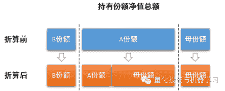 

**向下折算份额变化示意图**

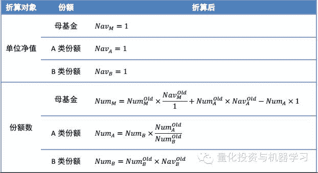 

> ■**折算原则**
> 
> 一般而言， 分级基金的下折周期需要 4 个交易日：
> ■ **触发日**： B 类份额收盘后净值低于 0.25 元；
> ■ **基准日**： 基金公司发布份额折算公告， A、 B 份额开市至 10:30 停牌 1 小时，同时基金暂停申购赎回、合并拆分等业务； 当日晚间，基金公司根据收盘后净值计算份额折算比例；**需要特别注意的是，在基准日，不论 B 类份额收盘后净值
> 是否反弹至 0.25 元以上，基金都将在次日进行折算。**
> ■ **折算日**： A、 B 份额暂停交易， 同时基金公司为持有人办理份额登记确认， 单位净值重置为 1 元； 收盘后各份额单位净值根据跟踪指数涨跌幅相应变动；
> ■ **复牌日**： 基金公司发布公告， A、 B 份额开市至 10:30 停牌 1 小时， 开盘时以前一交日的单位净值作为前收盘价； 同时基金恢复申购赎回、合并拆分等业务。

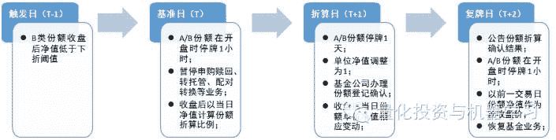 

> **二、 A/B 份额下折收益解析**

多数 B 类份额平时以溢价状态交易。 一方面，国内杠杆工具较少，尤其是像分级基金这样入门门槛较低、可选标的多样化的品种， 投资者对 B 类份额的投资热情度高， 愿意以溢价的状态持有。 另一方面， A 类份额约定收益率的规则大多为“ +3.0%” 、 “ +4.0%” ， 低于市场普遍要求的水平（如 10 年期 AA 级企业债到期收益率）， 持有人需要一定的折价补偿。 因此，导致市面上大部分 B 类份额长期以溢价状态交易。

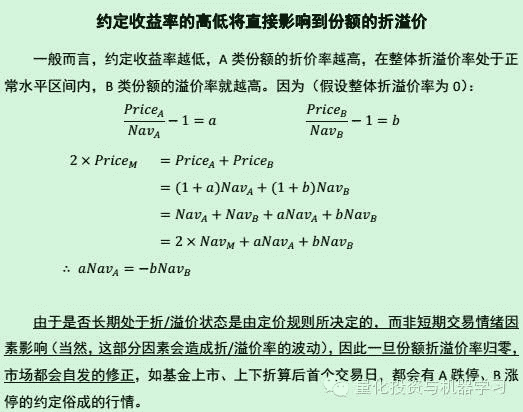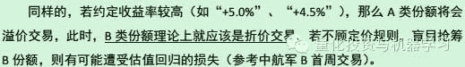 

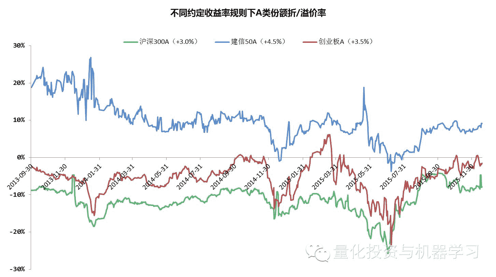 

当临近下折时， B 类份额的溢价率会被动得快速提高。 这是因为在临近下折时， B 类份额的净值杠杆较高（ 假设为 5 倍），若母基金净值下跌 5%，则 B 类份额净值将下跌 25%左右；分子方面，由于二级市场存在涨跌停限制，B 类份额交易价最多下跌 10%， 导致 B 类份额二级市场价格并没有跌到位，此时进场的投资者无疑是高位接盘。

下折后 B 类份额溢价全部消失！由此产生巨额损失。 根据折算规则， 首个交易日 B 类份额前收盘价参考前一交易日的份额净值， 这相当于平价交易，此前的高溢价被抹平， 由此发生亏损。

以军工 B 级为例：

（ 1） 假设以 7 月 9 日的收盘价 0.550 元买入 10,000 份军工 B 级，当日净值为 0.2537 元，溢价 116.8%， 总市值 5,500 元。

（ 2） 7 月 10 日， 10,000 份军工 B 级被折算为 2,537 份单位净值为 1 的军工 B 级，净值总额保持 2,537 元不变；当日收盘时，中证军工指数上涨 6.13%，军工 B 级在 2 倍杠杆的撬动下，净值增长 11.8%。
（ 3） 7 月 13 日，军工 B 级前收盘价为 1.118 元， 总市值为 2,836.37 元， 

截至当日亏损 48%。

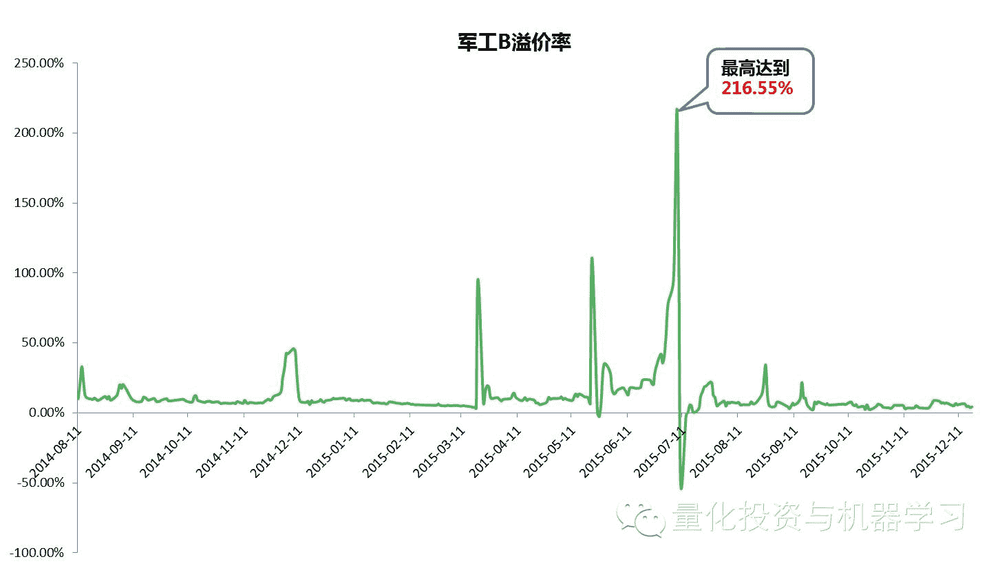

（1） 对于下折预期较大的品种， 倘若二级市场流动性较弱，无法易手，则可**买入等份额的 A 份额， 当日可申请合并为母基金， 次日确认成功后可申请赎回**（需在触发日之前操作，因为基准日暂停配对转换、申购赎回业务）。

（ 2） 对于已确定下折的品种， 此时投资者无法通过配对转换业务减少损失，则不必在折算后急于割肉，可等待溢价恢复， 挽回一定的损失。 

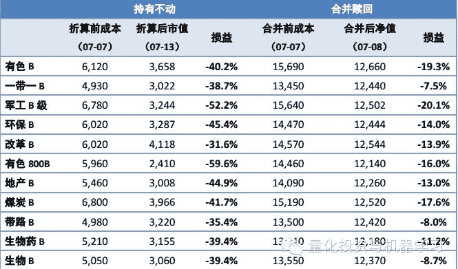 

> **三、折价抹平， A 类份额获利**

折价交易的 A， 下折后不仅恢复平价状态， 而且超过 B 类份额原单位净值的部分将转化为母基金， 而母基金自身并没有直接层面上的折溢价（ 深交所基金）。因此，即便复牌后 A 类份额会通过跌停来修复折价率，但是仍会有约 75%的资产保持平价状态（ 对母基金而言，最大的风险在于标的指数的走势）。 换言之， **B 类份额在下折过程中把大部分溢价转交给了 A 类份****额**（ 对基金总资产而言，将损失整体溢价率大于 0 的部分）。

特别强调， **并不是所有 A 类份额在下折过程中都能受益的**。 上述分析仅仅针对折价交易的 A 类份额， 对于溢价交易的 A， 由于折算后溢价消除， 同样会遭受损失。

正是由于 A 类份额在市场下跌过程中能享受到丰厚的收益， 而且标的指数跌幅越大， 其获利越多， 因此 A 类份额自带看跌期权的属性， 且这**部分价值随着下折的临近逐渐显现。**

**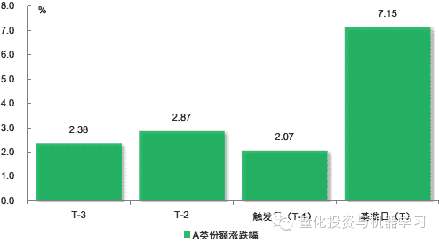** 

因此， 对于折价的 A 类份额， 持有人可以在整个下折过程中获得两部分收益：**（1） 临近下折时内置看跌期权价值修复带来的二级市场升值；（ 2） 下折之后折价抹平带来的资产升值。**

**量化投资与机器学习**

**知识、能力、深度、专业**

**勤奋、天赋、耐得住寂寞**

**** 

****