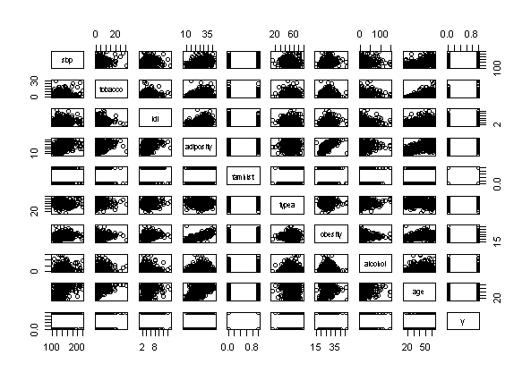
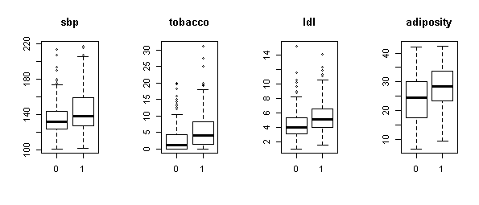
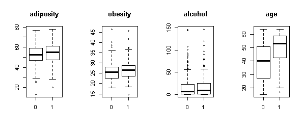
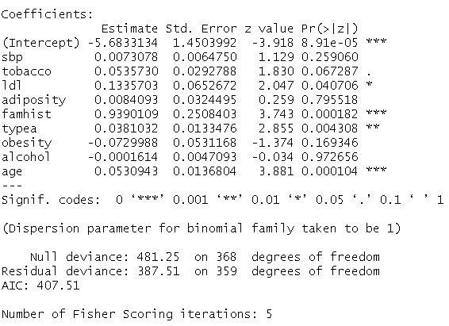
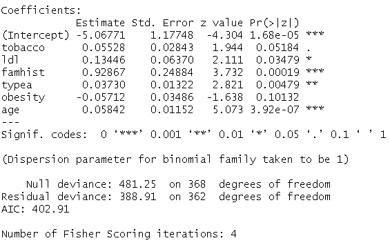
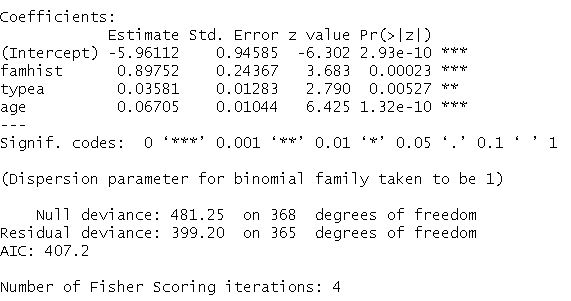
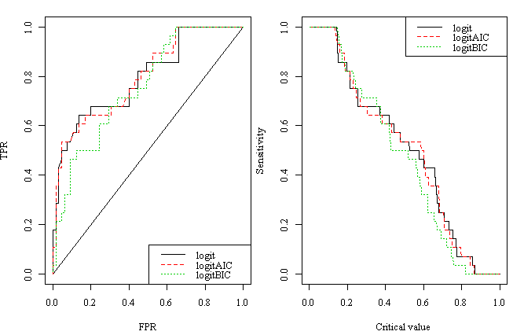
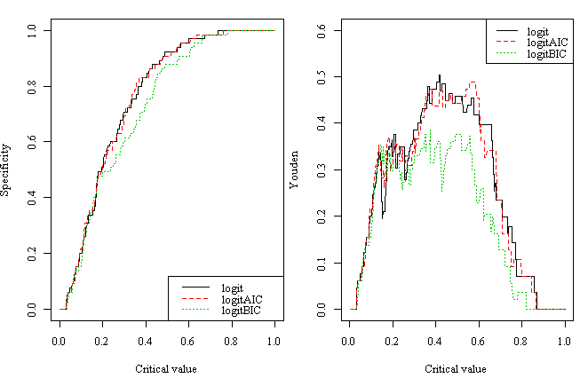

# 【连载干货】中国人民大学统计数据挖掘中心专题报告资料之线性判别、Logistic 回归

> 原文：[`mp.weixin.qq.com/s?__biz=MzAxNTc0Mjg0Mg==&mid=403111936&idx=1&sn=a7c3bacbec312ed928229c258720a01b&chksm=060cc215317b4b03ca29e295aa026048faed1d0b630ddc6f541f8f3b468b03f6443d10c74048&scene=27#wechat_redirect`](http://mp.weixin.qq.com/s?__biz=MzAxNTc0Mjg0Mg==&mid=403111936&idx=1&sn=a7c3bacbec312ed928229c258720a01b&chksm=060cc215317b4b03ca29e295aa026048faed1d0b630ddc6f541f8f3b468b03f6443d10c74048&scene=27#wechat_redirect)

> 谢谢大家支持，可以让有兴趣的人关注这个公众号。让知识传播的更加富有活力，谢谢各位读者。
> 
> 很多人问我为什么每次的头像是奥黛丽赫本，我只能说她是我女神，每天看看女神也是不错的嘛！

> **查看之前博文点击右上角关注且查看历史消息**

> 今天是共享第二天，每天为大家分享一篇中国人民大学数据挖掘中心（DMC）的统计专题报告，内容很丰富，专业性和学习行都很强，希望大家有所收获。所有版权均属中国人民大学数据挖掘中心，**请勿用作商业用途**！！！

**本期主题：线性判别、Logistic 回归**

> **先从一个案例分析开始，然后在阅读原文里有 Python 和 R 关于梯度上升法和 logistic 的代码。**

1.  数据说明

本案例所用的数据为 ISLR 中自带的数据 heart.data，样本是 462 个南非人的身体健康状况指标，用来研究哪些因素对是否患心脏病有影响。变量描述见表 1。

表 1 变量说明

| 变量名 | 含义 | 解释 |
| y | coronary heart disease | 冠心病 |
| sbp | systolic blood pressure | 血压 |
| tobacco | cumulative tobacco | 累计烟草量 |
| ldl | low density lipoprotein cholesterol | 低密度脂蛋白胆固醇 |
| adiposity | -- | 肥胖 |
| famhist | family history of heart disease | 是否有心脏病家族史 |
| typea | type-A behavior | A 型表现 |
| obesity | -- | 过度肥胖 |
| alcohol | current alcohol consumption | 当前饮酒 |
| age | age at onset | 发病年龄 |

1.  描述性统计

图 1 是变量的散点矩阵图，可以看出 adiposity 和 obesity 线性相关性较强。

表 2 是因变量与定性自变量 famhist 的列联表分析，卡方检验 p 值为 0，在 0.05 的显著性水平下，famhist 对 y 有显著影响。

图 3 是连续自变量与因变量的箱线图分析。

****表 2 定性变量与因变量列联表分析

| famhisty | 0 | 1 | P 值 |
| 0 | 206 | 96 |   |
| 1 | 64 | 96 | 0.000 |

图 2 连续自变量与因变量间的箱线图

1.  Logistic 回归

随机抽取 80%的样本作为训练集，剩下的 20%样本作为测试集，用所有变量建立二元 logistic 回归模型。之后用 AIC 和 BIC 对模型做逐步回归。模型拟合结果分别如图 3-5 所示

1.  模型预测

表 3 是模型预测结果的列联表符号示意。

表 3 预测结果列联表符号示意

| 预测值 实际值 | 0 | 1 |
| 0 | TN | FN |
| 1 | FP | TP |

真阳性率 TPR=TP/(TP+FN)； 假阳性率 FPR=FP/(FP+FN）

敏感性 Sensitivity=TP/(TP+FN)；特异性 Specificity=TN/(FP+TN)

约登指数 Youden=Sensitivity+Specificity-1

正确率 R=(TN+TP)/(TN+FN+FP+TP)

为了比较三个模型的效果，用 ROC 曲线以及约登曲线来选择最优的模型，如图 6 所示。

表 4 是 logit-AIC 模型预测效果如下表所示。

表 4 最优预测模型预测效果

| y 预测值 y 实际值 | 0 | 1 | 行和 |
| 0 | 62 | 13 | 75 |
| 1 | 3 | 15 | 18 |
| 列和 | 65 | 28 | 93 |

得 TPR=0.536，FPR=0.046，正确率 R=0.828。

**量化投资与机器学习**

**知识、能力、深度、专业**

**勤奋、天赋、耐得住寂寞**

**** 

****