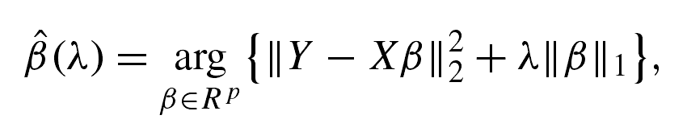

# 【连载干货】中国人民大学统计数据挖掘中心专题报告资料之回归分析与 Lasso

> 原文：[`mp.weixin.qq.com/s?__biz=MzAxNTc0Mjg0Mg==&mid=403090451&idx=1&sn=b4fe66fd5fc4a6a60f6e7affd9aad5ac&chksm=060d6e06317ae710b4754259695a81d391db278c1e9fabd4e2da8e34adcdb8d0f617222ad910&scene=27#wechat_redirect`](http://mp.weixin.qq.com/s?__biz=MzAxNTc0Mjg0Mg==&mid=403090451&idx=1&sn=b4fe66fd5fc4a6a60f6e7affd9aad5ac&chksm=060d6e06317ae710b4754259695a81d391db278c1e9fabd4e2da8e34adcdb8d0f617222ad910&scene=27#wechat_redirect)

> 谢谢大家支持，可以让有兴趣的人关注这个公众号。让知识传播的更加富有活力，谢谢各位读者。
> 
> 很多人问我为什么每次的头像是奥黛丽赫本，我只能说她是我女神，每天看看女神也是不错的嘛！

> **查看之前博文点击右上角关注且查看历史消息**

> 从今天起，每天为大家分享一篇中国人民大学数据挖掘中心（DMC）的统计专题报告，内容很丰富，专业性和学习行都很强，希望大家有所收获。所有版权均属中国人民大学数据挖掘中心，**请勿用作商业用途**！！！

**什么是 Lasso**

 

 

Lasso 是最小二乘的一个改进

核心是加入了惩罚项

效果是变量选择

开创了一个近二十年的领域

喂饱了不少统计学家

> **变量选择**

**什么是变量选择？**

在回归模型中，选择最能够解释 Y 的解释变量的过程，称为变量选择。

**不做变量选择的后果：**

一、严重的多重共线性

二、计算量大

三、数据成本昂贵

**常见的变量选择方法：**

前进法、后退法、逐步回归法 Lasso

> **一张图理解 LASSO！**

> **相关知识补充**

关于模型选择的标准：

一，模型的准确性（prediction accuracy）

二，模型的可解释性（parsimony）

例子：

1，变量选择模型，比如向前法、向后法、逐步回归，可解释性较好，但是预测的准确性较差。

2，岭回归的准确性较好，但是可解释性较差。

3，Lasso 很好的平衡了模型的准确性和模型的可解释性，但是运算量比较大。

> **对于岭回归的再理解**

由于文章很长，同时包含很多例子。我已经把整理好把连接放在**阅读原文**里，大家可以下载自学。好好学哦！

**量化投资与机器学习**

**知识、能力、深度、专业**

**勤奋、天赋、耐得住寂寞**

**** 

****