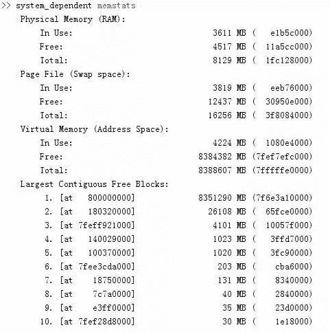

# 【干货】Matlab 的内存问题讨论

> 原文：[`mp.weixin.qq.com/s?__biz=MzAxNTc0Mjg0Mg==&mid=402818387&idx=1&sn=91d699ca797ddb9de064aae2cd92c327&chksm=06094746317ece50b5bb11b2b7603ac1206977f7344f29fd2df11795d7b69e8e5db5630661f0&scene=27#wechat_redirect`](http://mp.weixin.qq.com/s?__biz=MzAxNTc0Mjg0Mg==&mid=402818387&idx=1&sn=91d699ca797ddb9de064aae2cd92c327&chksm=06094746317ece50b5bb11b2b7603ac1206977f7344f29fd2df11795d7b69e8e5db5630661f0&scene=27#wechat_redirect)

> 谢谢大家支持，可以让有兴趣的人关注这个公众号。让知识传播的更加富有活力，谢谢各位读者。
> 
> 很多人问我为什么每次的头像是奥黛丽赫本，我只能说她是我女神，每天看看女神也是不错的嘛！

> **查看之前博文点击右上角关注且查看历史消息**

用 Matlab 进行大规模科学计算或仿真时，内存是一个需要时常注意的问题。在 matlab 命令输入行中输入： system_dependentmemstats 。

在这里就可以看到内存的使用情况了。当你写的 Matlab 程序跳出“Out ofMemory” 时，以下几点措施是需要优先考虑的解决方法：

**1.升级内存**

**2.升级 64 位系统**

**3.增加虚拟内存**

**4.采用 3GB 开关启动系统**

使用 3GB 切换

（1）在“开始”菜单下的“附件”程序组中，右击“命令提示器”（CommandPrompt）。点击“使用系统管理员身份运行”（Run asAdministrator）。

（2）在命令提示器中输入“bcdedit/set IncreaseUserVa 3072”

（3）重启电脑。

打开 3GB 的目的：32 位系统（包括 XP 和 32 位的 win7）,默认情况下不允许某个程序调用超过 2G 的内存，一旦超过，就自动结束掉该程序。因此打开 3GB，就是为了允许大型程序，调用最多 3G 的内存

5.如果没有必要，**不要启动 java 虚拟机**，采用 matlab-nojvm 启动（在快捷方式属性里面的"..../matlab.exe"）改为（"...../matlab.exe"- nojvm）

6.**关闭 MatlabServer**

7\. Windows 中字体、窗口等都是要占用系统资源的，所以在 Matlab 运行时**尽量不要打开不用的窗口**。

8.**在命令行输入 pack 整理内存空间**

当内存被分为很多碎片以后，其实本身可能有很大的空间，只是没有作构的连续空间即大的 Block 而已。如果此时 Out of Memory，此时使用 pack 命令可以很好的解决此问题。

9.以上所说的方法都是一些基础的方法，是从外界的角度来解决问题，实际上最本质的方法还是养成一个好的**编程习惯**。

（1）**尽量避免产生大的瞬时变量**，把没必要的变量 clear 掉或当它们不用的时候应该及时 clear；减少变量，尽量的重复使用变量；把有用的变量先 save，后 clear 掉，需要时再读出来。下面介绍一下关于 clear、save、load 的特殊用法，这对在 for 或 while 等多重循环里出现 out ofmemory 非常有效。

fork = 1:N % N 为循环次数

var0 = k; % 获得变量 var0

string = [sprintf('var_%d', k) ' = var0;'];

eval(string); % 等价于 var_k = var0;

save(sprintf('var_%d.mat', k),sprintf('var_%d'));

% 等价于 save var_k.matvar_k

clear(sprintf('var_%d')); % 等价于 clearvar_k

end

如果要读取刚才存取的变量 var_k,(k = 1,2, ..., N). 那么，可以使用如下用法：

fork = 1:N

load(sprintf('var_%d.mat', k)); % 等价于 loadvar_k.mat k = 1,2, ..., N

end

如果用清除刚才读取的变量 var_k,k = 1, 2, ..., N

clear '-regexp''^var_' % 清除所有以“ var_ ”开头的变量

（2）**使用单精度 single 短整数替代双精度 double**

Matlab 默认的数字类型是双精度浮点数 (double)，每个双浮点数占用 8 个字节。对于一些整数操作来说，使用双浮点数显得很浪费。在 Matlab 中可以在预先分配数组时指定使用的数字类型如以下命令：zero(10, 10, ‘uint8′) 。对于浮点数，在很多精度要求不高的情况下，可以使用 4 个字节的单浮点数 (single)，可以减少一半的内存。

（3）**为矩阵变量预制内存而不是动态分配**

在动态分配的过程中，由于开始 Matlab 所用的 Block 随着矩阵的增大而连续的为此矩阵分配内存，但是由于 Block 的不连续性，很有可能最开始分配的 Block 不能满足存储的需要，Matlab 只好移动此 Block 以找到更大的 Block 来存储，这样在移动的过程中不但占用了大量的时间，而且很有可能它找不到更大的块，导致 Out ofMemory。而当你为矩阵变量预制内存时，Matlab 会在计算开始前一次性找到最合适的 Block，此时就不用为变量连续的分配内存。

还有一些其他的内存管理方法，但以上所述是一些比较常用的方法，但是最主要的还是自己的编程习惯，要养成一个好的编程习惯是很重要的。

**量化投资与机器学习**

**知识、能力、深度、专业**

**勤奋、天赋、耐得住寂寞**

**** 

****