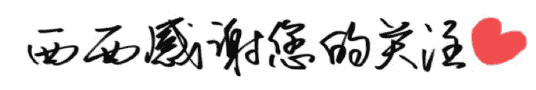

# 【感恩节】父母在，人生尚有来处；父母去，人生只剩归途

> 原文：[`mp.weixin.qq.com/s?__biz=MzAxNTc0Mjg0Mg==&mid=401959558&idx=1&sn=21f898b2a9a52f7944cc229f71f33966&chksm=09fea8933e892185a828cc6de9c119e309ec6086ee919f9848e07f1f4e8043fad1c172b748da&scene=27#wechat_redirect`](http://mp.weixin.qq.com/s?__biz=MzAxNTc0Mjg0Mg==&mid=401959558&idx=1&sn=21f898b2a9a52f7944cc229f71f33966&chksm=09fea8933e892185a828cc6de9c119e309ec6086ee919f9848e07f1f4e8043fad1c172b748da&scene=27#wechat_redirect)

**谢谢大家支持，可以让更多朋友和有兴趣志同道合的人关注这个公众号。让知识传播的更加富有活力，谢谢各位读者。**

很多人问我为什么每次的头像是奥黛丽赫本，我只能说她是我女神，每天看看女神也是不错的嘛！

**查看之前博文点击右上角关注查看历史消息**

> **今天恰逢感恩节，所以我就特别推一篇文章。希望大家学会感恩。**

* * *

听到一个小故事：古代有个孝子叫韩伯俞。他的母亲在他犯错时，总是严厉地教导他，有时还会打他。

待他长大成人后，当他犯错时，母亲的教训依然如故。有一次母亲打他，他突然放声大哭。

母亲很惊讶，几十年来打他从未哭过。于是就问他：“为什么要哭？”伯俞回答说：“从小到大，母亲打我，我都觉得很痛。我能感受到母亲是为了教育我才这么做。但是今天母亲打我，我已经感觉不到痛了。这说明母亲的身体愈来愈虚弱，我奉养母亲的时间愈来愈短了。想到此我不禁悲从中来。”

这个小故事，让我感动不已。

> 推荐一篇毕淑敏先生的小短文《孝心无价》，祝天下的父母平安喜乐，儿女的孝心都有着落。

**孝心无价**

我不喜欢一个苦孩子求学的故事。家庭十分困难，父亲逝去，弟妹嗷嗷待哺，可他大学毕业后，还要坚持读研究生，母亲只有去卖血……我以为那是一个自私的孩子。

求学的路很漫长，一生一世的事业，何必太在意几年蹉跎？况且这时间的分分秒秒都苦涩无比，需用母亲的鲜血灌溉！一个连母亲都无法挚爱的人，还能指望他会爱谁？把自己的利益放在至高无上位置的人，怎能成为人类的大师？

我也不喜欢父母病重在床，断然离去的游子，无论你有多少理由。地球离了谁都照样转动，不必将个人的力量夸大到不可思议的程度。在一位老人行将就木的时候，将他对人世间最期冀的希望斩断，以绝望之心在寂寞中远行，那是对生命的大不敬。

我相信每个赤诚忠厚的孩子，都曾在心底向父母许下“孝”的宏愿，相信来日方长，相信水到渠成，相信自己必有功成名就衣锦还乡的那一天，可以从容尽孝。

可惜人们忘了，忘了时间的残酷，忘了人生的短暂，忘了世上有永远无法报答的恩情，忘了生命本身不堪一击的脆弱。

父母走了，带着对我们深深的挂念；父母走了，留给我们永无偿还的心情。你就永远无以言孝。

有一些事情，当我们年轻的时候，无法懂得。当我们懂得的时候已不再年轻。世上有些东西可以弥补，有些东西永无弥补……

赶快为你的父母尽一份孝心。

也许是一处豪宅，也许是一片砖瓦。

也许是大洋彼岸的一只鸿雁，也许是近在咫尺的一个口信。

也许是一顶纯黑的博士帽，也许是作业簿上的一个满分。

也许是一桌山珍海味，也许是一只野果一朵山花。

也许是花团锦簇的盛世华衣，也许是一双洁净的布鞋。

也许是数以万计的金钱，也许只是含着体温的一枚硬币……

但在“孝”的天平上，它们等值。  

**量化投资与机器学习**

**知识、能力、深度、专业**

**勤奋、天赋、耐得住寂寞**

**** 

****