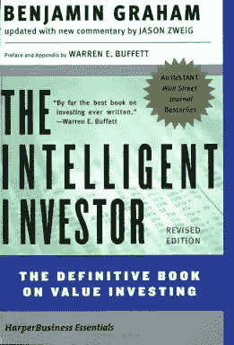
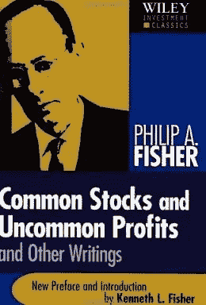
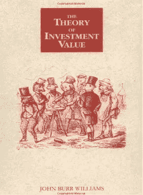
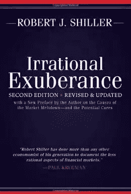
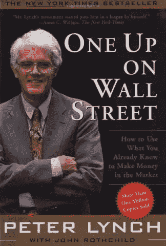
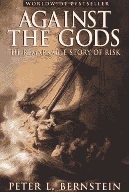
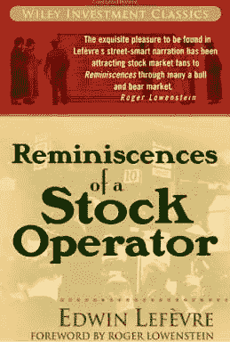
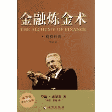
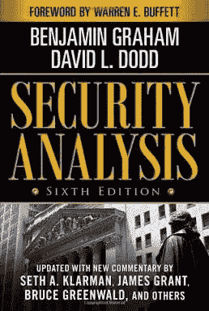
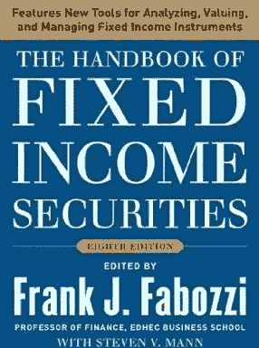

# 【知识食粮】最新华尔街牛人必读书籍排行

> 原文：[`mp.weixin.qq.com/s?__biz=MzAxNTc0Mjg0Mg==&mid=401910135&idx=1&sn=43d5eb7549281bb9231a3be831302139&chksm=09ff6b623e88e2748eae3431fbab1d7aaa40a75d5ef9932c959c1ce7eb29d00e55849809695c&scene=27#wechat_redirect`](http://mp.weixin.qq.com/s?__biz=MzAxNTc0Mjg0Mg==&mid=401910135&idx=1&sn=43d5eb7549281bb9231a3be831302139&chksm=09ff6b623e88e2748eae3431fbab1d7aaa40a75d5ef9932c959c1ce7eb29d00e55849809695c&scene=27#wechat_redirect)

**谢谢大家支持，可以让更多朋友和有兴趣志同道合的人关注这个公众号。让知识传播的更加富有活力，谢谢各位读者。**

很多人问我为什么每次的头像是奥黛丽赫本，我只能说她是我女神，每天看看女神也是不错的嘛！

**查看之前博文点击右上角关注查看历史消息**

> 美国金融博客网站 BusinessInsider 列出了华尔街人必读的 22 本金融佳作，既涵盖投资技巧，也搜罗了那些讲述曾在华尔街上演的惊心动魄的故事。这些书是经典中的经典，值得一看。

**今天推送 10 本**

1.《聪明的投资者》（The Intelligent Investor）Benjamin Graham。格雷厄姆专门为业余投资者所著，巴菲特称之为“有史以来最伟大的投资著作”。

2.《怎样选择成长股》（Common Stocks and Uncommon Profits）Philip Fisher

巴菲特称自己的投资策略是“85%的格雷厄姆和 15%的费舍尔”。

3.《投资价值理论》（The Theory of Investment Value）John Burr Williams

 

4.《非理性繁荣》（Irrational Exuberance）Robert Shiller

作者罗勃·席勒也是 2013 年诺贝尔经济学奖得主。《纽约客》评论道：《非理性繁荣》不仅预言了市场的衰落，更为重要的是，它对于解读投机性泡沫的产生和持续进行了严谨而有益的尝试。

 

5.《彼得·林奇的成功投资》（One Up on Wall Street）Peter Lynch

彼得·林奇是全球首屈一指的投资专家，本书总结了股票投资的诸多技巧，向广大的中小投资者提供了简单易学的投资分析方法，这些方法是作者多年的经验总结，具有很强的实践性，对于业余投资者来说尤为有益。

 

6.《与天为敌：风险探索传奇》（Against the Gods）Peter L. Bernstein

 

7.《股票作手回忆录》（Reminiscences of a Stock Operator）Edwin Lefevre

 

8.《金融炼金术》（The Alchemy of Finance）George Soros

本书是索罗斯的投资日记。索罗斯也许是有史以来知名度最高和最具传奇色彩的金融大师。这本书讲述了索罗斯如何分析个股、如何把握市场转变的时机、如何面对不利市场行情并及时调整对策。

 

9.《证券分析》（Security Analysis）Benjamin Graham and David Dodd。

格雷厄姆的经典名著，一直被各类投资者奉为价值投资的圣经。

10.《固定收益证券手册》（The Handbook of Fixed Income Securities）Frank J. Fabozzi

**量化投资与机器学习**

**知识、能力、深度、专业**

**勤奋、天赋、耐得住寂寞**

