# 【分级基金】之分级 A 的隐含收益率研究分析

> 原文：[`mp.weixin.qq.com/s?__biz=MzAxNTc0Mjg0Mg==&mid=401876825&idx=1&sn=d2eed5059426af15d1eb60821ccc9bcf&chksm=09ffe54c3e886c5a2ee2112f95bf9ebf9116b255dbbcdba2add715cc9678fc8e060f99a81c97&scene=27#wechat_redirect`](http://mp.weixin.qq.com/s?__biz=MzAxNTc0Mjg0Mg==&mid=401876825&idx=1&sn=d2eed5059426af15d1eb60821ccc9bcf&chksm=09ffe54c3e886c5a2ee2112f95bf9ebf9116b255dbbcdba2add715cc9678fc8e060f99a81c97&scene=27#wechat_redirect)

> **今天给大家介最近在分级基金研究一些小成果，希望大家能学到一点知识，那我也是欣慰的^_^o~ 努力！**

****谢谢大家支持，可以让更多朋友和有兴趣志同道合的人关注这个公众号。让知识传播的更加富有活力，谢谢各位读者。****

**很多人问我为什么每次的头像是奥黛丽赫本，我只能说她是我女神，每天看看女神也是不错的嘛！**

****查看之前博文点击右上角关注查看历史消息****

****分级 A 隐含收益率详细分析****

* * *

**最近在研究分级基金，发现分级 A 的隐含收益率很有意思，所以做了一些拓展和研究，发现真是有学问在里面，今天把自己得研究分享给大家，说不定以后你也会用到。**下面的所有公式我都推导过一遍，可以保证准确性！！！****

> ****分级基金简介****

**分级基金是一种特殊的可分离基金，母基金是普通的开放式基金，将收益与风险进行不对称分割，形成低风险与高风险两种份额，这两个份额在交易所上市交易。** 

**低风险 A 类份额，每年获取约定的收益，约定收益率多与定存利率挂钩。高风险 B 类份额，获取分配完 A 类份额约定收益后母基金的剩余收益，因而具备一定的杠杆性质。由于 A 类产品的约定收益率不同、市场利率变化，分级 A、B 都会有一定的折溢价交易，但是因为套利机制存在，A+B 的交易价格又始终围绕母基金净值波动。**

**分级基金有三项重要条款,分别为配对转换条款、定期折算条款和不定期折算条款。其中，不定期折算条款又分为向上折算和向下折算。**

**配对转换条款使分级基金可以合并分拆并进行折溢价套利,决定了 A+B 价始终围绕母基金净值波动。定期折算条款决定了分级 A 的债券属性；不定期折算，向上折算条款保证了 B 的杠杆，向下折算，保证了 A 的安全，同时决定了分级 A 的期权属性。分级 A 产品可以拆分成永续浮息债和二元期权。**

**目前，分级基金市值已经超过千亿，逐渐形成了具有一定规模的衍生品市场。早期发行的分级基金条款差异较大，经过多年的探索与发展，分级基金各项条款逐步呈现由繁入简，由封闭式到开放式，由有限存续期型到永续型，由固定利率到浮动利率，由分化到统一的规律。**

**大概就先介绍到这里吧，本文的重点是 A 隐含收益率。以后会陆续详细介绍分级基金的各种知识。下面正式进入正题。**

> ****A 隐含收益率****

****隐含收益率是一个适用于评价所有 A 份额的综合指标。****

**但它不能直观地看得见摸得着，显得十分抽象。这有点像物理学中密度概念的含义。在阿基米德发明密度概念之前，古代的国王们只要打造个皇冠、首饰之类的器件总是被工匠所蒙蔽。工匠扣下些金子，掺入等重的银，同样金光闪闪，浑然不觉。阿基米德通过计算密度，解一组二元一次方程，就知道皇冠被掺入了多少比例的银，将工匠抓个现行。**

**隐含收益率的核心是收益率，而计算收益率就要涉及投入和回报。如果在二级市场买入 A 份额，那么投入就是支付的价格，回报则是基金合同约定的定期或不定期折算的母基金份额。银行有一种业务叫整存零取。如果有本金 100 元，存款利率是 5%，办理整存零取业务就能够每年获得 5 元的利息。隐含收益率就相当于这个存款利率。只是二级市场 A 份额的价格总是变动的，未来的回报则不因交易行为发生改变，因此隐含收益率也是动态变化的。熟悉固定收益的亲们就会知道，隐含收益率就是债券到期收益率的概念。**

**为了进一步解释清楚隐含收益率，我们首先要来看看 A 份额的现金流。由于 A 份额的约定收益率要锚定一年期定期存款利率，为了分析的便利，我们引入两个假设条件：（1）最近定折时点后的每年约定收益率 R1 为按照最新一年期定期存款利率计算的约定收益率水平，并且假设后续定折的约定收益率都为 R1。最近定折的约定回报 R0 在期初已经确定，不需假定；（2）后续定折的间隔时间是 1 年，且是永续的。**

**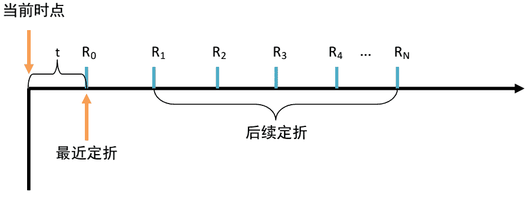**

**注：P 是 A 份额当前的价格，t 是当前时间距离最近一次定折的时间。R0 是最近一次定折的约定回报（注意：对于新成立的基金，该约定回报不一定等于约定收益率），R1 是根据最新一年期定期存款利率计算的后续定折约定收益率。**

**对于第一个假设条件，后续定折的每年约定收益率是按照期初公布的一年期定期存款利率设定的。如果假设后续定折的每年约定收益率是相同的，即相当于假设每年的一年期定期存款利率是相同的，这与实际情况显然不符。这个假设条件需要修正为约定收益率服从一个利率的随机过程，可以考虑采用 CIR model 或 HJM model。**

**　　 虽然这是个弱假设，但利率水平的波动影响的是所有 A 份额的未来现金流。在恒定约定收益率的假设基础上计算的隐含收益率不会影响 A 份额的相对价值判断**

**现在我们可以得出隐含收益率的公式了：**

**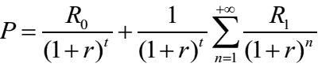** 

**这个公式我推导过，要用到等比求和和极值的方法。** 

**我顺便把等比求和的两个公式给大家复习一下。**

**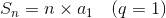**

**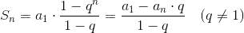**

**然后呢， 进一步得到下面这个公式：** 

**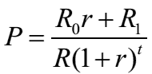**

**虽然上面那个隐含收益率的等式没有解析解，但我们可以通过数值计算方法来求得真实解。都说算法是程序的灵魂，给各位推荐两种算法。第一种算法是二分法。在其他参数不变的情况下，隐含收益率变小，价格会上升。因此，可以认为关于隐含收益率的方程是单调的，从而可以采用二分法来求解。但二分法需要事先判断隐含收益率的区间。正常情形下，隐含收益率会落在 0 至 10%区间。但是，如果一不小心将参数 5.75%输为 5.75，程序就会陷入万劫不复的死循环。我更中意另一种算法，牛顿切线法。该算法只需要指定一个初始值，初始值的指定也具有很强的随意性，并且能够快速迭代至真实解，这也更符合计算科学中的鲁棒性。**

**　　 用数值计算得到的隐含收益率与常用算法计算的结果会有一些差异。只要参数 R0 与 R1 相差不大，那么两者结果也不会有明显差异。但从严谨的角度来看，数值计算算法能为 A 份额的投资决策提供重要依据，尤其对于以 BP 为单位计算投资收益的固定收益亲们而言，意义就很重大了。**

**在这里再给大家补充一下解析解和数值解的区别**

> **解析解(analytical solution)**

**就是一些严格的公式，给出任意的自变量就可以求出其因变量，也就是问题的解，他人可以利用这些公式计算各自的问题。所谓的解析解是一种包含分式、三角函数、指数、对数甚至无限级数等基本函数的解的形式。用来求得解析解的方法称为解析法。比如一元二次方程：**

**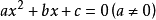**

**其求解公式是**

**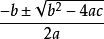**

**这就是解析解。**

**解析解的准确含义依赖于何种运算称为常见运算或常见函数。传统上，只有初等函数被看作常见函数，无穷级数、序列的极限、连分数等都不被看作常见函数。按这种定义，许多累积分布函数无法写成解析形式。但如果我们把特殊函数，比如误差函数或伽玛函数也看作常见函数，则累积分布函数可以写成解析形式。**

> ****数值解(numerical solution)****

**采用某种计算方法,如有限元的方法，数值逼近,插值的方法，得到的解。别人只能利用数值计算的结果，而不能随意给出自变量并求出计算值。**

**比如上面给出了一元二次方程的解析解，在求一个已知系数的一元二次方程时，将系数的具体取值代入则可以得到其数值解。**

**可以这样来理解二者的区别，解析解是一个求解公式，它适用于所有这类方程的求解，而数值解是某个特定方程的具体的解。**

> ****还有一种算法是下面又一重要介绍的：****

**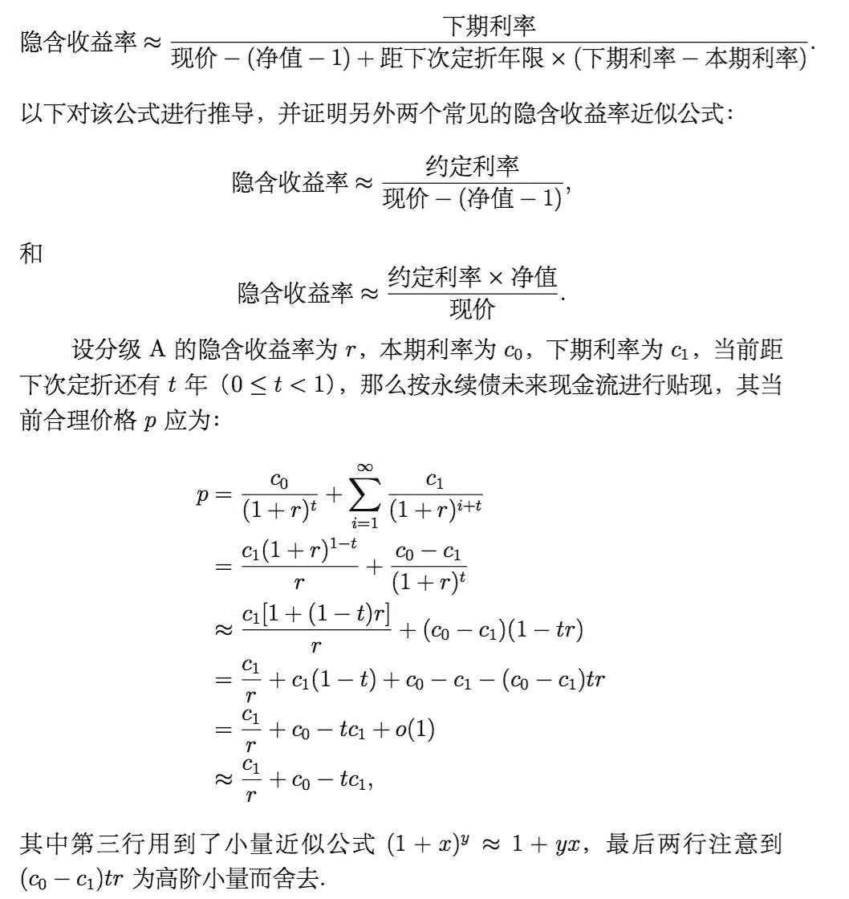**

**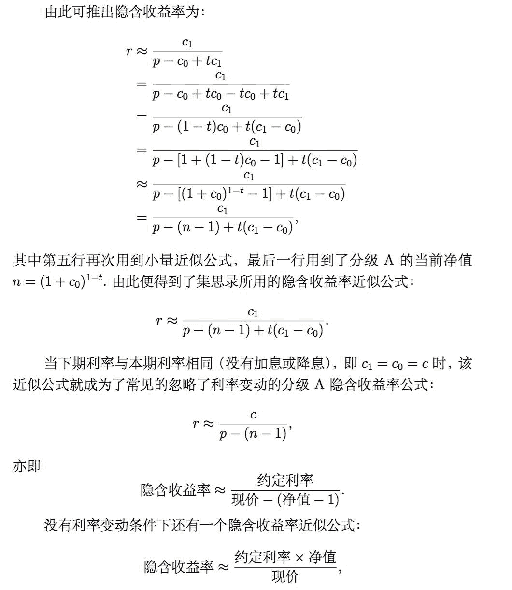**

**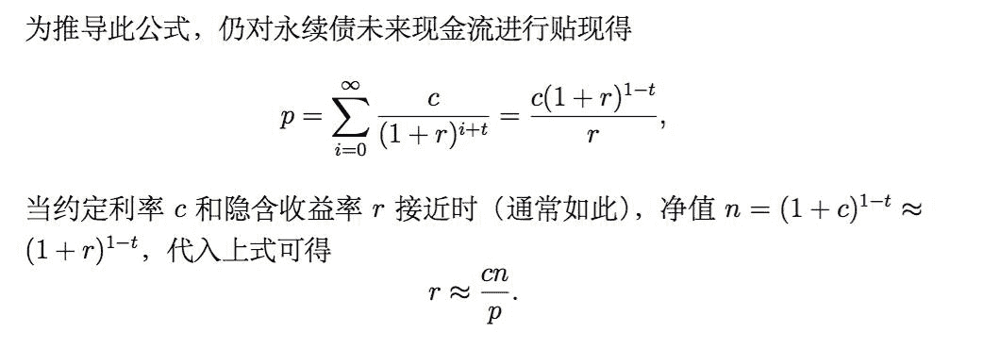**

**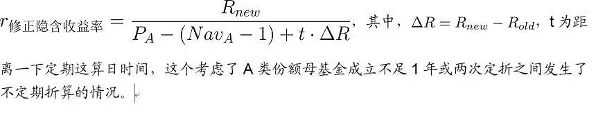**

**我还在找到了一个更加详细的解释，**以上公式和下面的公式我都算过推导一遍，他们的准确性可以保证。****

****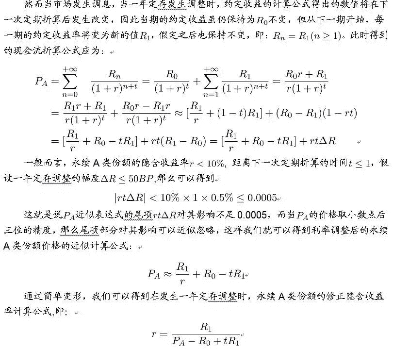**** 

**当然这个问题可以用 Microsoft Excel 里的一个函数去做，我先把这个函数介绍一下：**

# ****XIRR 函数****

* * *

# **语法：XIRR(values, dates, [guess])**

**XIRR 函数语法具有下列参数：**

**· **值** 必需。 与 dates 中的支付时间相对应的一系列现金流。首期支付是可选的，并与投资开始时的成本或支付有关。 如果第一个值是成本或支付，则它必须是负值。 所有后续支付都基于 365 天/年贴现。 值系列中必须至少包含一个正值和一个负值。**

**· **日期** 必需。 与现金流支付相对应的支付日期表。 日期可按任何顺序排列。应使用 DATE 函数输入日期，或者将日期作为其他公式或函数的结果输入。 例如，使用函数 DATE(2008,5,23) 输入 2008 年 5 月 23 日。 如果日期以文本形式输入，则会出现问题 。**

**· **Guess** 可选。 对函数 XIRR 计算结果的估计值。**

## **备注**

**· Microsoft Excel 可将日期存储为可用于计算的序列号。默认情况下，1900 年 1 月 1 日的序列号是 1，而 2008 年 1 月 1 日的序列号是 39448，这是因为它距 1900 年 1 月 1 日有 39448 天。**

**· Dates 中的数值将被截尾取整。**

**· 函数 XIRR 要求至少有一个正现金流和一个负现金流，否则函数 XIRR 返回 错误值 #NUM!。**

**· 如果 dates 中的任一数值不是有效日期，函数 XIRR 返回 错误值 #VALUE!。**

**· 如果 dates 中的任一数字早于开始日期，函数 XIRR 返回 错误值 #NUM!。**

**· 如果 values 和 dates 所含数值的数目不同，函数 XIRR 返回 错误值 #NUM!。**

**· 大多数情况下，不必为函数 XIRR 的计算提供 guess 值。 如果省略， guess 值假定为 0.1(10%)。**

**· 函数 XIRR 与净现值函数 XNPV 密切相关。函数 XIRR 计算的收益率即为函数 XNPV = 0 时的利率。**

**· Excel 使用迭代法计算函数 XIRR。 通过改变收益率（从 guess 开始），不断修正计算结果，直至其精度小于 0.000001%。如果函数 XIRR 运算 100 次，仍未找到结果，则返回 错误值 #NUM!。 函数 XIRR 的计算公式如下：**

**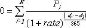** 

**其中：**

**di = 第 i 个或最后一个支付日期。**

**d1 = 第 0 个支付日期。**

**Pi = 第 i 个或最后一个支付金额。**

**我们因此可以发现隐含收益率的问题在数学上就是求解这个方程：** 

****0 = C0 + C1/(1+rate)¹ +C2/(1+rate)²…………+Cn-1/(1+rate)^(n-1)+….****

**有时候第一期计算时间不一定是一年，如果以一年来算，结果是不准确的，上述公式可以改写成：** 

****0 = C0 + C1/(1+rate)^y +C2/(1+rate)^(1+y)…+Cn-1/(1+rate)^(n-2+y)+….****

**因为这个等式中 C0 小于 0，C1,C2….Cn-1 都是大于 0 的，所以这个方程是具备单调性的，可以编程采用二分法较快的求出精度较高的近似解。**

**那么我们再回过头来看 XIRR。**

> ****XIRR 算法之各期利率****

**1.第一期现金流可能要手动计算一次，不一定等于本期利率，注意！！！因为高低折或新发行的原因，本次派息周期可能不是正好 365 天
2.第二期现金流=下期利率
3.第三期现金流到第 N 年都=下下期利率**

> ****XIRR 算法之派息次数****

**试了多个方案，最后发现取 500 年比较合适，再多了白白增加计算量。500 年和 1000 年的误差就只有 0.02 基点。**

> ****XIRR 算法之每年派息日****

**第一年比如是 2015-7-1，第二年不要+365 天，要加 365.2422 天。加 365 天 500 年后的派息日误差超过了几个月，不是 7.1 日了，变成 3 月或者 4 月了**

**举个例子我实际算过的：**

**150205 国防 A**

**2015-7-15，收盘价 0.855 元，100 年 5.973%，500 年 5.992%，与万得算出的 5.976%，误差 0.3 基点。**

**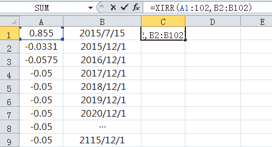** 

**我再解释一下：**

**国防在每年 12/1 折算的时候，使用的利率是今年 1/1 日的
150205 国防 A
0.8552015/7/14
-0.0331 2015/12/1（2015/12/1 ~ 2015/7/15）/365*0.0575
-0.0575 2016/12/1 (这期发放的利息是 2015/12/1 定折时，用的 2015/1/1 的利率)
-0.0500 2017/12/1
-0.0500 2018/12/1
-0.0500 2019/12/1
-0.0500 2020/12/1
-0.0500 2021/12/1
-0.0500 2022/12/1
- ......................................
-0.0500 2114/12/1
-0.0500 2115/12/1**

> ****这样就算出来了。真是费了好大周折，不过把他们完全搞明白也是件开心的事情啊。****
> 
> ****总之我觉得学习就是要把每一个不懂的问题弄懂弄透彻才是最好的。今天的推文就到这里吧。大家能学到东西是最好的。****

****量化投资与机器学习****

****知识、能力、深度、专业****

****勤奋、天赋、耐得住寂寞****

**** 

****