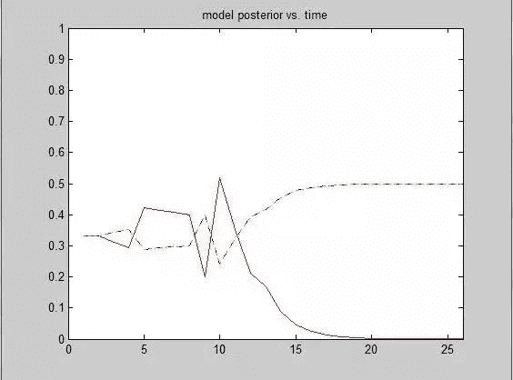
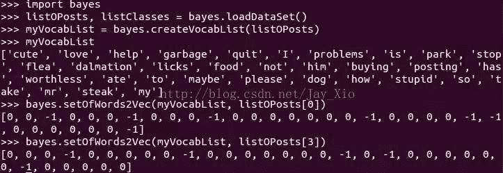
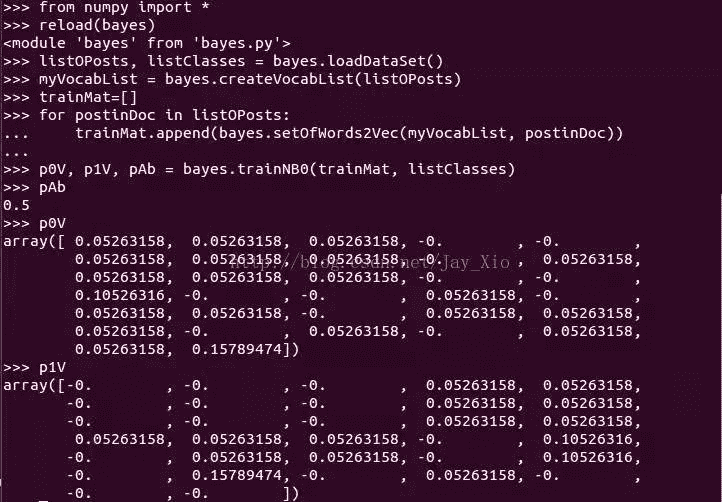
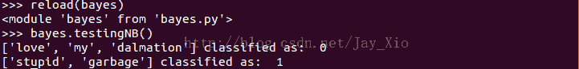
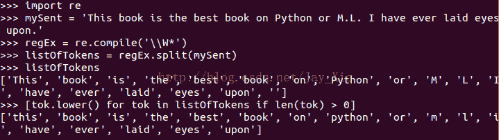
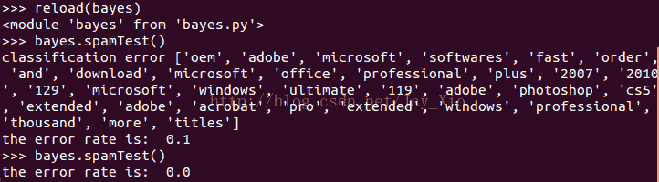

# 朴素贝叶斯模型(NBM)详解与在 Matlab 和 Python 里的具体应用

> 原文：[`mp.weixin.qq.com/s?__biz=MzAxNTc0Mjg0Mg==&mid=401834925&idx=1&sn=d56246158c1002b2330a7c26fd401db6&chksm=09f841b83e8fc8aedd11072c084bcf85e59abaafc9bf84be314b1d97352a83b9e9c4c97cb42e&scene=27#wechat_redirect`](http://mp.weixin.qq.com/s?__biz=MzAxNTc0Mjg0Mg==&mid=401834925&idx=1&sn=d56246158c1002b2330a7c26fd401db6&chksm=09f841b83e8fc8aedd11072c084bcf85e59abaafc9bf84be314b1d97352a83b9e9c4c97cb42e&scene=27#wechat_redirect)

> **今天给大家介绍机器学习的一种分类模型朴素贝叶斯模型，这是我整理了好久的文章，希望大家能学到一点知识我也是欣慰的^_^o~ 努力！**

**********谢谢大家支持，可以让更多朋友和有兴趣志同道合的人关注这个公众号。让知识传播的更加富有活力，谢谢各位读者。**********

**********查看之前博文点击右上角关注查看历史消息**********

* * *

************点击**阅读原文**可获得工具包连接与**密码:sm2s**************

************回复**贝叶斯 Matlab**可获取全部**文章 Word 版**************

**************贝叶斯 T****homas Bayes**，英国数学家。他首先将归纳推理法用于概率论基础理论，并创立了贝叶斯统计理论，对于统计决策函数、统计推断、统计的估算等做出了贡献。************ 

**********贝叶斯决策理论**是主观贝叶斯派归纳理论的重要组成部分。贝叶斯决策就是在不完全情报下，对部分未知的状态用主观概率估计，然后用贝叶斯公式对发生概率进行修正，最后再利用期望值和修正概率做出最优决策。其基本思想是：　　********

*   ********　　1、已知类条件概率密度参数表达式和先验概率。********

*   ********　　2、利用贝叶斯公式转换成后验概率。********

*   ********　　3、根据后验概率大小进行决策分类。********

**********贝叶斯公式：**********

********　　　　 　　 **P(B[j]|A[i])=P(A[i]|B[j])P(B[j]) / P(A[i])**********

********　　未知事件中 A[i]出现时 B[j]出现的**后验概率**在主观上等于已有事件中 B[j]出现时 A[i]出现的**先验概率**值乘以 B[j]出现的**先验概率**值然后除以 A[i]出现的**先验概率**值最终得到的结果。这就是贝叶斯的核心思想：用先验概率估计后验概率。********

********　　具体到分类模型中，上述公式可以理解为：将 B[j]看作分类的一种，将 A[i]看作样本的特征属性之一，此时等号左边为**待分类样本**中出现特征 A[i]时该样本属于类别 B[j]的概率 P(B[j]|A[i])，而等号右边是根据**训练样本**统计得到的特征 A[i]出现子类别 B[j]中的概率 P(A[i]|B[j])乘以类别 B[j]在**训练样本**中出现的概率 P(B[j])最后除以特征 A[i]在**训练样本**中出现的概率 P(A[i])。********

********　　以下为基本的概念介绍，有概率论知识基础的可以跳过，这部分主要是为一些不理解上面公式的初始学习者进行指导。********

********　　定义 1\. 一个随机试验 E 所有可能的结果构成的集合称为该随机试验 E 样本空间，记为 S。样本空间的元素，即 E 的每个结果，称为样本点。试验 E 的样本空间 S 的子集为 E 的随机事件，简称为事件。********

********　　定义 2\. 设 E 是随机事件，S 是它的样本空间。对于 E 的每一事件 A 赋予一个实数，记为 P(A)，称为事件发生的概率。********

********　　定义 3\. 设 A，B 是两个事件，且 P(A)>0，则称 P(B|A)=P(AB)/P(A)为在事件 A 发生的条件下事件 B 发生的条件概率，其中 P(AB)表示事件 A 与事件 B 同时出现的概率，公式 P(B|A)=P(AB)/P(A)称为条件概率公式。********

********　　根据条件概率公式可知：P(AB)=P(B|A)P(A)，若 B[1],B[2],……,B[m]为样品空间 S 的一个划分，且 P(B[i])>0, i = 1,2,……,m，则有 P(A[i]) = P(A[i]|B[1])P(B[1]) +P(A[i]|B[2])P(B[2]) + …… + P(A[i]|B[m])P(B[m])；故有贝叶斯的另一种形式：********

**********P(B[j]|A[i])=P(A[i]|B[j])P(B[j])/** **∑P(A[i]|B[j])P(B[j])**********

**********　　朴素贝叶斯**是基于一个简单假设所建立的一种贝叶斯方法，朴素贝叶斯假定样本的不同特征属性对样本的归类影响时相互独立的。此时若样本 A 中同时出现特征 A[i]与 A[k],则样本 A 属于类别 B[j]的概率为：********

********　　　**P(B[j]|A) = P(B[j]|A[i],A[k]) = P(B[j]|A[i])P(B[j]|A[k])**********

********　　**朴素贝叶斯模型：**********

********样本 a=(a[1], a[2], ……, a[n]);为 n 维布尔向量，用来表示样本 a 中特征 A[i]是否出现。********

**********　　类别 B∈{B[1], B[2], ……, B[m]}为 m 类的分类问题，B[j]表示 m 个类别中的一个。**********

********　　训练样本 x[1], x[2], ……, x[t],其中 x[k]=(x[k][1], x[k][2], ……, x[k][n])为 n 维布尔向量，训练样本的类别为 b[1], b[2], ……, b[t];********

********　　现考虑待分类样本 y=(y[1], y[2], ……, y[n]);属于每个类别的概率情况。********

********　　1、考虑训练样本中类别 B[j]的概率值 P(B[j])********

********　　　　P(B[j]) = 类别为 B[j]的训练样本数 / 总训练样本数 t********

********　　2、考虑训练样本中特征 A[i]在类别 B[j]中的出现的相对概率值 P(A[i]|B[j])********

********　　　　P(A[i]|B[j]) = 类别为 B[j]并包含特征 A[i]的训练样本数 / 类别为 B[j]的训练样本数********

********　　3、根据 1、2 计算训练样本中特征 A[i]的概率值 P(A[i])********

********　　　　P(A[i]) = ∑P(A[i]|B[j])P(B[j])********

********　　4、根据贝叶斯公式计算待分类样本中出现特征 A[i]时样本属于 B[j]的相对概率 P(B[j]|A[i])********

********　　　　P(B[j]|A[i]) = P(A[i]|B[j])P(B[j]) / P(A[i])********

********　　5、根据朴素贝叶斯的假设得出样本 y 属于类别 B[j]的概率 P[j]********

********　　　　P[j] = ∏ P(B[j]|A[i])*y[i]********

********　　6、同法求出样本 y 属于其他各个类别的概率从而得到：P[1], P[2], ……, P[m]。然后在对这 m 个概率值进行归一化，并排序，从而得到待分类样本 y 属于各个类别的相似度以及最终的归类********

> # **********Matlab 贝叶斯网络建模**********

## **********1、 FullBNT 简介**********

* * *

## ********基于 Matlab 的贝叶斯网络工具箱 BNT 是 kevinp.murphy 基于 matlab 语言开发的关于贝叶斯网络学习的开源软件包，提供了许多贝叶斯网络学习的底层基础函数库，支持多种类型的节点（概率分布）、精确推理和近似推理、参数学习及结构学习、静态模型和动态模型。******** 

## **********2、向 matlab 中添加 FULLBNT，参考地址：**********

* * *

## ********http://hi.baidu.com/73290673/item/21db99f36d90bc49932af29d******** 

********采用 MATLAB 语言编制的贝叶斯网络工具箱(Bayesian Networks Toolbox,BNT)可实现贝叶斯网络结构学习、参数学习、推理和构建贝叶斯分类器,此工具箱在贝叶斯学习编 程方面非常灵活。
官方主页：http://www.cs.ubc.ca/~murphyk/Software/BNT/bnt.html
官方下载：http://www.cs.ubc.ca/~murphyk/Software/BNT/FullBNT-1.0.4.zip
原文链接：http://hi.baidu.com/zgyz/blog/item/2d3627f415c7fbe77709d763.html
贝叶斯网络：http://www.cs.ubc.ca/~murphyk/Software/BNT/bnt.html
语音工具箱：http://www.ee.ic.ac.uk/hp/staff/dmb/voicebox/voicebox.html
1、解压 FullBNT-1.0.4.zip，将整个目录 FullBNT-1.0.4 复制到 MATLAB 的安装目录的 TOOLBOX 目录下，如 D:\MATLAB7\toolbox\
2、打开 Matlab，在 MATLAB 命令窗口中输入以下命令：
>> cd D:\MATLAB7\toolbox\FullBNT-1.0.4
>> addpath(genpathKPM(pwd))
>>
将 TOOLBOX 下新加的 BNT 工具箱加到 MATLAB 的搜索路径中去。
添加 BNT 工具箱的 MATLAB 的搜索路径也可采用如下指令
>> addpath(genpath('D:\MATLAB7\toolbox\FullBNT-1.0.4'))
>>
3、为了永久保存上面的路径，以免下次重启 MATLAB 时重新添加，在 MATLAB 命令窗口下使用下面的命令：
>> savepath
>>
4、检验是否成功设置的方法：
在命令窗口中输入以下命令：which test_BNT.m（可以为所加工具箱的任一个 M 文件名称），如果显示正确，就说明上面的设置成功。
>> which test_BNT.m
D:\MATLAB7\toolbox\FullBNT-1.0.4\BNT\test_BNT.m
>>********

**********3、关于 FULLBNT 使用简单教程**********

* * *

********http://www.cs.ubc.ca/~murphyk/Software/BNT/usage.html#examples******** 

********http://blog.sina.com.cn/s/blog_6c7b434d01013ufz.html********

### **********4、结构学习算法函数**********

* * *

### ********BNT 中提供了较为丰富的结构学习函数，都有：******** 

********1.学习树扩展贝叶斯网络结构的 TANC 算法.********

********2.数据完整条件下学习一般贝叶斯网络结构学习算法********

**********数据完整条件下贝叶斯结构算法**********

| 算法名称 | 调用函数 |
| K2 算法 | *learn_struct_k2()* |
| 贪婪搜索 GS（greedy search）算法 | *earn_struct_gs()* |
| 爬山 HC（hill climbing）算法 | *learn_struct_hc()* |
| …… | …… |

********3.缺失数据条件下学习一般贝叶斯网络结构学习算法********

**********缺失数据条件下贝叶斯结构算法**********

| 算法名称 | 调用函数 |
| 最大期望 EM（expectation maximization）算法 | *learn_struct_EM**（）* |
| MCMC（Markov Chain Monte Carlo） | *learn_struct_mcmc()* |
| …… | …… |

### ********参数学习算法函数********

********1.BNT 中也提供了丰富的参数学习函数，都有：********

********2.完整数据时，学习参数的方法主要有两种：最大似然估计*learn_params()*和贝叶斯方法*bayes_update_params()*;********

********3.数据缺失时，如果已知网络拓扑结构，用 EM 算法来计算参数， *learn_params_em ()*。********

### ********推理机制及推理引擎********

### ********为了提高运算速度，使各种推理算法能够有效应用，BNT 工具箱采用了引擎机制，不同的引擎根据不同的算法来完成模型转换、细化和求解。这个推理过程如下。********

********BNT 中提供了多种推理引擎，都有：********

**********BNT 推理引擎**********

| 算法名称 | 调用函数 |
| 联合树推理引擎 | *jtree_inf_engine()* |
| 全局联合树推理引擎 | *global_joint_inf_engine()* |
| 信念传播推理引擎 | *belprop_inf_engine()* |
| 变量消元推理引擎 | *var_elim_inf_engine()* |
| 采样传播引擎 | *gibbs_sampling_inf_engine* |

## **********5、 参数学习**********

* * *

## ********在 BNT 中，参数评估程序可以分为 4 类。分类依据是否目标是通过参数或仅仅一个点的估计来计算贝叶斯全部的后验概率，是否全部的节点是可观察的或者存在数据/隐含变量（局部可观察）。******** 

|   | Full obs | Partial obs |
| Point | *learn_params* | *learn_params_em* |
| Bayes | *Bayes_update_params* | *not yet supported* |

**********Noisy-or****节点**********

********一个 Noisy-or 节点就像通常的“或”门一样，但有时父节点的效果将被抑制。受抑制的父节点*i*的概率用  来表示。一个节点 C，有两个父节点 A 和 B，有如下 CPD，使用 F 和 T 来表达关和开，（在 BNT 中是 1 和 2）。********

| A | B | P(C=off) | P(C=on) |
| F | F | 1.0 | 0.0 |
| T | F | qA) | 1-q(A) |
| F | T | q(B) | 1-q(B) |
| T | T | q(A)q(B) | 1-q(A)q(B) |

**********Softmax****节点**********

**********神经网络节点** 使用一个多层感知器实现了从连续父节点向离散子节点的映射。********

**********高斯节点** 将连续值的节点处理成一个离散的情况********

**********广义线性模型节点**********

**********分类/****回归树节点**********

### **********最大似然参数估计**********

********bnet3 = learn_params(bnet2,samples);********

### **********先验参数分布**********

********tabular_CPD(bnet, i, 'prior_type','dirichlet', 'dirichlet_type', 'unif');********

|   | B=1 | B=2 | B=3 |
| A=1 | 1 | 1 | 1 |
| A=2 | 1 | 1 | 1 |

********tabular_CPD(bnet, i, 'prior_type','dirichlet', 'dirichlet_type', 'BDeu');********

|   | B=1 | B=2 | B=3 |
| A=1 | 1/6 | 1/6 | 1/6 |
| A=2 | 1/6 | 1/6 | 1/6 |

********我们将 N/(q*r) 放入每个格；N 是等效的样本大小，r=|A|,q = |B|. 这可以按如上面方式创建：********

********tabular_CPD(bnet, i, 'prior_type','dirichlet', 'dirichlet_type', ...********

********'BDeu', 'dirichlet_weight', 10);********

********这里 1 是等效样本大小，也是先验概率的强度。你可以使用上面面方式更改它，********

## **********6、结构学习**********

* * *

**********算法概要**********

| 贝叶斯模型选择算法 |
| 1.建立模型 A->B，生成样本数据 |
| 2.建立所有可能的结构: (1)A B, (2)B<-A, (3) A->B 并计算先验概率 |
| 3.模型 2 和模型 3 为 Markov equivalent |
| 4.B 节点使用 noisy Not gate |
| 5.正确的模型在 12 次后收敛 |

**********代码示例**********

| % 贝叶斯选择模型示例.% 建立模型 A->B，生成样本数据% 建立所有可能的结构: (1)A B, (2)B<-A, (3) A->B 并计算先验概率% 模型 2 和模型 3 为 Markov equivalent% B 节点使用 noisy Not gate% 正确的模型在 12 次后收敛% ground truthN = 2;dag = zeros(N);A = 1; B = 2;dag(A,B) = 1;ntrials = 25;ns = 2*ones(1,N);true_bnet = mk_bnet(dag, ns);true_bnet.CPD{1} = tabular_CPD(true_bnet, 1, [0.5 0.5]);pfail = 0.1;psucc = 1-pfail;true_bnet.CPD{2} = tabular_CPD(true_bnet, 2, [pfail psucc; psucc pfail]);% NOT gateG = mk_all_dags(N);nhyp = length(G);hyp_bnet = cell(1, nhyp);for h=1:nhyphyp_bnet{h} = mk_bnet(G{h}, ns);for i=1:Nfam = family(G{h}, i);hyp_bnet{h}.CPD{i}= tabular_CPD(hyp_bnet{h}, i, 'prior_type', 'dirichlet', ...'CPT', 'unif');endend% 结构先验，假设为均匀分布 prior = normalise(ones(1, nhyp));% 保存结果并初始化训练结构 init_hyp_bnet = hyp_bnet;init_prior = prior;rand('state', 0);hyp_w = zeros(ntrials+1, nhyp);hyp_w(1,:) = prior(:)';data = zeros(N, ntrials);% 逐步计算后验概率 LL = zeros(1, nhyp);ll = zeros(1, nhyp);for t=1:ntrialsev = cell2num(sample_bnet(true_bnet));data(:,t) = ev;for i=1:nhypll(i) = log_marg_lik_complete(hyp_bnet{i}, ev);hyp_bnet{i} = bayes_update_params(hyp_bnet{i}, ev);endprior = normalise(prior .* exp(ll));LL = LL + ll;hyp_w(t+1,:) = prior;end% Plot，模型后验概率% Red = model 1 (no arcs), blue/green = models 2/3 (1 arc)% Blue = model 2 (2->1)% Green = model 3 (1->2, "ground truth")if 1figure;m = size(hyp_w, 1);h=plot(1:m, hyp_w(:,1), 'r-', 1:m, hyp_w(:,2), 'b-.', 1:m, hyp_w(:,3), 'g:');axis([0 m 0 1])title('model posterior vs. time')drawnowend% 检验结果 hyp_bnet2 = init_hyp_bnet;prior2 = init_prior; |

**************** 

**********图为贝叶斯模型选择后验概率对比**********

********BNT 中的结构学习程序可以按类似参数学习的情况分成四类：********

|   | Full obs | Partial obs |
| Point | *learn_struct_K2* | *not yet supported* |
| Bayes | *learn_struct_mcmc* | *not yet supported* |

### **********Markov 等效**********

********如果两个 DAGs 编码同样的条件独立，它们被叫做 Markov 等效。所有 DAGs 的集合可以被分割成 Markov 等效类。同一类内的线图可以有方向，它们弧的颠倒不会改变任何 CI 关系。每一类都可以用一个 PDAG（partially directed acyclic graph，局部有向非循环图）这种图被称为本质图或方向图。这个详细说明哪个边必须在某一个方位上被定向，哪个可能被颠倒。********

**********穷举搜索**********

********结构学习的强有力手段是列举 DAGs 的所有可能性，并对它们一一打分。这为其它算法的比较提供了一个“黄金标准”。我们按如下做：********

*********dags= mk_all_dags(N);*********

*********score= score_dags(data, ns, dags);*********

********默认的情况下，我们使用贝叶斯打分规则，并假定 CPDs 是用带有 BDeu 的先验表表示的。如果想是用一致的先验值，我们可以通过如下方法覆盖这些默认值。********

*********params = cell(1,N);*********

*********for i=1:N*********

*********params{i} = {'prior', 'unif'};*********

*********end*********

*********score = score_dags(data, ns, dags, 'params', params,**'scoring_fn','bic');*********

********实际上不能列举 N>5 的所有可能的 DAGs。********

### **********K2 算法**********

### ********K2 算法(Cooper and Herskovits, 1992)是一种按如下方式工作的贪婪搜索算法。每一个起始点没有父节点。然后增加结果结构打分最高时的父节点。当单独添加父节点再不能提高分数时，停止添加父节点。当我们使用固定的顺序时，我们不需要做循环检查，也不需要为每个节点单独选择父节点。BNT 推广了这点允许使用任何种类的 CPD，无论贝叶斯打分规则还是 BIC，另外，你可以对每一个节点指定一个任意的父节点数量的上限。********

*********order= [C S R W];*********

*********max_fan_in= 2;*********

*********dag2=* *learn_struct_K2(data, ns, order, 'max_fan_in',max_fan_in);*********

**********爬山法**********

********爬山算法从状态空间中的一个指定点开始，考虑所有最接近的邻节点，然后移向得分最高的相邻节点。当相邻节点得分没有高于当前节点时（例如到达了局部最大值。），算法停止。然后从空间的其它部分重新开始。“相邻”通常定义为所有的图可以通过从当前的图添加、删除或翻转一个单独的弧得出，并服从无环的约束。其它相邻的可能详。********

*********learn_struct_hc()*********

**********MCMC**********

********使用 Metropolis-Hastings(MH)的马尔可夫链蒙特卡尔算法来搜索所有的图空间。标准的分配提案是考虑移动所有最近的按上面定义的邻节点。这个函数可以按如下方法调用：********

*********[sampled_graphs,accept_ratio] = learn_struct_mcmc(data, ns, 'nsamples', 500, 'burnin', 10);*********

**********SEM 算法**********

********计算贝叶斯打分时，有部分是计算具有挑战性的观测，因为参数学习的后验概率变成了多峰的状态（这是由于隐含节点导致了一个混合的分布）。因此需要使用逼近算法，如 BIC。不幸的是搜索算法仍然是代价高昂的，因为我们需要在每一步运行 EM 算法来计算 MLE********

********值，它需要对每一个模型进行计算打分。一个变换的方法是在每步进行局域搜索来替代第 M 步的 EM，当数据是“添满”状态时这种方法非常有效。——以上被称为结构上的 EM 算法（Friedman 1997）它可以通过 BIC 打分收敛的局部最大值来证明。********

## **********推断引擎**********

********创立好一个贝叶斯网络，我们现在可以用它来进行推断。贝叶斯网络中有许多不同的算法来作为推断的的工具，在速度、复杂性、普遍性和精确性上有不同的表现。BNT 因此提供了多种多样的不同的推断引擎。********

********推理引擎是一个包含了 bnet(Bayesian net )支持*enter_evidence*和*marginal_nodes*方法的对象。引擎设计者把 bnet 作为一个自变量，并且可以执行一些特殊处理的模型。当调用 *enter_evidence*，引擎可以处理一些经过特殊处理的证据。最后，当调用，*marginal_nodes*引擎可以执行一些特殊处理的查询。********

### ********4.1 联合树推断引擎（所有精确推断引擎的根本）********

*********engine= jtree_inf_engine(bnet);*********

### **********全局推理算法**********

********最简单的推理方法是直接构建所有结点的联合分布，然后得到边缘概率。这已在*global_joint_inf_engine*中实现，但它仅适用于教学和调试。********

### **********近似传播引擎**********

*********likelihood_weighting_inf_engine*，可以完成重要采样，并能够处理任意种类的结点。*gibbs_sampling_inf_engine*，由 Bhaskara Marthi 写的. 目前它仅能处理表格条件概率分布（tabular CPDs）。********

> # **********Python 贝叶斯文档分类模型**********

**********朴素贝叶斯的一般过程**********

********（1）收集数据：可以使用任何方法。本文使用 RSS 源********

********（2）准备数据：需要数值型或者布尔型数据********

********（3）分析数据：有大量特征时，绘制特征作用不大，此时使用直方图效果更好********

********（4）训练算法：计算不同的独立特征的条件概率********

********（5）测试算法：计算错误率********

********（6）使用算法：一个常见的朴素贝叶斯应用是文档分类。可以在任意的分类场景中使用朴素贝叶斯分类器，不一定非要是文本。********

**********准备数据：从文本中构建词向量**********

********[['my','dog','has','flea','problems','help','please'], 0********

********['maybe','not','take','him','to','dog','park','stupid'], 1********

********['my','dalmation','is','so','cute','I','love','him'], 0********

********['stop','posting','stupid','worthless','garbage'], 1********

********['mr','licks','ate','my','steak','how','to','stop','him'], 0********

********['quit','buying','worthless','dog','food','stupid']] 1********

********以上是六句话，标记是 0 句子的表示正常句，标记是 1 句子的表示为粗口。我们通过分析每个句子中的每个词，在粗口句或是正常句出现的概率，可以找出那些词是粗口。********

********在 bayes.py 文件中添加如下代码：********

**********[python]**  view plaincopy********

********1. # coding=utf-8********

********2.********

********3. **def** loadDataSet():********

********4. postingList = [['my', 'dog', 'has', 'flea', 'problems', 'help', 'please'],********

********5. ['maybe', 'not', 'take', 'him', 'to', 'dog', 'park', 'stupid'],********

********6. ['my', 'dalmation', 'is', 'so', 'cute', 'I', 'love', 'him'],********

********7. ['stop', 'posting', 'stupid', 'worthless', 'garbage'],********

********8. ['mr', 'licks', 'ate', 'my', 'steak', 'how', 'to', 'stop', 'him'],********

********9. ['quit', 'buying', 'worthless', 'dog', 'food', 'stupid']]********

********10. classVec = [0, 1, 0, 1, 0, 1] # 1 代表侮辱性文字，0 代表正常言论********

********11. **return** postingList, classVec********

********12.********

********13. **def** createVocabList(dataSet):********

********14. vocabSet = set([])********

********15. **for** document **in** dataSet:********

********16. vocabSet = vocabSet | set(document)********

********17. **return** list(vocabSet)********

********18.********

********19. **def** setOfWords2Vec(vocabList, inputSet):********

********20. returnVec = [0] * len(vocabList)********

********21. **for** word **in** inputSet:********

********22. **if** word **in** vocabList:********

********23. returnVec[vocabList.index(word)] = 1********

********24. **else**:********

********25. **print**  "the word: %s is not in my Vocabulary!" % word********

********26. **return** returnVec********

**********运行结果：**********

****************

**********训练算法：从词向量计算概率**********

**********[python]**  view plaincopy********

********1. # 朴素贝叶斯分类器训练函数********

********2. # trainMatrix: 文档矩阵， trainCategory: 由每篇文档类别标签所构成的向量********

********3. **def** trainNB0(trainMatrix, trainCategory):********

********4. numTrainDocs = len(trainMatrix)********

********5. numWords = len(trainMatrix[0])********

********6. pAbusive = sum(trainCategory) / float(numTrainDocs)********

********7. p0Num = zeros(numWords);********

********8. p1Num = zeros(numWords);********

********9. p0Denom = 0.0;********

********10. p1Denom = 0.0;********

********11. **for** i **in** range(numTrainDocs):********

********12. **if** trainCategory[i] == 1:********

********13. p1Num += trainMatrix[i]********

********14. p1Denom += sum(trainMatrix[i])********

********15. **else**:********

********16. p0Num += trainMatrix[i]********

********17. p0Denom += sum(trainMatrix[i])********

********18. p1Vect = p1Num / p1Denom********

********19. p0Vect = p0Num / p1Denom********

********20. **return** p0Vect, p1Vect, pAbusive********

**********运行结果：**********

****************

**********测试算法：根据现实情况修改分类器**********

********上一节中的 trainNB0 函数中修改几处：********

********p0Num = ones(numWords);********

********p1Num = ones(numWords);********

********p0Denom = 2.0;********

********p1Denom = 2.0;********

********p1Vect = log(p1Num / p1Denom)********

********p0Vect = log(p0Num / p1Denom)********

**********[python]**  view plaincopy********

********1. # 朴素贝叶斯分类器训练函数********

********2. # trainMatrix: 文档矩阵， trainCategory: 由每篇文档类别标签所构成的向量********

********3. **def** trainNB0(trainMatrix, trainCategory):********

********4. numTrainDocs = len(trainMatrix)********

********5. numWords = len(trainMatrix[0])********

********6. pAbusive = sum(trainCategory) / float(numTrainDocs)********

********7. p0Num = ones(numWords);********

********8. p1Num = ones(numWords);********

********9. p0Denom = 2.0;********

********10. p1Denom = 2.0;********

********11. **for** i **in** range(numTrainDocs):********

********12. **if** trainCategory[i] == 1:********

********13. p1Num += trainMatrix[i]********

********14. p1Denom += sum(trainMatrix[i])********

********15. **else**:********

********16. p0Num += trainMatrix[i]********

********17. p0Denom += sum(trainMatrix[i])********

********18. p1Vect = log(p1Num / p1Denom)********

********19. p0Vect = log(p0Num / p1Denom)********

********20. **return** p0Vect, p1Vect, pAbusive********

********21.********

********22. # 朴素贝叶斯分类函数********

********23. **def** classifyNB(vec2Classify, p0Vec, p1Vec, pClass1):********

********24. p1 = sum(vec2Classify * p1Vec) + log(pClass1)********

********25. p0 = sum(vec2Classify * p0Vec) + log(1.0 - pClass1)********

********26. **if** p1 > p0:********

********27. **return** 1********

********28. **else**:********

********29. **return** 0********

********30.********

********31. **def** testingNB():********

********32. listOPosts, listClasses = loadDataSet()********

********33. myVocabList = createVocabList(listOPosts)********

********34. trainMat = []********

********35. **for** postinDoc **in** listOPosts:********

********36. trainMat.append(setOfWords2Vec(myVocabList, postinDoc))********

********37.********

********38. p0V, p1V, pAb = trainNB0(array(trainMat), array(listClasses))********

********39.********

********40. testEntry = ['love', 'my', 'dalmation']********

********41. thisDoc = array(setOfWords2Vec(myVocabList, testEntry))********

********42. **print** testEntry, 'classified as: ', classifyNB(thisDoc, p0V, p1V, pAb)********

********43.********

********44. testEntry = ['stupid', 'garbage']********

********45. thisDoc = array(setOfWords2Vec(myVocabList, testEntry))********

********46. **print** testEntry, 'classified as: ', classifyNB(thisDoc, p0V, p1V, pAb)********

**********运行结果：**********

****************

**********准备数据：文档词袋模型**********

********词集模型（set-of-words model）：每个词是否出现，每个词只能出现一次********

********词袋模型（bag-of-words model）：一个词可以出现不止一次********

**********[python]**  view plaincopy********

********1. # 朴素贝叶斯词袋模型********

********2. **def** bagOfWords2VecMN(vocabList, inputSet):********

********3. returnVec = [0] * len(vocabList)********

********4. **for** word **in** inputSet:********

********5. **if** word **in** vocabList:********

********6. returnVec[vocabList.index(word)] += 1********

********7. **return** returnVec********

**********示例：使用朴素贝叶斯过滤垃圾邮件**********

********（1）收集数据：提供文本文件********

********（2）准备数据：将文本文件解析成词条向量********

********（3）分析数据：检查词条确保解析的正确性********

********（4）训练算法：使用我们之前建立的 trainNB0()函数********

********（5）测试算法：使用 classifyNB()，并且构建一个新的测试函数来计算文档集的错误率********

********（6）使用算法：构建一个完整的程序对一组文档进行分类，将错分的文档输出到屏幕上********

********使用正则表达式切分句子********

****************

************测试算法：使用朴素贝叶斯进行交叉验证************

**********[python]**  view plaincopy********

********1. # 该函数接受一个大写字符的字串，将其解析为字符串列表********

********2. # 该函数去掉少于两个字符的字符串，并将所有字符串转换为小写********

********3. **def** textParse(bigString):********

********4. **import** re********

********5. listOfTokens = re.split(r'\W*', bigString)********

********6. **return** [tok.lower() **for** tok **in** listOfTokens **if** len(tok) > 2]********

********7.********

********8. # 完整的垃圾邮件测试函数********

********9. **def** spamTest():********

********10. docList = []********

********11. classList = []********

********12. fullText = []********

********13. # 导入并解析文本文件********

********14. **for** i **in** range(1, 26):********

********15. wordList = textParse(open('email/spam/%d.txt' % i).read())********

********16. docList.append(wordList)********

********17. fullText.extend(wordList)********

********18. classList.append(1)********

********19.********

********20. wordList = textParse(open('email/ham/%d.txt' % i).read())********

********21. docList.append(wordList)********

********22. fullText.extend(wordList)********

********23. classList.append(0)********

********24.********

********25. vocabList = createVocabList(docList)********

********26. trainingSet = range(50)********

********27. testSet = []********

********28. # 随机构建训练集********

********29. **for** i **in** range(10):********

********30. randIndex = int(random.uniform(0, len(trainingSet)))********

********31. testSet.append(trainingSet[randIndex])********

********32. **del**(trainingSet[randIndex])********

********33.********

********34. trainMat = []********

********35. trainClasses = []********

********36. **for** docIndex **in** trainingSet:********

********37. trainMat.append(setOfWords2Vec(vocabList, docList[docIndex]))********

********38. trainClasses.append(classList[docIndex])********

********39.********

********40. p0V, p1V, pSpam = trainNB0(array(trainMat), array(trainClasses))********

********41. errorCount = 0********

********42. # 对测试集分类********

********43. **for** docIndex **in** testSet:********

********44. wordVector = setOfWords2Vec(vocabList, docList[docIndex])********

********45. **if** classifyNB(array(wordVector), p0V, p1V, pSpam) != classList[docIndex]:********

********46. errorCount += 1********

********47. **print**  "classification error",docList[docIndex]********

********48. **print**  'the error rate is: ', float(errorCount) / len(testSet)********

**********运行结果：**********

****************

********因为这些电子邮件是随机选择的，所以每次输出的结果可能会不一样。********

> **********今天的推文就到这吧，我感冒发烧了，有点难受。各位晚安。**********

**********量化投资与机器学习**********

**********知识、能力、深度、专业**********

**********勤奋、天赋、耐得住寂寞**********

**************** 

****************