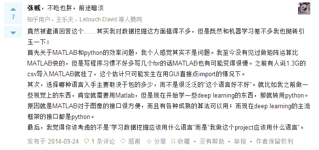

# Python VS Matlab----给我一个理由先

> 原文：[`mp.weixin.qq.com/s?__biz=MzAxNTc0Mjg0Mg==&mid=401782053&idx=1&sn=27a92490e9ef9ffec72906d27e2e268a&chksm=09f977303e8efe26d2bd9bc11ad02032d505aafd45a3ac13eb5ec19fb8cdc450af21044ca5fd&scene=27#wechat_redirect`](http://mp.weixin.qq.com/s?__biz=MzAxNTc0Mjg0Mg==&mid=401782053&idx=1&sn=27a92490e9ef9ffec72906d27e2e268a&chksm=09f977303e8efe26d2bd9bc11ad02032d505aafd45a3ac13eb5ec19fb8cdc450af21044ca5fd&scene=27#wechat_redirect)

**谢谢大家支持，可以让更多朋友和有兴趣志同道合的人关注这个公众号。让知识传播的更加富有活力，谢谢各位读者。**

**查看之前博文请点击右上角查看历史消息**

> **最近好多人问我这个问题：究竟要学哪门语言比较好，是 Matlab 还是 Python 呢。所以今天我就两门语言做一个详细介绍，大家也可以根据自己的兴趣做出自己的选择。**

**Matlab**

* * *

MATLAB 是一种用于算法开发、数据可视化、数据分析以及数值计算的高级技术计算语言和交互式环境。使用 MATLAB，可以较使用传统的编程语言（如 C、C++ 和 Fortran）更快地解决技术计算问题。

<wbr>随着 MATLAB 工具箱的不断添加和完善，M 语言也逐渐成为工程界的准通用标准语言，官网称：MATLAB - The Language Of Technical Computing。大学理工科专业一般都开设了或选修或必修的 MATLAB 相关课程。很多新出版的教材，计算机辅助教学的工具软件开始选用 MATLAB。MATLAB 以其简洁易学的语法、友好的界面和完善的文档系统逐渐深入人心并将继续扩大它的控制领地。

然而，MATLAB 也有着很大的局限性。**首先，是价格。**作为一款商业软件，获得正版授权，价格不菲。就说最便宜的学生版，核心组件单个授权要花 99 刀，想使用额外工具箱，则是每个工具箱 29 刀。 正如你能想到的，商业版本更贵。**其次，是版权。**mathworks 论坛活跃着很多用户，也有很多有价值的代码，但是，版权归 mathworks 公司，要想使用必须获得它的授权。**再次，是语言完善性。**MATLAB 进行数学计算的表现无可置疑，但是实际的科学计算还有文件操作、界面设计等。MATLAB 在这些领域功能较弱或者很麻烦。应该可以说，MATLAB 不是一种完善的语言。

**Python**

* * *

**首先，Python 完全免费**，绝大多数科学计算相关扩展库也都是免费的，大多也都是是开源的，所以金钱问题完全不用考虑。版权问题也基本不用考虑，众多的实例程序可以让你拿去就用。（有时候也需要考虑，因为有些授权，如 GPL 授权，具有“传染性”）。考虑控制版权更严格的诸如美国之类的国家，有着众多的研究人员和大学生使用 Python，并有很多网络提供了交流平台，在这个平台可以获得更多的交流学习机会。**其次，Python 是一门更易学更严谨的面向对象的程序设计语言。**作为通用程序设计语言的 Python，有更为严格清晰的语法，可以轻易完成界面、文件、封装等高阶需求。**最后，不得不提的就是性能。**MATLAB 作为科学计算工具，经过了近乎苛刻的优化，Python 呢？实话说，纯 Python 的速度确实不怎么地，但是使用 Python 的科学计算扩展库 numpy、scipy 等之后，速度和 MATLAB 不相上下。

另外给大家推荐基本入门的书籍，有些书是必须从头看到尾的，有些书是拿做当工具书看的，希望大家能够有所思考。

 

 

**下面是我从知乎上截取的部分我认为很有代表性和客观性的评价，包含了两种语言在各个领域的应用，大家可以好好看看，心得体会自己琢磨。**

* * *

从我的工作经验来看，我只能说，精通一门掌握一门是最好的。

**量化投资与机器学习**

**知识、能力、深度、专业**

**勤奋、天赋、耐得住寂寞**

