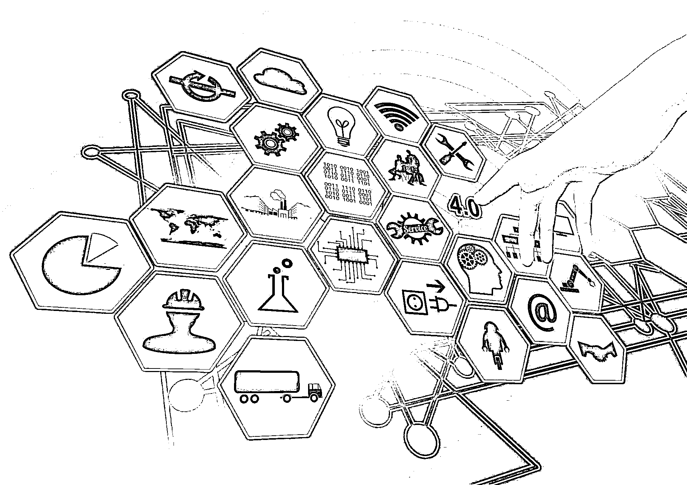
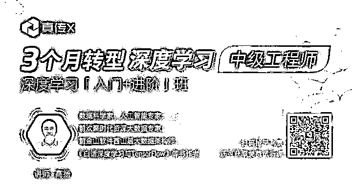

# 普通程序员如何转型深度学习指南

> 原文：[`mp.weixin.qq.com/s?__biz=MzAxNTc0Mjg0Mg==&mid=2653286990&idx=1&sn=87c834d79c6ce798fb4ca7f6ba1dfa7d&chksm=802e305bb759b94d32069254e8d77dbf9257f785366791142739d8682155efbdb4c00d8b7437&scene=27#wechat_redirect`](http://mp.weixin.qq.com/s?__biz=MzAxNTc0Mjg0Mg==&mid=2653286990&idx=1&sn=87c834d79c6ce798fb4ca7f6ba1dfa7d&chksm=802e305bb759b94d32069254e8d77dbf9257f785366791142739d8682155efbdb4c00d8b7437&scene=27#wechat_redirect)

AI 领域人才奇缺，炙手可热的 AI 专业应届生年薪 30 万起步，AI 毕业生基本不用找工作，都已经被企业早早预定。

<inherit style="display: block;">AI 人才究竟有多紧缺？据腾讯研究院《全球人工智能人才白皮书》报告数据，目前全球 AI 领域人才仅约 30 万，全球 367 所具有 AI 研究方向的高校，每年毕业 AI 领域学生仅约 2 万人，这个数据甚至远未达到国内 500 万 AI 人才需求，更不用说全球的 AI 人才缺口了。</inherit>

不仅是人才短缺、市场对 AI 人才的白热化渴求，2016 年国家从战略层面就将包括 AI 在内的高技术人才培养提升到一个新的高度。从市场、国家政府出台政策等种种表现，都不难看出：现在我们正处在 AI 技术的关键红利期。

<inherit style="display: block;">**那绝大多数程序员都不是 AI 科班出身，如何把握住这个最佳的新技术红利期呢？**</inherit>

<inherit style="display: block;"></inherit>

<inherit style="display: block;text-align: justify;">今天，我们要分享一门人工智能专家高扬老师开讲的深度学习系统进阶课程。</inherit>

<inherit style="display: block;text-align: justify;">具体而言，这门课程：</inherit>

**国内全网第一个从入门****直达深度学习中级工程师****的教学方案：**

*   将帮助程序员，通过三个月（均在周末）集中学习，完成 41 个工程实验、58 个核心高阶知识点，入门转型深度学习中级工程师，进阶达到普通深度学习工程师 1 年左右水平。

<inherit>为结果负责的教学指导：</inherit>

期末测评 85 分以上

*   直接保就业

*   半年内找不到工作全额退款

*   一年后年薪达不到 30W+，全额退款

两次测评 75 分以上

*   直接内推

<inherit>实战项目包括（但不止于）：</inherit>

*   全卷积网络抠像

*   CNN 人脸识别、图片风格变换

*   R-CNN 目标检测

*   语音合成

*   中文聊天机器人

*   RNN 实现作曲机器人

*   对抗学习实现人脸生成

*   GCGAN 打国际象棋

*   UNREAL 打游戏

<inherit>**谁适合报名这门课：**</inherit>

**我们会确保报名学习完成课程的同学 80%以上的成功转型率，所以会对申请报名的同学进行审核**，建议同学：

*   1 年以上程序员工程经验

*   数学基础应在本科及以上，学过微分、线性代数

*   基本熟练掌握一门计算机语言

*   想转型、进阶深度学习

<inherit>**零风险的报名试听承诺**</inherit>

报名需申请审核，审核通过后，支持试听学习半个月，每次需按时学习，如有不满意，支持全额退课

<inherit>上课安排在什么时候？</inherit>

*   课程将在 2018 年 1 月 27 日正式开课，线上直播安排在每周六周日

将近 3 个月的时间里，你将在讲师带领下学习完所有实战项目，直播后还可温习回放视频，有效期内支持随时观看。

学习途中，遇到问题，有专属学员答疑群为你解答问题，有专属班主任全程跟进你的学习进度。

<inherit>**课程讲师是谁？**</inherit>

**高扬**

*   数据科学家/人工智能专家，现为某创业公司首席数据科学家。

*   前欢聚时代资深大数据专家，负责欢聚时代直播部深度学习落地相关的研究。

*   曾任金山软件西山居大数据架构师。

*   有多年服务器端开发经验（多年日本和澳洲工作经验），多年大数据架构设计与数据分析、处理经验。擅长传统机器学习、深度学习、数据建模、关系型数据库应用以及大数据框架等的应用。

*   《白话大数据与机器学习》、《白话深度学习与 TensorFlow》、《数据科学家养成手册》等书籍作者；有丰富的分享与教学经验，擅长用浅显易懂的方式传授晦涩的技术技能。曾开有《深度学习，从入门到精通实战》系列专业课程，广受学生好评。

**欢迎扫海报二维码，了解更多课程信息！**

<inherit style="display: block;"></inherit>