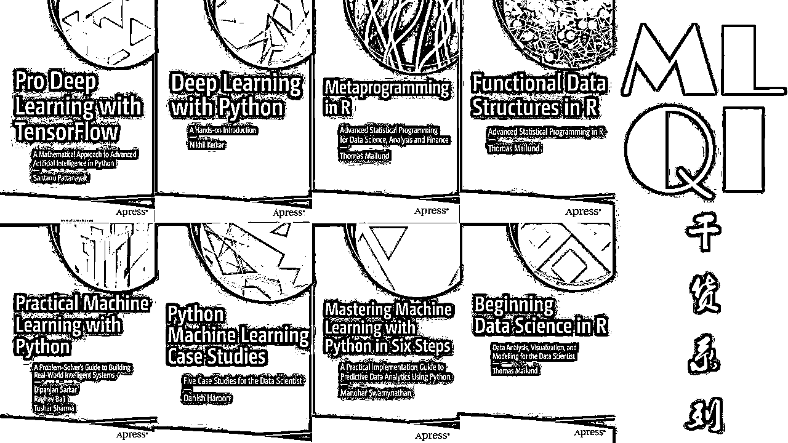
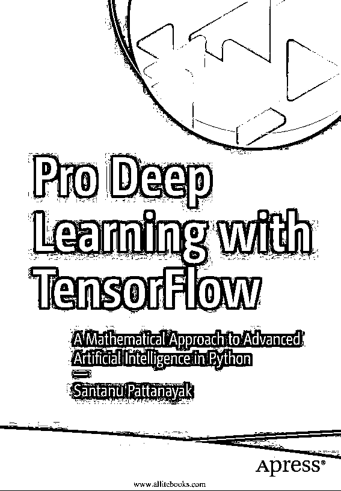
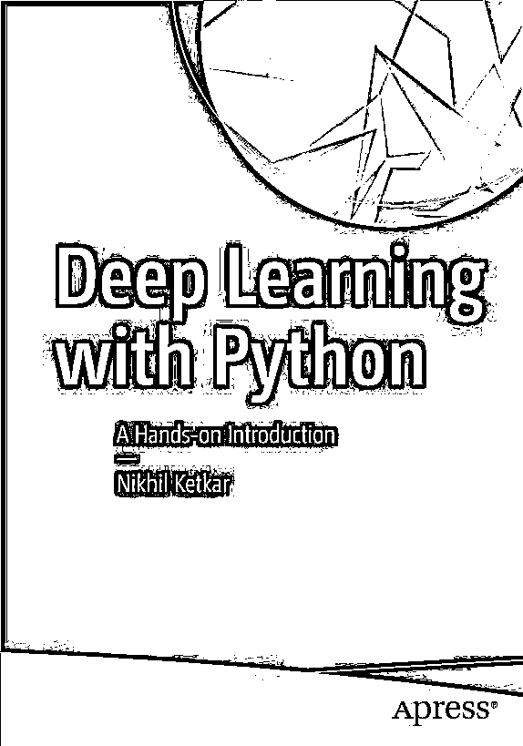
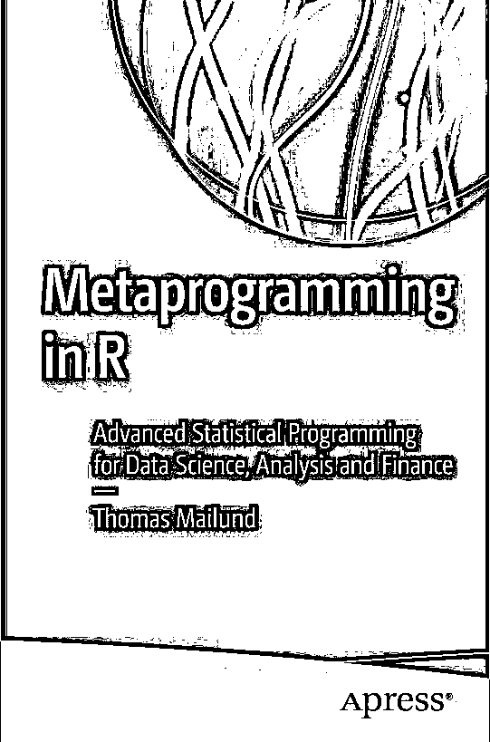
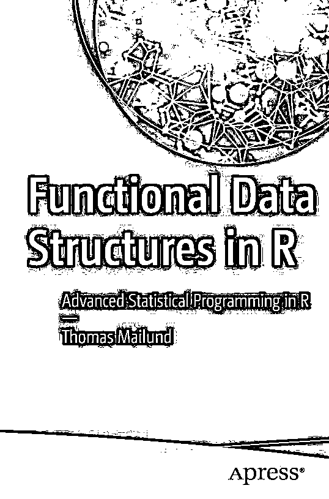
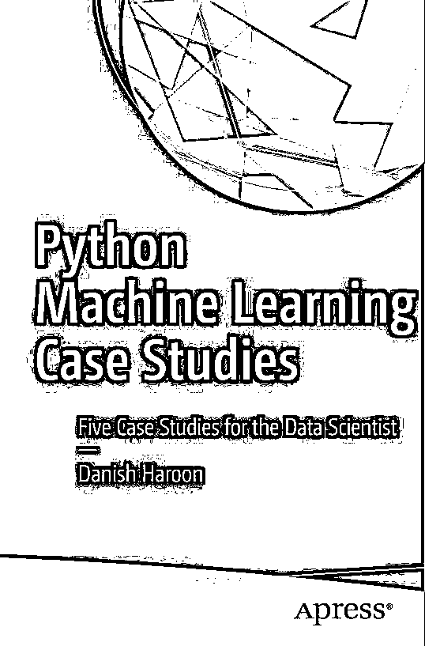
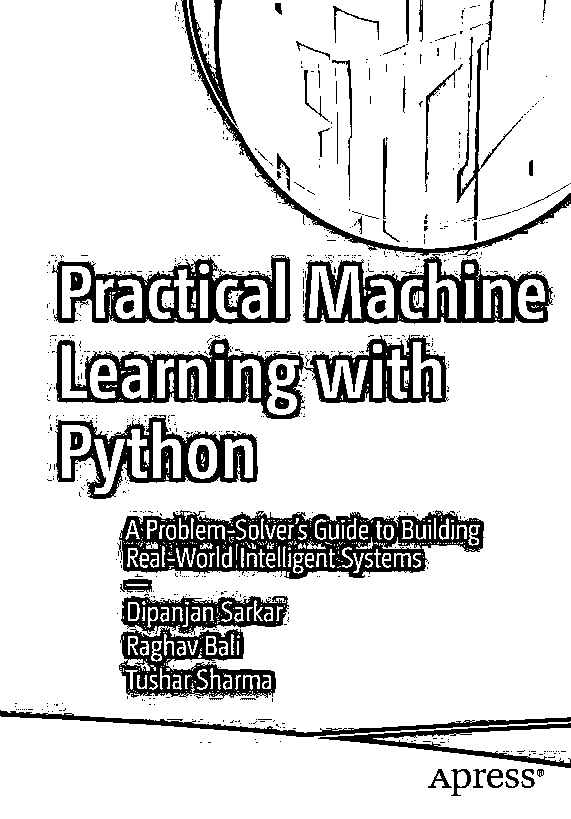
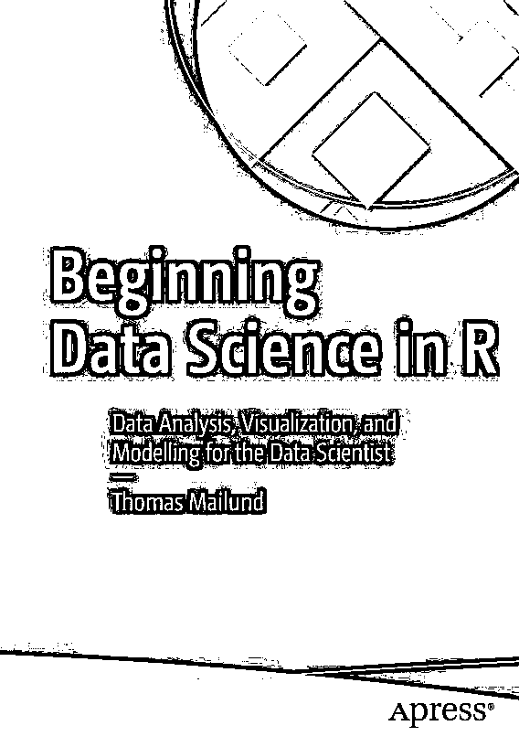
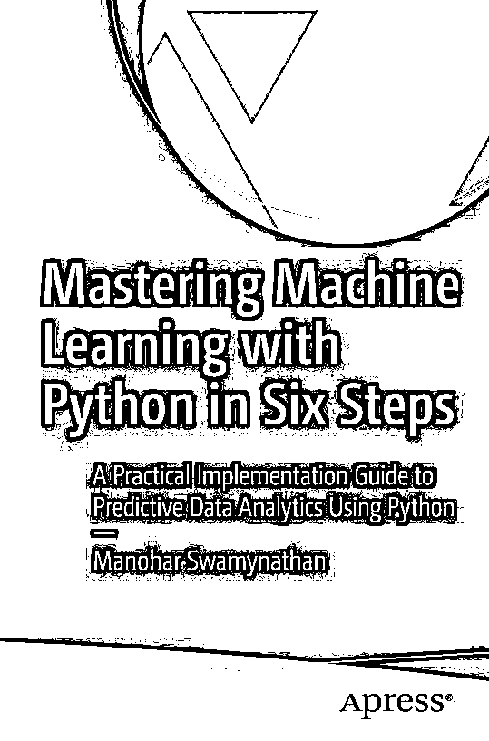
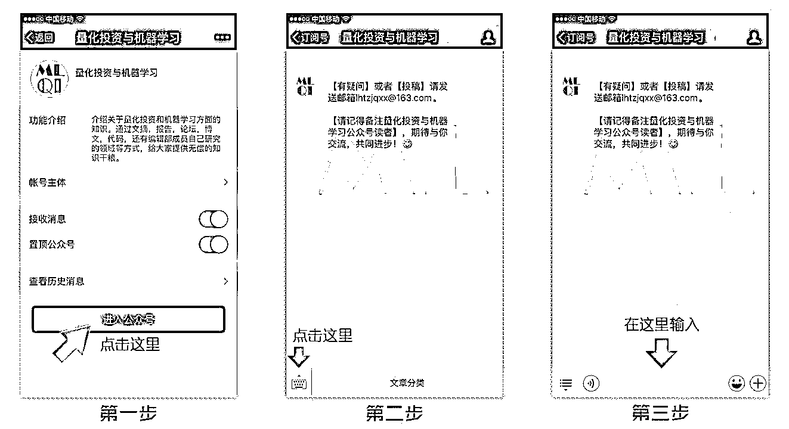

# 【精选干货】近期有关机器学习、深度学习、数据科学方面的书籍

> 原文：[`mp.weixin.qq.com/s?__biz=MzAxNTc0Mjg0Mg==&mid=2653286985&idx=1&sn=1d98e54ec35f20535cfd19fec2575635&chksm=802e305cb759b94aaa1604fdbefea88f304a45da642441eaa1ee548b3645157a79cb6a503e24&scene=27#wechat_redirect`](http://mp.weixin.qq.com/s?__biz=MzAxNTc0Mjg0Mg==&mid=2653286985&idx=1&sn=1d98e54ec35f20535cfd19fec2575635&chksm=802e305cb759b94aaa1604fdbefea88f304a45da642441eaa1ee548b3645157a79cb6a503e24&scene=27#wechat_redirect)

**编辑部**

微信公众号

**关键字**全网搜索**最新排名**

**『量化投资』：排名第一**

**『量       化』：排名第一**

**『机器学习』：排名第三**

我们会再接再厉

成为全网**优质的**科技文公众号

今天小编为大家带来近期出版的一些关于机器学习、深度学习、数据科学方面的书籍。希望大家有所收获！

我们已经打包好了！

可在

**文末下载**

**获取以上书籍**

**请在后台回复**

**12 月系列 1**

**即可获取**

有些人不知道**后台回复**如何操作

为大家介绍一下：

