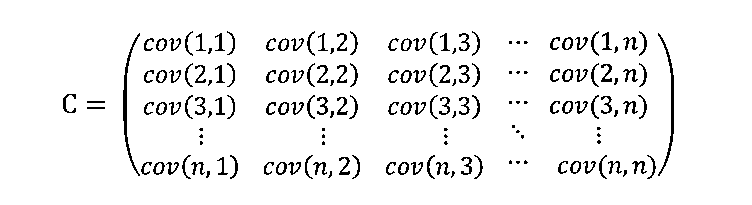
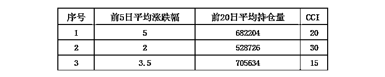

# 【MATLAB 机器学习系列】——主成份分析(PCA)在量化投资中的应用

> 原文：[`mp.weixin.qq.com/s?__biz=MzAxNTc0Mjg0Mg==&mid=2653286972&idx=1&sn=2e28947d3d411d9b8232dda4a1426c02&chksm=802e3029b759b93f2e1734d033bdec9f6996ca7dbd7c16a973323a974c3e5c329d47607fb041&scene=27#wechat_redirect`](http://mp.weixin.qq.com/s?__biz=MzAxNTc0Mjg0Mg==&mid=2653286972&idx=1&sn=2e28947d3d411d9b8232dda4a1426c02&chksm=802e3029b759b93f2e1734d033bdec9f6996ca7dbd7c16a973323a974c3e5c329d47607fb041&scene=27#wechat_redirect)


**编辑部**

微信公众号

**关键字**全网搜索**最新排名**

**『量化投资』：排名第一**

**『量       化』：排名第一**

**『机器学习』：排名第三**

我们会再接再厉

成为全网**优质的**科技文公众号

**1**

**PAC 核心思想**

PCA 算法也叫主成分分析（principal components analysis），用来减少数据集的维数，同时保留数据集中对方差贡献最大的特征来达到简化数据集的目的。 其核心思想就是将 n 维特征映射到 k 维上（k < n），这 k 维是全新的正交特征。我们将这 k 维成为主元，是重新构造出来的 k 维特征，而不是简单地从 n 维特征中取出其余 n-k 维特征。

**2**

**PCA 几何意义**

在 PCA 中，数据从原来的坐标系转换到新的坐标系下，新的坐标系的选择与数据本身是密切相关的。其中，第一个新坐标轴选择的是原始数据中方差最大的方向，第二个新坐标轴选取的是与第一个坐标轴正交且具有最大方差的方向，依次类推，我们可以取到这样的 k 个坐标轴。

*   0 维-PCA：将所有样本信息都投影到一个点，因此无法反应样本之间的差异；要想用一个点来尽可能的表示所有样本数据，则这个点必定是样本的均值。

*   1 维-PCA：相当于将所有样本信息向样本均值的直线投影；

*   2 维-PCA：将样本的平面分布看作椭圆形分布，求出椭圆形的长短轴方向，然后将样本信息投影到这两条长短轴方向上，就是二维 PCA。（投影方向就是平面上椭圆的长短轴方向）；

*   3 维-PCA：样本的平面分布看作椭圆形分布，投影方法分别是椭圆球的赤道半径 a 和 b，以及是极半径 c（沿着 z 轴）；

**3**

**PCA 理论基础**

#### **最大方差理论**

如何在降维后最大程度保留原有的信息呢？这就要基于最大方差理论来解决这个问题。

信号处理中认为信号（Signal）具有较大的方差，噪声（Noise）有较小的方差，信噪比就是信号与噪声的方差比，越大越好。


因此我们认为，最好的 k 维特征既是将 n 维样本点转换为 k 维后，每一维上的样本方差都很大。 

如下图所示：


那我们应该选择哪一个呢？很明显是左图比较好。原因有两个：

**1、投影后方差最大
2、点到直线的距离平方和最小**

从另一个角度看，左边的图每个点直线上的距离绝对值之和比右边的每个点到直线距离绝对值之和小。那么接下来我们就分析一下，为什么是两个原因。

#### **方差：偏离平均值的程度**


红点 A 表示样本点，蓝点 B 表示在 u 上的投影点。u 是直线的斜率也是直线的方向向量，而且是单位向量。

现在从 A 点向 B 所在直线引一条垂线。垂线与 B 的交点叫做 A 在 B 上的投影，再设 A 与 B 的夹角是<semantics><annotation encoding="application/x-tex">\alpha</annotation></semantics>α，则投影的矢量长度为：


又因为：


A 与 B 的内积等于 A 到 B 的投影长度乘以 B 的模。因为 B 的模即为 u ，并且是单位向量，那么：


也就是说的值**`等于 A 向 B 所在直线投影的矢量长度！`**

我们再回顾一下协方差的一些概念

#### **协方差：两个随机变量关系的统计量**

让数据尽可能表示更多的原始信息，让它们之间不存在（线性）相关性，因为相关性意味着两个字段不是完全独立，必然存在重复表示的信息。


协方差具体的大小并不重要，但是它的正负是重要的。如果它的值是正的，这表明两个特征之间同时增加或减小;如果它的值是负的，这表明两个特征之间有一个增加而另一个减小。如果它的值为 0，则表明两个特征之间是独立的。



上面的维数是 n 乘 n，对角线上红色的是特征与自己的协方差，因此它是方差。对角线两侧的协方差是对称的，因此协方差矩阵是一个关于对角线对称的方阵。

方差的公式：


我们推导一下：


因此，我们只需要对协方差矩阵进行特征值分解，得到的前 k 大特征值对应的特征向量就是最佳的 k 维新特征，而且这 k 维新特征是正交的。

因此


**4**

**PCA 实现步骤**

通过上面的描述，我们基本掌握了如何计算 PCA，接下来我们就总结一下实现 PCA 的步骤：

1、把原始数据中每个样本用一个向量表示，然后把所有样本组合起来构成一个矩阵。为了避免样本的单位的影响，样本集需要标准化（一般都是去均值化）。

2、求该矩阵的协方差矩阵。

3、求步骤 2 中得到的协方差矩阵的特征值和特征向量。

4、PCA 可以得到 n 个主成分，但是，由于各个主成分的方差是递减的，包含的信息量也是递减的，所以实际分析时，一般是不选取 n 个主成分，而是根据各个主成分累计贡献率的大小取前 k 个主成分。这里的 贡献率 就是指某个主成分的方差占全部方差的比重，实际也就是某个特征值占全部特征值合计的比重，即：


贡献率越大，说明该主成分所包含的原始变量的信息越强。

5、主成分个数 k 的选取，主要是根据主成分的 累计贡献率 来决定的，即一般要求累计贡献率达到 85%以上，这样才能保证综合变量能够包含原始数据的绝大多数信息。前 k（k⩽n） 个主成分的贡献率之和为：


它反映了前 k 个主成分综合原始变量信息或解释原始变量的能力。

**5**

**PCA 的 Matlab 函数解析**

和主成分分析相关的 Matlab 函数有 pcacov、princomp、princomp。接下来我们一一进行分析。

#### **pcacov**

pcacov 函数运用协方差矩阵或者相关系数矩阵进行主成分分析，其调用格式如下：

```py
COEFF = pcacov(V)
[COEFF,latent] = pcacov(V)
[COEFF,latent,explained] = pcacov(V)
```

参数说明

*   `V`

*   总体或样本的协方差矩阵或者相关系数矩阵，对于 n 维总体，V 是 k × k 的矩阵。

*   `COEFF`

*   是 k 个主成分的系数矩阵，是 k × k 的矩阵，他的第 i 列是第 i 个主成分的系数向量。

*   `latent`

*   是 k 个主成分的方差构成的列向量，即 V 的 p 个特征值（从大到小）构成的向量（特征向量）。

*   `explained`

*   k 个主成分的贡献率向量，每个主成份的方差在观测量总方差中所占的百分数向量

*   示例

```py
X = [1 2 1 1;   %样本矩阵  
     3 3 1 2;   
     3 5 4 3;   
     5 4 5 4;  
     5 6 1 5;   
     6 5 2 6;  
     8 7 1 2;  
     9 8 3 7
     5 6 1 9
     8 8 3 4];
covx = cov(X); % 表示总体的协方差矩阵
[COEFF,latent,explained] = pcacov(covx); % 总体主成分分析
```

程序输出结果：

```py
%主成份变换矩阵
COEFF =
   0.6656   -0.4490   -0.0741   -0.5916
   0.5307   -0.2530   -0.1047    0.8021
   0.0655   -0.1265    0.9887    0.0458
   0.5207    0.8476    0.0770   -0.0671
%主成份方差向量
latent =
  12.3994
   3.9767
   2.1073
   0.4277
%各主成份贡献率向量
explained =
  65.5668
  21.0284
  11.1433
   2.2615
```

第一主成份的贡献率为： 65.5668%

前三个主成份的累计贡献率为：65.5668% + 21.0284% + 11.1433% = 97.7385%

因此，若用前三个主成分代替原来三个变量，其信息损失为 2.2615%，是很小的。

#### **princomp**

princomp 函数运用样本数据矩阵进行主成分分析，其调用格式如下：

```py
[COEFF,SCORE] = princomp(X)
[COEFF,SCORE,latent] = princomp(X)
[COEFF,SCORE,latent,tsquare] = princomp(X)
[...] = princomp(X,'econ')
```

但是官网也提示 princomp will be removed in a future release. Use pca instead 。所以以后我们就尽量用最新的 pca 吧。两者基本一样。

参数说明：

*   X

*   样本数据矩阵，输入的参数 X 是 n 行 p 列的矩阵，每一行对应一个观测样品，每一列对应一个变量。
    类似我们的指标数据或者量价数据，每一行就是多个指标的对应值或多个量价数据的对应值，每一列就是某一个指标或者量价的变量。请大家一定不要混淆行和列的顺序。



*   COEFF

*   主成份系数矩阵。

*   SCORE

*   主成份的得分矩阵。

*   latent

*   样本协方差矩阵特征值的向量。k 个特征值构成的列向量，其中特征值按降序排列。

*   tsquare

*   包含 k 个元素的列向量，是每个数据点的 HotellingT2（霍特林）统计量。描述了第 i 个观测与样本观测矩阵之间的距离，可用来寻找远离中心的极端数据。

**提示：** princomp 函数对样本数据进行了中心化处理，所以，他返回的主成分就是中心化的主成分得分。当 n⩽p 时，SCORE 矩阵的第 n 列到第 p 列元素均为 0。 latent 的第 n 列到第 p 个元素均为 0。

**代码如下：**

```py
% 样本矩阵 X，有 10 个样本，每个样本有 4 个特征，使用 PCA 降维提取 k 个主要特征（k<4）  
X = [1 2 1 1;   %样本矩阵  
     3 3 1 2;   
     3 5 4 3;   
     5 4 5 4;  
     5 6 1 5;   
     6 5 2 6;  
     8 7 1 2;  
     9 8 3 7
     5 6 1 9
     8 8 3 4]  
% 使用 Matlab 工具箱 princomp 函数实现 PCA  
[COEFF SCORE latent] = princomp(X)
```

```py
COEFF =
   0.6656   -0.4490   -0.0741   -0.5916
   0.5307   -0.2530   -0.1047    0.8021
   0.0655   -0.1265    0.9887    0.0458
   0.5207    0.8476    0.0770   -0.0671
SCORE =
  -6.4631    0.1454   -0.7664   -0.0172
  -4.0806   -0.1579   -0.9422   -0.4652
  -2.3022   -0.1957    1.8918    1.2094
  -0.9155   -0.1195    2.9141   -0.7971
   0.4047    0.7279   -1.1731    0.5568
   1.1257    1.2532   -0.0768   -0.8581
   1.3699   -3.4147   -1.7311   -0.2145
   5.3006   -0.1316    0.4529   -0.2477
   2.4875    4.1184   -0.8650    0.2886
   3.0729   -2.2255    0.2958    0.5451
latent =
  12.3994
   3.9767
   2.1073
   0.4277
```

```py
% 计算贡献率
l1 = 12.3994/sum(latent);
l2 = 3.9767/sum(latent);
l3 = 2.1073/sum(latent);
l4 = 0.4277/sum(latent);
lt = [l1,l2,l3,l4]
lt =
   0.6557    0.2103    0.1114    0.0226
```

前三个主成分的累积贡献率已达 0.9774。

我们再用下面这种方法求一下：

```py
% 计算累积贡献率，一般要求累积贡献率大于 95%时才能给不影响原始数据
contribution = cumsum(latent) ./ sum(latent)
contribution =
   0.6557
   0.8660
   0.9774
   1.0000
```

我们可以看到在第三行 0.9774 大于 0.95 ，说明可以将原数据降到 3 维表示原数据。这也和前面的单独算贡献率、通过 pcacov 函数算出来的结果一致。

pareto - 帕累托图

此函数用 Y 中的元素索引标识每个条形，并绘制线条以显示 Y 的累积和。

```py
pareto(Y)
pareto(Y,names)
pareto(Y,X)
H = pareto(...)
[H,ax] = pareto(...)
```

我们用此函数作图如下：

```py
pareto(latent)
```


上图为 parto 生成的图，当贡献率累加至 95%，以后的维数会不再显示。

所以上面的例子最后可以降至 3 维，即可以只选取 SCORE 的前三列来表示原始数据。

**6**

**PCA 应用量化策略实例**

**基于 SVM 的股指期货择时策略**

我们通过 HS300 指数行情数据来合成一些常见的量价指标如下：

> `开盘价`、`最低价`、`收盘价`、`最高价`
> 
> `当日成交额`、`当日涨跌幅`
> 
> `昨日成交额`、`昨日涨跌幅`
> 
> `前 5 日平均涨跌幅`、`前 5 日平均成交额`、`前 5 日平均持仓量`
> 
> `前 20 日平均涨跌幅`、`前 20 日平均成交额`、`前 20 日平均持仓量`

金融序列之间通常存在相关性需要进行数据预处理，用 PCA 进行降维。从主成分累积共享图可以看出，4 个主成分的累积共享已达到 95%以上，这些特征之间的相关性较大，之后可以增加一些特征相关性较低的指标进行改进。

```py
[time, open, high, low, close, volume, turnover, openinterest] = traderGetKData('sse', '000300', 'day', 1, 20100101, 20171101, false, 'FWard'); 
if length(close)<45
    return;
end
lags=100;lens=25;
limit=abs(close(2:end,:)-close(1:end-1))./close(1:end-1);%计算涨跌幅，比收盘价向量少一个数
limit_ma5=MA(limit',5);
openinterest_ma5=MA(openinterest',5);
turnover_ma5=MA(turnover',5);
limit_ma20=MA(limit',20);
openinterest_ma20=MA(openinterest',20);
turnover_ma20=MA(turnover',20);
T_close_z=close(end-lens:end,:);%昨日收盘价
T_high_z=high(end-lens:end,:);
T_low_z=low(end-lens:end,:);
T_turnover_z=turnover(end-lens:end,:);
T_limit_z=limit(end-lens:end,:);
T_turnover_q=turnover(end-1-lens:end-1,:);%前日成交额
T_limit_q=limit(end-1-lens:end-1,:);
T_limit_5=limit_ma5(end-lens:end)';
T_openinterest_5=openinterest_ma5(end-lens:end)';
T_turnover_5=turnover_ma5(end-lens:end)';
T_limit_20=limit_ma20(end-lens:end)';
T_openinterest_20=openinterest_ma20(end-lens:end)';
T_turnover_20=turnover_ma20(end-lens:end)';
zdata=[T_close_z,T_high_z,T_turnover_z,T_limit_z,T_turnover_q,T_limit_q,T_limit_5,T_openinterest_5,T_turnover_5,T_limit_20,T_openinterest_20,T_turnover_20];
traindata=zdata(end-lens:end-1,:);testdata=zdata(end,:);
%%构造训练集标签
label=sign(close(2:end,:)-close(1:end-1));trainlabel=label(end-lens+1:end,:);
%%数据主成分分析降维
[Rnrow,Rncol]=size(traindata);%求训练集矩阵大小
[Enrow,Encol]=size(testdata);%求测试集矩阵大小
A(1:Rnrow,:)=traindata;
A(Rnrow+1:Rnrow+Enrow,:)=testdata;%训练集测试集合成一个矩阵
[coef,score,latent,t2]=princomp(A);%计算主成分：coef 为系数矩阵、score 为主成分得分矩阵、latent 为贡献率
latent=100*latent/sum(latent);
for i=1:Rncol                      %计算累积贡献率并
   sum_latent(i)=sum(latent(1:i));
end;
hold on;
bar(latent(1:12));
plot(sum_latent(1:12));grid on;%画出主成分贡献率、累积贡献率
```


*   **数据标签**

当数据特征为第 n 天的数据值时，用第 n+1 天的涨跌作为标签值以达到预测得到目的，涨（第 n+1 日收盘价>第 n 日收盘价）记为+1，跌（第 n+1 日收盘价<第 n 日收盘价）记为-1。在 AT 回测过程中开平仓操作都是对今日进行的，因此特征值构造时数值以昨天作为基准。

*   **训练集和测试集**

构造择时模型与普通的分类模型不同，因为金融数据是实时更新的，因此训练集样本也是增量变化的，为了节约每次的训练时间，我们用动态模式来看待择时模型。测试集为第 n+1 天（即回测当天），训练集为过去的 n 天，训练集的样本个数在整个过程中不发生变化但样本却实时更新，这里的 n 就是研报提到的滑动窗口，关于滑动窗口大小的选取可以根据回测结果好坏进行讨论，不同的回测策略所对应的最佳窗口大小不同。本文暂时给定 n=25。（这里如果不考虑样本量增加带来计算时间成本的上升，也可以将训练集设定为样本总量不断增加，也就是从初始日期开始到当前回测天前的一天都作为训练集，不进行滑动处理而进行增量学习。）

*   **模型实现和回测**

模型的数据和回测均**基于 Auto-trader**软件，SVM 的实现需要事先安装**MATLAB**的 libsvm 工具箱。

数据获取：回测当日为测试集，回测前 n 天为训练集。为了构造出测试集和训练集至少要读取回测日前 n+20 天的数据进行运算（因为有的特征为前 20 天平均）。而这里 n 我们暂时取为 25 天，之后可以对 n 的取值进行讨论，这里一天指的是一个交易日。

策略运算部分：数据未进行归一化，用 pca 进行降维，svm 参数给定（pso 也可但运算时间较长）

回测策略：标的资产为沪深 300 股指期货，买入信号为今日收盘价预测为上涨时建仓买入，卖出信号为今日收盘价预测为下跌时平仓，每次交易固定份额 100 份，回测时间取 20100101-20171001。

**回测结果**


点宽网站独家授权

**策略开发平台**：**AT 量能策略研究平台**基于 MATLAB，支持股票、期货、期权等全市场品种的策略研究和自动化交易，目前已经有超过 300 家高校的数学背景的学生、近万名专业量化用户。


**DigQuant 点宽网量化社区**（***www.digquant.com.cn***）是国内首家基于 Matlab 的专业在线量化研究社区，为专业策略研究人员及量化爱好者提供 Auto-Trader 量能策略研究平台，30 多篇严谨的专业文章和超百个完全公开源代码的策略资源池。

