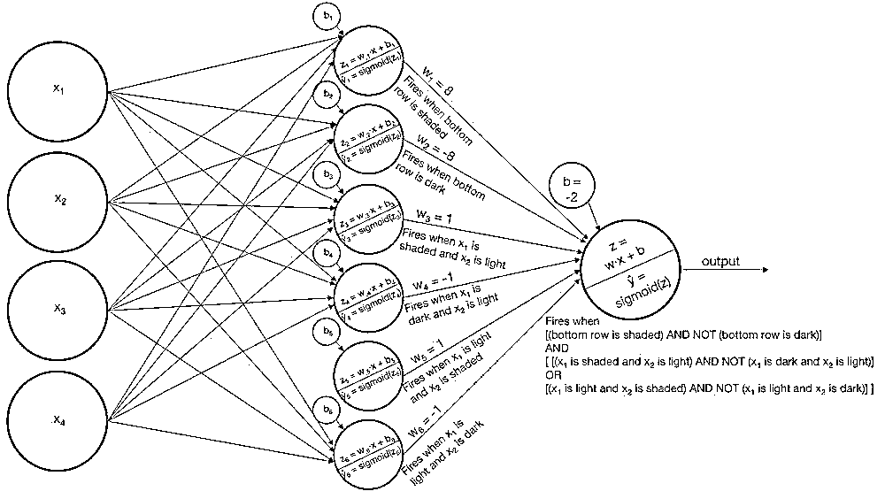

# 【精选干货】2017 年 12 月份机器学习排名前 10 名文章（论文+代码）

> 原文：[`mp.weixin.qq.com/s?__biz=MzAxNTc0Mjg0Mg==&mid=2653286968&idx=1&sn=ba12dc60d694e916eef0c830ad9016b6&chksm=802e302db759b93babf20638a4bf8d0c5f2c7c8fa05207f0beed198891cfab4e78b1e30ceea5&scene=27#wechat_redirect`](http://mp.weixin.qq.com/s?__biz=MzAxNTc0Mjg0Mg==&mid=2653286968&idx=1&sn=ba12dc60d694e916eef0c830ad9016b6&chksm=802e302db759b93babf20638a4bf8d0c5f2c7c8fa05207f0beed198891cfab4e78b1e30ceea5&scene=27#wechat_redirect)

**编辑部**

微信公众号

**关键字**全网搜索**最新排名**

**『量化投资』：排名第一**

**『量       化』：排名第一**

**『机器学习』：排名第三**

我们会再接再厉

成为全网**优质的**科技文公众号

这是一份很有竞争力的榜单

排名综合了很多因素

你将看到最前沿的内容

文中部分没有下载链接的论文

可在**文末下载**

我们已经打包好了！

**第一名**

Alpha Zero：Mastering Chess and Shogi by Self-Play with a General Reinforcement Learning Algorithm. Courtesy of Demis Hassabis and others at Deepmind

**论文**

《Mastering Chess and Shogi by Self-Play with a General Reinforcement Learning Algorithm》

**（论文在文末下载）**

**视频地址**

** https://youtu.be/7-MborNxYWE**

**第二名**

High-Resolution Image Synthesis and Semantic Manipulation with Conditional GANs。由加利福尼亚大学伯克利分校和 Nvidia Research 的 Ming-Yu Liu 等人。

**论文**

**https://arxiv.org/pdf/1711.11585.pdf**

**代码**

**https://github.com/NVIDIA/pix2pixHD**

**第三名**

Capsule Networks Tutorial — Aurelien Geron (Geob Hinton on this video: “This is an amazingly good video. I wish I could explain capsules that well”). Courtesy of Aurélien Géron

**视频地址**

**https://www.youtube.com/watch?v=pPN8d0E3900&feature=youtu.be**

**第四名**

Artwork Personalization at Neteix**（论文在**文末**下载）**

[Part I： Courtesy of Neteix Technology Blog]

[Part 2：Innovating Faster on Personalization Algorithms at Neteix Using Interleaving]

**第五名**

A Year in Computer Vision. Courtesy of Ben Duby and Daniel Flynn**（论文在**文末**下载）**

**第六名**

Sequence Modeling with CTC. Courtesy of Distill

**网址**

**https://distill.pub/2017/ctc/?utm_source=mybridge&utm_medium=blog&utm_campaign=read_more**

**第七名**

**吴恩达最新研究成果**

Improving Palliative Care with Deep Learning. Courtesy of Andrew Ng and others at Stanford ML Group

**论文**

**https://arxiv.org/pdf/1711.06402.pdf**

**第八名**

Evolving Stable Strategies. Courtesy of hard maru at Google Brain

**第九名**

Some Deep Learning with Python, TensorFlow and Keras

**地址**

**https://sandipanweb.wordpress.com/2017/11/25/some-deep-learning-with-python-tensorflow-and-keras/?utm_source=mybridge&utm_medium=blog&utm_campaign=read_more**

****

****

****

******第十名******

**Introduction To Neural Networks **

**[Part I]. Courtesy of Ben Gorman at GormAnalysis**

****地址****

**http://blog.kaggle.com/2017/11/27/introduction-to-neural-networks/**

********

********

********

****[Part II]. A Worked Example ]****

******地址******

******http://blog.kaggle.com/2017/12/06/introduction-to-neural-networks-2/******

********

****************

**来源**

**https://medium.mybridge.co/machine-learning-top-10-articles-for-the-past-month-v-dec-2017-82883b8062f5?source=userActivityShare-19d54032c7a-1513853387**

****获取以上论文****

****请在后台回复****

****1210****

****即可获取****

**有些人不知道**后台回复**如何操作**

**为大家介绍一下：**

****

****