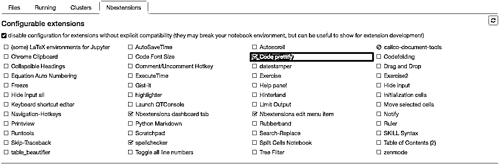

# 【精心解读】关于 Jupyter Notebook 的 28 个技巧（第七期免费赠书活动来啦！）

> 原文：[`mp.weixin.qq.com/s?__biz=MzAxNTc0Mjg0Mg==&mid=2653286936&idx=1&sn=17ebfb48f8541243953041b0c857ae5d&chksm=802e300db759b91bd4028d0cebe7f01ceb844c44a68067fbbf5312945b5b6f2b44830e606516&scene=27#wechat_redirect`](http://mp.weixin.qq.com/s?__biz=MzAxNTc0Mjg0Mg==&mid=2653286936&idx=1&sn=17ebfb48f8541243953041b0c857ae5d&chksm=802e300db759b91bd4028d0cebe7f01ceb844c44a68067fbbf5312945b5b6f2b44830e606516&scene=27#wechat_redirect)


**编辑部**

微信公众号

**关键字**全网搜索**最新排名**

**『量化投资』：排名第一**

**『量       化』：排名第一**

**『机器学习』：排名第三**

我们会再接再厉

成为全网**优质的**科技文公众号

Jupyter 具有很强的可扩展性，支持许多编程语言，可以很容易地托管在计算机上或几乎所有的服务器上，只需要拥有 ssh 或 http 访问权限。 最重要的是，它是完全免费的。


在 Jupyter 中使用 Python 时，使用了 IPython 内核，这使得我们可以在 Jupyter 笔记本中轻松访问 IPython 功能（后面会介绍更多内容！）

**1、键盘快捷键**

正如任何用户所知，键盘快捷键会为您节省大量的时间。 Jupyter 在顶部的菜单下面保存一 keybord 快捷键列表：Help > Keyboard Shortcuts，或者在命令模式下按 H 键。 每次更新 Jupyter 都值得检查一下，因为所有的时候都会添加更多的快捷方式。

另一种访问键盘快捷方式的方法，以及学习它们的方便方法是使用：Cmd + Shift + P（或者在 Linux 和 Windows 上使用 Ctrl + Shift + P）。 此对话框可帮助你按名称运行任何命令 - 如果你不知道某个操作的键盘快捷方式，或者您想要执行的操作没有键盘快捷键，则可以使用该对话框。 这个功能类似于 Mac 上的 Spotlight 搜索，一旦你开始使用它，你会会知道你的生活从此不能没有它！


**The command palette**

*   Esc 将带你进入命令模式，你可以使用箭头键在笔记本上导航。

*   在命令模式下：

*   A 在当前单元格上方插入一个新单元格，B 在下面插入一个新单元格。

*   M 将当前单元格更改为 Markdown，Y 将其更改回代码

*   D + D（按键两次）删除当前单元格

*   Enter 将把你从命令模式转换回给定单元格的编辑模式。

*   Shift + Tab 会显示刚刚在代码单元中输入的对象的文档字符串（文档） - 你可以继续按下此快捷键以循环使用几种文档模式。

*   Ctrl + Shift + - 会将当前单元格从光标所在的位置分成两部分。

*   Esc + F 查找并替换你的代码，而不是输出。

*   Esc + O 切换单元格输出。

*   选择多个单元格：

*   Shift + J 或 Shift + Down 选择向下的下一个 sell。你也可以使用 Shift + K 或 Shift + Up 选择向上的 sell。

*   选中单元格后，可以删除/复制/剪切/粘贴/批处理。当你需要移动笔记本的某些部分时，这非常有用。

*   你也可以使用 Shift + M 来合并多个单元格。


合并多个单元格

**2、完美的显示变量**

第一部分是广为人知的。 通过完成 Jupyter 单元格的变量名称或未指定的语句输出，Jupyter 将显示该变量，而不需要打印语句。 这在处理 Pandas DataFrames 时特别有用，因为输出整齐地格式化为表格。

但是很少人知道，你可以修改 ast_note_interactivity 内核选项来使 jupyter 对它自己的行上的任何变量或语句执行此操作，所以你可以同时看到多个语句的值。

```py
from IPython.core.interactiveshell import InteractiveShell
InteractiveShell.ast_node_interactivity = "all"
```

```py
from pydataset import data
quakes = data('quakes')
quakes.head()
quakes.tail()
```


如果要为 Jupyter（Notebook 和 Console）的所有实例设置此行为，只需使用下面的行创建〜/ .ipython / profile_default / ipython_config.py 文件即可。

```py
c = get_config()

# Run all nodes interactively
c.InteractiveShell.ast_node_interactivity = "all"
```

**3、易于链接到文档**

在“帮助”菜单中，您可以找到包含 NumPy，Pandas，SciPy 和 Matplotlib 等通用库的在线文档的便捷链接。

另外不要忘记，通过在库中添加库，方法或变量。

```py
?str.replace()
```

```py
Docstring:
S.replace(old, new[, count]) -> str

Return a copy of S with all occurrences of substring
old replaced by new.  If the optional argument count is
given, only the first count occurrences are replaced.
Type:      method_descriptor
```

**4、绘图**

*   matplotlib，用％matplotlib inline 激活 。**(https://matplotlib.org/)**

*   ％matplotlib 提供交互性，但可能有点慢，因为渲染是在服务器端完成的。

*   Seaborn 建立在 Matplotlib 之上， 只需通过导入 Seaborn，你的 matplotlib 就会变得更漂亮，不需要修改任何代码。***(http://seaborn.pydata.org/)***

*   mpld3 为 matplotlib 代码提供了替代渲染器（使用 d3）。 相当不错，虽然不完整。***(https://github.com/mpld3/mpld3)***

*   bokeh 是建立交互式更好选择。***(http://bokeh.pydata.org/en/latest/)***

*   plot.ly 可以提供更好的 plots - 这曾经只是一个付费服务，但最近是开源 le 。***(https://plot.ly/)***

*   Altair 是一个相对较新的用 Python 的可视化库。 使用起来非常简单，并且可以制作出非常好看的图，但是定制这些图的能力并不像 Matplotlib 那样强大。***(https://github.com/altair-viz/altair)***


**5、IPython Magic 命令** 上面看到的％matplotlib 是一个 IPython Magic 命令的例子。 基于 IPython 内核，Jupyter 可以从 IPython 内核访问所有的 Magics，它可以让你的工作变得更容易！

```py
# This will list all magic commands
%lsmagic
```

```py
Available line magics:
%alias  %alias_magic  %autocall  %automagic  %autosave  %bookmark  %cat  %cd  %clear  %colors  %config  %connect_info  %cp  %debug  %dhist  %dirs  %doctest_mode  %ed  %edit  %env  %gui  %hist  %history  %killbgscripts  %ldir  %less  %lf  %lk  %ll  %load  %load_ext  %loadpy  %logoff  %logon  %logstart  %logstate  %logstop  %ls  %lsmagic  %lx  %macro  %magic  %man  %matplotlib  %mkdir  %more  %mv  %notebook  %page  %pastebin  %pdb  %pdef  %pdoc  %pfile  %pinfo  %pinfo2  %popd  %pprint  %precision  %profile  %prun  %psearch  %psource  %pushd  %pwd  %pycat  %pylab  %qtconsole  %quickref  %recall  %rehashx  %reload_ext  %rep  %rerun  %reset  %reset_selective  %rm  %rmdir  %run  %save  %sc  %set_env  %store  %sx  %system  %tb  %time  %timeit  %unalias  %unload_ext  %who  %who_ls  %whos  %xdel  %xmode

Available cell magics:
%%!  %%HTML  %%SVG  %%bash  %%capture  %%debug  %%file  %%html  %%javascript  %%js  %%latex  %%perl  %%prun  %%pypy  %%python  %%python2  %%python3  %%ruby  %%script  %%sh  %%svg  %%sx  %%system  %%time  %%timeit  %%writefile

Automagic is ON, % prefix IS NOT needed for line magics.
```

建议浏览所有 IPython Magic 命令的文档，因为你会发现一些适合你的工具。***(http://ipython.readthedocs.io/en/stable/interactive/magics.html)***

**6、IPython Magic - ％env：设置环境变量**

你可以管理 Jupyter 的环境变量，而无需重新启动 Jupyter 服务器进程。 有些库（如 theano）使用环境变量来控制行为，％env 是最方便的方法。

```py
# Running %env without any arguments
# lists all environment variables
 # The line below sets the environment
# variable OMP_NUM_THREADS
%env OMP_NUM_THREADS=4
```

```py
env: OMP_NUM_THREADS=4
```

**7、IPython Magic - ％run：执行 python 代码**

％run 可以从.py 文件中执行 python 代码，鲜为人知的是，它也可以执行其他 jupyter notebooks，相当有用。

请注意，使用％run 与导入 python 模块不同。

```py
# this will execute and show the output from
# all code cells of the specified notebook
%run ./two-histograms.ipynb
```


**8、IPython Magic - ％load：从外部脚本插入代码**

这将用外部脚本替换单元格的内容。 你可以使用计算机上的文件作为源，也可以使用 URL。

```py
# Before Running
%load ./hello_world.py
```

```py
# After Running
# %load ./hello_world.py
if __name__ == "__main__":
  print("Hello World!")
```

```py
Hello World!
```

**9、IPython Magic - ％store：在笔记本之间传递变量**

％store 命令可以让你在两个不同的文件之间传递变量。

```py
data = 'this is the string I want to pass to different notebook'
%store data
del data # This has deleted the variable
```

```py
Stored 'data' (str)
```

new

```py
%store -r data
print(data)
```

```py
this is the string I want to pass to different notebook
```

**10、IPython Magic - ％who：列出全局范围的所有变量**

没有任何参数的％who 命令将列出全局范围中存在的所有变量。 传递像 str 这样的参数将仅列出该类型的变量。

```py
one = "for the money"
two = "for the show"
three = "to get ready now go cat go" 
%who str
```

```py
one   three   two
```

**11、IPython Magic - 时间**

有两个 IPython Magic 命令对时间有效 - %%time 和％timeit。 

%%time 会给你关于单元中的代码的单一运行的信息。

```py
%%time
import time
for _ in range(1000):
    time.sleep(0.01)# sleep for 0.01 seconds
```

```py
CPU times: user 21.5 ms, sys: 14.8 ms, total: 36.3 ms
Wall time: 11.6 s
```

```py
import numpy
%timeit numpy.random.normal(size=100)
```

```py
The slowest run took 7.29 times longer than the fastest. This could mean that an intermediate result is being cached.
100000 loops, best of 3: 5.5 µs per loop
```

**12、IPython Magic - %% writefile 和％pycat：导出单元格的内容/显示外部脚本的内容**

使用%% writefile magic 将该单元格的内容保存到外部文件中。 ％pycat 会做相反的处理，并显示（在弹出窗口中）外部文件高亮内容。

```py
%%writefile pythoncode.py

import numpy
def append_if_not_exists(arr, x):
    if x not in arr:
        arr.append(x)

def some_useless_slow_function():
    arr = list()
    for i in range(10000):
        x = numpy.random.randint(0, 10000)
        append_if_not_exists(arr, x)
```

```py
Writing pythoncode.py

%pycat pythoncode.py

```python
import numpy
def append_if_not_exists(arr, x):
    if x not in arr:
        arr.append(x)

def some_useless_slow_function():
    arr = list()
    for i in range(10000):
        x = numpy.random.randint(0, 10000)
        append_if_not_exists(arr, x)

### 13\. IPython Magic - %prun: Show how much time your program spent in each function.

Using `%prun statement_name` will give you an ordered table showing you the number of times each internal function was called within the statement, the time each call took as well as the cumulative time of all runs of the function.

```pypython
%prun some_useless_slow_function()

26324 function calls in 0.556 seconds

Ordered by: internal time

ncalls  tottime  percall  cumtime  percall filename:lineno(function)
 10000    0.527    0.000    0.528    0.000 <ipython-input-46-b52343f1a2d5>:2(append_if_not_exists)
 10000    0.022    0.000    0.022    0.000 {method 'randint' of 'mtrand.RandomState' objects}
     1    0.006    0.006    0.556    0.556 <ipython-input-46-b52343f1a2d5>:6(some_useless_slow_function)
  6320    0.001    0.000    0.001    0.000 {method 'append' of 'list' objects}
     1    0.000    0.000    0.556    0.556 <string>:1(<module>)
     1    0.000    0.000    0.556    0.556 {built-in method exec}
     1    0.000    0.000    0.000    0.000 {method 'disable' of '_lsprof.Profiler' objects}
```

**14.、IPython Magic - 用％pdb 进行调试**

Jupyter 拥有自己的 Python Debugger（pdb）接口。 这使得调试成为可能。

你可以在这里查看 a list of accepted commands for pdb here.***(https://docs.python.org/3.5/library/pdb.html#debugger-commands)*** 

```py
%pdb

def pick_and_take():
    picked = numpy.random.randint(0, 1000)
    raise NotImplementedError()

pick_and_take()

Automatic pdb calling has been turned ON
```

```py
---------------------------------------------------------------------------
NotImplementedError                       Traceback (most recent call last)
<ipython-input-24-0f6b26649b2e> in <module>()
      5     raise NotImplementedError()
      6 
----> 7 pick_and_take()

<ipython-input-24-0f6b26649b2e> in pick_and_take()
      3 def pick_and_take():
      4     picked = numpy.random.randint(0, 1000)
----> 5     raise NotImplementedError()
      6 
      7 pick_and_take()

NotImplementedError:
```

```py
> <ipython-input-24-0f6b26649b2e>(5)pick_and_take()
      3 def pick_and_take():
      4     picked = numpy.random.randint(0, 1000)
----> 5     raise NotImplementedError()
      6 
      7 pick_and_take()
```

```py
ipdb>
```

**15、IPython Magic - 输出 Retina notebooks 的高分辨率绘图**

一行神奇的 IPython 会给你的 Retina 屏幕输出双分辨率绘图像，比如 Macbook。 注意：下面的例子不会在非视网膜屏幕上渲染。

```py
x = range(1000)
y = [i ** 2 for i in x]
plt.plot(x,y)
plt.show();

%config InlineBackend.figure_format = 'retina'
plt.plot(x,y)
plt.show();
```


**16、阻止最终函数的输出**

有时候在最后一行阻止函数的输出是很方便的，例如绘图时。 要做到这一点，你只需在最后添加一个分号。

```py
%matplotlib inline
from matplotlib import pyplot as plt
import numpy
x = numpy.linspace(0, 1, 1000)**1.5
# Here you get the output of the function
plt.hist(x)
(array([ 216.,  126.,  106.,   95.,   87.,   81.,   77.,   73.,   71.,   68.]),
 array([ 0. ,  0.1,  0.2,  0.3,  0.4,  0.5,  0.6,  0.7,  0.8,  0.9,  1. ]),
 <a list of 10 Patch objects>)
# By adding a semicolon at the end, the output is suppressed.
plt.hist(x);
```


**17、执行 Shell 命令**

从 notebook 内部执行 shell 命令很容易。 你可以使用它来检查工作文件夹中可用的数据集：

```py
!ls *.csv
nba_2016.csv             titanic.csv
pixar_movies.csv         whitehouse_employees.csv
```

```py
!pip install numpy
!pip list | grep pandas
Requirement already satisfied (use --upgrade to upgrade): numpy in /Library/Frameworks/Python.framework/Versions/3.4/lib/python3.4/site-packages
pandas (0.18.1)
```

**18、使用 LaTeX 的公式**

当你在 Markdown 单元格中编写 LaTeX 时，使用 MathJax 将其渲染为公式。

```py
$$ P(A \mid B) = \frac{P(B \mid A) \, P(A)}{P(B)} $$
```


**19、运行代码从其他内核在 notebook 中**

如果你喜欢，你可以将来自多个内核的代码组合到一个 notebook 中。

只需在每个单元的开始处使用 IPython Magics 以及你的内核的名称就可以使用该内核：

*   %%bash

*   %%HTML

*   %%python2

*   %%python3

*   %%ruby

*   %%perl

```py
%%bash
for i in {1..5}
do
   echo "i is $i"
done
i is 1
i is 2
i is 3
i is 4
i is 5
```

**20、安装 Jupyter 的其他内核**

Jupyter 的一个很好的功能是能够运行不同语言的内核。 举个例子，这里是如何获取 R 内核运行。

简单选项：使用 Anaconda 安装 R 内核

如果你使用 Anaconda 来设置你的环境，那么让 R 工作非常容易。 在终端上运行下面的代码：

```py
conda install -c r r-essentials
```

较不容易的选项：手动安装 R 内核

如果你不使用 Anaconda，这个过程会更复杂一些。 首先，如果您尚未安装 R，则需要安装 R。

完成之后，启动 R 控制台并运行以下命令：

```py
install.packages(c('repr', 'IRdisplay', 'crayon', 'pbdZMQ', 'devtools'))
devtools::install_github('IRkernel/IRkernel')
IRkernel::installspec()  # to register the kernel in the current R installation
```

**21、在同一个 notebook 中运行 R 和 Python**

最好的解决方案是安装 rpy2（需要一个 R 的工作版本），可以很容易地用 pip 完成：***(https://bitbucket.org/)***

```py
pip install rpy2

%load_ext rpy2.ipython

%R require(ggplot2)

array([1], dtype=int32)

import pandas as pd
df = pd.DataFrame({
        'Letter': ['a', 'a', 'a', 'b', 'b', 'b', 'c', 'c', 'c'],
        'X': [4, 3, 5, 2, 1, 7, 7, 5, 9],
        'Y': [0, 4, 3, 6, 7, 10, 11, 9, 13],
        'Z': [1, 2, 3, 1, 2, 3, 1, 2, 3]
    })

%%R -i df
ggplot(data = df) + geom_point(aes(x = X, y= Y, color = Letter, size = Z))
```


**22、用其他语言编写函数**

有时 numpy 的速度是不够的，我们需要写一些速度较快的代码。

原则上，你可以在动态库中编译函数并编写 Python 包装器...

但是，这个无聊的部分应该你做吗？

你可以用 cython 或者 fortran 编写函数，直接从 python 代码中使用。

首先你需要安装：

```py
!pip install cython fortran-magic 

%load_ext Cython

%%cython
def myltiply_by_2(float x):
    return 2.0 * x

myltiply_by_2(23.)
```

个人更喜欢使用 fortran，这对于编写数字运算函数非常方便。 更多的使用细节可以在这里找到。***(http://arogozhnikov.github.io/2015/11/29/using-fortran-from-python.html)***

```py
%load_ext fortranmagic

%%fortran
subroutine compute_fortran(x, y, z)
    real, intent(in) :: x(:), y(:)
    real, intent(out) :: z(size(x, 1))

    z = sin(x + y)

end subroutine compute_fortran

compute_fortran([1, 2, 3], [4, 5, 6])
```

**23、Multicursor 支持**

Jupyter 支持多个 Multicursor，类似于 Sublime Text。 只需按住 Alt 键并拖动鼠标即可。


**24.、Jupyter-contrib 扩展**

包括 jupyter 拼写检查器和代码格式化等。

```py
!pip install https://github.com/ipython-contrib/jupyter_contrib_nbextensions/tarball/master
!pip install jupyter_nbextensions_configurator
!jupyter contrib nbextension install --user
!jupyter nbextensions_configurator enable --user
```



**25、从 Jupyter 中创建一个演示文稿。**

Damian Avila's 的 RISE 允许你从现有的笔记本中创建一个 PPT 风格的演示文稿。***(https://github.com/damianavila/RISE)***

你可以使用 conda 安装 RISE：

```py
conda install -c damianavila82 rise
# Or alternatively pip:

pip install RISE
# And then run the following code to install and enable the extension:

jupyter-nbextension install rise --py --sys-prefix
jupyter-nbextension enable rise --py --sys-prefix
```

**26、Jupyter 输出系统**

笔记本显示为 HTML，单元格输出可以是 HTML，因此你可以返回几乎任何内容：视频/音频/图像。

在这个例子中，我用我的资料库中的图像扫描文件夹，并显示其缩略图：

```py
import os
from IPython.display import display, Image
names = [f for f in os.listdir('../images/ml_demonstrations/') if f.endswith('.png')]
for name in names[:5]:
    display(Image('../images/ml_demonstrations/' + name, width=100))
```


我们可以用 bash 命令创建相同的列表

```py
names = !ls ../images/ml_demonstrations/*.png
names[:5]
['../images/ml_demonstrations/colah_embeddings.png',
 '../images/ml_demonstrations/convnetjs.png',
 '../images/ml_demonstrations/decision_tree.png',
 '../images/ml_demonstrations/decision_tree_in_course.png',
 '../images/ml_demonstrations/dream_mnist.png']
```

**27、“大数据”分析**

查询/处理大数据样本有多种解决方案：

*   ipyparallel（以前的 ipython 集群）是 python 中简单的 map-reduce 的一个好选择。我们用它来并行训练许多机器学习模型***(https://github.com/ipython/ipyparallel)***

*   pyspark***(https://www.cloudera.com/documentation/enterprise/5-5-x/topics/spark_ipython.html)***

*   spark-sql magic %% sql***(https://github.com/jupyter-incubator/sparkmagic)***

**28、共享 notebook**

共享笔记本最简单的方法就是使用笔记本文件（.ipynb），但对于那些不使用 Jupyter 的用户，有几个选择：

*   Convert notebooks to html file using the `File > Download as > HTML` Menu option.

*   Share your notebook file with gists or on github, both of which render the notebooks. See this example.

*   If you upload your notebook to a github repository, you can use the handy mybinder service to allow someone half an hour of interactive Jupyter access to your repository.

*   Setup your own system with jupyterhub, this is very handy when you organize mini-course or workshop and don't have time to care about students machines.

*   Store your notebook e.g. in dropbox and put the link to nbviewer. nbviewer will render the notebook from whichever source you host it.

*   Use the `File > Download as > PDF` menu to save your notebook as a PDF. If you're going this route, I highly recommend reading Julius Schulz's excellent article Making publication ready Python notebooks.

*   Create a blog using Pelican from your Jupyter notebooks.

**赠书活动**

量化投资与机器学习公众号联合博文视点 Broadview 送出**5 本**《深入浅出深度学习：原理剖析与 Python 实践》

> 本书最大的特色在于取舍明确，一切无助于迅速理解深度学习精髓的内容全被摒弃了，并着重阐述了技术上的重点和难点；表达上深入浅出：即便是从未接触过 AI 知识的人，也能从作者简明清晰的表述中，一窥深度学习的殿堂。对任何一位想成为 AI/深度学习领域工程师的读者来说，《深入浅出深度学习：原理剖析与 Python 实践》能帮你迅速打开 AI 的大门，并成长为一名合格的 AI 工程师。


**截止 2017.12.22 12:00**

大家在本篇推文【写留言】处发表留言，**获得点赞数前五的读者，即可免费获赠此书**。届时，工作人员会联系五位读者，寄出此书。

