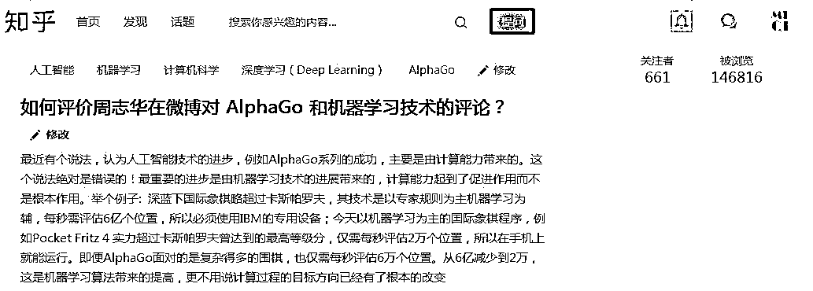

# 如何评价周志华在微博对 AlphaGo 和机器学习技术的评论？

> 原文：[`mp.weixin.qq.com/s?__biz=MzAxNTc0Mjg0Mg==&mid=2653286882&idx=1&sn=f9493bf62097ceb0d46b583694225ded&chksm=802e33f7b759bae10c51844ec26bed722a048fc4b64351b6329136bd5de36e7bbf1f0743f9fa&scene=27#wechat_redirect`](http://mp.weixin.qq.com/s?__biz=MzAxNTc0Mjg0Mg==&mid=2653286882&idx=1&sn=f9493bf62097ceb0d46b583694225ded&chksm=802e33f7b759bae10c51844ec26bed722a048fc4b64351b6329136bd5de36e7bbf1f0743f9fa&scene=27#wechat_redirect)

**编辑部**

微信公众号

**关键字**全网搜索**最新排名**

**『量化投资』：排名第一**

**『量       化』：排名第一**

**『机器学习』：排名第三**

我们会再接再厉

成为全网**优质的**科技文公众号

近期公众号在**知乎**发起了一个提问，觉得大家的回答很丰富，有借鉴意义。分享出来，希望大家能够各抒己见，谈谈自己的看法。

点击**阅读原文**，查看评论