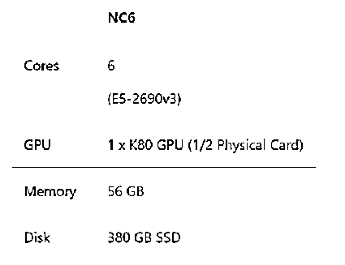
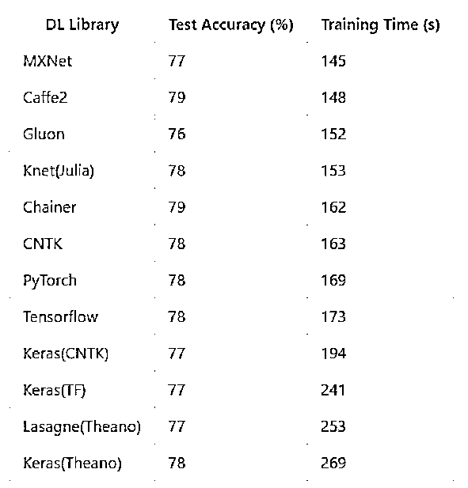
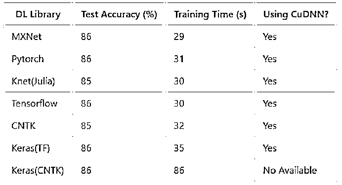
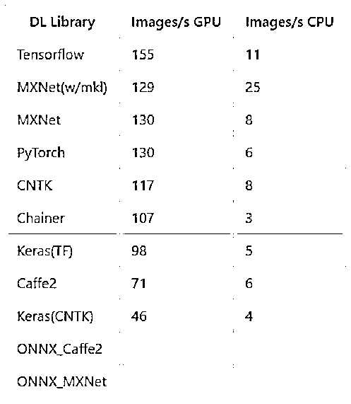
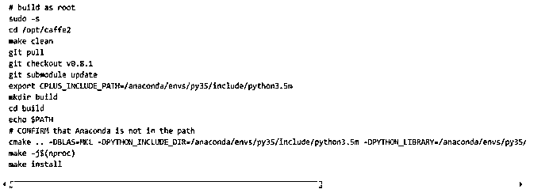

# 深度学习框架哪家强？MXNet 称霸 CNN、RNN 和情感分析，TensorFlow 仅擅长推断特征提取

> 原文：[`mp.weixin.qq.com/s?__biz=MzAxNTc0Mjg0Mg==&mid=2653286877&idx=1&sn=b425ad1def047596c8859c439feb49e4&chksm=802e33c8b759badeff152f5f8fb083e45b9b2208f2c8f7af55d34e85eaef196e533940f85ae3&scene=27#wechat_redirect`](http://mp.weixin.qq.com/s?__biz=MzAxNTc0Mjg0Mg==&mid=2653286877&idx=1&sn=b425ad1def047596c8859c439feb49e4&chksm=802e33c8b759badeff152f5f8fb083e45b9b2208f2c8f7af55d34e85eaef196e533940f85ae3&scene=27#wechat_redirect)

**编辑部**

微信公众号

**关键字**全网搜索**最新排名**

**『量化投资』：排名第一**

**『量       化』：排名第一**

**『机器学习』：排名第三**

我们会再接再厉

成为全网**优质的**科技文公众号

<inherit></inherit>

翻译 | 刘畅

编辑 | Donna

来源 |AI 科技大本营

> **深度学习框架哪家强：TensorFlow？Caffe？MXNet？Keras？PyTorch？对于这几大框架在运行各项深度任务时的性能差异如何，各位读者不免会有所好奇。**
> 
> 微软数据科学家 Ilia Karmanov 最新测试的结果显示，亚马逊 MXNet 在 CNN、RNN 与 NLP 情感分析任务上性能强劲，而 TensorFlow 仅擅长于特征提取。
> 
> 测试详情更新在 Ilia Karmanov 的 GitHub 项目 DeepLearningFrameworks（https://github.com/ilkarman/DeepLearningFrameworks）内。不过作者表示，**项目内的测试代码并非专门为深度学习性能而编写，目的仅在于简单比较一下各框架之间的性能差异**。
> 
> 以下为该项目的详情，have fun!

我们做这个榜单的初衷是为了好玩，所以省略了很多重要部分的比较。比如：帮助和支持，自定义图层（可以创建一个胶囊网络吗？），数据加载器，调试，不同的平台支持，分布式训练等等。

我们不确定是否能对框架的整体性能提出任何建议，因为**本项目主要还是在演示如何在不同的框架中创建相同的神经网络**。

例如，使用 Caffe2 在 Python 中创建 CNN，然后在 Julia 中使用 KNet 复制这个网络，或者也可以在 PyTorch 中尝试创建一个 RNN 并在 Tensorflow 中复制它。你可以在 Chainer 中进行一些特征提取，然后在 CNTK 中复制这个操作。

**因为 Microsoft Azure 深度学习虚拟机 NC6 上的框架已经更新到了最新版本，所以 notebooks 代码选择在上面运行，仅占用了显卡 Nvidia K80 GPU 一半的性能。**

<inherit><inherit>**测试目标**</inherit></inherit>

创建深度学习框架的 Rosetta Stone（译者注：一个非常好用的外语学习软件），使数据科学家能够轻松地将他们的专业知识从一个框架转移到另一个框架（通过翻译，而不是从头开始学习）。另外，是为了更加透明地在模型训练时间和默认选项方面进行比较。

许多在线教程使用非常低级别的 API，虽然这些 API 非常详细，但对于大多数用例来说，并没有多大意义，因为大多数时候有更高级别的帮助程序可用。在这里，我们直接忽略冲突的默认值的条件下，尝试采用最高级别的 API，以便在框架之间进行更容易的比较。

下面的结果将证明，一旦使用更高级的 API，代码结构变得非常相似，并且可以粗略地表示为：

*   加载数据;  x_train，x_test，y_train，y_test = cifar_for_library（channel_first =？，one_hot =？）

*   生成 CNN / RNN 网络结构（通常在最后一层上不激活）

*   指定损失函数（交叉熵与 softmax 是一起指定的），优化器并初始化网络权重+会话

*   用 mini-batch 的方式来训练训练集并使用自定义迭代器（所有框架都使用公共的数据库）

*   在测试集的 mini-batch 上面进行预测

*   计算准确率

本质上，我们是在比较一系列确定性的数学运算（尽管是随机初始化），所以比较跨框架的准确性就是没有意义了。相反，它会提示我们去检查想要的匹配（？），以确保我们正在比较的是相同的模型架构。

<inherit><inherit><inherit><inherit>**测试结果（2017 年 11 月 24 日）**</inherit></inherit></inherit></inherit>

在 CIFAR-10 数据集上训练 CNN（VGG 类型）网络 

**性能对比- 图像识别**

<inherit></inherit>

该模型的输入是标准的 CIFAR-10 数据集，包含五万个训练图像和一万个测试图像，均匀分布在 10 个类别中。每个 32×32 像素的图像转化为张量的形式（3,32,32），像素值从 0-255 归一化到 0-1。 例如：汽车图像的相关参数 y=（0,1,0,0,0,0,0,0,0,0），其标签是= [飞机，汽车，鸟，猫，鹿，狗，青蛙，马，船 ，卡车]

在 IMDB 数据集上训练 RNN（GRU,门控循环单元）

**性能对比 - 自然语言处理（情感分析）**

<inherit></inherit>

这个模型的输入是标准的 IMDB 电影评论数据集，包含两万五千个训练评论和两万五千个测试评论，统一分为 2 个等级（正面/负面）。 下载的评论已经是单词索引的张量形式，例如 （如果你喜欢像南方公园这样的成人喜剧漫画）将被表示为（1 2 3 4 5 6 3 7 8）。

遵循 Keras 框架的处理方法，其中起始字符被设置为 1，词汇外（使用 3 万大小的词汇库）被表示为 2，因此词索引从 3 开始。通过零填充/截断的方式，把每条评论都固定到 150 个字。

在可能的情况下，我会尝试使用 cudnn 的方式来优化 RNN（由 CUDNN = True 开关来控制），因为我们有一个可以轻易降低到 CuDNN 水平的简单的 RNN。例如，对于 CNTK，我们使用 optimized_rnnstack 而不是 Recurrence(LSTM())函数。 虽然它不太灵活，但是速度要快得多。

例如，对于 CNTK，我们不能再使用类似层归一化的更复杂的变量。在 PyTorch 中，这是默认启用的。但是对于 MXNet，我无法找到这样的 RNN 函数，而是使用稍慢的 Fused RNN 函数。 

Keras 最近刚得到了 cudnn 的支持，但是只有 Tensorflow 后端可以使用（而不是 CNTK 后端）。 Tensorflow 有许多 RNN 变种，其中包括他们自己定制的内核。这里有一个很好的基准，我将尝试更新使用 CudnnLSTM 的样例而不是当前的方法。

注：CNTK 框架是支持动态轴，这意味着我们不需要将输入填充到 150 个字，就可以按原样输入，但是由于我找不到与其他框架做到这一点的方法，所以我还是采用填充的方法。这样对 CNTK 框架有点不公平，因为会低估了它的能力。

分类模型创建大小为（150x125）的嵌入矩阵，然后采用 100 个门控循环单元，并将最终输出（不是输出序列也不是隐藏状态）作为输出。 

**ResNet-50（特征提取）推断性能对比**

<inherit></inherit>

加载一个预训练好的 ResNet50 模型并在 avg_pooling 结束后变成（7,7）向量处截断，输出一个 2048 维的向量。在这里可以插入一个 softmax 层或其它的分类器，例如用激励树来实现迁移学习。此处，在 CPU 和 GPU 上向 avg_pool 层进行前向传递的时间均计算在内。

<inherit>**我从中学到了什么？**</inherit>

**关于 CNN**

以下提供了一些我在看到 github 上面提出的问题后比较跨框架的测试准确率时的一些见解。

1、上面的例子（Keras 除外），为了便于比较，尝试使用相同级别的 API，因此都使用相同的生成器函数。 对于 MXNet 和 CNTK，我尝试了一个更高级别的 API，在这里我使用了框架的训练生成器函数。在这个例子中，速度的提高是微不足道的，因为整个数据集都是作为 NumPy 数组加载到 RAM 中的，而且在处理的时候每个迭代的数据都是随机的。我怀疑框架的生成器是异步执行随机的。

奇怪的是，框架的随机操作似乎是在一个批次层次上而不是在一个观察层次上进行的，因此会略微降低测试精度（至少在 10 个迭代之后）。 对于我们会进行的输入输出活动以及可能在运行中进行预处理和数据增强的情况，自定义的生成器将对性能产生更大的影响。

2、让 CuDNN 自动调整/穷举搜索参数（能选择最有效的 CNN 算法来固定图像的大小）能在性能上带来一个巨大的提升。Chainer，Caffe2，PyTorch 和 Theano 这四个框架都必须手动启动它。CNTK，MXNet 和 Tensorflow 三个框架是默认启用 CuDNN 的。

贾扬清提到了 cudnnGet （默认）和 cudnnFind 之间性能的提升。然而，其在 TitanX GPU 上的差异小得多。

现在看来，**在 K80 +上采用的新的 cudnn 使其性能差异问题更为突出。由于在目标检测各种图像大小的组合上运行 cudnnFind 会出现较大的性能下降，所以穷举搜索算法应该是不能在目标检测的任务上使用了**。

3、**使用 Keras 时，选择与后端框架相匹配的[NCHW]排序很重要**。CNTK 是 channels first，我曾经在 Keras 上错误的配置为 channels last。这样就必须在每一个 batch 上改变它的顺序，同时会造成性能严重的下降。通常，[NHWC]是大多数框架的默认设置（如 Tensorflow），[NCHW]是在 NVIDIA GPU 上使用 cuDNN 训练时可以使用的最佳顺序。

4、Tensorflow，PyTorch，Caffe2 和 Theano 四个框架都需要一个提供给 dropout 层的布尔值来指示我们是否训练，因为这对在测试集上的准确率有很大的影响，72 vs 77％。因此，**在这种情况下不应该使用 Dropout 来测试**。

5、使用 Tensorflow 框架时需要两个改变：通过启用 TF_ENABLE_WINOGRAD_NONFUSED，同时还改变提供给 channel first 而不是 channel last 的维度（data_format ='channels_first'）。对卷积操作启用 WINOGRAD，自然而然的就将 keras 变成改成以 TF 作为后端。

6、**Softmax 层通常与 cross_entropy_loss()函数一起用于大部分的功能，你需要检查一下你是否要激活最终的全连接层，以节省使用两次的时间。**

7、不同框架的内核初始化器可能会有所不同，并且会对准确性有±1％的影响。我尽可能统一地指定 xavier / glorot，而不要太冗长的内核初始化。

8、为了 SGD-momentum 中 momentum 类型的实现，我不得不关闭 unit_gain。因为它在 CNTK 框架上是默认关闭，以此来跟其他框架的实现保持一致。

9、**Caffe2 对网络的第一层（no_gradient_to_input = 1）进行了额外的优化，可以通过不计算输入的梯度产生了一个比较小的速度提升**。 Tensorflow 和 MXNet 可能已经默认启用了此功能。 计算这个梯度对于研究和像 deep-dream 的网络是有用的。

10、在 max-pooling 之后使用 ReLU 激活意味着你在减少维度之后才执行一个计算，从而能够减少几秒钟。这可以使采用 MXNet 框架的运行时间缩短 3 秒。

11、一些可能有用的额外检查：

*   是否指定的内核（3）变成了对称元组（3,3）或 1 维卷积（3,1）？

*   步长（最大池化中的）是否是默认为（1，1）或等于内核（Keras 这样做的）？

*   默认填充通常是 off（0，0）或 valid，但检查一下它不是 on/'same'是很有用的

*   卷积层上默认的激活是否是'None'或'ReLu'的

*   Bias 值的初始化可能不能（有时是没有 bias 值）

*   梯度的下降和无穷大的值或 NaNs 的处理可能因框架不同而不同

*   有些框架支持稀疏的标签，而不是 one-hot 编码类型的（例如我使用的 Tensorflow 有 f.nn.sparse_softmax_cross_entropy_with_logits 函数）

*   数据类型的假设可能是不同的-例如，我曾经试着用 float32 和 int32 类型来初始化 X 和 Y。但是在 torch 中 Y 需要 double 类型(是为了可以使用在 torch.LongTensor(y).cuda 函数中)的数据

*   如果框架有一个稍微低级一点的 API，请确保在测试过程中不要通过设置 training= False 来计算梯度。

12、据说安装支持 python3.5 版本的 Caffe2 有点困难。因此我这里分享了一个脚本

<inherit></inherit>

**关于 RNN**

1、大多数框架（例如 Tensorflow）上，都有多个 RNN 实现/内核; 一旦降低到 cudnn LSTM / GRU 级别，执行速度是最快的。但是，这种实现不太灵活（例如，可能希望层归一化），并且接下来如果在 CPU 上运行推理可能会出现问题。

2、在 cuDNN 这个层面，大部分框架的运行时间是非常相似的。这个 Nvidia 的博客文章写到过几个有趣的用于循环神经网络 cuDNN 优化的方法，例如，融合 - “将许多小矩阵的计算结合为大矩阵的计算，并尽可能地对计算进行流式处理，增加与内存 I / O 计算的比率，从而在 GPU 上获得更好的性能。”

> 作者 | Ilia Karmanov
> 
> 原文地址：https://github.com/ilkarman/DeepLearningFrameworks

