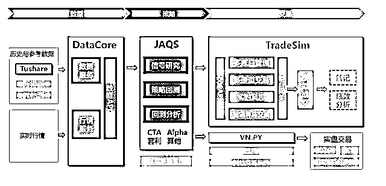

# 【公众号推荐】全新的开源量化平台，只为你！

> 原文：[`mp.weixin.qq.com/s?__biz=MzAxNTc0Mjg0Mg==&mid=2653286868&idx=1&sn=745556c9487a9613368cda067a9f321e&chksm=802e33c1b759bad7a228cbf6433354dc28079814866a2d9fbf6a04f2ce6afa1e7beb8b8e9fbb&scene=27#wechat_redirect`](http://mp.weixin.qq.com/s?__biz=MzAxNTc0Mjg0Mg==&mid=2653286868&idx=1&sn=745556c9487a9613368cda067a9f321e&chksm=802e33c1b759bad7a228cbf6433354dc28079814866a2d9fbf6a04f2ce6afa1e7beb8b8e9fbb&scene=27#wechat_redirect)

**编辑部**

微信公众号

**关键字**全网搜索**最新排名**

**『量化投资』：排名第一**

**『量       化』：排名第一**

**『机器学习』：排名第三**

我们会再接再厉

成为全网**优质的**科技文公众号

**首先，感谢米哥对中国量化事业做出的突出贡献。**

**其次，希望我们做量化的读者，多多关注这个平台。**

**最后，希望米哥做的越来越好。**

说到量化平台，大家首先想到的可能是优矿、可能是米筐，可能是聚宽、可能是京东量化、也可能是 MindGo，亦或是新起的 BigQuant，这些平台或早或晚，或多或少的推动了国内开放式量化平的落地发展。

伴随着量化投资在国内的风起云涌，他们在各自的领域和地域风生水起如火如荼，守护着靠每一行代码每一个策略样例每一个运营人员打下的一片天地。

不得不说，我们应该感谢这些开放式平台的先行者，他们一步一个脚印推动着量化平台在民间、在机构的落地，纵使艰难，却一如既往。

我们也应该感恩于这个时代，技术的进步带来了便捷的开发语言和分析工具，数据的开放让我们随手捏来即取即用，而社区的兴起可以成为我们学习交流、获得经验的便捷途径。

在这样一个技术可插拔，知识和经验可拼凑，常规数据随手可得的条件下，即使是个人，也希望能够靠着自己的能力，构建起属于他们各自量化投资的“私密空间”。

这其实也是 Tushare 最早开源时的初心，在量化投资寥寥无几的当时，Tushare 决定开放所有接口，从数据的角度，力图推动量化金融的开源开放。

3 年来，我们看到了 Tushare 社区的壮大，看到了从数据、策略回测、交易、归因分析到报表展示等各类开源项目的出现，这其中不乏像 RQAlpha、VNPY、PyalgoTrade、quantdigger 比较成体系的工具，也有像 Tuchart 一样还很弱小的新颖图形工具。

尽管如此，我们可以找到各个模块为我所用，但仍然无法快速搭建一个体系完整，结构周密的系统。

在这种情况下，有一个组织、有一群人走到了一起，成立了一个全开源的量化组织 quantOS。

这是一群有想法、有干劲的年轻人，有在华尔街风雨几载实战交易过的，有在国内大型券商掌管过交易体系的，也有在国内最大数据供应商供职过的，还有在各类金融和科技公司摸爬滚打过的这样一群人做了一个量化开源项目。

而 Tushare 和我们所熟悉的 VNPY 作为数据和柜台交易接口的成员项目，融入在 quantOS 组织里，力求打造一站式量化平台，为个人为机构提供一个纯开源的量化研究和交易平台。

**一、quantOS 成员项目**

*   JAQS

*   DataCore

*   TradeSim

*   Tushare

*   VN.PY

**二、quantOS 业务架构**

quantOS 以策略研究平台 JAQS 为核心，通过标准化的 DataApi 和 TradeApi，将数据、策略、交易的连接打通，提供一站式的解决方案。 

涉及三个核心的业务组件：数据、策略和交易，在数据系统上，quantOS 提供两种选择： 

1、通过与 Tushare 深度集成，提供在线数据服务(data.tushare.org)。

2、开源 DataCore 数据系统，客户可适配自己的数据源，本地化部署。

在策略系统上，JAQS 策略系统采用 Python 开发并完全开源，并提供了规范化的研究流程和常见类型策略的支持，提供回测框架。用户可下载到本地后，实现自己的策略，保障客户的策略安全。

在交易系统上，quantOS 提供多种选择：

1、提供一个在线仿真服务 TradeSim，供用户策略验证的有效性。

2、实现了与 vn.py 的深度集成，可通过 vn.py 进行实盘交易。

3、使用企业版的交易软件 TKPro 进行实盘交易。

**三、quantOS 的特点**

1、完全开源：所有软件完全开源, 用户可以免费使用.涉及三个核心的业务组件：数据、策略和交易。

2、免费数据：提供策略研究必须的、高质量的、可持续的研究数据,

3、本地策略：提供包括 Alpha、CTA、套利等策略模板和回测框架，用户可以快速实现策略，本地化部署。

4、仿真交易：提供免费在线仿真交易模拟环境，帮助用户进行策略验证。

5、实盘交易：提供多种成熟的实盘交易解决方案，适用不同的用户。

**点击这里查看更多****quantOS**