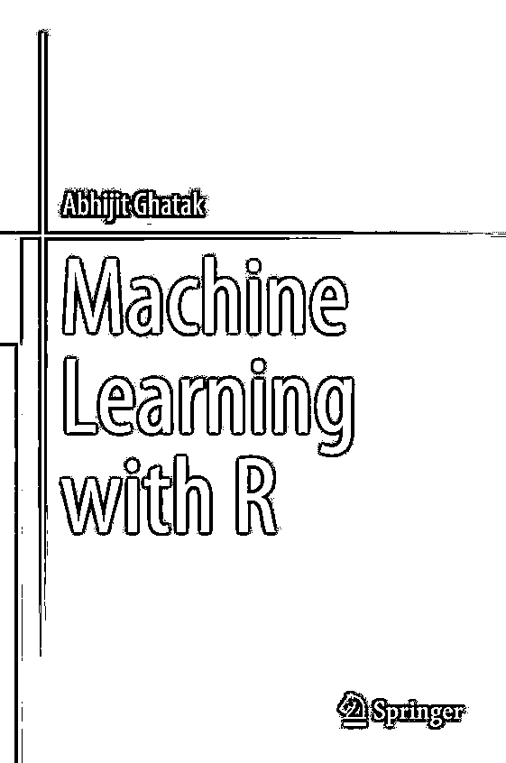
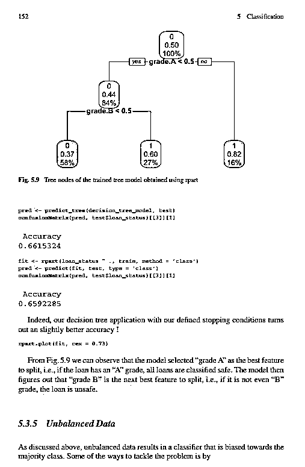
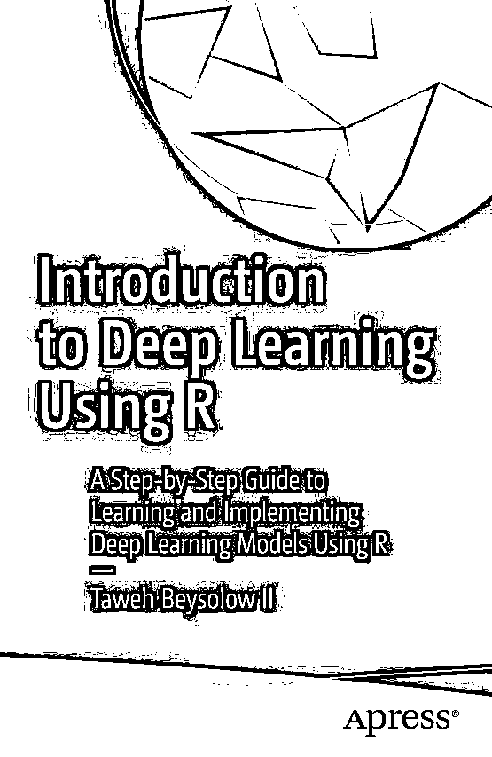
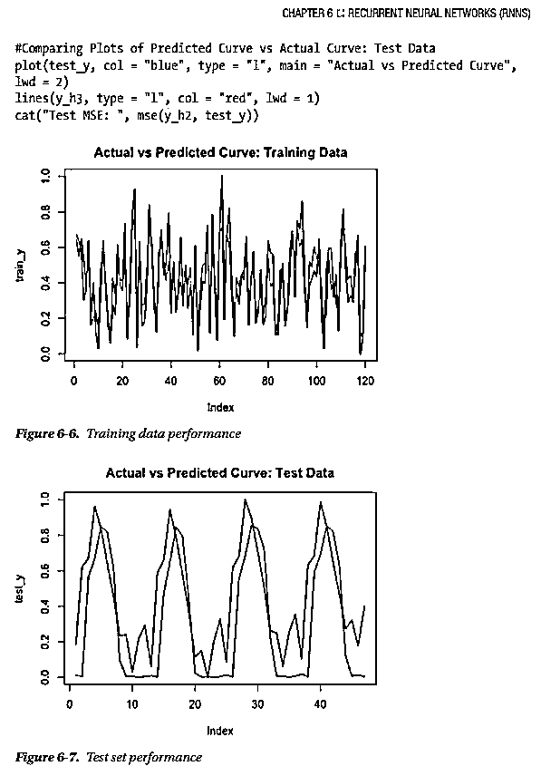
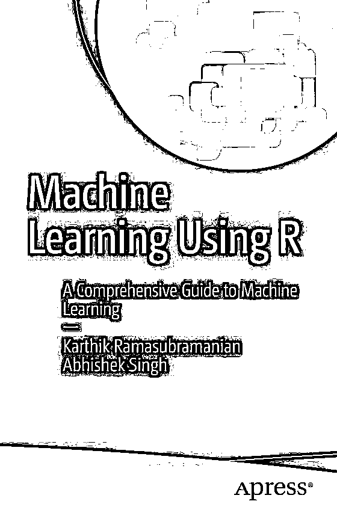
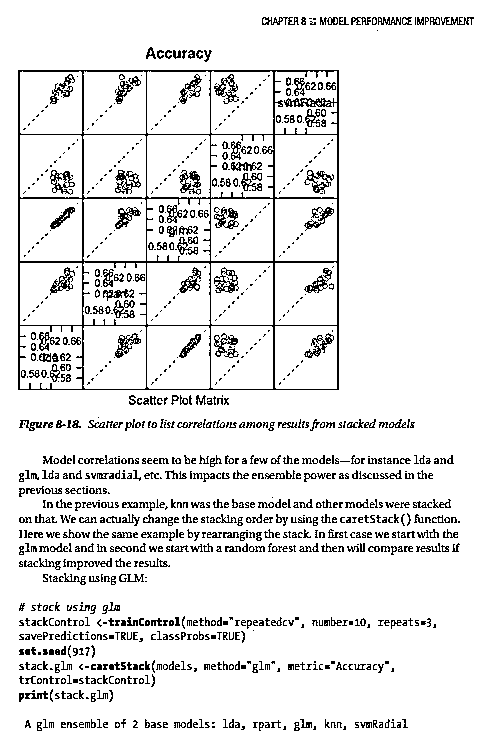
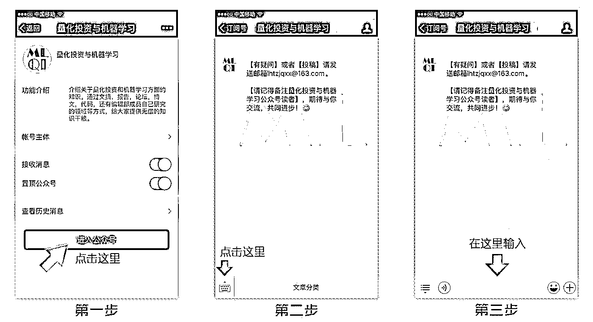
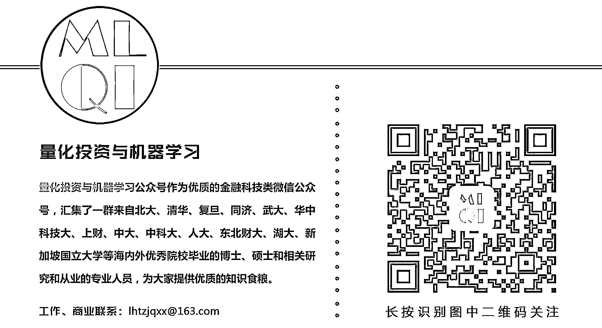

# 【干货】最新有关 DL & ML 的 R 语言书籍

> 原文：[`mp.weixin.qq.com/s?__biz=MzAxNTc0Mjg0Mg==&mid=2653286857&idx=1&sn=f9486821b5ca77003f2f5a6f4dee7bac&chksm=802e33dcb759baca469c4b45396ea45fb2d87cef4f145fd46415bef1846babbad5897e110bfc&scene=27#wechat_redirect`](http://mp.weixin.qq.com/s?__biz=MzAxNTc0Mjg0Mg==&mid=2653286857&idx=1&sn=f9486821b5ca77003f2f5a6f4dee7bac&chksm=802e33dcb759baca469c4b45396ea45fb2d87cef4f145fd46415bef1846babbad5897e110bfc&scene=27#wechat_redirect)

**编辑部**

微信公众号

**关键字**全网搜索**最新排名**

**『量化投资』：排名第一**

**『量       化』：排名第一**

**『机器学习』：排名第三**

我们会再接再厉

成为全网**优质的**科技文公众号

公众号在 R 语言板块比较少内容

现在我们逐步回归啦！

以后在

**MATLAB、Python、R**

我们会一起发力

接下来

赶紧给大家分享 3 本

最新的 R 语言的书籍

1**第一本**

**图书样章**

2**第二本**

**图书样章**

3**第三本**

**图书样章**

**后台回复**

**R 语言**

赶紧拿去撸吧

有些人不知道**后台回复**如何操作

为大家介绍一下：

