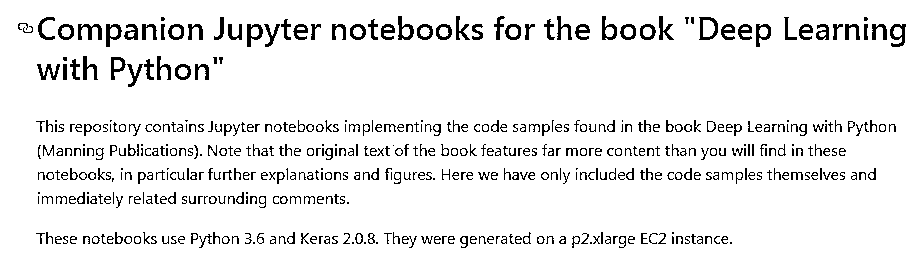
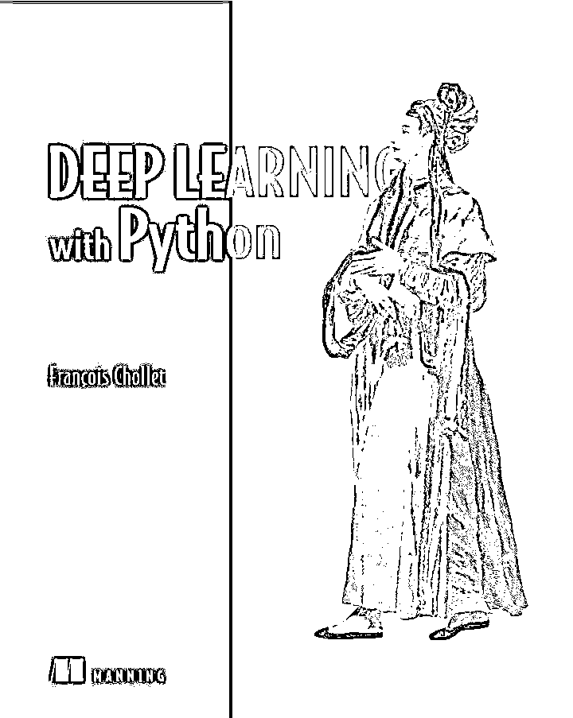

# 【干货】Deep Learning with Python 终于等到你！

> 原文：[`mp.weixin.qq.com/s?__biz=MzAxNTc0Mjg0Mg==&mid=2653286846&idx=1&sn=ec31e6bca615b6cd303ef8496870f93a&chksm=802e33abb759babdd98ec93be4ce36c7545c22fc1f07203ce980fe1f172cfe3d5d9c98e9b089&scene=27#wechat_redirect`](http://mp.weixin.qq.com/s?__biz=MzAxNTc0Mjg0Mg==&mid=2653286846&idx=1&sn=ec31e6bca615b6cd303ef8496870f93a&chksm=802e33abb759babdd98ec93be4ce36c7545c22fc1f07203ce980fe1f172cfe3d5d9c98e9b089&scene=27#wechat_redirect)

**编辑部**

微信公众号

**关键字**全网搜索**最新排名**

**『量化投资』：排名第一**

**『量       化』：排名第一**

**『机器学习』：排名第三**

我们会再接再厉

成为全网**优质的**科技文公众号

从年初就一直在等啦

终于等到这本书

分享一下

> **此书的代码下载地址：**

> *https://github.com/fchollet/deep-learning-with-python-notebooks*

**后台回复**

**keras**

赶紧拿去撸

