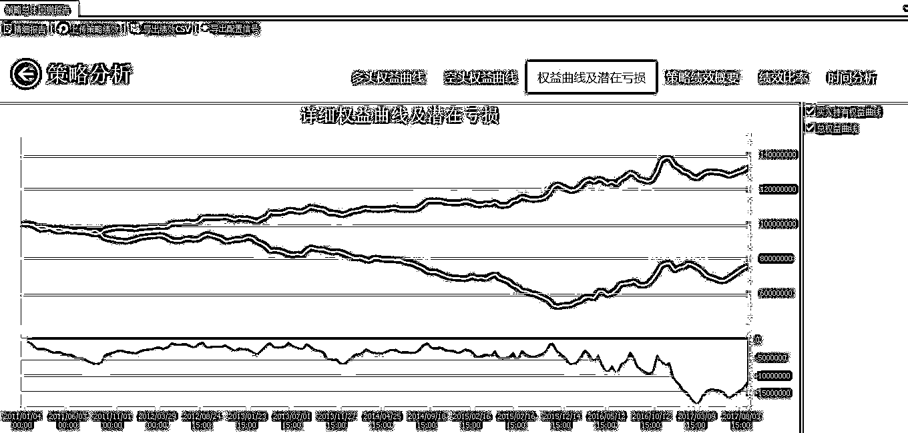
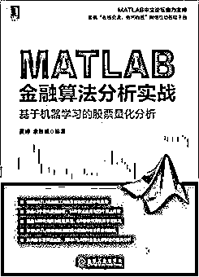

# 【精选】破解波动性突破实盘系统（第六期免费赠书活动来啦！）

> 原文：[`mp.weixin.qq.com/s?__biz=MzAxNTc0Mjg0Mg==&mid=2653286841&idx=1&sn=8dc6bdd610c349bd0c5bd46fc16ee014&chksm=802e33acb759baba4c78fef9d578c698b99e6a87739dac14f98902adf686f927494abe4b7419&scene=27#wechat_redirect`](http://mp.weixin.qq.com/s?__biz=MzAxNTc0Mjg0Mg==&mid=2653286841&idx=1&sn=8dc6bdd610c349bd0c5bd46fc16ee014&chksm=802e33acb759baba4c78fef9d578c698b99e6a87739dac14f98902adf686f927494abe4b7419&scene=27#wechat_redirect)


**编辑部**

微信公众号

**关键字**全网搜索**最新排名**

**『量化投资』：排名第一**

**『量       化』：排名第一**

**『机器学习』：排名第三**

我们会再接再厉

成为全网**优质的**科技文公众号

来源：点宽网  

链接：https://www.digquant.com.cn/forum.php?mod=viewthread&tid=312&extra=page%3D1

## **1、****波动性突破实盘系统介绍**

### **1.1 系统设计思想** 

波动性突破， 本身带有一定程度自适应市场的特点， 为趋势跟踪系统中的上品， 我们再加入时间清仓、 顺势下轿的元素， 在中性的盘整市道中主动退出突破交易， 或在发生第二次波动性突破的时候顺势平仓，这样就部分解决了利润回撒的问题， 至于参数， 个人倾向于没有参数的交易系统模型最好， 最具有未来市场的适应能力， 如果必须要有一两个参数， 那么以该参数在大幅度变动的测试环境下， 仍然可以盈利为佳。

### **1.2 波动性突破系统的文华财经源码：**

```py
TR:= MAX(MAX((HIGH-LOW),ABS(REF(CLOSE, 1）-HIGH)), ABS (REF(CLOSE, 1)-LOW))；
ATR := MA(TR, 10)；
DT:=CLOSE>REF(CLOSE, l)+REF(ATR, l)×1.5；
KT:=CLOSEREF(CLOSE, l)+REF(ATR, l)×1.5, 2)=1&&DT：
KT2:=COUNT(CLOSE＜REF(CLOSE, 1)-REF(ATR, l)×1.5, 2)=1&&KT:
DT,BPK;
KT,SPK;
CROSS (BARSLAST (DT),N) || DT2, SP;
CROSS (BARSLAST (KT),N) || KT2, BP;
```

### **1.3 文华财经函数注解：**

**文华中：**

> 1、买开/卖开（BK/SK)、买平/卖平(BP/SP)和买平开/卖平开(BPK/SPK)的字母缩写。简单说，就是前者每次交易有间隔，类似于一般人的交易方式；而后者就是平仓后立即反手，是连续在市场交易。
> 
> 2、REF(X,N) 引用 X 在 N 个周期前的值。
> 
> 3、BARSLAST(X) 求上一次条件成立到当前的周期数。
> 
> 4、COUNT(X,N) 表示统计在 N 周期内满足 X 条件的周期数。
> 
> 5、CROSS(X,Y) 表示 X 上穿 Y。

## **2、策略代码分享**

### **2.1 策略文件**

```py
function  WATR(Int,Begin,cellPar)
global idexK
global Tlen
global TimeDT
global TimeKT
N=cellPar{1};
if Int
    traderSetParalMode(false);
    idexK=traderRegKData('day',1);
    Tlen=length(idexK(:,1));
    TimeDT=zeros(Tlen,1);
    TimeKT=zeros(Tlen,1);
else
    %提取数据
    [mp,~,~] = traderGetAccountPositionV2(1,(1:Tlen));
    [~,HandListCap,~,~,~]=traderGetAccountInfoV2(1);
    iddexK = traderGetRegKData(idexK, 30, false);
    [Multiple, ~, ~, ~, ~, ~, ~] = traderGetFutureInfoV2(1:Tlen);
    for i=1:Tlen
        idddexK=iddexK(1+8*(i-1):8*i,:);
        time=idddexK(1,:);
        high=idddexK(3,:);
        low=idddexK(4,:);
        close=idddexK(5,:);
        sharenum=floor(HandListCap*0.8/close(end)/Multiple(i)/Tlen);
        %指标计算
        TR=max(max((high(1:end-1)-low(1:end-1)),abs(close(1:end-1)-high(1:end-1))),abs(close(1:end-1)-low(1:end-1)));
        ATRValue=MA(TR,10);
        DT=close(end)>close(end-1)+ATRValue(end-1)*1.5;
        KT=close(end)<close(end-1)-ATRValue(end-1)*1.5;
        if DT==1
            TimeDT(i)=time(end);
        elseif KT==1
            TimeKT(i)=time(end);
        end
        D1=close(end-1)>close(end-2)+ATRValue(end-2)*1.5;
        D2=close(end-2)>close(end-3)+ATRValue(end-3)*1.5;
        K1=close(end-1)<close(end-2)-ATRValue(end-2)*1.5;
        K2=close(end-2)<close(end-3)-ATRValue(end-3)*1.5;
        DT2=(D1+D2==1)&&DT;
        KT2=(K1+K2==1)&&KT;
        SP=(time(end-N+1)>TimeDT(i))||DT2;
        BP=(time(end-N+1)>TimeKT(i))||KT2;
        %开平仓动作
        if mp(i)==0
            if KT
                traderBuyV2(1,i,sharenum,0,'market','buy');
            elseif   DT
                traderSellShortV2(1,i,sharenum,0,'market','sell');
            end
        elseif mp(i)>0
            if  DT
                traderPositionToV2(1,i,0,0,'market','stop');
            elseif BP
                traderPositionToV2(1,i,0,0,'market','stop');
            end
        elseif  mp(i)<0
            if KT
                traderPositionToV2(1,i,0,0,'market','stop');
            elseif SP
                traderPositionToV2(1,i,0,0,'market','stop');
            end
        end
    end
end
end
function MAValue=MA(Price,Length)
MAValue=zeros(length(Price),1);
for i=Length:length(Price)
    MAValue(i)=sum(Price(i-Length+1:i))/Length;
end
MAValue(1:Length-1)=Price(1:Length-1);
end
```

### **2.2 执行文件**

```py
targetList1 = traderGetCodeList('dce000');
targetList2 =traderGetCodeList('czce000');
targetList3 = traderGetCodeList('shfe000');
targetList=[targetList1,targetList2,targetList3]; 
targetList=targetList([2 16 17 18 33 47]);
traderSetBacktest(100000000,0.0025,0.02,0,1,0,0);
AccountList(1) = {'FutureBackReplay'};
N=7;
traderRunBacktestV2('WATR',@WATR,{N},AccountList(1),targetList,'day',1,20110101,20170820,'FWard');
```

## **3、回测表现**

对几种不同类型同时成交量活跃的商品期货 2010 年至 2017 年进行回测。



**赠书活动**

量化投资与机器学习公众号联合机械工业出版社送出**5 本**《MATLAB 金融算法分析实战——基于机器学习的股票量化分析》

> 详解 MATLAB 金融工具箱及金融算法分析与应用。涵盖 43 个量化投资指标、14 种算法应用和 23 个算法案例。涵盖 14 种常用数据处理算法、8 种股票预测机器学习算法。详解 MATLAB 金融数据挖掘中的趋向和发展趋势指标。从机器学习算法出发，用 MATLAB 对金融大数据进行仿真分析

> 本书全面系统地讲解了 MATLAB 金融算法分析与应用，以及金融数据挖掘中的趋向和发展趋势指标，并结合具体的机器学习算法分析，让读者深入学习和掌握 MATLAB 金融数据机器学习算法。本书注重实战，通过大量的案例，帮助读者更好地理解书中的内容。



**截止 2017.12.07 12:00**

大家在本篇推文【写留言】处发表留言，**获得点赞数前五的读者，即可免费获赠此书**。届时，工作人员会联系五位读者，寄出此书。


**策略代码查看**

**↓↓↓**