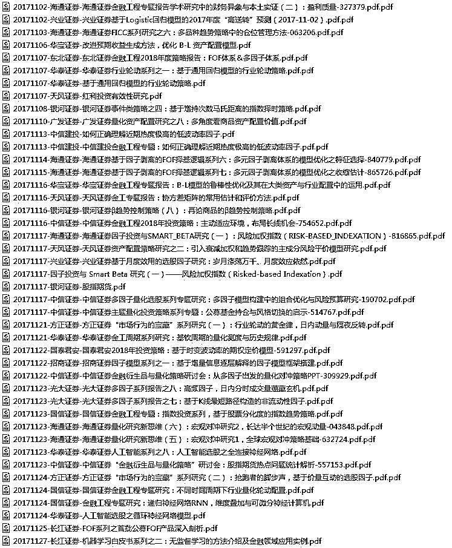

# 【每月系列】2017 年 11 月全部券商金融工程研报汇总

> 原文：[`mp.weixin.qq.com/s?__biz=MzAxNTc0Mjg0Mg==&mid=2653286772&idx=1&sn=f8ca457e87587ed73aa3d81903336db5&chksm=802e3361b759ba7775e1879e1c8a0b9b917d9ff43649e68c85b17b434d516acfc0ec758968a7&scene=27#wechat_redirect`](http://mp.weixin.qq.com/s?__biz=MzAxNTc0Mjg0Mg==&mid=2653286772&idx=1&sn=f8ca457e87587ed73aa3d81903336db5&chksm=802e3361b759ba7775e1879e1c8a0b9b917d9ff43649e68c85b17b434d516acfc0ec758968a7&scene=27#wechat_redirect)

**编辑部**

微信公众号

**关键字**全网搜索最新排名

**『量化投资』：排名第一**

**『量       化』：排名第一**

**『机器学习』：排名第三**

我们会再接再厉

成为全网**优质的**金融、技术类公众号

**编辑部声明**

由于百度网盘经常出现连接失效、大家获取不便、文档保存提取优化等一系列问题。

很幸运，**DigQuant 点宽网****社区**为我们提供了依托于**微软云的存储**。公众号所推出的所有的干货资料，全部会放在点宽社区上。便于大家下载浏览。

请大家**点击****阅读原文**，即可下载！

“最近在网上某些公众号

用变相分享、收费等方式

来获取我们编辑部的成果

哎。做事好难啊！”

**我们会按月更新，方便大家及时阅读研究**

**永久的无偿分享是我们的初衷**

点击标题即可下载

[**2017 年 1-3 月所有券商金工研究报告**](https://mp.weixin.qq.com/s?__biz=MzAxNTc0Mjg0Mg==&mid=2653286032&idx=1&sn=f931e3de55ba425049553d524173b57e&chksm=802e2c85b759a5935002ab01161a92be5ba6c7a5ba64ad12d8be55490fa328973835008ab2dc&scene=21#wechat_redirect)

[**2017 年 4-6 月所有券商金工研究报告**](https://mp.weixin.qq.com/s?__biz=MzAxNTc0Mjg0Mg==&mid=2653286039&idx=2&sn=b6fda2baaff0af634531e3d2928755e0&chksm=802e2c82b759a59496553894c6e3a90e8a47622a228276d61c6c84a3b593b8a81e989926fb5c&scene=21#wechat_redirect)

[**2017 年 7 月所有券商金工研究报告**](https://mp.weixin.qq.com/s?__biz=MzAxNTc0Mjg0Mg==&mid=2653286133&idx=1&sn=c8ef7e2df827698971c71c270ec08a65&chksm=802e2ce0b759a5f63de0fb7f635e8959c4f25a5c761d165a0a2312d08e48e48e408dde572642&scene=21#wechat_redirect)

**[2017 年 8 月所有券商金工研究报告](https://mp.weixin.qq.com/s?__biz=MzAxNTc0Mjg0Mg==&mid=2653286262&idx=1&sn=8fe879fc4a5189cf027b7496da82681f&chksm=802e2d63b759a47535c7a0dfe279672f10821edcdeb49c6f099a7388feef39e8faeb2aaf30e3&scene=21#wechat_redirect)**

**[2017 年 9 月所有券商金工研究报告](https://mp.weixin.qq.com/s?__biz=MzAxNTc0Mjg0Mg==&mid=2653286383&idx=1&sn=7c6b9f54ee5727ede261042510daa401&chksm=802e2dfab759a4ec6a3eb346d6e27fceae852aefae361bd93320ba4ffab7a2859899b28ace19&scene=21#wechat_redirect)**

[**2017 年 10 月所有券商金工研究报告**](https://mp.weixin.qq.com/s?__biz=MzAxNTc0Mjg0Mg==&mid=2653286510&idx=1&sn=b64aab20dc1ba2e56776aa34090d361d&chksm=802e327bb759bb6d558caf6a2aaf4e86bfaf31a3558573f58c7f5f24d1526756ec0ac1d3a820&scene=21#wechat_redirect)

**研报系列（11 月）**

<fieldset class="96wx-bdc" style="margin-top: 0.5em;margin-bottom: 0.5em;border-width: 0px;border-style: initial;border-color: rgb(82, 154, 243);width: 472px;">**点击“阅读原文”，获取 11 月研报棒棒哒！**</fieldset>