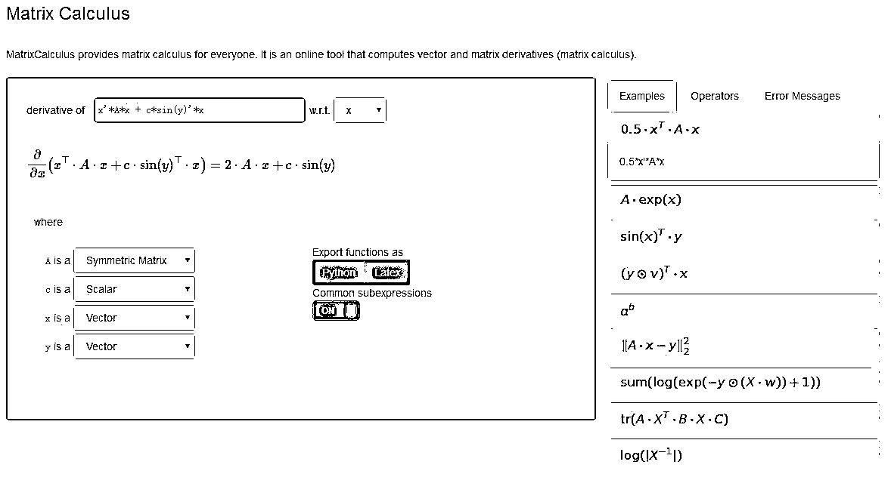

# 在线矩阵微积分工具，可以生成 Python/Latex 代码哦！

> 原文：[`mp.weixin.qq.com/s?__biz=MzAxNTc0Mjg0Mg==&mid=2653286765&idx=1&sn=4f5c4c2c57cc482da09953c526f6165d&chksm=802e3378b759ba6e6013c547d6e9b39c236ffda91ed6bba1f4750e946d0531ec022fd3bd6a6b&scene=27#wechat_redirect`](http://mp.weixin.qq.com/s?__biz=MzAxNTc0Mjg0Mg==&mid=2653286765&idx=1&sn=4f5c4c2c57cc482da09953c526f6165d&chksm=802e3378b759ba6e6013c547d6e9b39c236ffda91ed6bba1f4750e946d0531ec022fd3bd6a6b&scene=27#wechat_redirect)


**编辑部**

微信公众号

**关键字**全网搜索最新排名

**『量化投资』：排名第一**

**『量       化』：排名第一**

**『机器学习』：排名第三**

我们会再接再厉

成为全网**优质的**金融、技术类公众号

**社区在线技术交流群**

**https://bbs.mlqi.org**

（大家多去逛逛哈）


今天给大家介绍一个实用的在线小工具，矩阵微积分在线生成 Python/Latex 代码。

链接：

**http://www.matrixcalculus.org/matrixCalculus**



**Python 代码如下：**

```py
"""
d/dx x'*A*x + c*sin(y)'*x = 2*A*x+c*sin(y)
A is a matrix
c is a scalar
y is a vector
x is a vector
"""

from __future__ import division, print_function, absolute_import

import numpy as np

def fAndG(A, c, x, y):
    assert(type(A) == np.ndarray)
    dim = A.shape
    assert(len(dim) == 2)
    A_rows = dim[0]
    A_cols = dim[1]
    if type(c) == np.ndarray:
        dim = c.shape
        assert(dim == (1, ))
    assert(type(x) == np.ndarray)
    dim = x.shape
    assert(len(dim) == 1)
    x_rows = dim[0]
    assert(type(y) == np.ndarray)
    dim = y.shape
    assert(len(dim) == 1)
    y_rows = dim[0]
    assert(A_cols == x_rows == y_rows == A_rows)

    t_0 = np.dot(A, x)
    t_1 = np.sin(y)
    functionValue = (np.dot(x, t_0) + (c * np.dot(t_1, x)))
    gradient = ((2 * t_0) + (c * t_1))

    return functionValue, gradient

def generateRandomData():
    A = np.random.randn(3, 3)
    c = np.random.randn(1)
    x = np.random.randn(3)
    y = np.random.randn(3)
    return A, c, x, y

if __name__ == '__main__':
    A, c, x, y = generateRandomData()
    functionValue, gradient = fAndG(A, c, x, y)
    print('functionValue = ', functionValue)
    print('gradient = ', gradient)
```

****Latex 代码如下：****

```py
\documentclass[12pt]{article}
\usepackage{amsmath,amsthm,amssymb}
\begin{document}
function:
\begin{align*}
  f = x^\top \cdot A\cdot x+c\cdot \sin(y)^\top \cdot x
\end{align*}

gradient:
\begin{align*}
  \frac{\partial f}{\partial x} = 2\cdot A\cdot x+c\cdot \sin(y)
\end{align*}
\end{document}
```

