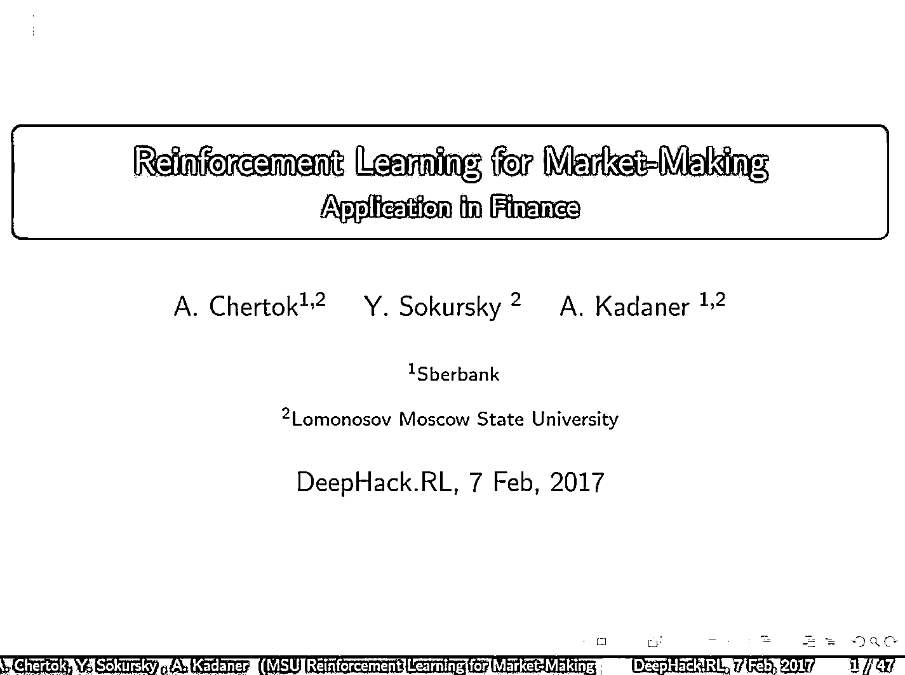
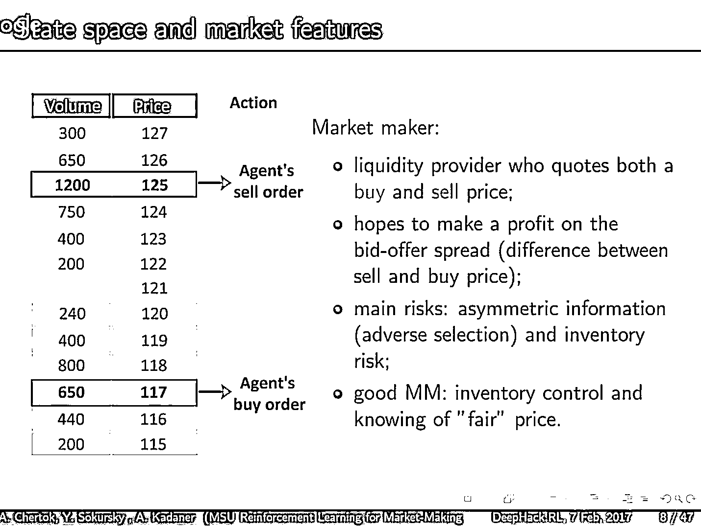
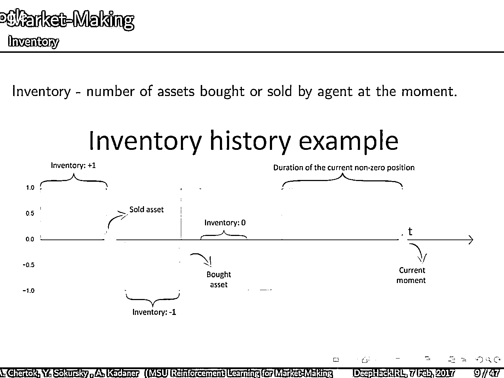
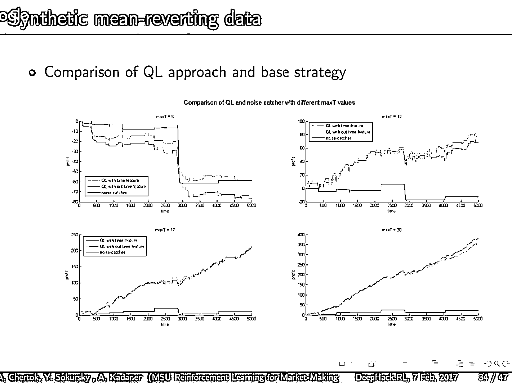
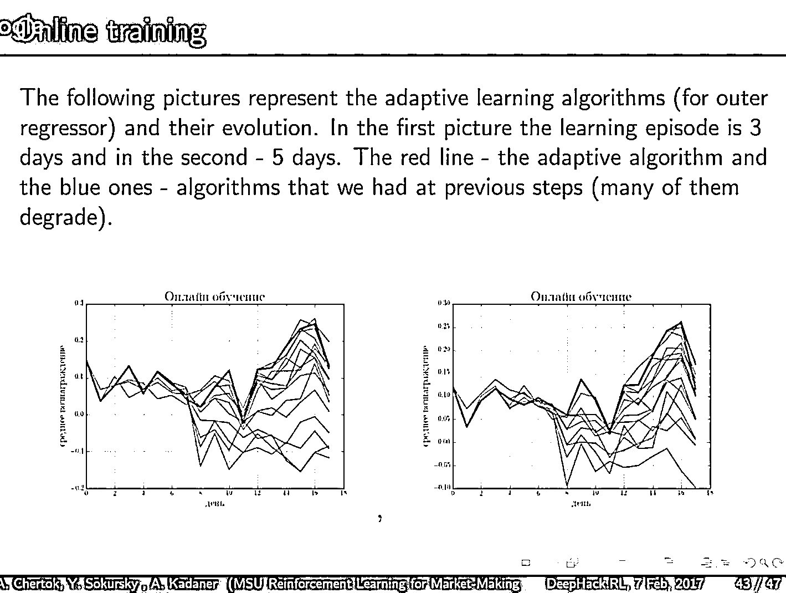
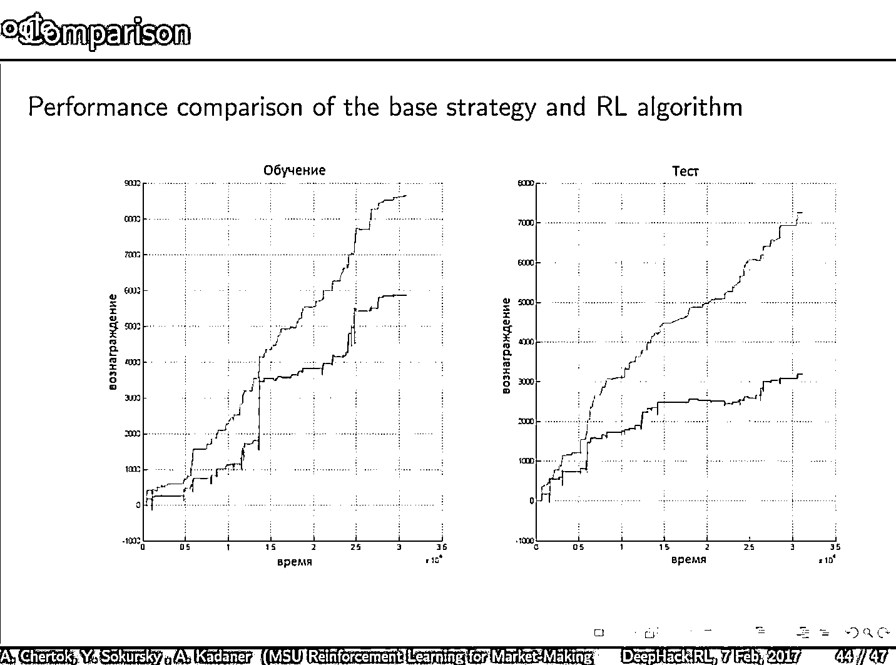
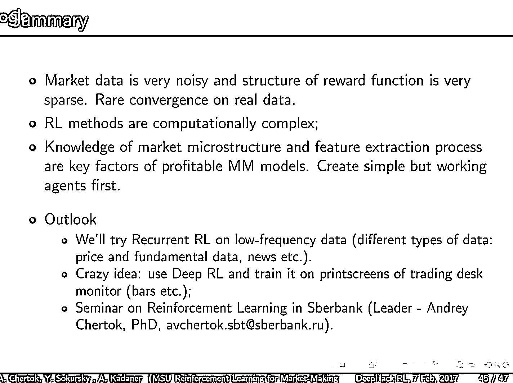

# 强化学习（Reinforcement Learning）应用于量化投资系列专题（一）——在交易中的应用

> 原文：[`mp.weixin.qq.com/s?__biz=MzAxNTc0Mjg0Mg==&mid=2653286755&idx=1&sn=156ca3a5021e171225de9553a2cbf411&chksm=802e3376b759ba6076fefe52747c159f040e78f7645fc21bd761cc1ea5ce44a07c01d15f177a&scene=27#wechat_redirect`](http://mp.weixin.qq.com/s?__biz=MzAxNTc0Mjg0Mg==&mid=2653286755&idx=1&sn=156ca3a5021e171225de9553a2cbf411&chksm=802e3376b759ba6076fefe52747c159f040e78f7645fc21bd761cc1ea5ce44a07c01d15f177a&scene=27#wechat_redirect)

**编辑部**

微信公众号

**关键字**全网搜索最新排名

**『量化投资』：排名第一**

**『量       化』：排名第一**

**『机器学习』：排名第三**

我们会再接再厉

成为全网**优质的**金融、技术类公众号

今天带来机器学习应用于量化投资系列之

**强化学习（Reinforcement Learning）系列（一）**

视频来自 **YouTube** 

出自 DeepHack

时长：1 小时

地址：**https://www.youtube.com/watch?v=ylEo1O59Cb4**

考虑有些读者上不了 YouTube，我们为大家找到了一些下载链接，希望可以帮上忙。

**1、http://www.downyoutubemp4.net/watch?v=ylEo1O59Cb4**

**2、http://hdkeep.com/video/Reinforcement-Learning-Reward-Neural-Network.html**

**3、http://mp3ee.fun/mp3/deephack-rl-andrew-barto.html**

大家有好的下载视频的小技巧可以留言告诉我们。我们可以帮大家下载好，传到 b 站！

**部分 PPT 截图**

