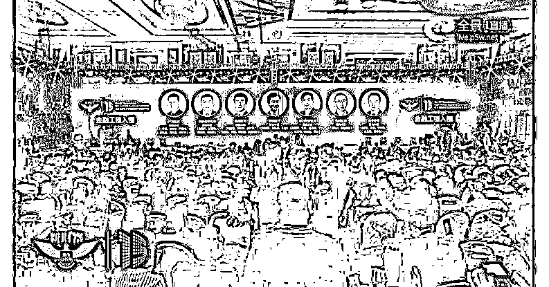
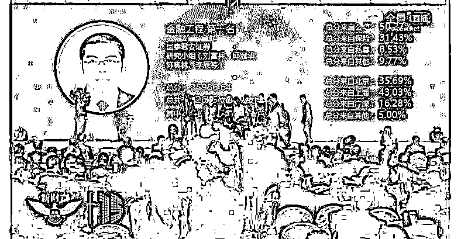
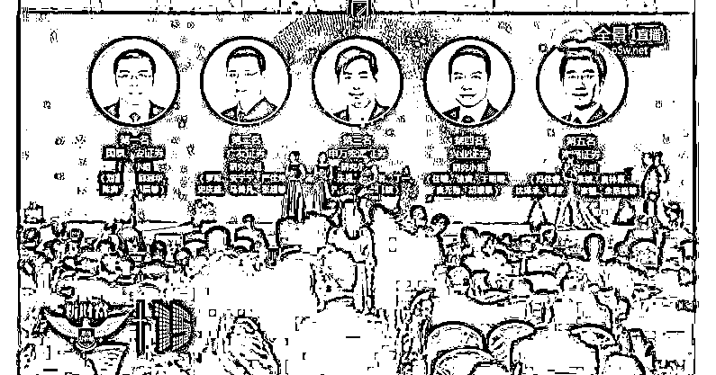
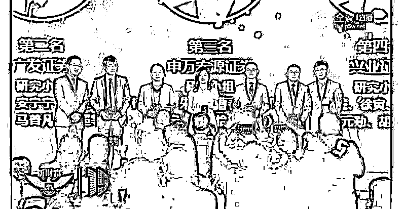

# 二千零一十七、年“第 15 届新财富最佳分析师”金融工程前五获奖名单（附所有券商金融工程类研报汇总）

> 原文：[`mp.weixin.qq.com/s?__biz=MzAxNTc0Mjg0Mg==&mid=2653286725&idx=1&sn=7a8a3c2ab0fae018e1fc0e1ddc89c943&chksm=802e3350b759ba46b17543e7024f027bc5d08259b0cd722d781b92b98ee743d5e9c1ddcce4f3&scene=27#wechat_redirect`](http://mp.weixin.qq.com/s?__biz=MzAxNTc0Mjg0Mg==&mid=2653286725&idx=1&sn=7a8a3c2ab0fae018e1fc0e1ddc89c943&chksm=802e3350b759ba46b17543e7024f027bc5d08259b0cd722d781b92b98ee743d5e9c1ddcce4f3&scene=27#wechat_redirect)

**编辑部**

微信公众号

**关键字**全网搜索最新排名

**『量化投资』：排名第一**

**『量       化』：排名第一**

**『机器学习』：排名第三**

我们会再接再厉

成为全网**优质的**

金融、技术类公众号

今天由《新财富》杂志社主办的“第十五届新财富最佳分析师”评选颁奖盛典在深圳举行，作为专注于量化投资的我们最为关注的就是**金融工程**项目的评选，接下来，小编带你一睹为快吧！

本次入围“第十五届新财富最佳分析师”金融工程组的总共有 7 家券商的金融工程团队，分别是：**广发证券、****国泰君安证券**、**海通证券**、**华泰证券**、**申万宏源证券**、**天风证券**、**兴业证券**。

**最终**

**2017 年“第 15 届新财富最佳分析师”**

**金融工程组**

★**第一名**

国泰君安证券研究小组

（刘富兵、邱冠华、陈奥林、李辰等）

★**第二名**

广发证券研究小组

（罗军、安宁宁、严佳祎、史庆盛、马普凡、张超等）

★**第三名**

申万宏源证券研究小组

（杨国平、朱岚、曹春晓、丁一、张立宁、宋施怡、马俊等）

★**第四名**

兴业证券研究小组

（任瞳、徐寅、于明明、麦元勋、胡顺泰）

★**第五名**

海通证券研究小组

（冯佳睿、郑雅斌、袁林青、沈泽承、罗蕾、宋家骥、余浩淼等）

**棒**福利时间**金融工程研报汇总**

01. [各大券商研金融工程报告（1）](http://mp.weixin.qq.com/s?__biz=MzAxNTc0Mjg0Mg==&mid=2653283257&idx=2&sn=49c78925e7f3535b9cad95bf91574519&scene=21#wechat_redirect)

02. [各大券商研](http://mp.weixin.qq.com/s?__biz=MzAxNTc0Mjg0Mg==&mid=2653283773&idx=1&sn=d4604682da0c5563be9da16717d11bf9&scene=21#wechat_redirect)[金融工程报告](http://mp.weixin.qq.com/s?__biz=MzAxNTc0Mjg0Mg==&mid=2653283257&idx=2&sn=49c78925e7f3535b9cad95bf91574519&scene=21#wechat_redirect)（2）

03. [【海通证券】 研报大放送（百篇）](http://mp.weixin.qq.com/s?__biz=MzAxNTc0Mjg0Mg==&mid=2653284202&idx=1&sn=f94bdefe70ddcb538ca463ba1c5e5205&chksm=802e257fb759ac69899d8544937600c22637697591fce25d1ed1b72414d975eeeba7cc58c9d8&scene=21#wechat_redirect)

04. [【广发证券】 研报大放送（最全）](http://mp.weixin.qq.com/s?__biz=MzAxNTc0Mjg0Mg==&mid=2653284199&idx=1&sn=4ec9cac078f8057744349c9c953decb2&chksm=802e2572b759ac6438362451289132ab4bb631da5b41e9f2b2545eb5efe50e0d14d6bd3d3015&scene=21#wechat_redirect)

05. [【国泰君安】 研报大放送（精华）](http://mp.weixin.qq.com/s?__biz=MzAxNTc0Mjg0Mg==&mid=2653284196&idx=1&sn=85245caf9148fb965df1c56c963984ba&chksm=802e2571b759ac6772582aea40781bddd6f148f144edc9b8b08606749f3c2c012b907441d59d&scene=21#wechat_redirect)

06. [2016 年金工报告（共 600 篇）- 第 1 部分](http://mp.weixin.qq.com/s?__biz=MzAxNTc0Mjg0Mg==&mid=2653284668&idx=1&sn=1d099b61ac8a378f39ef99203cfb85af&chksm=802e2b29b759a23f1ce824e84ab55601f8da41ace7877cac3fe97900f1a7147c97a732481841&scene=21#wechat_redirect)

07. [2016 年金工报告（共 600 篇）- 第 2-4 部分](http://mp.weixin.qq.com/s?__biz=MzAxNTc0Mjg0Mg==&mid=2653284678&idx=1&sn=0c29d884ada86f565b5849057fe5cdb6&chksm=802e2b53b759a245db87fe77c211e8f987464d0d188305808b412fb2d36cbc9f4bb707fedde9&scene=21#wechat_redirect)

08. [2016 年金工报告（共 600 篇）- 第 5-9 部分](http://mp.weixin.qq.com/s?__biz=MzAxNTc0Mjg0Mg==&mid=2653284702&idx=1&sn=c150e541adb6f852459b085a086bf97f&chksm=802e2b4bb759a25de30c981d25e8db6c90e409e0c8ec5303ad0b3fa673abfc01fd4832842c16&scene=21#wechat_redirect)

[09\. 2017 上半年金工研究报告（一）](https://mp.weixin.qq.com/s?__biz=MzAxNTc0Mjg0Mg==&mid=2653286032&idx=1&sn=f931e3de55ba425049553d524173b57e&chksm=802e2c85b759a5935002ab01161a92be5ba6c7a5ba64ad12d8be55490fa328973835008ab2dc&scene=21#wechat_redirect)

[10\. 2017 上半年金工研究报告（完结）](https://mp.weixin.qq.com/s?__biz=MzAxNTc0Mjg0Mg==&mid=2653286039&idx=2&sn=b6fda2baaff0af634531e3d2928755e0&chksm=802e2c82b759a59496553894c6e3a90e8a47622a228276d61c6c84a3b593b8a81e989926fb5c&scene=21#wechat_redirect)

[11\. 2017 年 7 月全部券商金工研报汇总](https://mp.weixin.qq.com/s?__biz=MzAxNTc0Mjg0Mg==&mid=2653286133&idx=1&sn=c8ef7e2df827698971c71c270ec08a65&chksm=802e2ce0b759a5f63de0fb7f635e8959c4f25a5c761d165a0a2312d08e48e48e408dde572642&scene=21#wechat_redirect)

[12\. 2017 年 8 月全部券商金融工程研报汇总](https://mp.weixin.qq.com/s?__biz=MzAxNTc0Mjg0Mg==&mid=2653286262&idx=1&sn=8fe879fc4a5189cf027b7496da82681f&chksm=802e2d63b759a47535c7a0dfe279672f10821edcdeb49c6f099a7388feef39e8faeb2aaf30e3&scene=21#wechat_redirect)

[13 .2017 年 9 月全部券商金融工程研报汇总](https://mp.weixin.qq.com/s?__biz=MzAxNTc0Mjg0Mg==&mid=2653286383&idx=1&sn=7c6b9f54ee5727ede261042510daa401&chksm=802e2dfab759a4ec6a3eb346d6e27fceae852aefae361bd93320ba4ffab7a2859899b28ace19&scene=21#wechat_redirect)

[14\. 2017 年 10 月全部券商金融工程研报汇总](https://mp.weixin.qq.com/s?__biz=MzAxNTc0Mjg0Mg==&mid=2653286510&idx=1&sn=b64aab20dc1ba2e56776aa34090d361d&chksm=802e327bb759bb6d558caf6a2aaf4e86bfaf31a3558573f58c7f5f24d1526756ec0ac1d3a820&scene=21#wechat_redirect)

**明年再会**

